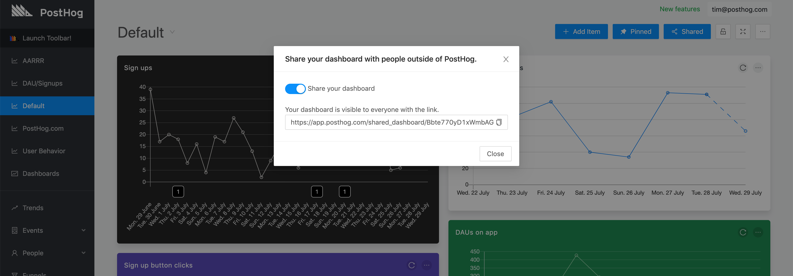
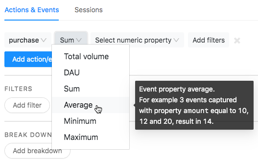
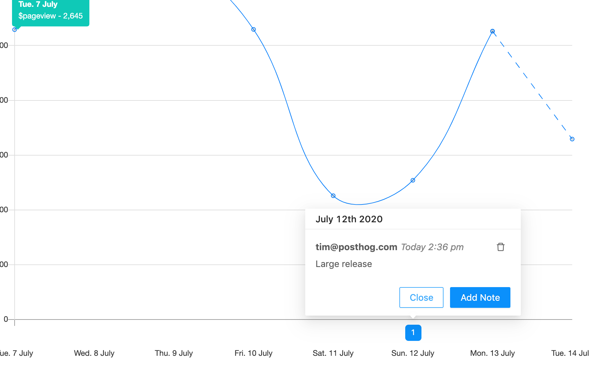
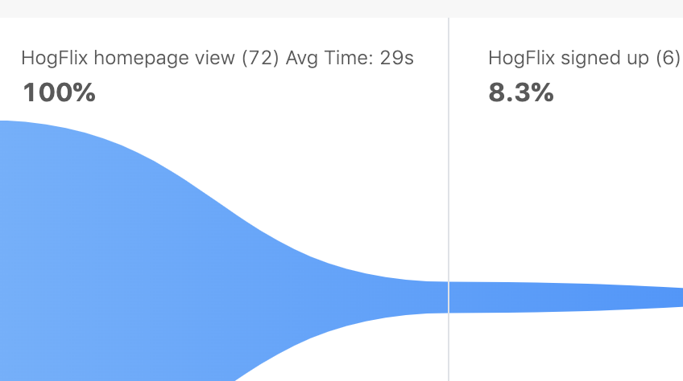
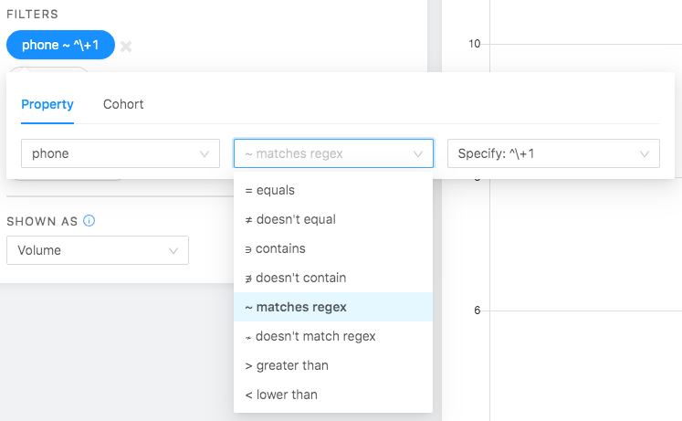

Shared dashboards, global annotations, retention table improvements and a metric ton of bug fixes. This week's PostHog array has it all.

If you're self hosting and want these features - [update your PostHog](/docs/runbook/upgrading-posthog).

Please also update your `posthog-js` version to at least `1.3.5` if you have it installed via NPM. If you're using the snippet, you're good to go!  

## Release Notes

### Shared Dashboards

Dashboard on a TV in your office? Want to have a public stats page? Share a dashboard with someone who doesn't have a PostHog account? You can now publicly share a dashboard. Just click "Share Dashboard" and enable sharing. You'll get a link that's publicly accessible.

Changed your mind? You can always disable sharing.

### Aggregate Functions

Want to know the average revenue per user? Want to know the lowest browser version anyone is using? You can now do Sum, Max, Min and Avg calculations on any event property and graph them in trends!

### Global Annotations

Digging through git commits to find out what changed to make the graphs go hay-wire? No more! You can now annotate when something happened (a big release, a bugfix or a launch) and make it super easy for your team-mates to figure out what's going on. Now global.

As part of this, you can now also manage, add and delete annotations from a central screen.

### Funnel Step Time 

You can now see how long it takes users on average to get through steps in a funnel.

### Regex Filtering

Regex master? Put those skills to use on any property with regex filtering

### Retention Table Improvements

Previously the retention table was hardcoded only to recognize the `$pageview` event as a retention event. Now, you can select any action or event to measure retention on.

Clicking on any section in the retention table will tell you exactly which users fall in that item.

## Bug Fixes and Performance Improvements

* We've added a button [to easily launch the toolbar](https://github.com/PostHog/posthog/pull/1186)
* We've made line charts more precise by [straightening the lines.](https://github.com/PostHog/posthog/pull/1238)
* We've enabled interval selection for sessions [too](https://github.com/PostHog/posthog/pull/1241)
* We're now using Typescript ([1](https://github.com/PostHog/posthog/pull/1297), [2](https://github.com/PostHog/posthog/pull/1286))
* We've [fixed various issues with annotations](https://github.com/PostHog/posthog/pull/1291)
* We don't refresh the Events table if you [don't select a property](https://github.com/PostHog/posthog/pull/1285)
* "All time" date filter [works on funnels again](https://github.com/PostHog/posthog/pull/1252)
* You can now [delete users from your team](https://github.com/PostHog/posthog/pull/1274)
* Fixed an issue where timestamps [were displayed incorrectly on sessions](https://github.com/PostHog/posthog/pull/1294)
* Fixed a bug where selecting "last 48 hours" [wouldn't return results](https://github.com/PostHog/posthog/pull/1264)
* Fixed issues with funnels loading [on dashboards](https://github.com/PostHog/posthog/pull/1266)
* [UUIDs are ugly](https://github.com/PostHog/posthog/pull/1255), so we just cut them off rather than wrapping entire lines in the events table
* [Samcaspus](https://github.com/samcaspus) contributed a little bit of magic: we now automatically adjust your date range if [you change the interval](https://github.com/PostHog/posthog/pull/1253)
* We added a button to dashboard that allows users to [easily add a new item](https://github.com/PostHog/posthog/pull/1242)
* enhanced ctrl + click new tab opening feature 
* Massively speed up [loading live actions](https://github.com/PostHog/posthog/pull/1182)
* Fix password validation and improve minimums notice (closes #1197) 
* Closes #1180 worker fails if timestamp is invalid 
* (abhijitghate)[https://github.com/abhijitghate] contributed an improvement to the way we display DAU's in the graph
* Fix an issue where [loading sessions would do an entire table scan](https://github.com/PostHog/posthog/pull/1221), and then throw it away
* [Automatically bind docker-compose 2to port 80](https://github.com/PostHog/posthog/pull/1257) for production deployments
* \+ a bunch of improvements to make local development better! ([1](https://github.com/PostHog/posthog/pull/1290), [2](https://github.com/PostHog/posthog/pull/1288), [3](https://github.com/PostHog/posthog/pull/1272), [4](https://github.com/PostHog/posthog/pull/1293))

## Favorite issue

### [Funnel step re-ordering](https://github.com/PostHog/posthog/pull/1245)

## Weekly round up

- [pointerpointer.com](https://pointerpointer.com/)
- [del.icio.us](https://del.icio.us) will be back
- [Windows Task Manager Run Doom (896 cores)](https://www.youtube.com/watch?v=hSoCmAoIMOU)

## PostHog news

We launched [a new version of our website!](https://posthog.com) Lottie and Ben have done an amazing job getting this live. We decided to go with a 80's-Adidas-retro-SNES look, combined with hedgehogs… obviously.

### Open roles

Full stack or growth engineers - [we want you!](https://posthog.com/careers). We have *just* filled the technical writer role too, you can already see the docs getting a makeover! More on that next time.

<ArrayCTA />

