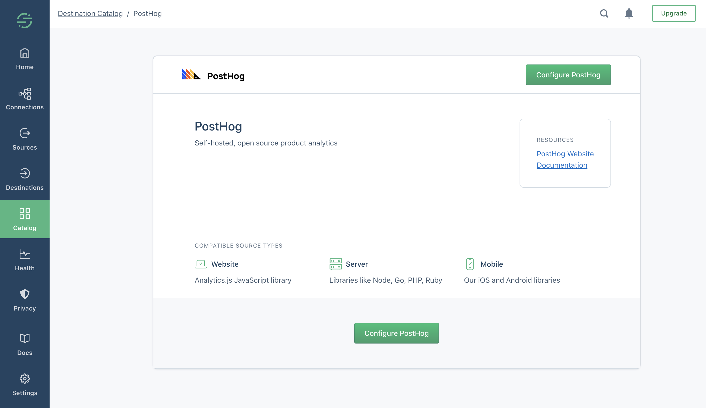
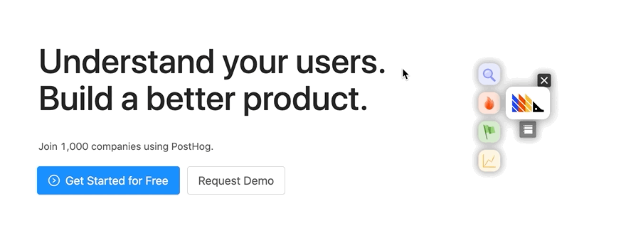

Quality was the name of the game over the last two weeks.

We have a few user facing tweaks and a mountain of bug fixes and refactoring this week. We're not sure what the collective noun for a bunch of bug fixes and refactoring pull requests is - a "virtue"?

If you're self-hosting and want to upgrade for a better experience with nicer features - [update your PostHog](/docs/runbook/upgrading-posthog).

## Release Notes

### [PostHog is now available on Segment!](/blog/posthog-segment-integration)

We're happy to announce that PostHog is now available as a destination on Segment.

Our friends at Segment have built a platform that works as an integrated data pipeline to pull in all your customer data. It's a cool way to combine PostHog with ie Google Analytics or Salesforce data.

If you're already a Segment user, check us out on their [Destination Catalog](https://segment.com/docs/connections/destinations/catalog/). Otherwise, if you're dealing with multiple tools for data collection and analysis, consider using [Segment](https://segment.com/)! They have a generous [startup scheme too](https://segment.com/industry/startups/), like us.

### [Quicker access to everything](https://github.com/PostHog/posthog/pull/1265)

We consolidated trends, sessions, funnels, retention, and user paths into one page for much faster answers to the questions you may have!

### [More powerful Slack messages](https://github.com/PostHog/posthog/pull/1219)

PostHog has a feature where Actions can be posted to Slack or Microsoft Teams. This helps you notify your team in real time of the user actions that really matter. Just got a new user? Ping your sales team. Did a user try out a new feature? Get an alert!

The integration used to be very basic - but now you can edit the message format directly in the UI.

### [Toolbars for all!](https://github.com/PostHog/posthog/pull/1326)

PostHog provides an irrefutably awesome toolbar. This lets you interact with your site or app and understand who is doing what. We've been in Beta for a few weeks, and spent a lot of time interviewing early users - thank you to everyone that took part!

We have now eliminated many bugs and improved the UX, so this feature will be on by default for all new PostHog users.

### [Better annotations](https://github.com/PostHog/posthog/pull/1331)

You can annotate graphs in PostHog - mention big releases, new features, or changes to your UX.

Now, it's quicker and easier to get a quick read on what happened that caused something funky in your graphs.

We've also made all annotations [default to being global](https://github.com/PostHog/posthog/pull/1296). That means if you create an annotation in one graph (or in the annotations page), it is visible across any dashboard graph that covers that date range. No need to fear losing your annotations.

## Bug Fixes and Performance Improvements

* Heatmaps [now work](https://github.com/PostHog/posthog/pull/1397) for sites built with Tailwind CSS.
* Some clicks for the heatmap were being double counted. Now [they aren't](https://github.com/PostHog/posthog/pull/1400).
* We improved the UX for [posting to Slack](https://github.com/PostHog/posthog/pull/1402).
* We fixed [selector attributes](https://github.com/PostHog/posthog/pull/1413).
* We made a [security improvement](https://github.com/PostHog/posthog/pull/1387) to the way session cookies are used, and [removed SameSite middleware](https://github.com/PostHog/posthog/pull/1384).
* We fixed a bug where GitHub actions [required packer](https://github.com/PostHog/posthog/pull/1304) to be manually installed.
* [Cohorts supported](https://github.com/PostHog/posthog/pull/1362) for people merged to a person.
* [Solved a bug](https://github.com/PostHog/posthog/pull/1386) with the way the current version update message displayed.
* If you're running in DEBUG mode, it'll be [more obvious](https://github.com/PostHog/posthog/pull/1378)!
* We [refactored sessions](https://github.com/PostHog/posthog/pull/1307) into a new queries folder.
* There was a weird issue with the user email search. [That's gone](https://github.com/PostHog/posthog/pull/1351).
* We squished [two](https://github.com/PostHog/posthog/pull/1330) [bugs](https://github.com/PostHog/posthog/pull/1348) with our stickiness metrics when specific events were filtered.
* The team page now [looks much nicer](https://github.com/PostHog/posthog/pull/1346).
* Eric smushed [a bug](https://github.com/PostHog/posthog/pull/1337) with filters.
* We [improved how logouts work](https://github.com/PostHog/posthog/pull/1309) with the toolbar.
* We crushed [a bug](https://github.com/PostHog/posthog/pull/1335) with date filters and funnels.
* We [improved how StatsD is used](https://github.com/PostHog/posthog/pull/1336) for better tracking of the things that PostHog doesn't track!
* Chunk loading errors [be gone](https://github.com/PostHog/posthog/pull/1333). The assertive "attempt to" in the title says it all.
* Saving actions from the toolbar [now makes it easier](https://github.com/PostHog/posthog/pull/1313) to view insights or to go to your actions list.
* We cleaned up a debug warning, [leveraging heart emojis](https://github.com/PostHog/posthog/pull/1332).
* An issue with demo data on the dashboard loading has [been disappeared](https://github.com/PostHog/posthog/pull/1334).
* Tim eliminated an issue [with cumulative graphs](https://github.com/PostHog/posthog/pull/1328).
* A Sentry error about breakdown filters is now [brown bread](https://github.com/PostHog/posthog/pull/1321) (dead).
* We now [return an error](https://github.com/PostHog/posthog/pull/1319) for malformed JSONs to the API.
* We've [converted the toolbar to TypeScript](https://github.com/PostHog/posthog/pull/1306). That always makes for a ridiculously huge pull request. 110 files changed. Noice, noice.
* We [added a missing migration](https://github.com/PostHog/posthog/pull/1311) for ActionStep URL.
* [Warnings on running local tests](https://github.com/PostHog/posthog/pull/1308) now don't appear.
* The experiments tab in the navigation didn't have a highlight. [Now it does](https://github.com/PostHog/posthog/pull/1298). That was weird.
* We [moved most of the analytics logic](https://github.com/PostHog/posthog/pull/1280) into a `queries` folder. This means it's in one place and in the future will make a ClickHouse integration way easier.

## Favorite Issue

### [Database candidate testing](https://github.com/PostHog/posthog/issues/1341)

We have had a lot of demand for very high volume deployments. We ran a ton of tests. Results to follow!

## Weekly Round Up

- [What noise does a hedgehog make?](https://www.youtube.com/watch?v=5sgw-achKVM)
- [Lynx deodorant now offers 'Africa and Marmite'](https://twitter.com/aaronnstuart/status/1272927611031879680)

## PostHog News

We're testing out more scalable databases as we've had several teams start using us with 600+ events/second. We are going to build on ClickHouse for our Enterprise version.

On the team side, we welcomed Yakko as a Technical Writer and Developer - you'll see his work in our Docs, which are getting a serious overhaul. Paolo has also joined as our first Growth Engineer. We'll release a blog post explaining what he's up to!

Lottie, our legendary designer, is moving to Senegal from Guildford in the UK. She'll start packing soon as she leaves this weekend.

## Share your feedback
We'd love to hear anything you have to say about PostHog, good or bad. As a thank you, we'll share some awesome [PostHog merch](https://merch.posthog.com).

Want to get involved? [Email us to schedule a 30 minute call](mailto:hey@posthog.com) with one of our teams to help us make PostHog even better!

### Open roles

Full stack engineers that love hedgehogs - [we want you!](https://posthog.com/careers)

<ArrayCTA />

