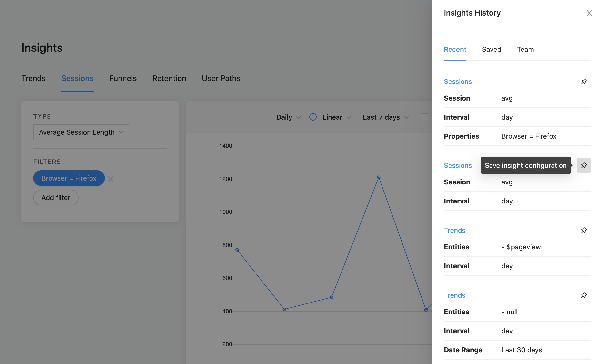
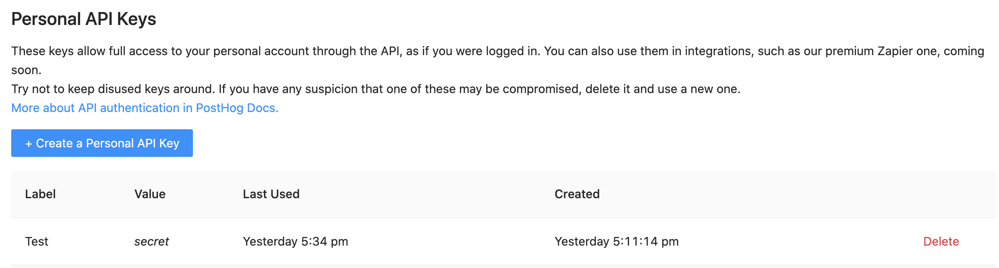
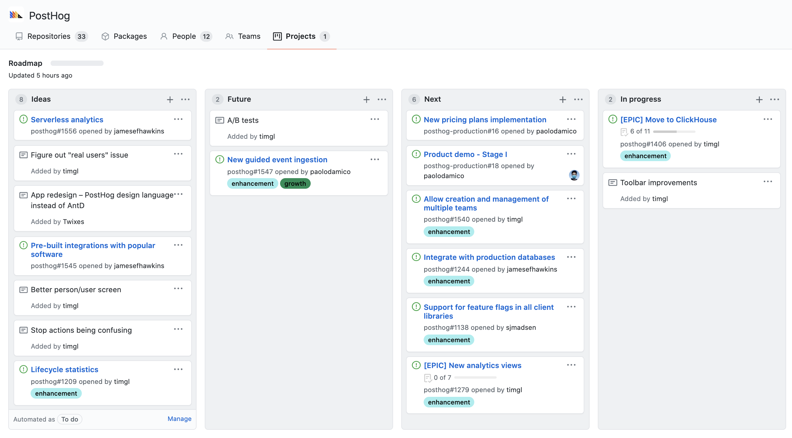

Over the past three weeks, there was one word on everyone's mind: feedback.

We did a bunch of interviews with users and had a lot of discussions with the community around one key question: **How can we make PostHog better for you?**

The result is a release with new features and a ton of bug fixes, aimed at making PostHog better, faster, and more secure for our users. 

If you're self-hosting and want to upgrade for a better experience with nicer features, remember to [update your PostHog instance](/docs/configuring-posthog/upgrading-posthog).

## Release Notes

### [Insight History](https://github.com/PostHog/posthog/pull/1379)

Eric really killed this one with a massive pull request where 55 files were modified. 

As a result, PostHog now allows you to look through a history of the charts you've made on 'Insights', so that you don't have to worry about forgetting the exact filters you used to reach a certain conclusion, or feeling bad about not having saved that perfect chart from a week ago.

Experiment with insights all you want, now without the fear of losing your work. 

### [Personal API Keys](https://github.com/PostHog/posthog/pull/1281)

We also merged another huge PR (58 files changed!) from Michael that's been a long time in the making because we wanted to get this just right. 

To facilitate integrations with external services, as well as make the experience of using our API simpler and safer, we have now introduced Personal API Keys. They can be generated and deleted on the PostHog setup page. It's worth noting that this is a private API Key, compared to your public 'Team API Key' used in the snippet. 

Lastly, because of this change, we have deprecated authentication with username and password for API endpoints.

### [Public Roadmap](https://github.com/orgs/PostHog/projects/1)

At PostHog, one of our core values is transparency. As a result, we try to make as much information public as we can, from what we're working on to how we operate. 

As such, it felt important to us to release a public roadmap where our entire community can view what we're up to, what we'll work on next, and what our objectives are for the future. For a long time we have had a rough roadmap available in our Handbook, but, by now having our roadmap on GitHub, we can directly link issues to the board, and community members can also vote (with emojis 👍) on issues they believe to be important.

Furthermore, we have always encouraged members of our community to open issues for bugs, feature requests, or just anything at all they want to see changed. Now, issues opened by the community can be incorporated on the roadmap, so you can have an idea of how your suggestions fit in with our development process. 

Keep the tickets coming!

### [PostHog FOSS](https://github.com/PostHog/posthog-foss)

As an open core company, we have to conciliate our open source efforts with our ability to generate revenue. Generating revenue is how we're able to continue to sustain our extensive work in the open source space. 

Thus, after a lot of brainstorming and [calls with the likes of Sid Sijbrandij](/blog/a-chat-with-sid), CEO of multibillion dollar [open core company GitLab](https://about.gitlab.com/install/ce-or-ee/), we settled on a business model that allows PostHog to be a sustainable company in the open source space. 

This led to the creation of two key things: an `ee` subdirectory on our [main repo](https://github.com/PostHog/posthog), and a new repository called [posthog-foss](https://github.com/PostHog/posthog-foss). We'll be explaining these in more detail in the future, but, for now, you should know that to run fully MIT-licensed software, you can either clone the main repo and delete the `ee` subdirectory (without any consequences), or clone our posthog-foss repo, which is a mirror of the main repository without proprietary code.

In addition, if you're an enterprise customer looking for added functionality and improved performance, contact us at sales@posthog.com to discuss the license for using our proprietary features. 

### [Secret Key Requirement](https://github.com/PostHog/posthog/pull/1426)

To ensure the security of your PostHog instance, it's important that you use a randomly-generated unique `SECRET_KEY`. This key is used by Django to encrypt cookies, calculate hashes, and generate tokens, making it of high importance. 

Prior to this version, we denoted the importance of this in our Docs, but did not enforce it in our software. Now, to enhance security, PostHog will not allow you to run the server without setting it.

Many of our deployments generate and set this key by default, so that you will not need to worry about it. This is the case with our [Heroku One-Click deployment](/docs/deployment/deploy-heroku), for example. However, other methods may not automatically do this (we're working on it!). As such, if you run into any issues when updating PostHog, make sure you have a unique `SECRET_KEY` set. 

You can find more information about this on our ['Securing PostHog' page](/docs/configuring-posthog/securing-posthog#secret-key) and should always feel welcome to ask any questions on our [community Slack group](https://join.slack.com/t/posthogusers/shared_invite/enQtOTY0MzU5NjAwMDY3LTc2MWQ0OTZlNjhkODk3ZDI3NDVjMDE1YjgxY2I4ZjI4MzJhZmVmNjJkN2NmMGJmMzc2N2U3Yjc3ZjI5NGFlZDQ).

## Bug Fixes and Performance Improvements

* We [disabled our own snippet](https://github.com/PostHog/posthog/pull/1539) on DEBUG instances and [improved tracking](https://github.com/PostHog/posthog/pull/1519)
* We [started using `django_extensions`](https://github.com/PostHog/posthog/pull/1541)
* Tim added a test to PRs to [check if our Docker image builds](https://github.com/PostHog/posthog/pull/1515/files)
* [Michael](https://github.com/PostHog/posthog/pull/1537/files) and [a bot](https://github.com/PostHog/posthog/pull/1527) helped us keep dependencies up-to-date
* Marius made the Toolbar UX better by [fixing its element detection](https://github.com/PostHog/posthog/pull/1424), [making the info window follow the mouse](https://github.com/PostHog/posthog/pull/1472), and [correcting other minor things](https://github.com/PostHog/posthog/pull/1470)
* Paolo [made user metrics better](https://github.com/PostHog/posthog/pull/1508)
* Eric [updated our /insights endpoint](https://github.com/PostHog/posthog/pull/1498)
* We changed the [color on some tabs](https://github.com/PostHog/posthog/pull/1485) and the [tone on some buttons](https://github.com/PostHog/posthog/commit/35e604e031da43b49da0afb0e7a854ecd93c95b8) to improve our UI
* We [added tests for our multitenancy environment](https://github.com/PostHog/posthog/pull/1533/)
* Michael [fixed a UI bug on our URL list](https://github.com/PostHog/posthog/pull/1526)
* We overhauled our README, which was really in need of updating. 

## Favorite Issue

### [Database candidate testing](https://github.com/PostHog/posthog/issues/1341)

We have had a lot of demand for very high volume deployments. We ran a ton of tests. Results to follow!

## Weekly Round Up

- [What noise does a hedgehog make?](https://www.youtube.com/watch?v=5sgw-achKVM)
- [Lynx deodorant now offers 'Africa and Marmite'](https://twitter.com/aaronnstuart/status/1272927611031879680)

## PostHog News

We're testing out more scalable databases as we've had several teams start using us with 600+ events/second. We are going to build on ClickHouse for our Enterprise version.

On the team side, we welcomed Yakko as a Technical Writer and Developer - you'll see his work in our Docs, which are getting a serious overhaul. Paolo has also joined as our first Growth Engineer. We'll release a blog post explaining what he's up to!

Lottie, our legendary designer, is moving to Senegal from Guildford in the UK. She'll start packing soon as she leaves this weekend.

### Open roles

Full stack engineers that love hedgehogs - [we want you!](https://posthog.com/careers)
