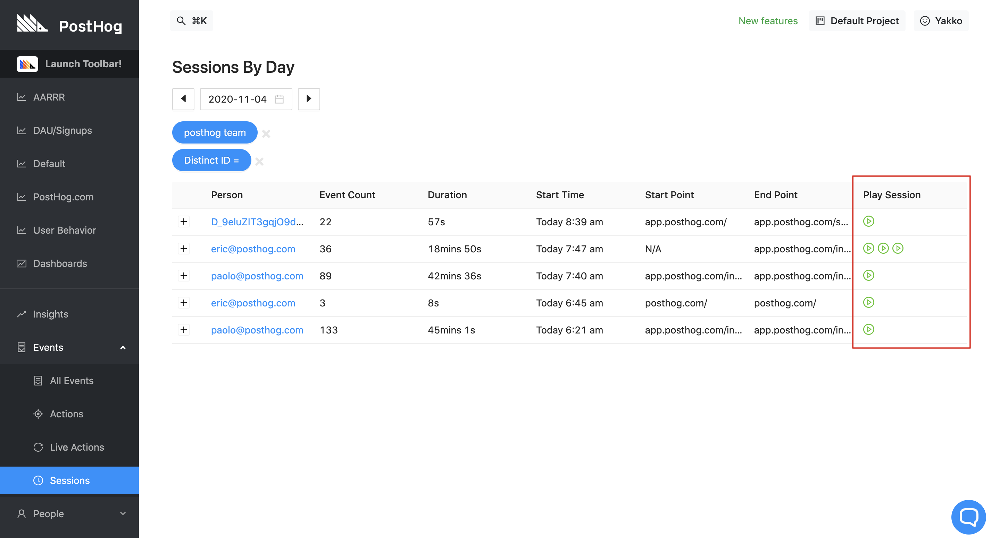
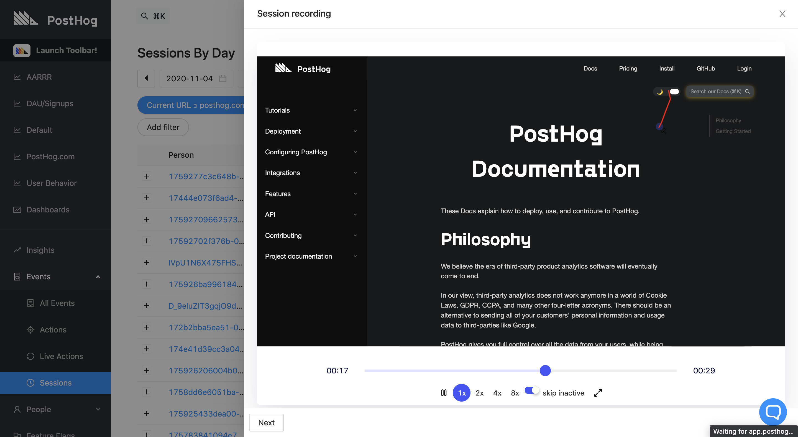
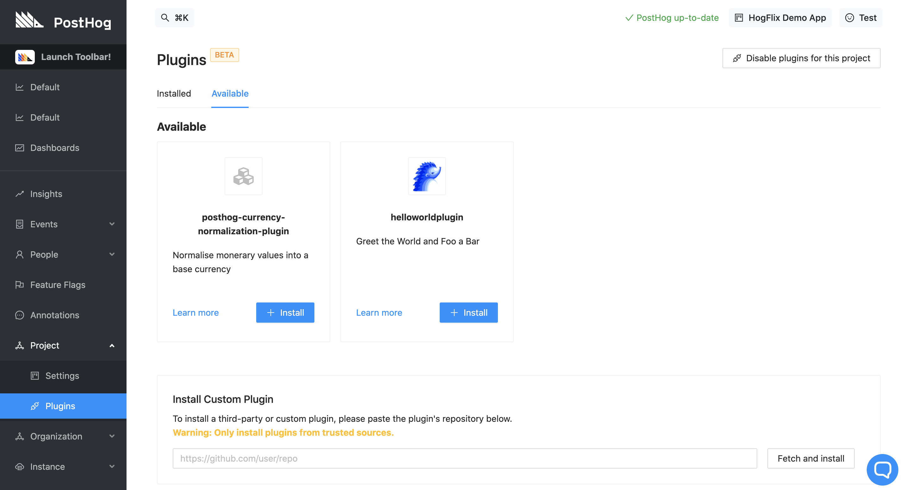
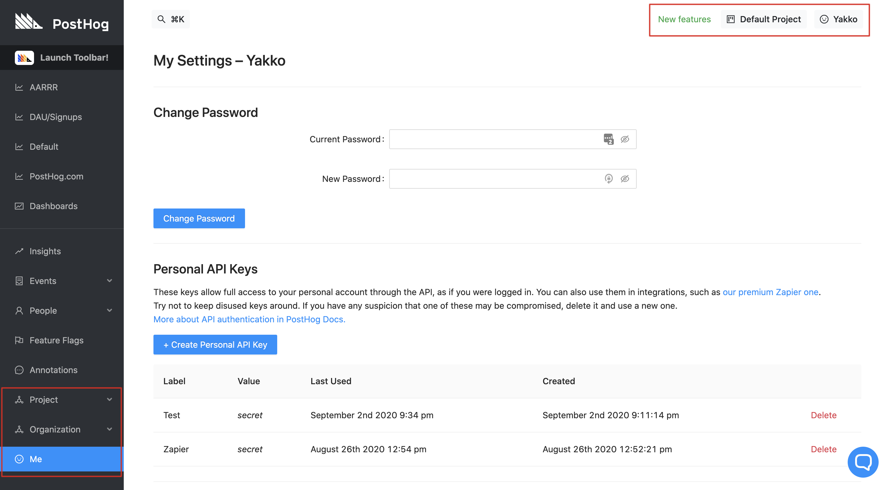
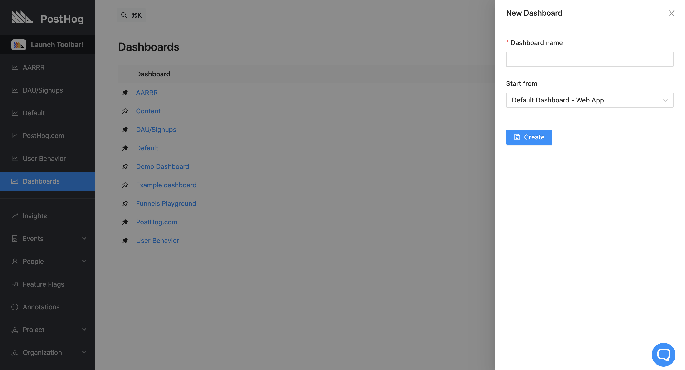
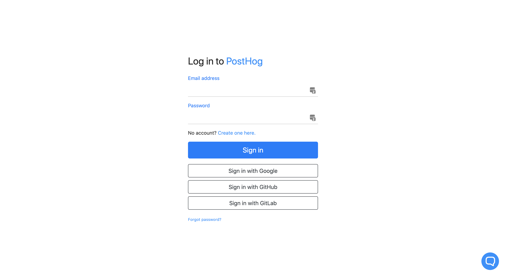
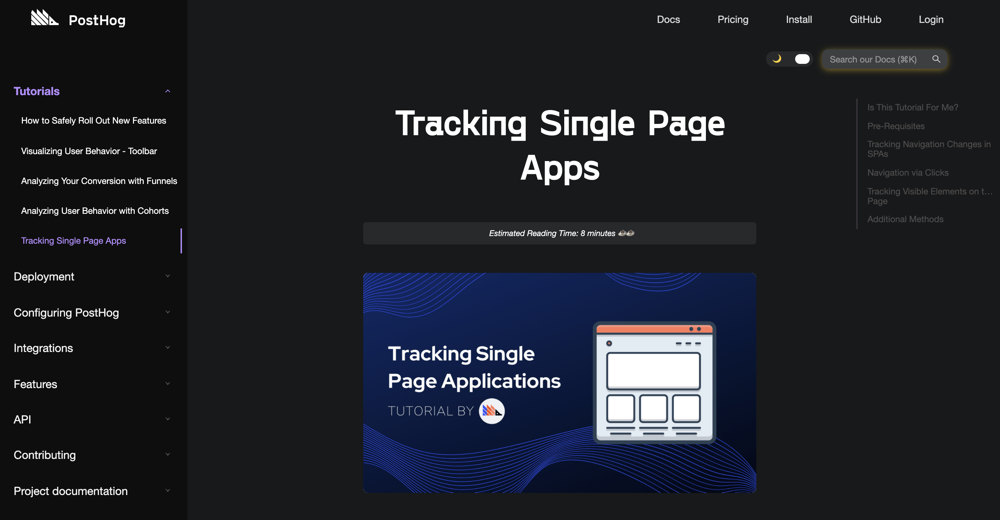
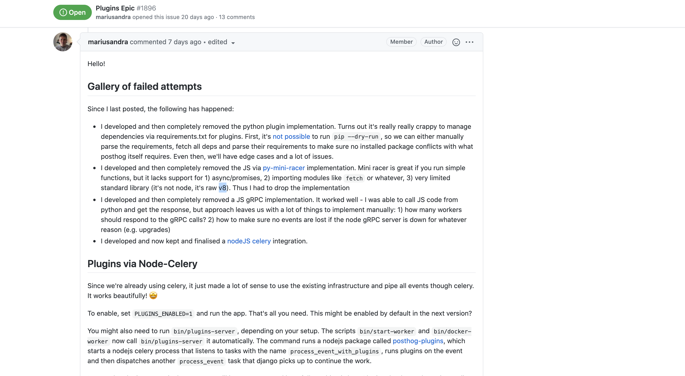

Following our largest release to date, we are now back on a more regular release schedule. And, given that scalability was the focus of the previous release, we thought it was time for some fresh new features. 

So, without further ado, here they are:

## Release Notes

> If you're self-hosting and want to upgrade for a better experience with nicer features, remember to [update your PostHog instance](/docs/runbook/upgrading-posthog).

### [Session Recording (Beta)](https://github.com/PostHog/posthog/issues/1846)

Given that our mission at PostHog is to increase the number of successful projects in the world, session recording felt like a feature that fits in perfectly with that goal.

PostHog already provides various features to help you understand and improve your UX - but watching real users use your product is a _whole other ball game_. 

With PostHog's session recording, you are able to truly feel the pain points of your users first-hand, seeing where they get stuck, debugging exceptions faster, and making your UX smoother. 

Additionally, you can do so while still preserving the privacy of your users, by determining what shouldn't be captured, as well as being able to turn session recording on and off as you wish.

However, please note that our session recording feature is in **Beta** at the moment. This means that it can be unstable and have bugs. To report bugs you find while using it, please [open an issue for us on GitHub](https://github.com/PostHog/posthog/issues). 

### [Apps (Beta)](https://github.com/PostHog/posthog/issues/1896)

Apps is another **Beta** feature that we're extremely excited for. Currently only available for self-hosted instances, apps allow you to add additional logic to your event processing pipeline, in order to do things like enrich your data or send it somewhere else, like a data warehouse. 

At the moment, we have created a few example apps for you to test out the functionality, and have the intention of launching more for the next release. We will also be launching tutorials on how to make your own apps, so stay tuned for that.

As of right now, if you're on a self-hosted instance, you should head over to 'Project' -> 'Apps' to enable the functionality. You can start testing it out with our "Hello World" app, which adds a property to your events called `foo` with a value that is up to you to decide in setup. 

We also have built apps for currency normalization and GeoIP data, allowing you to convert currency values in events according to up-to-date exchange rates and determine the location of an event based on the user's IP.

Our overall vision for apps is to enable seamless integration with other relevant data analytics platforms, as well as allow users to more easily customize PostHog's functionality by adding their own logic and data to the event pipeline.

Finally, as is the case with session recording, please report any bugs in the functionality on [GitHub](https://github.com/PostHog/posthog/issues).

### [Multiple Projects](https://github.com/PostHog/posthog/pull/1562)

You asked and we delivered!

As per feedback from many in our community, PostHog now offers support for managing multiple projects under one "umbrella" organization. 

This allows you to segregate concerns, such as keeping tracking for your dev and prod environments separately, as well as track multiple domains and apps without mixing data.  

In addition, we also enhanced our invite and permissioning system as a by-product of this feature. 

As this is an Enterprise Edition feature, please contact us at _[sales@posthog.com](mailto:sales@posthog.com)_ if you are interested in using it.

### [Dashboard Templates](https://github.com/PostHog/posthog/pull/1942)

In order to make it easier to create valuable dashboards to keep track of your business metrics, PostHog now offers the option to create new dashboards based on a template. We will be expanding the power of dashboard templates, but, as of right now, you can already create a dashboard using our web app dashboard template, which provides you with a good starting point for determining and tracking relevant metrics.

### [Setup Improvements](https://github.com/PostHog/posthog/pull/1990)

In addition to GitHub and GitLab authentication, PostHog now supports signup and login with Google accounts! 

We also improved our setup process by better structuring our settings pages, allowing you to [change your project's token](https://github.com/PostHog/posthog/pull/2015), and [enhancing the UX for empty states on dashboards](https://github.com/PostHog/posthog/pull/2068).

### [Documentation Level Up](https://github.com/PostHog/posthog.com)

We have been working hard to improve our product documentation and had a few big upgrades recently:

- Our Docs now have a Dark Mode option
- You can search our entire documentation without ever using your mouse
- We are actively releasing new tutorials on how to use PostHog to track key metrics and improve your product
- Our Docs pages now load faster
- New screenshots have been added throughout the Docs, as well as functionality walkthrough videos

...and a lot more!

If you have any suggestions for new tutorials or improvements to our documentation, [do not hesitate to let us know!](https://github.com/PostHog/posthog.com/issues)

## Share your feedback
We'd love to hear anything you have to say about PostHog, good or bad. As a thank you, we'll share some awesome [PostHog merch](https://merch.posthog.com).

Want to get involved? [Email us to schedule a 30 minute call](mailto:hey@posthog.com) with one of our teams to help us make PostHog even better!

## Bug Fixes and Performance Improvements

In addition to the main features mentioned above, we also merged multiple PRs improving PostHog's performance and fixing bugs:

- Retention UX fixes [\#2168](https://github.com/PostHog/posthog/pull/2168) ([EDsCODE](https://github.com/EDsCODE))
- Simplify action queries [\#2167](https://github.com/PostHog/posthog/pull/2167) ([timgl](https://github.com/timgl))
- Prune person materialized [\#2166](https://github.com/PostHog/posthog/pull/2166) ([EDsCODE](https://github.com/EDsCODE))
- Switch to the official Heroku Python buildpack [\#2151](https://github.com/PostHog/posthog/pull/2151) ([edmorley](https://github.com/edmorley))
- Slim down dev docker image [\#2147](https://github.com/PostHog/posthog/pull/2147) ([timgl](https://github.com/timgl))
- ClickHouse binary capture [\#2146](https://github.com/PostHog/posthog/pull/2146) ([timgl](https://github.com/timgl))
- Fix funnel loading and other UX issues [\#2134](https://github.com/PostHog/posthog/pull/2134) ([timgl](https://github.com/timgl))
- Fix elements chain with bad classes [\#2133](https://github.com/PostHog/posthog/pull/2133) ([timgl](https://github.com/timgl))
- Fix social auth account creation [\#2123](https://github.com/PostHog/posthog/pull/2123) ([Twixes](https://github.com/Twixes))
- Flatten array and check length for actions [\#2120](https://github.com/PostHog/posthog/pull/2120) ([EDsCODE](https://github.com/EDsCODE))
- \[ClickHouse\] speed up sessions list [\#2118](https://github.com/PostHog/posthog/pull/2118) ([timgl](https://github.com/timgl))
- Fix for action/event dropdown [\#2117](https://github.com/PostHog/posthog/pull/2117) ([EDsCODE](https://github.com/EDsCODE))
- Make DELETE synchronous in clickhouse tests / make tests less flaky [\#2116](https://github.com/PostHog/posthog/pull/2116) ([macobo](https://github.com/macobo))
- Capture social\_create\_user exception with Sentry [\#2115](https://github.com/PostHog/posthog/pull/2115) ([Twixes](https://github.com/Twixes))
- Clarify invite creation [\#2113](https://github.com/PostHog/posthog/pull/2113) ([Twixes](https://github.com/Twixes))
- \[ClickHouse\] More speed optimizations for funnels [\#2109](https://github.com/PostHog/posthog/pull/2109) ([timgl](https://github.com/timgl))
- Fix changelog images [\#2105](https://github.com/PostHog/posthog/pull/2105) ([yakkomajuri](https://github.com/yakkomajuri))
- Debug redis leak [\#2102](https://github.com/PostHog/posthog/pull/2102) ([mariusandra](https://github.com/mariusandra))
- ClickHouse improve funnel speed [\#2100](https://github.com/PostHog/posthog/pull/2100) ([timgl](https://github.com/timgl))
- Reduce Heroku worker thread count [\#2092](https://github.com/PostHog/posthog/pull/2092) ([mariusandra](https://github.com/mariusandra))
- Wire up the length to the proto message [\#2089](https://github.com/PostHog/posthog/pull/2089) ([fuziontech](https://github.com/fuziontech))
- Start with a new topic [\#2088](https://github.com/PostHog/posthog/pull/2088) ([fuziontech](https://github.com/fuziontech))
- Provide required proto message length for our clickhouse overlords [\#2087](https://github.com/PostHog/posthog/pull/2087) ([fuziontech](https://github.com/fuziontech))
- ClickHouse window funnel [\#2086](https://github.com/PostHog/posthog/pull/2086) ([timgl](https://github.com/timgl))
- Protobufize events to protect from malformed JSON [\#2085](https://github.com/PostHog/posthog/pull/2085) ([fuziontech](https://github.com/fuziontech))
- \#2083 Ignore result [\#2084](https://github.com/PostHog/posthog/pull/2084) ([timgl](https://github.com/timgl))
- Add CH Person Sessions By Day [\#2082](https://github.com/PostHog/posthog/pull/2082) ([yakkomajuri](https://github.com/yakkomajuri))
- Fix bin/tests too many files watching error [\#2078](https://github.com/PostHog/posthog/pull/2078) ([timgl](https://github.com/timgl))
- Fix retention label and add tests [\#2076](https://github.com/PostHog/posthog/pull/2076) ([EDsCODE](https://github.com/EDsCODE))
- Make possible CI optimizations [\#2074](https://github.com/PostHog/posthog/pull/2074) ([Twixes](https://github.com/Twixes))
- Attempt to speed up 3.9 tests [\#2073](https://github.com/PostHog/posthog/pull/2073) ([macobo](https://github.com/macobo))
- Fix cypress tests [\#2070](https://github.com/PostHog/posthog/pull/2070) ([macobo](https://github.com/macobo))
- Give staff users superuser permissions [\#2069](https://github.com/PostHog/posthog/pull/2069) ([Twixes](https://github.com/Twixes))
- Fix loading people and stickiness [\#2067](https://github.com/PostHog/posthog/pull/2067) ([EDsCODE](https://github.com/EDsCODE))
- Improved settings for session recording [\#2066](https://github.com/PostHog/posthog/pull/2066) ([macobo](https://github.com/macobo))
- Fix History button layout in Insights [\#2065](https://github.com/PostHog/posthog/pull/2065) ([Twixes](https://github.com/Twixes))
- Fixes bad timerange for retentino [\#2064](https://github.com/PostHog/posthog/pull/2064) ([EDsCODE](https://github.com/EDsCODE))
- Autoimport celery tasks [\#2062](https://github.com/PostHog/posthog/pull/2062) ([macobo](https://github.com/macobo))
- Limit ingestion for teams [\#2060](https://github.com/PostHog/posthog/pull/2060) ([fuziontech](https://github.com/fuziontech))
- ClickHouse never calculate action [\#2059](https://github.com/PostHog/posthog/pull/2059) ([timgl](https://github.com/timgl))
- Bump cryptography from 2.9 to 3.2 [\#2058](https://github.com/PostHog/posthog/pull/2058) ([dependabot[bot]](https://github.com/apps/dependabot))
- ClickHouse move to JSON extract for all filters [\#2056](https://github.com/PostHog/posthog/pull/2056) ([timgl](https://github.com/timgl))
- Fix cohorts clickhouse [\#2052](https://github.com/PostHog/posthog/pull/2052) ([timgl](https://github.com/timgl))
- Fix flaky test [\#2048](https://github.com/PostHog/posthog/pull/2048) ([EDsCODE](https://github.com/EDsCODE))
- Upgrade kea-router and typegen [\#2044](https://github.com/PostHog/posthog/pull/2044) ([mariusandra](https://github.com/mariusandra))
- Use jsonextract for steps in funnel query [\#2040](https://github.com/PostHog/posthog/pull/2040) ([EDsCODE](https://github.com/EDsCODE))
- Use uuids in funnels for consistency [\#2036](https://github.com/PostHog/posthog/pull/2036) ([timgl](https://github.com/timgl))
- \[ClickHouse\] fix events for action with no steps [\#2035](https://github.com/PostHog/posthog/pull/2035) ([timgl](https://github.com/timgl))
- Fix funnels with multiple property filters [\#2034](https://github.com/PostHog/posthog/pull/2034) ([timgl](https://github.com/timgl))
- Restore original retention query [\#2029](https://github.com/PostHog/posthog/pull/2029) ([EDsCODE](https://github.com/EDsCODE))
- Filter person\_distinct\_id table further before joining [\#2028](https://github.com/PostHog/posthog/pull/2028) ([EDsCODE](https://github.com/EDsCODE))
- Fix typescript errors \#1 [\#2027](https://github.com/PostHog/posthog/pull/2027) ([mariusandra](https://github.com/mariusandra))
- Remove useless User.is\_superuser [\#2026](https://github.com/PostHog/posthog/pull/2026) ([Twixes](https://github.com/Twixes))
- Get rid of Py 3.7-incompatible typing.Literal [\#2025](https://github.com/PostHog/posthog/pull/2025) ([Twixes](https://github.com/Twixes))
- Update person property filtering [\#2024](https://github.com/PostHog/posthog/pull/2024) ([EDsCODE](https://github.com/EDsCODE))
- Add eslint rule for empty JSX elements [\#2023](https://github.com/PostHog/posthog/pull/2023) ([mariusandra](https://github.com/mariusandra))
- Fix click outside spam & public paths [\#2022](https://github.com/PostHog/posthog/pull/2022) ([mariusandra](https://github.com/mariusandra))
- \[ClickHouse\] Fix action filtering on events [\#2013](https://github.com/PostHog/posthog/pull/2013) ([timgl](https://github.com/timgl))
- Add types to window.posthog [\#2012](https://github.com/PostHog/posthog/pull/2012) ([macobo](https://github.com/macobo))
- Rename existing projects to "Default Project" [\#2009](https://github.com/PostHog/posthog/pull/2009) ([Twixes](https://github.com/Twixes))
- Enable compatibility with old Team signup links [\#2007](https://github.com/PostHog/posthog/pull/2007) ([Twixes](https://github.com/Twixes))
- Add tests to important query builders [\#2006](https://github.com/PostHog/posthog/pull/2006) ([EDsCODE](https://github.com/EDsCODE))
- Put organization switcher under user [\#2005](https://github.com/PostHog/posthog/pull/2005) ([Twixes](https://github.com/Twixes))
- Fix links [\#2004](https://github.com/PostHog/posthog/pull/2004) ([Twixes](https://github.com/Twixes))
- Cohorts Test [\#2003](https://github.com/PostHog/posthog/pull/2003) ([mariusandra](https://github.com/mariusandra))
- Patch broken link from changed path [\#2002](https://github.com/PostHog/posthog/pull/2002) ([EDsCODE](https://github.com/EDsCODE))
- Fix cohort page link [\#2000](https://github.com/PostHog/posthog/pull/2000) ([mariusandra](https://github.com/mariusandra))
- Break down feature\_flag\_response and add to propertykeyinfo [\#1991](https://github.com/PostHog/posthog/pull/1991) ([timgl](https://github.com/timgl))
- Make PostHog compatible with Python 3.9 [\#1987](https://github.com/PostHog/posthog/pull/1987) ([Twixes](https://github.com/Twixes))
- Use posthog.js correctly in userLogic [\#1975](https://github.com/PostHog/posthog/pull/1975) ([macobo](https://github.com/macobo))
- \[ClickHouse\] Fix grabbing by person [\#1960](https://github.com/PostHog/posthog/pull/1960) ([timgl](https://github.com/timgl))
- Add new person materialized [\#1944](https://github.com/PostHog/posthog/pull/1944) ([EDsCODE](https://github.com/EDsCODE))

## Favorite Issue

### [Apps Epic](https://github.com/PostHog/posthog/issues/1896)

Originally built over the span of a few days at an internal hackathon, our apps feature has since undergone massive refactors and improvements. 

As a result, the linked issue has the following gem, as well as an in-depth discussion (AKA monologue) about the implementation, which is extremely informative:

## PostHog News

Charles joined our ops team to fix anything and everything that has ever been broken at PostHog. Akin to a mythical creature, he puts out fires on our ops roadmap, handles our Fax division, and even submits pull requests (see: [everyone codes](/handbook/company/values#everyone-codes)).

Even more importantly, pineapples are 404 on Charles' pizzas, making him an illustrious member of the "common sense" group of the PostHog core team. The number of people who appreciate a good pizza has now decidedly surpassed the number of Estonians in the company (3-2).

## Open Roles

Are you a Designer or Fullstack Engineer? 

Or perhaps you're not either but think you'd still be a good fit for PostHog? 

[We want you!](https://posthog.com/careers) 

<ArrayCTA />

