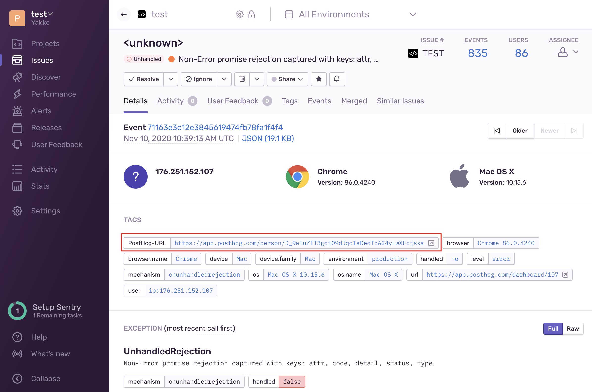
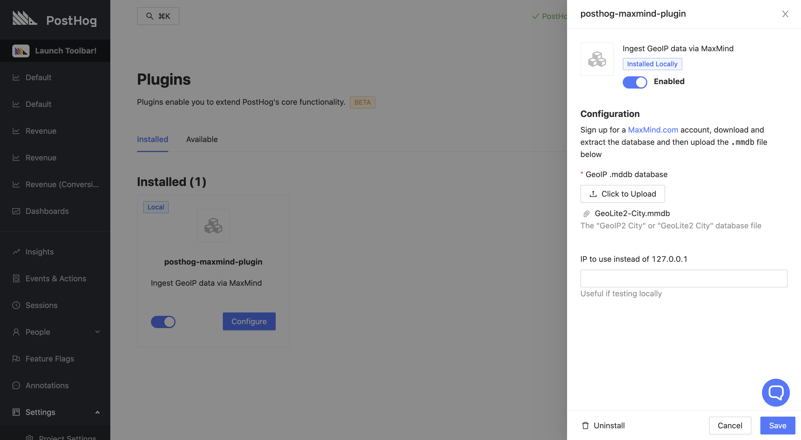
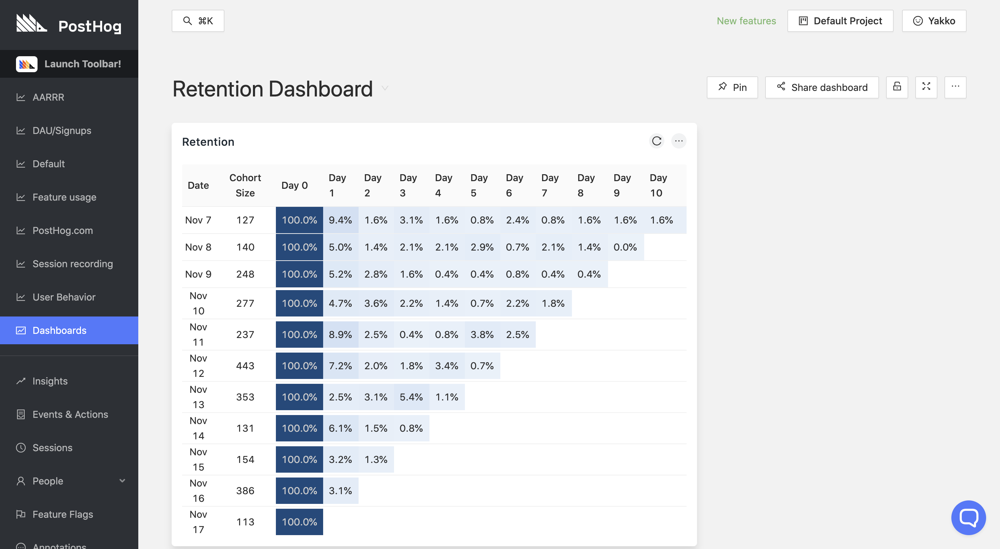
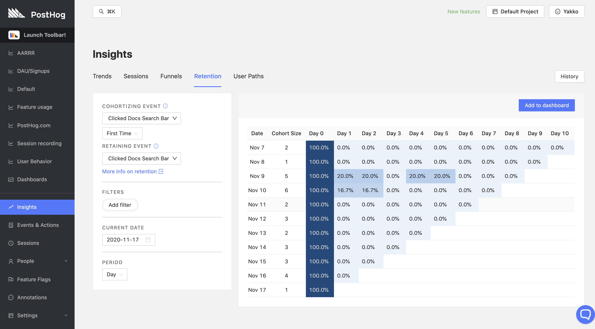
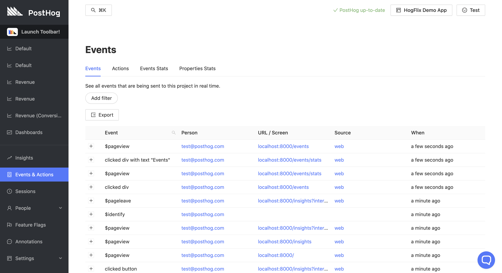

Having launched **major** features in our [previous release](/blog/the-posthog-array-1-16-0) such as [Session Recording](/docs/user-guides/recordings) and [apps](/apps), over the past two weeks we worked extremely hard to improve PostHog's UX, enhance the new Beta features, and fix a bunch of bugs.  

You'll notice PostHog feels much nicer to use and that's largely in part to all the feedback we've received from our users, so thank you and keep the suggestions coming!

## Release Notes

> If you're self-hosting and want to upgrade for a better experience with nicer features, remember to [update your PostHog instance](/docs/runbook/upgrading-posthog).

### [Sentry Integration](https://github.com/PostHog/posthog/pull/1833)

An important part of developing a great user experience is identifying, tracking, and fixing bugs. 

With our new [Sentry](https://sentry.io/) integration, you can leverage PostHog data to help your debugging, and Sentry exception data to track relevant UX metrics. As a two-way integration, it:
- Adds a direct link in Sentry to the profile of the person affected in PostHog
- Sends an `$exception` event to PostHog with a direct link to Sentry

If you're unfamiliar with Sentry, we highly recommend you to check it out - it is an awesome application monitoring platform of which we're avid users at PostHog.

To set up the integration you can read the step-by-step instructions on the dedicated [Sentry Integration page](/docs/libraries/sentry).

### [RudderStack Integration](https://docs.rudderstack.com/destinations/posthog)

RudderStack is an open-source, warehouse-first, customer data platform for developers. It allows you to collect and deliver customer event data to a variety of destinations such as data warehouses and analytics platforms.

As of last week, PostHog is now available as a destination on RudderStack, allowing you to send your event data from various sources into PostHog for performing product analytics. 

You can read more about RudderStack on [their website](https://rudderstack.com/), and learn how to integrate PostHog through their [comprehensive integration docs](https://docs.rudderstack.com/destinations/posthog). 

### [App Attachments and GeoIP Plugin](https://github.com/PostHog/posthog/pull/2263)

Over the past two weeks, our [Apps](/docs/plugins/overview) feature was extensively worked on to improve the experience of using and developing apps for PostHog. 

One of the main changes was the addition of app attachments, which allow you to upload files that are used in the configuration of the app, vastly expanding the realm of possibilities of what apps can do. 

As a result of this, we built the [PostHog MaxMind App](https://github.com/PostHog/maxmind-plugin), leveraging attachments to allow GeoIP data to be used for enriching your events. Once configured, the app adds IP-based location information as properties on your events, such as what country and city your users are located in, making it possible to create charts and tables filtered based on the location of your users.

> **Note:** Apps are currently only available on self-hosted instances. If you're self-hosting and want to use the PostHog MaxMind App, please follow [these instructions](https://github.com/PostHog/maxmind-plugin). If you want to build your own apps, check out our [fresh new guide](/docs/apps/build) on how to do so.

### [Retentions & Paths Dashboard Panels](https://github.com/PostHog/posthog/pull/2201)

Dashboards are a key part of PostHog, so it's important to us that you can have an overview of as many as possible of your metrics in them.

As such, the user paths graph and the retention table can now be added as panels on dashboards, making it so that every single chart, table, funnel, and graph you create in PostHog can make it to your dashboards now. 

### [First Time Retention](https://github.com/PostHog/posthog/pull/2325)

Following some feedback from our own Growth Engineer on what functionality we need for ourselves at PostHog, we have now extended the functionality of our 'Retention' view, adding first time retention and differentiating between 'Cohortizing' and 'Retaining' events.

In short, first time retention cohortizes users based on when they did an event for the **first time**, rather than adding a user to each cohort they had the event in. Additionally, by being able to have different target events for the cohort and the retention, you are able to track the impact of 'Event A' on the retention of 'Event B', exploring hypotheses such as how users who read your documentation retain on product pageviews when compared to other users.

### [New Events & Actions View](https://github.com/PostHog/posthog/pull/2319)

In an effort to make it easier to filter through your events in PostHog and tag events that you find useful, we have now consolidated 'Events' and 'Actions' into one single view, found on the left sidebar as 'Events & Actions'.

On this page, you'll be able to manage everything related to your events, from inspecting their properties, to tagging them as actions. In addition, we have also added stats for your event and property volumes, so you can dig deeper into your analytics data collection, and optimize it to your needs.

### [Improved AWS CloudFormation Deployment](https://github.com/PostHog/deployment/pulls?q=is%3Apr+is%3Aclosed)

Following a lot of great user feedback, we have now significantly improved our [AWS CloudFormation Deployment](/docs/self-host/deploy/aws).

We have now added configuration for relevant alerts and RDS disk size, as well as improved the setup flow and added automatic `SECRET_KEY` generation. If you're happy with the standard config, deploying with AWS is now just a matter of "click, click, click", as described by Karl, one of our engineers.

## Share your feedback
We'd love to hear anything you have to say about PostHog, good or bad. As a thank you, we'll share some awesome [PostHog merch](https://merch.posthog.com).

Want to get involved? [Email us to schedule a 30 minute call](mailto:hey@posthog.com) with one of our teams to help us make PostHog even better!

## Favorite Issue

### [EPIC: Retention](https://github.com/PostHog/posthog/issues/2228)

A roadmap for various retention improvements that will significantly increase the power of PostHog's retention functionality.

## PostHog News

Our community continues to be as awesome as ever, providing valuable feedback and helping out with issues, pull requests, and discussions on our [community](/questions).

This week, we want to give a special shoutout to [Adam](https://github.com/adamb70), who got 2 PRs merged and wrote an article about integrating PostHog on their website. 

Check it out: [Valuing user privacy — PostHog Analytics](https://boaler.uk/posts/valuing-user-privacy-posthog/)

## Open Roles

Are you a Lead Designer, Fullstack Engineer, or Recruiter? 

Or perhaps you're not either but think you'd still be a good fit for PostHog? 

[We want you!](https://posthog.com/careers) 

## Bug Fixes and Performance Improvements

In addition to the highlights listed above, we also merged a bunch of PRs improving PostHog's performance and fixing bugs:

- Fix Cohorts [\#2415](https://github.com/PostHog/posthog/pull/2145) ([timgl](https://github.com/timgl))
- Fix heroku image [\#2414](https://github.com/PostHog/posthog/pull/2414) ([timgl](https://github.com/timgl))
- Fix cohorts not being calculated [\#2404](https://github.com/PostHog/posthog/pull/2404) ([timgl](https://github.com/timgl))
- Fix navigation with actions & events [\#2401](https://github.com/PostHog/posthog/pull/2401) ([paolodamico](https://github.com/paolodamico))
- Minor fix: remove repeated code [\#2399](https://github.com/PostHog/posthog/pull/2399) ([paolodamico](https://github.com/paolodamico))
- Toolbar .less styles fix [\#2392](https://github.com/PostHog/posthog/pull/2392) ([mariusandra](https://github.com/mariusandra))
- Use cloud billing engine [\#2379](https://github.com/PostHog/posthog/pull/2379) ([paolodamico](https://github.com/paolodamico))
- Remove crontab manage events [\#2372](https://github.com/PostHog/posthog/pull/2372) ([EDsCODE](https://github.com/EDsCODE))
- Increase action step url max length. Closes \#2348 [\#2369](https://github.com/PostHog/posthog/pull/2369) ([timgl](https://github.com/timgl))
- Refactor sceneLogic to TypeScript and add dynamic page title [\#2361](https://github.com/PostHog/posthog/pull/2361) ([Twixes](https://github.com/Twixes))
- Watch person and person\_distinct\_id tables for lag [\#2360](https://github.com/PostHog/posthog/pull/2360) ([fuziontech](https://github.com/fuziontech))
- Persist database after docker-compose down [\#2359](https://github.com/PostHog/posthog/pull/2359) ([adamb70](https://github.com/adamb70))
- Adds features to cloud plans [\#2357](https://github.com/PostHog/posthog/pull/2357) ([paolodamico](https://github.com/paolodamico))
- Add missing copy over in dev.dockerfile for new config [\#2356](https://github.com/PostHog/posthog/pull/2356) ([EDsCODE](https://github.com/EDsCODE))
- Added Revenue Data Generator [\#2355](https://github.com/PostHog/posthog/pull/2355) ([yakkomajuri](https://github.com/yakkomajuri))
- Closes \#2347 Fix shared dashboards [\#2351](https://github.com/PostHog/posthog/pull/2351) ([timgl](https://github.com/timgl))
- Run E2E tests without celery [\#2344](https://github.com/PostHog/posthog/pull/2344) ([macobo](https://github.com/macobo))
- Add events table row count to metrics [\#2343](https://github.com/PostHog/posthog/pull/2343) ([fuziontech](https://github.com/fuziontech))
- Fix doubled up slack hook [\#2340](https://github.com/PostHog/posthog/pull/2340) ([EDsCODE](https://github.com/EDsCODE))
- Trends consolidation [\#2339](https://github.com/PostHog/posthog/pull/2339) ([EDsCODE](https://github.com/EDsCODE))
- Implement missing person datapoint on breakdown [\#2338](https://github.com/PostHog/posthog/pull/2338) ([EDsCODE](https://github.com/EDsCODE))
- Fix 'Found 99 users' when there are more [\#2330](https://github.com/PostHog/posthog/pull/2330) ([yakkomajuri](https://github.com/yakkomajuri))
- Fix day interval for people [\#2328](https://github.com/PostHog/posthog/pull/2328) ([EDsCODE](https://github.com/EDsCODE))
- Fix Hidden Properties Display State [\#2326](https://github.com/PostHog/posthog/pull/2326) ([yakkomajuri](https://github.com/yakkomajuri))
- Fix OR generation and deletion in cohort page [\#2324](https://github.com/PostHog/posthog/pull/2324) ([yakkomajuri](https://github.com/yakkomajuri))
- Fix gray bar under preflight [\#2323](https://github.com/PostHog/posthog/pull/2323) ([yakkomajuri](https://github.com/yakkomajuri))
- Fix local static file host on Windows [\#2321](https://github.com/PostHog/posthog/pull/2321) ([adamb70](https://github.com/adamb70))
- Handle intervals don't rely on date\_to for people [\#2317](https://github.com/PostHog/posthog/pull/2317) ([EDsCODE](https://github.com/EDsCODE))
- Cache cohorts from clickhouse / make /decide fast [\#2316](https://github.com/PostHog/posthog/pull/2316) ([macobo](https://github.com/macobo))
- Make sure properties filter on breakdown [\#2315](https://github.com/PostHog/posthog/pull/2315) ([EDsCODE](https://github.com/EDsCODE))
- Fix: Add default to params [\#2314](https://github.com/PostHog/posthog/pull/2314) ([macobo](https://github.com/macobo))
- Closes \#2283 fix heatmap [\#2309](https://github.com/PostHog/posthog/pull/2309) ([timgl](https://github.com/timgl))
- Fixes email invite link [\#2307](https://github.com/PostHog/posthog/pull/2307) ([paolodamico](https://github.com/paolodamico))
- Closes \#2286 remove restrict signups [\#2304](https://github.com/PostHog/posthog/pull/2304) ([timgl](https://github.com/timgl))
- Remove Live Actions Altogether [\#2303](https://github.com/PostHog/posthog/pull/2303) ([yakkomajuri](https://github.com/yakkomajuri))
- Add option to print clickhouse SQL to terminal [\#2302](https://github.com/PostHog/posthog/pull/2302) ([macobo](https://github.com/macobo))
- Basic caching for ClickHouse to redis [\#2300](https://github.com/PostHog/posthog/pull/2300) ([fuziontech](https://github.com/fuziontech))
- Fix cohort query missing filters [\#2299](https://github.com/PostHog/posthog/pull/2299) ([EDsCODE](https://github.com/EDsCODE))
- Fix person created at [\#2288](https://github.com/PostHog/posthog/pull/2288) ([timgl](https://github.com/timgl))
- Updated rrweb block class [\#2279](https://github.com/PostHog/posthog/pull/2279) ([yakkomajuri](https://github.com/yakkomajuri))
- Fix Asterisk in action selector [\#2277](https://github.com/PostHog/posthog/pull/2277) ([timgl](https://github.com/timgl))
- Fix actions grouping by OR [\#2276](https://github.com/PostHog/posthog/pull/2276) ([timgl](https://github.com/timgl))
- Add tooltip to session recording, kill feature flag [\#2275](https://github.com/PostHog/posthog/pull/2275) ([macobo](https://github.com/macobo))
- Add data-attr to session recording toggle [\#2272](https://github.com/PostHog/posthog/pull/2272) ([macobo](https://github.com/macobo))
- Improve instance status report [\#2271](https://github.com/PostHog/posthog/pull/2271) ([macobo](https://github.com/macobo))
- Optimize @cached\_function [\#2270](https://github.com/PostHog/posthog/pull/2270) ([Twixes](https://github.com/Twixes))
- Make debug bar tricolor again and fix its text color outside of SPA [\#2269](https://github.com/PostHog/posthog/pull/2269) ([Twixes](https://github.com/Twixes))
- Possibly optimize action finding [\#2267](https://github.com/PostHog/posthog/pull/2267) ([Twixes](https://github.com/Twixes))
- Fix people filtering with entity filters [\#2265](https://github.com/PostHog/posthog/pull/2265) ([timgl](https://github.com/timgl))
- Don't reload sessions on closing player [\#2261](https://github.com/PostHog/posthog/pull/2261) ([timgl](https://github.com/timgl))
- Invite team member on sidebar [\#2259](https://github.com/PostHog/posthog/pull/2259) ([paolodamico](https://github.com/paolodamico))
- Fix team leakge in count [\#2257](https://github.com/PostHog/posthog/pull/2257) ([timgl](https://github.com/timgl))
- Make local events table work with proto from kafka [\#2254](https://github.com/PostHog/posthog/pull/2254) ([fuziontech](https://github.com/fuziontech))
- Add ee webhooks to celery paths [\#2250](https://github.com/PostHog/posthog/pull/2250) ([EDsCODE](https://github.com/EDsCODE))
- 1999 improve feature flag ux [\#2243](https://github.com/PostHog/posthog/pull/2243) ([timgl](https://github.com/timgl))
- Maximize resuability between ch retention and pg retention [\#2241](https://github.com/PostHog/posthog/pull/2241) ([EDsCODE](https://github.com/EDsCODE))
- Update changelog, mention npm requirement for session recording [\#2240](https://github.com/PostHog/posthog/pull/2240) ([macobo](https://github.com/macobo))
- Update rrweb, posthog-js dependencies [\#2239](https://github.com/PostHog/posthog/pull/2239) ([macobo](https://github.com/macobo))
- Navigation 1775 [\#2238](https://github.com/PostHog/posthog/pull/2238) ([paolodamico](https://github.com/paolodamico))
- Make sure instance status page loads on AWS [\#2237](https://github.com/PostHog/posthog/pull/2237) ([macobo](https://github.com/macobo))
- Fix actions count clickhouse [\#2234](https://github.com/PostHog/posthog/pull/2234) ([timgl](https://github.com/timgl))
- Make tiny adjustments to the changelog [\#2233](https://github.com/PostHog/posthog/pull/2233) ([Twixes](https://github.com/Twixes))
- Log web access in docker [\#2230](https://github.com/PostHog/posthog/pull/2230) ([macobo](https://github.com/macobo))
- Disable server side cursors for PGBouncer [\#2229](https://github.com/PostHog/posthog/pull/2229) ([timgl](https://github.com/timgl))
- Avoid running cronjobs many times a day [\#2226](https://github.com/PostHog/posthog/pull/2226) ([macobo](https://github.com/macobo))
- Monitor clickhouse lag on cloud [\#2225](https://github.com/PostHog/posthog/pull/2225) ([fuziontech](https://github.com/fuziontech))
- Enable email on localhost by default [\#2222](https://github.com/PostHog/posthog/pull/2222) ([paolodamico](https://github.com/paolodamico))
- Fix flaky person test [\#2221](https://github.com/PostHog/posthog/pull/2221) ([timgl](https://github.com/timgl))
- Updated readme with heatmaps mention [\#2218](https://github.com/PostHog/posthog/pull/2218) ([jamesefhawkins](https://github.com/jamesefhawkins))
- Prettier write instead of check [\#2215](https://github.com/PostHog/posthog/pull/2215) ([Twixes](https://github.com/Twixes))
- Fix sessions on dashboard [\#2214](https://github.com/PostHog/posthog/pull/2214) ([timgl](https://github.com/timgl))
- Remove feature flags on clickhouse endpoints [\#2212](https://github.com/PostHog/posthog/pull/2212) ([EDsCODE](https://github.com/EDsCODE))
- Add timing for event endpoint [\#2211](https://github.com/PostHog/posthog/pull/2211) ([fuziontech](https://github.com/fuziontech))
- Skip celery for ee path [\#2210](https://github.com/PostHog/posthog/pull/2210) ([fuziontech](https://github.com/fuziontech))
- Fix: improve the accessibility [\#2206](https://github.com/PostHog/posthog/pull/2206) ([weyert](https://github.com/weyert))
- Optionally log to Kafka for WAL [\#2205](https://github.com/PostHog/posthog/pull/2205) ([fuziontech](https://github.com/fuziontech))
- Plugins via NPM [\#2204](https://github.com/PostHog/posthog/pull/2204) ([mariusandra](https://github.com/mariusandra))
- ClickHouse dont run caching/cohort [\#2200](https://github.com/PostHog/posthog/pull/2200) ([timgl](https://github.com/timgl))
- Possibly fix org signup by fixing analytics [\#2199](https://github.com/PostHog/posthog/pull/2199) ([Twixes](https://github.com/Twixes))
- Optimize commandPaletteLogic [\#2193](https://github.com/PostHog/posthog/pull/2193) ([Twixes](https://github.com/Twixes))
- Remove some seemingly unused requirements and use pip-compile [\#2192](https://github.com/PostHog/posthog/pull/2192) ([Twixes](https://github.com/Twixes))
- Fix suggestion loading error [\#2191](https://github.com/PostHog/posthog/pull/2191) ([timgl](https://github.com/timgl))
- Update Django from 3.0.7 to 3.0.11 \(and Django-related packages\) [\#2190](https://github.com/PostHog/posthog/pull/2190) ([Twixes](https://github.com/Twixes))
- Center align retention values [\#2189](https://github.com/PostHog/posthog/pull/2189) ([EDsCODE](https://github.com/EDsCODE))
- Update sentry-sdk from 0.16.5 to 0.19.2 [\#2188](https://github.com/PostHog/posthog/pull/2188) ([Twixes](https://github.com/Twixes))
- Handle ChunkLoadError better [\#2187](https://github.com/PostHog/posthog/pull/2187) ([Twixes](https://github.com/Twixes))
- Restore slack hook [\#2186](https://github.com/PostHog/posthog/pull/2186) ([EDsCODE](https://github.com/EDsCODE))
- Update local dev to use proto for events [\#2181](https://github.com/PostHog/posthog/pull/2181) ([fuziontech](https://github.com/fuziontech))
- Fix Sentry issue POSTHOG-13K [\#2180](https://github.com/PostHog/posthog/pull/2180) ([Twixes](https://github.com/Twixes))
- Ignore sentry error about mis-matched timezones for now [\#2174](https://github.com/PostHog/posthog/pull/2174) ([timgl](https://github.com/timgl))
- Fix feature flags clickhouse [\#2170](https://github.com/PostHog/posthog/pull/2170) ([timgl](https://github.com/timgl))
- Simplify action queries [\#2167](https://github.com/PostHog/posthog/pull/2167) ([timgl](https://github.com/timgl))
- New UI [\#2114](https://github.com/PostHog/posthog/pull/2114) ([paolodamico](https://github.com/paolodamico))
- Send invite over email if possible [\#2112](https://github.com/PostHog/posthog/pull/2112) ([Twixes](https://github.com/Twixes))
- Save session player speed in localstorage [\#2110](https://github.com/PostHog/posthog/pull/2110) ([macobo](https://github.com/macobo))
- Improve weekly report testing [\#2014](https://github.com/PostHog/posthog/pull/2014) ([paolodamico](https://github.com/paolodamico))
- Run posthog-production CI in a way testing migration continuity [\#1863](https://github.com/PostHog/posthog/pull/1863) ([Twixes](https://github.com/Twixes))

<ArrayCTA />
