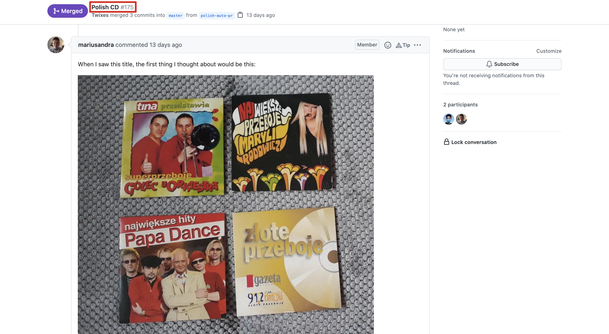
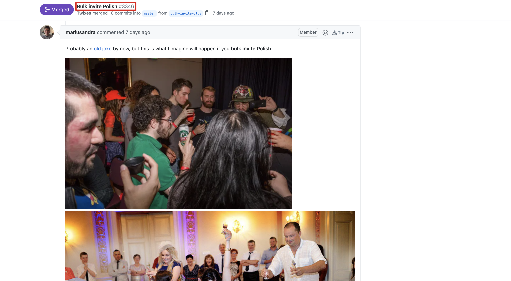

import { Link } from 'gatsby'

PostHog 1.22 is out with awesome new features, usability and performance improvements, and the usual bug squashing.

### Community MVP

The community MVP for PostHog 1.22.0 is [oshura3](https://github.com/oshura3), who did a [thorough review and edit of our website content](https://github.com/PostHog/posthog.com/pull/1045) and continues to be active in design and marketing discussions.

Anyone can contribute to PostHog and open source, whether it's code, copy, design or discussion. We're delighted that our community are so passionate that they even [share PostHog with their family](https://github.com/PostHog/posthog.com/issues/1036#issuecomment-788732593) ;)

Thank you oshura3, we look forward to collaborating with you more!

**In this release:**

-   **New:** Support for bar charts by value
-   **New:** UTM tags now get automatically set as user properties
-   **New:** Equality filters now allow the selection of multiple values
-   **New:** Two more apps!
-   **New:** API Key autofill on our Docs
-   **Improvement:** All events can now set properties on a user
-   **Improvement:** Better tooling for updating data in dashboards
-   **Improvement:** A whole new UX for individual person pages

 

  <CallToAction to="https://app.posthog.com/signup">
    Try PostHog Cloud Now
  </CallToAction>

 

## Important Announcement for Self-Hosted Users

If you're self hosting PostHog, make sure you have your app server up and running by looking at the color of the middle circle on the top left of the PostHog UI.

If it is running, you'll see a green checkmark, and hovering over it will give the message "All systems operational", like so:

From this release (1.22.0) onwards, if your app server is not running, this circle will turn amber. You can click on the server to verify if your app server is indeed the problem.

**Important:** next release we will move all our event ingestion to the app server, meaning that you **will not be able to ingest events** if your app server isn't running.

## PostHog 1.22.0 Release Notes

> If you're self-hosting and want to upgrade for a better experience and new features, remember to [update your PostHog instance](/docs/runbook/upgrading-posthog).

### [Bar Charts by Graph Series/Value](https://github.com/PostHog/posthog/pull/3457)

Before this release bar charts were time-based, which meant that if you had multiple graph series (values), they would all be stacked into one bar for each time period.

We now support two different types of bar charts! When selecting a chart type, you will see the options 'Time' and 'Value' under 'Bar Chart'. Selecting 'Value' will give you the view from the image above, where each graph series is represented in a separate bar, with the value consisting of the aggregate value for the time period specified.

### [UTM Tags Automatically Set as User Properties](https://github.com/PostHog/plugin-server/pull/214)

PostHog now automatically sets user properties from [UTM tags](https://en.wikipedia.org/wiki/UTM_parameters). You can now filter and create cohorts of users much more easily based on what campaign, source, or medium brought them to your product or landing page. This is a big feature for us as it gives our users an automatic way of connecting marketing and product to have a more complete view of your business. We're very excited for our community to start using this feature and extending it through [apps](https://posthog.com/docs/plugins/overview).

### [Multiple Value Selector for Equality Filters](https://github.com/PostHog/posthog/pull/3422)

Writing complex filters is now easier than ever before. You can now select multiple values for Equality Filters instead of just one - this will simplify filter creation and debugging and just save people a lot of time!

### [Refreshing Dashboards and Updating Time Range for All Panels](https://github.com/PostHog/posthog/pull/3363)

It's now easier to work through your key metrics in Dashboards:

-   All dashboard panels can be refreshed at the same time to ensure you're not seeing cached results
-   Time ranges for all dashboard panels can be changed at the same time
-   The dashboard author and creation time are displayed below the title

### [A Much Better UI for Person Pages](https://github.com/PostHog/posthog/pull/3461)

The UI of our person pages just got a whole lot better! As is often the case with our larger features, this isn't news to all of you. We had this behind a feature flag and have now decided to roll it out for everyone.

Now you can visualize user properties alongside a user's events, and most of the context you need on a person is available to you in a sleek UI without you needing to scroll.

Oh, and the code got much better as a result too...

### [Exposing $set and $set_once on all events](https://github.com/PostHog/posthog/pull/3363)

The event properties `$set` and `$set_once` can now be used on any event to set properties directly to the user associated with that event.

Previously, this would only work on `$identify` events, making it so that you needed to call multiple methods in order to send an event and set user properties based on the same data. But now, you can do it all in one, as shown in the image above.

### [Event Sequence Timer](https://posthog.com/plugins/event-sequence-timer-plugin)

Our users requested a way to measure the time passed between certain events, and this is it!

By installing the Event Sequence Timer, you can specify as many sets of events as you want and the app will track the time between them, either using a first touch or last touch mechanism.

It will then add a property to your events that allows you to easily build visualizations in PostHog of the average, minimum, and maximum time between events, as well as all the other mathematical operations we support.

### [Property Flattener](https://posthog.com/plugins/property-flattener)

The new Property Flattener allows you to convert event properties contained in a nested structure into a flat structure, allowing you to set filters based on the nested properties.

### [Project API Key Autofill in Docs for Cloud Users](https://github.com/PostHog/posthog.com/pull/998)

If you're a user of PostHog Cloud, we now autofill your Project API Key and API Host automatically in the Docs for you, meaning you can copy-paste snippets and use them directly with no manual changes!

This key will be based on the last project you used in PostHog, and you can check what project that is by simply hovering your cursor over the highlighted key.

## Share your feedback
We'd love to hear anything you have to say about PostHog, good or bad. As a thank you, we'll share some awesome [PostHog merch](https://merch.posthog.com).

Want to get involved? [Email us to schedule a 30 minute call](mailto:hey@posthog.com) with one of our teams to help us make PostHog even better!

## Favorite ~~Issue~~ Banter

On the rare occasions that our M² team (Michael & Marius) is not found working hard (and oftentimes late) on our app server, they can be found taking the names of Pull Requests out of context:

## PostHog News

Kunal has joined us as our first Growth Engineer, and he's already been making a solid impact. Kunal is a startup vet, who started out as a developer and now works on growth, being passionate about building the right product experience to drive the most value.

He sent shockwaves across the company by claiming that pineapple belongs on pizza... sometimes? Never before has the entire company disagreed with someone's stance on this sensitive topic.

## Community Shoutouts

Big thanks to the following members of our community who have contributed to PostHog over this release cycle:

-   [ungps](https://github.com/ungps)
-   [Skchoudhary](https://github.com/Skchoudhary)
-   [oshura3](https://github.com/oshura3)
-   [Abo7atm](https://github.com/Abo7atm)
-   [andrewm4894](https://github.com/andrewm4894)

## Open Roles

Are you a Fullstack Engineer, Senior Engineer, Site Reliability Engineer, Sales Engineer, Product Marketer, or Content Writer?

Or perhaps you're not either but think you'd still be a good fit for PostHog?

[We want you!](https://posthog.com/careers)

## Bug Fixes and Performance Improvements

In addition to the highlights listed above, we also merged a bunch of PRs improving PostHog's performance and fixing bugs:

-   Closes \#3520 fix custom date filter dashboards [\#3533](https://github.com/PostHog/posthog/pull/3533) ([timgl](https://github.com/timgl))
-   Closes \#3524 filters do not reset [\#3532](https://github.com/PostHog/posthog/pull/3532) ([ungps](https://github.com/ungps))
-   Random fixes Mar 1 [\#3530](https://github.com/PostHog/posthog/pull/3530) ([paolodamico](https://github.com/paolodamico))
-   fix plugin invalid config error [\#3529](https://github.com/PostHog/posthog/pull/3529) ([yakkomajuri](https://github.com/yakkomajuri))
-   Add explanation for clipboard not working on remote HTTP [\#3528](https://github.com/PostHog/posthog/pull/3528) ([Twixes](https://github.com/Twixes))
-   Parse retention timestamps to local time [\#3522](https://github.com/PostHog/posthog/pull/3522) ([EDsCODE](https://github.com/EDsCODE))
-   Disable unnecessary chart filters on retention [\#3521](https://github.com/PostHog/posthog/pull/3521) ([EDsCODE](https://github.com/EDsCODE))
-   Fix minor UI issue with funnel loading [\#3519](https://github.com/PostHog/posthog/pull/3519) ([yakkomajuri](https://github.com/yakkomajuri))
-   Fix cannot read property 0 of undefined [\#3518](https://github.com/PostHog/posthog/pull/3518) ([yakkomajuri](https://github.com/yakkomajuri))
-   Add no-PR-description-shaming workflow [\#3517](https://github.com/PostHog/posthog/pull/3517) ([Twixes](https://github.com/Twixes))
-   Instrument person properties management [\#3511](https://github.com/PostHog/posthog/pull/3511) ([paolodamico](https://github.com/paolodamico))
-   Make PLUGIN_SERVER_INGESTION True by default [\#3485](https://github.com/PostHog/posthog/pull/3485) ([Twixes](https://github.com/Twixes))
-   Add ability to add person props on the UI [\#3394](https://github.com/PostHog/posthog/pull/3394) ([yakkomajuri](https://github.com/yakkomajuri))
-   Use plugin-server container in containerized deploys [\#3515](https://github.com/PostHog/posthog/pull/3515) ([Twixes](https://github.com/Twixes))
-   Fix debug toolbar sql panel [\#3507](https://github.com/PostHog/posthog/pull/3507) ([timgl](https://github.com/timgl))
-   Don't recalculate deleted cohorts [\#3506](https://github.com/PostHog/posthog/pull/3506) ([macobo](https://github.com/macobo))
-   Fix limit of events in CSV export [\#3503](https://github.com/PostHog/posthog/pull/3503) ([Twixes](https://github.com/Twixes))
-   Update plugin server to 0.11.1 [\#3502](https://github.com/PostHog/posthog/pull/3502) ([posthog-bot](https://github.com/posthog-bot))
-   Fix getting earliest timestamp on EE with no events [\#3501](https://github.com/PostHog/posthog/pull/3501) ([macobo](https://github.com/macobo))
-   Fix filtering sessions by action with property filters [\#3500](https://github.com/PostHog/posthog/pull/3500) ([macobo](https://github.com/macobo))
-   Update plugin server to 0.10.3 [\#3498](https://github.com/PostHog/posthog/pull/3498) ([posthog-bot](https://github.com/posthog-bot))
-   Run all connections through clickhouse connection pooler [\#3495](https://github.com/PostHog/posthog/pull/3495) ([fuziontech](https://github.com/fuziontech))
-   Reduce calls to api/action [\#3493](https://github.com/PostHog/posthog/pull/3493) ([timgl](https://github.com/timgl))
-   e2e-test-runner: Only start webpack if not already running [\#3484](https://github.com/PostHog/posthog/pull/3484) ([macobo](https://github.com/macobo))
-   Fix: funnels & retention person links, funnel calculations [\#3483](https://github.com/PostHog/posthog/pull/3483) ([macobo](https://github.com/macobo))
-   Update plugin server to 0.10.1 [\#3481](https://github.com/PostHog/posthog/pull/3481) ([posthog-bot](https://github.com/posthog-bot))
-   Fix "unseen sessions" filter [\#3478](https://github.com/PostHog/posthog/pull/3478) ([macobo](https://github.com/macobo))
-   Reload our feature flags after changing them [\#3477](https://github.com/PostHog/posthog/pull/3477) ([macobo](https://github.com/macobo))
-   Add test for bar charts [\#3474](https://github.com/PostHog/posthog/pull/3474) ([macobo](https://github.com/macobo))
-   Fix "password" on invite page [\#3473](https://github.com/PostHog/posthog/pull/3473) ([Twixes](https://github.com/Twixes))
-   Create a connection every time a query is run [\#3467](https://github.com/PostHog/posthog/pull/3467) ([fuziontech](https://github.com/fuziontech))
-   Fix invite being inaccessible for users without org or project [\#3466](https://github.com/PostHog/posthog/pull/3466) ([Twixes](https://github.com/Twixes))
-   Alert if plugin server down [\#3465](https://github.com/PostHog/posthog/pull/3465) ([mariusandra](https://github.com/mariusandra))
-   Earlier IP anonymization [\#3464](https://github.com/PostHog/posthog/pull/3464) ([mariusandra](https://github.com/mariusandra))
-   Fix webhooks specifity [\#3463](https://github.com/PostHog/posthog/pull/3463) ([Twixes](https://github.com/Twixes))
-   Don't null IPs for teams who toggled an ancient field [\#3462](https://github.com/PostHog/posthog/pull/3462) ([mariusandra](https://github.com/mariusandra))
-   Rename posthog-production to posthog-cloud [\#3460](https://github.com/PostHog/posthog/pull/3460) ([paolodamico](https://github.com/paolodamico))
-   Update plugin server to 0.9.29 [\#3459](https://github.com/PostHog/posthog/pull/3459) ([posthog-bot](https://github.com/posthog-bot))
-   Bar chart by value [\#3457](https://github.com/PostHog/posthog/pull/3457) ([macobo](https://github.com/macobo))
-   Update plugin server to 0.9.28 [\#3456](https://github.com/PostHog/posthog/pull/3456) ([posthog-bot](https://github.com/posthog-bot))
-   Send all events to plugin server [\#3452](https://github.com/PostHog/posthog/pull/3452) ([mariusandra](https://github.com/mariusandra))
-   Fix setting up test databases on clickhouse [\#3451](https://github.com/PostHog/posthog/pull/3451) ([macobo](https://github.com/macobo))
-   Update plugin server to 0.9.26 [\#3450](https://github.com/PostHog/posthog/pull/3450) ([posthog-bot](https://github.com/posthog-bot))
-   Update plugin server to 0.9.25 [\#3447](https://github.com/PostHog/posthog/pull/3447) ([posthog-bot](https://github.com/posthog-bot))
-   change frequency of cohort calculation [\#3446](https://github.com/PostHog/posthog/pull/3446) ([EDsCODE](https://github.com/EDsCODE))
-   Update plugin server to 0.9.24 [\#3445](https://github.com/PostHog/posthog/pull/3445) ([posthog-bot](https://github.com/posthog-bot))
-   Add telemetry for the hooks task [\#3442](https://github.com/PostHog/posthog/pull/3442) ([Twixes](https://github.com/Twixes))
-   Add : in front of password for ioredis [\#3439](https://github.com/PostHog/posthog/pull/3439) ([mariusandra](https://github.com/mariusandra))
-   Send 20% of events to plugin server [\#3437](https://github.com/PostHog/posthog/pull/3437) ([mariusandra](https://github.com/mariusandra))
-   Update plugin server to 0.9.23 [\#3436](https://github.com/PostHog/posthog/pull/3436) ([posthog-bot](https://github.com/posthog-bot))
-   Update plugin server to 0.9.22 [\#3435](https://github.com/PostHog/posthog/pull/3435) ([posthog-bot](https://github.com/posthog-bot))
-   935 trend legend [\#3434](https://github.com/PostHog/posthog/pull/3434) ([EDsCODE](https://github.com/EDsCODE))
-   Fix authenticated invite signup [\#3433](https://github.com/PostHog/posthog/pull/3433) ([paolodamico](https://github.com/paolodamico))
-   Update plugin server to 0.9.21 [\#3430](https://github.com/PostHog/posthog/pull/3430) ([posthog-bot](https://github.com/posthog-bot))
-   Fix find_key_with_source \(2231571657\) [\#3429](https://github.com/PostHog/posthog/pull/3429) ([paolodamico](https://github.com/paolodamico))
-   Fix clicking datapoint with multiple entities [\#3428](https://github.com/PostHog/posthog/pull/3428) ([EDsCODE](https://github.com/EDsCODE))
-   Support POSTHOG_REDIS\_\* vars in bin/plugin-server [\#3426](https://github.com/PostHog/posthog/pull/3426) ([Twixes](https://github.com/Twixes))
-   Separate stricter team model migration into two [\#3424](https://github.com/PostHog/posthog/pull/3424) ([Twixes](https://github.com/Twixes))
-   Rename DAU -\> Active Users [\#3420](https://github.com/PostHog/posthog/pull/3420) ([yakkomajuri](https://github.com/yakkomajuri))
-   Update plugin server to 0.9.20 [\#3419](https://github.com/PostHog/posthog/pull/3419) ([posthog-bot](https://github.com/posthog-bot))
-   Run tests via pytest [\#3417](https://github.com/PostHog/posthog/pull/3417) ([macobo](https://github.com/macobo))
-   Fix "Finish setup" button in billing [\#3416](https://github.com/PostHog/posthog/pull/3416) ([Twixes](https://github.com/Twixes))
-   Finish the purge on curly-less if statements [\#3414](https://github.com/PostHog/posthog/pull/3414) ([yakkomajuri](https://github.com/yakkomajuri))
-   Improve reordering funnel steps [\#3412](https://github.com/PostHog/posthog/pull/3412) ([macobo](https://github.com/macobo))
-   Improve django admin for organizations [\#3405](https://github.com/PostHog/posthog/pull/3405) ([timgl](https://github.com/timgl))
-   Fix tooltips over property type icons [\#3404](https://github.com/PostHog/posthog/pull/3404) ([Twixes](https://github.com/Twixes))
-   Plugin server 0.9.14 [\#3403](https://github.com/PostHog/posthog/pull/3403) ([mariusandra](https://github.com/mariusandra))
-   Plugin server 0.9.12 [\#3401](https://github.com/PostHog/posthog/pull/3401) ([mariusandra](https://github.com/mariusandra))
-   Update plugin server to 0.9.11 [\#3400](https://github.com/PostHog/posthog/pull/3400) ([Twixes](https://github.com/Twixes))
-   Update plugin server to 0.9.7 [\#3398](https://github.com/PostHog/posthog/pull/3398) ([Twixes](https://github.com/Twixes))
-   10% to plugin server [\#3397](https://github.com/PostHog/posthog/pull/3397) ([mariusandra](https://github.com/mariusandra))
-   Update plugin server to 0.9.6 [\#3396](https://github.com/PostHog/posthog/pull/3396) ([Twixes](https://github.com/Twixes))
-   Plugin server 0.9.5 [\#3395](https://github.com/PostHog/posthog/pull/3395) ([mariusandra](https://github.com/mariusandra))
-   Update plugin server to 0.9.4 [\#3393](https://github.com/PostHog/posthog/pull/3393) ([Twixes](https://github.com/Twixes))
-   Order distinct ids by anonymous [\#3392](https://github.com/PostHog/posthog/pull/3392) ([timgl](https://github.com/timgl))
-   Fix loading billing plans on self-hosted [\#3389](https://github.com/PostHog/posthog/pull/3389) ([paolodamico](https://github.com/paolodamico))
-   Update plugin server to 0.9.3 [\#3388](https://github.com/PostHog/posthog/pull/3388) ([mariusandra](https://github.com/mariusandra))
-   Change 10% to 1% ingestion via the plugin server [\#3385](https://github.com/PostHog/posthog/pull/3385) ([mariusandra](https://github.com/mariusandra))
-   Str the UUID [\#3383](https://github.com/PostHog/posthog/pull/3383) ([mariusandra](https://github.com/mariusandra))
-   Ingest 10% of events via plugin server [\#3382](https://github.com/PostHog/posthog/pull/3382) ([mariusandra](https://github.com/mariusandra))
-   Plugin server ingestion again [\#3381](https://github.com/PostHog/posthog/pull/3381) ([mariusandra](https://github.com/mariusandra))
-   Add plugin server version to System Status [\#3380](https://github.com/PostHog/posthog/pull/3380) ([Twixes](https://github.com/Twixes))
-   Reuse Postgres connections in Celery [\#3379](https://github.com/PostHog/posthog/pull/3379) ([Twixes](https://github.com/Twixes))
-   Auto log in for e2e tests and review apps [\#3377](https://github.com/PostHog/posthog/pull/3377) ([macobo](https://github.com/macobo))
-   Plugin server 0.9.1 [\#3376](https://github.com/PostHog/posthog/pull/3376) ([mariusandra](https://github.com/mariusandra))
-   Fix breaking down by "all" cohorts when no other cohorts [\#3374](https://github.com/PostHog/posthog/pull/3374) ([macobo](https://github.com/macobo))
-   Add some missing team_id filters [\#3372](https://github.com/PostHog/posthog/pull/3372) ([macobo](https://github.com/macobo))
-   Bump version [\#3371](https://github.com/PostHog/posthog/pull/3371) ([yakkomajuri](https://github.com/yakkomajuri))
-   Fix path for demo data generation [\#3369](https://github.com/PostHog/posthog/pull/3369) ([paolodamico](https://github.com/paolodamico))
-   Prefilter post_event_to_webhook_ee more [\#3368](https://github.com/PostHog/posthog/pull/3368) ([Twixes](https://github.com/Twixes))
-   Add created by tag to individual dashboards [\#3367](https://github.com/PostHog/posthog/pull/3367) ([yakkomajuri](https://github.com/yakkomajuri))
-   Fix hidden plugin config field [\#3364](https://github.com/PostHog/posthog/pull/3364) ([yakkomajuri](https://github.com/yakkomajuri))
-   Dashboards: allow changing date filters & refresh [\#3363](https://github.com/PostHog/posthog/pull/3363) ([macobo](https://github.com/macobo))
-   Bump rrweb 0.9.14 [\#3361](https://github.com/PostHog/posthog/pull/3361) ([timgl](https://github.com/timgl))
-   Support client-side compact number formatting & instrumentation [\#3360](https://github.com/PostHog/posthog/pull/3360) ([paolodamico](https://github.com/paolodamico))
-   retention dashboard item refresh bug [\#3359](https://github.com/PostHog/posthog/pull/3359) ([EDsCODE](https://github.com/EDsCODE))
-   3293 retention hourly bug [\#3358](https://github.com/PostHog/posthog/pull/3358) ([EDsCODE](https://github.com/EDsCODE))
-   Fix filtering on elements clickhouse [\#3354](https://github.com/PostHog/posthog/pull/3354) ([timgl](https://github.com/timgl))
-   Clean-up post-migration of invite signup [\#3353](https://github.com/PostHog/posthog/pull/3353) ([paolodamico](https://github.com/paolodamico))
-   Fix unselecting fields in action [\#3352](https://github.com/PostHog/posthog/pull/3352) ([timgl](https://github.com/timgl))
-   Fix /demo feature flags loading issue [\#3350](https://github.com/PostHog/posthog/pull/3350) ([yakkomajuri](https://github.com/yakkomajuri))
-   Update launch toolbar CTA for new nav [\#3347](https://github.com/PostHog/posthog/pull/3347) ([yakkomajuri](https://github.com/yakkomajuri))
-   Bulk invite the Polish [\#3346](https://github.com/PostHog/posthog/pull/3346) ([Twixes](https://github.com/Twixes))
-   Add Invite Team Member to top bar user dropdown [\#3343](https://github.com/PostHog/posthog/pull/3343) ([Twixes](https://github.com/Twixes))
-   Fix/replace setTimeout in logics [\#3337](https://github.com/PostHog/posthog/pull/3337) ([macobo](https://github.com/macobo))
-   Fix formula query parsing [\#3336](https://github.com/PostHog/posthog/pull/3336) ([timgl](https://github.com/timgl))
-   Migrate team invite signup to React - Part II \(Front-end\) [\#3300](https://github.com/PostHog/posthog/pull/3300) ([paolodamico](https://github.com/paolodamico))
-   Remove statsd logspam [\#3299](https://github.com/PostHog/posthog/pull/3299) ([macobo](https://github.com/macobo))
-   Trend component test [\#3278](https://github.com/PostHog/posthog/pull/3278) ([EDsCODE](https://github.com/EDsCODE))
-   Stricter Team model [\#3252](https://github.com/PostHog/posthog/pull/3252) ([Twixes](https://github.com/Twixes))
-   Change graphs to ts [\#3181](https://github.com/PostHog/posthog/pull/3181) ([EDsCODE](https://github.com/EDsCODE))
-   Static cohort on person modal [\#2952](https://github.com/PostHog/posthog/pull/2952) ([EDsCODE](https://github.com/EDsCODE))

<ArrayCTA />
