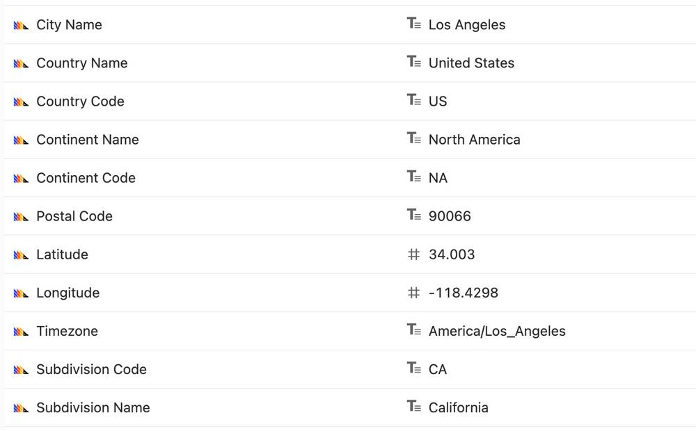

PostHog 1.33.0 introduces a full Experimentation suite, enabling you to run multivariate experiments to ensure you maximize value for your end users. Introducing also support for a managed ClickHouse infrastructure through Altinity Cloud, insight legends and insight permalinks. Plus, there are over 290+ improvements and bugfixes included!

For Enterprise customers, we've also added the ability to set granular permissions on dashboards.

<blockquote class='warning-note'>
<b>IMPORTANT!</b> From this version onwards, you'll need to make sure to run all async migrations on your instance <b>after upgrading to 1.33.0</b>. The next version (1.34.0) will not run until async migrations are completed. Please check out the <a href="/docs/runbook/async-migrations" target="_blank">async migrations</a> docs for details.
</blockquote>

## PostHog 1.33.0 release notes

> To upgrade your PostHog instance, you can check out our [upgrade guide](/docs/runbook/upgrading-posthog).

**Release highlights:**

-   [Experimentation](#new-experimentation)
-   [Dashboard permissions](#new-dashboard-permissions)
-   [Altinity Cloud support](#new-altitiny-cloud-support)
-   [Instance configuration UI](#new-instance-configuration-ui)

### New: Experimentation

PostHog now offers a full, [open source end-to-end A/B testing](/blog/best-open-source-ab-testing-tools) suite! Previously you could use [Feature Flags](/product/feature-flags) to run experiments, but it took a lot of manual work to setup and interpret. We wanted to fix that. This new experimentation suite will help you plan tests by selecting users, sample sizes and run times, then track results and let you know when results are statistically significant.

With [Experimentation](/docs/user-guides/experimentation), you can now test multiple variants to optimize for a specific metric, or even conversion rate for a funnel. This enables you to ship product changes confidently while maintaining speed.

> 🎁 Experimentation is a premium feature and requires a PostHog Scale or Enterprise license. [Learn more](/pricing).

 

### New: Dashboard redesign

We've redesigned dashboards to make them more useful than ever. Changes include better exposition of titles, descriptions, tags and activity, so that it's easier to understand at a glance.

We've also added a new Insight Details feature that can give you a handy summary of the query. Now all the information you need to understand a dashboard is right there in front of you!

 

### New: Dashboard permissions

It's now possible to granularly control team members' access to dashboards – by default anyone in the project can still edit them, but there is also an option to restrict editing only to specific invited team members. Those who don't have edit access to a dashboard are also prevented from editing insights belonging to it. With this feature unwanted changes to existing dashboards and insights no longer pose a problem for teams.

> 🎁 Dashboard permissions is a premium feature and requires a **PostHog Enterprise** license. [Learn more](/pricing).

 

### New: Altinity Cloud support

We've partnered with Altinity to offer a worry-free managed ClickHouse database. Altinity is an expert in ClickHouse and data infrastructure and helps large organizations to deploy, manage and scale their PostHog instance. If you need to self-host PostHog, but don't want to manage the deployment yourself then Altinity is the solution for you.

 

### New: Instance configuration UI

We're making it much more straightforward to manage your PostHog instance, with a new UI that surfaces options and removes the need to rely on environment variables such as email settings. You can read more about these settings in the [instance settings docs](/docs/self-host/configure/instance-settings) and [environment variables docs](/docs/self-host/configure/environment-variables).

 

### Other improvements & fixes

-   Improved: Short robust permalinks. When sharing an insight link (e.g. `https://app.posthog.com/insights/BYt1oFdI`), we'll now automatically switch you to the relevant project (if the link is from a different project). You can now be confident the recipient will see the insight you intended.
-   Improved: Smarter events and property filters. We've made a lot of improvements to how we show events and event properties across the app. We'll now only show you the relevant properties for a specific event and we'll signal when an event has not been seen in the last 30 days, so you can create insights faster.
-   Improved: Redesigned share dashboard modal. We've made it simpler and clearer when your dashboard is shared, internally and externally.
-   Improved: A new async migration (`person_distinct_id2`) will speed up queries >70% for projects with 10M+ unique users.
-   New: Insight legends. Each insight now offers a legend within each graph to provide clarity to what each line represents. This is particularly useful when sharing screenshots of an insight so the recipient knows what each line represents.
-   Improved: Automatic API documentation. We've implemented [Swagger](https://github.com/swagger-api) to automatically generate API docs to ensure these are always up-to-date.
-   Improved: Performance of Events page. The events page will now load up to 10x faster! We've improved the way queries are performed, and what information is loaded to reduce load times to a minimum.
-   Plus 290+ improvements & fixes.

### Deprecation & removal notices

-   Please make sure to run all [async migrations](/docs/runbook/async-migrations) after upgrading to this version (1.33.0) and before upgrading to the next version (1.34.0, March 2022).

## Share your feedback
We'd love to hear anything you have to say about PostHog, good or bad. As a thank you, we'll share some awesome [PostHog merch](https://merch.posthog.com).

Want to get involved? [Email us to schedule a 30 minute call](mailto:hey@posthog.com) with one of our teams to help us make PostHog even better!

## PostHog News

Welcome Grace McKenzie! Grace joined PostHog as an Ops Manager to help keep the company running smoothly. Grace has a very unique position on pineapple on pizza (🍍 on 🍕), "I will tolerate pineapple on pizza as long as there is bacon and ranch dipping sauce involved".

> I once lead a self-researched and organized pub crawl for 30 strangers in Prague after having only been in the city for 6 hours!

## Share your feedback
We'd love to hear anything you have to say about PostHog, good or bad. As a thank you, we'll share some awesome [PostHog merch](https://merch.posthog.com).

Want to get involved? [Email us to schedule a 30 minute call](mailto:hey@posthog.com) with one of our teams to help us make PostHog even better!

### Community shoutouts

We want to thank [jc00ke](https://github.com/jc00ke) and [TheDoctor0](https://github.com/TheDoctor0) who contributed to this release of PostHog!

## Open roles

Join us in helping make more products successful! We're currently hiring for the following roles:

-   Ex-Founders
-   Engineering Manager
-   Full Stack Engineer
-   Site Reliability Engineer - Kubernetes
-   Full Stack Engineer - Growth

Learn more about these roles on our [Careers page](https://posthog.com/careers).

Don't see a role for you? We're always looking for exceptional people, so reach out to us via the link above.

_Follow us on [Twitter](https://twitter.com/PostHog) or [LinkedIn](https://linkedin.com/company/posthog), and subscribe to our [newsletter](https://posthog.com/newsletter) for more posts on startups, growth, and analytics._

<ArrayCTA />
