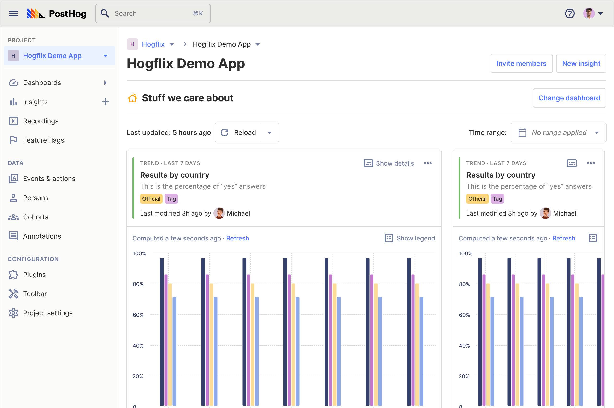

PostHog 1.34.0 focuses on supporting collaboration and helping you to find and share insights on PostHog. New features in this update include a new default homepage for projects, smart names for all insights and an entire Data Management tool!

<blockquote class='warning-note'>
<b>IMPORTANT!</b> Before upgrading, make sure to run all async migrations on your instance. This version will not run until async migrations are completed. Please check out the <a href="/docs/self-host/configure/async-migrations/overview" target="_blank">async migrations</a> docs for details.
</blockquote>

## PostHog 1.34.0 release notes

> Wondering how to upgrade a self-hosted instance? Check out our [upgrade guide](/docs/self-host/configure/upgrading-posthog).

**Release highlights:**
- [Project homepages](#new-homepage)
- [Data Management](#new-data-management)
- [Property group filtering](#new-property-group-filtering)
- [Smart insight naming](#improvement-smart-insight-naming)
- [Staff user controls](#new-staff-users)

### New: Project homepages


We've added default homepages for each project in PostHog, to help you explore new data and keep track on important metrics. You can pin your favorite dashboard directly to this new homepage to easily access those insights and we'll also surface popular insights for you too. 

Best of all, if your team uses [Session Recording](/product/session-recording), we'll also add your most recent recordings to the homepage too. We've found users who watch these recordings make 3x more useful discoveries, on average!

### New: Data Management


We've also added a new Data Management system! This new tool  helps you organize your PostHog data in-house through event definitions, definition tagging and many more features. This is especially useful in large teams, where it can sometimes be difficult to know if your insights are using the right events. 

Check out our [blogpost which explains more about Data Management on PostHog](/blog/data-management-feature) or dive straight into the [Data Management docs](https://posthog.com/docs/user-guides/data-management) for more information.

> 🎁 Definition creation, tagging, and volume metrics are premium features which require a PostHog Scale or Enterprise license. [Learn more](/pricing).

### Improvement: Smart insight naming


Previously, we generated random default names for insights based on animals. It was fun and ensured each insight had a unique name, but they weren't very descriptive and didn't help if you wanted to browse existing insights. 

Now, we've added smart insight naming to automatically generate descriptive names for every insight you create. This makes it a _lot_ easier to find the insights you need - thought you can of course add custom animal names, if you want.

### New: Property group filtering
One of the most requested features for PostHog, property group filters enable you to mix and match your favourite property filters with ```OR```s and ```AND``` conditions. This makes it much simpler to create complex filters when building insights, though this is currently only available as a global filter for insights.

### New: Staff user controls
Self-hosted users can now manage staff users on their instance settings. Staff users are a special instance-level permission which have access to instance-wide settings - and you probably want to have multiple staff users enabled to ensure your instance can always be properly maintained.

You can manage staff users either via the PostHog UI, or the API if you prefer - check out [the staff user docs](//docs/self-host/configure/instance-settings#staff-users) for more information.

### Other improvements & fixes
Version 1.34.0 also adds hundreds of other fixes and improvements, including...

- **Improved**: Dashboard "add insight" flow
- **Improved**: SSO login redirect
- **New:** Experiments secondary metrics
- **New**: PostHog storybook
- **New**: History logging

## Give us your feedback
We’re always working on improving the product experience and would love to talk to you! Please join one of our Product, Engineering, or Marketing team members on a quick 30-min call to help us understand how to improve. Schedule directly [on Calendly](https://calendly.com/posthog-feedback). As a thank you for your time, we'll be giving away awesome [PostHog merch](https://merch.posthog.com)!

## Contributions from the community
Want to help improve PostHog? We always welcome contributions from our community! Check out our [contributing resources](/docs/contribute) to get started, or head to [our Slack group](/slack). 

### Community shoutouts
This month we also want to say thank you to the following people...

- [Bnomei](https://github.com/bnomei) for providing [feedback on our PHP docs](https://github.com/PostHog/posthog.com/issues/3190)
- [Hspotorno](https://github.com/hspotorno) for additions to [Is Google Analytics Illegal?](https://isgoogleanalyticsillegal.com/)
- [Bla](https://github.com/Bla) for submitting [ideas and feedback](https://github.com/PostHog/posthog/issues/1)

## Open roles at PostHog
Want to join us in helping make more products successful? We're currently hiring for remote candidates in any of the following roles:

- [Community Engineer](https://apply.workable.com/posthog/j/449572FD18/)
- [Site Reliability Engineer - Kubernetes](https://apply.workable.com/posthog/j/7A6F1142D0/)
- [Full Stack Engineer - Growth](https://apply.workable.com/posthog/j/2682B00B76/)
- [Tech Talent Partner](https://apply.workable.com/posthog/j/AB22DA7D5F/)
  
Curious about what it's like to work at PostHog? Check out our [careers page](https://posthog.com/careers) for more info about our all-remote team and transparent culture. We also welcome speculative applications for roles from exceptional candidates.

<hr/>

_Follow us on [Twitter](https://twitter.com/PostHog) or [LinkedIn](https://linkedin.com/company/posthog) for more PostHog news!_

<ArrayCTA />
