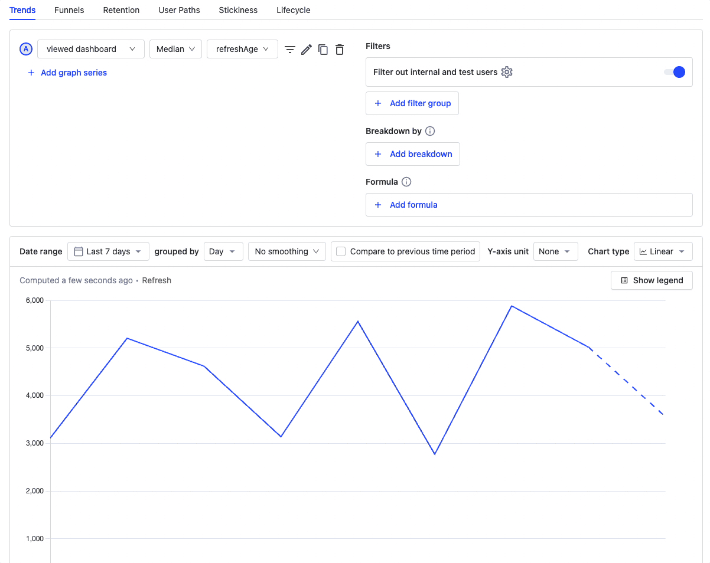
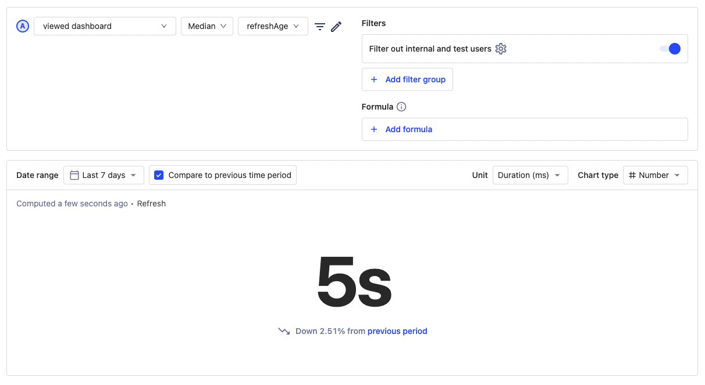
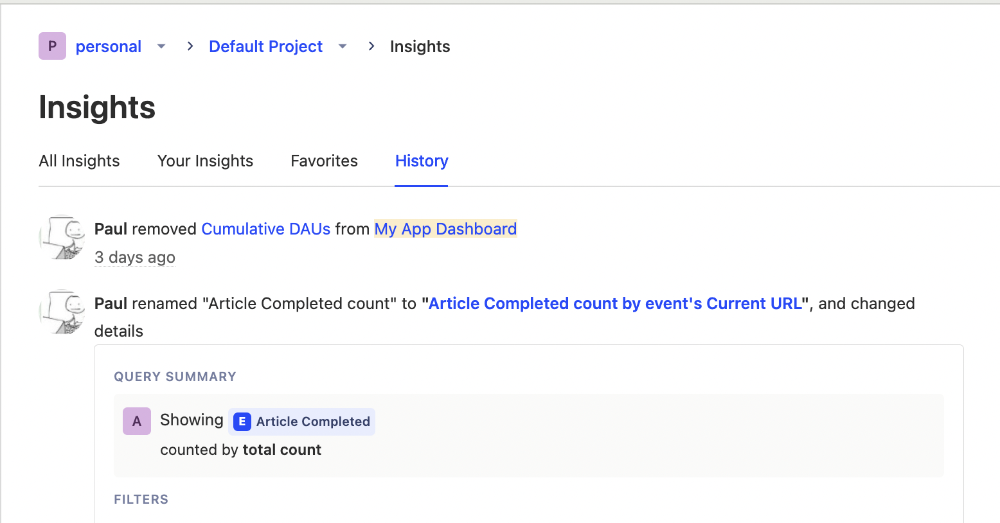

Want to know more about what we're up to? [Subscribe to HogMail, our newsletter](/newsletter), which we send out every two weeks!

> Running a self-hosted instance? Check out our [Upgrading PostHog guide](/docs/runbook/upgrading-posthog).

## PostHog 1.39.0 release notes

**Release highlights:**

- Beta: [Persons on events](#beta-persons-on-events)
- New: Paul to add a highlight here
- New: Paul to add a highlight here
- New: Paul to add a highlight here
- Improved: Paul to add a highlight here
- Improved: Paul to add a highlight here
- Improved: Paul to add a highlight here
- Apps: JOE to add

### Beta: Persons on events

We're getting ready to make a substantial change to the way [persons](/manual/persons) and [events](/manual/events) work by essentially combining them and moving all persons properties _onto_ events. 1.39.0 gives you the chance to try the feature ahead of the full release by toggling your `actors_on_events_teams` [instance setting](/docs/self-host/configure/instance-settings).

So, why have we moved person properties onto events? In part it's because it streamlines how we store data as we continue to scale, but it's also to unlock significant speed increases on queries involving both persons and events. Previously, PostHog stored personIDs and event information in separate tables, but this update simplifie

A big benefit of this approach is that it enables significantly faster queries because we no longer have to compare multiple tables when running queries - everything is stored on the event. Some of our internal tests have shown a 400x increase in speed!

We'll share more about this shift once it's fully released to all users - keep and eye on [the PostHog blog](/blog) for updates. 

### Improvement: Turbo properties

Frustrated that it was taking a few seconds to load properties? You weren't the only one. Thankfully, version 1.39.0 addresses this by adding a limit so that PostHog doesn't always search through hundreds of thousands of properties for each query. The result? [Properties load much faster](https://github.com/PostHog/posthog/pull/11037). 

Even better, this is just the starting point. We're aware that we need to do more to improve how properties work on PostHog, and we're working on it. 

### New: Format your insights as containing durations

Do your event properties contain milliseconds or seconds? Then you can now make things easier by marking your insight as showing durations to get more readable duration formatting on your queries. It works especially well with...

### New: Big, bold number chart type

This new, much requested and very exciting big bold number insight type does exactly what it says: simplifies a query down to a single number. Handy for those times when you need to track one big number.

### New: 

Paul to add a highlight here. Just one or two sentences is enough. 

### New: 

Paul to add a highlight here. Just one or two sentences is enough. 

### Improved: the history log now shows changes to Insights

We've had feedback that people love seeing the activity on feature flags. So we've added it to insights too \o/

### Instrumentation improvement: 

We now automatically [comment all SQL queries generated by posthog](https://github.com/PostHog/posthog/pull/10433) with tags. This helps track down performance issues on self-hosted instances.

### Apps: 

Joe will add our newest apps here. 

Interested in building your own app? [Here's how to get started](/docs/apps)!

### Other improvements & fixes
Version 1.39 also adds hundreds of other improvements and fixes, including...

-   **Improvement**: We've removed some axe violations on Home, to improve accessibility. And added accessibility testing to our workflow. Bonus: Check the PR for [a _fantastic_ Dad joke](https://github.com/PostHog/posthog/pull/11211#discussion_r941651022). 
-   **Improvement**: When deleting persons, you can now choose to delete event data as well thanks to [a new person deletion flow](https://github.com/PostHog/posthog/pull/11347).
-   **Improvement**: We've [optimised the query behind loading property definitions](https://github.com/PostHog/posthog/pull/11037). For PostHog Cloud we saw a 75% reduction in API call time.
-   **Improvement**: [We've separated the list of feature flags on an event from its event properties in the taxonomic filter](https://github.com/PostHog/posthog/pull/10668). Making it (approximately) 1,000,000% easier to find things when there are lots of feature flags.
-   **Fix**: In a few unexpected cases we used to return a successful response to some invalid API requests to the capture endpoint. [Now we correctly return a `400 BAD REQUEST`](https://github.com/PostHog/posthog/pull/10999) which will help people with useful feedback during development

View the commit log in GitHub for a full history of changes: [`release-1.37.0...release-1.38.0`](https://github.com/PostHog/posthog/compare/release-1.38.0...release-1.39.0).

## Give us your feedback
We’re always working on improving PostHog and would love to talk to you! Please [schedule a 30 minute call](https://calendly.com/posthog-feedback) with one of our Product, Engineering, or Marketing team members to help us understand how to improve. As a thank you for your time, we'll be giving away awesome [PostHog merch](https://merch.posthog.com)!

## Contributions from the community
We always welcome contributions from our community and this time we want to thank the following people...

- [@MrKevinOConnel](https://github.com/MrKevinOConnell) for several PRs, including [a new Support Hero bot](https://github.com/MrKevinOConnell/SupportHeroJr).
- [@petedemin](https://github.com/peterdemin) for some copy fixes.
- [@Nishant-Sagar](https://github.com/Nishant-Sagar) for improving the docs for Linux users.
- [@recklessop](https://github.com/recklessop) for fixing some broken URLs on [our GA site](https://isgoogleanalyticsillegal.com/).
- [@MarkBennett](https://github.com/MarkBennett) for fixing his URL normalizer app.
- [@danielthedifficult](https://github.com/danielthedifficult) for fixing some issues with our open source version. 
- [@nemobsis](https://github.com/nemobis) for adding to our GA site.

Do you want to get involved in making PostHog better? Check out our [contributing resources](/docs/contribute) to get started, or head to [our Slack group](/slack). We also have a [list of Good First Issues](https://github.com/PostHog/posthog/issues?q=is%3Aopen+is%3Aissue+label%3A%22good+first+issue%22) for ideas on where you can contribute!

## Open roles at PostHog
Want to join us in helping make more products successful? We're currently hiring for remote candidates in any of the following roles:

- [Head of Product](https://apply.workable.com/posthog/j/7910AE1F46/)
- [Senior Data Engineer](https://apply.workable.com/posthog/j/F01772B948/)
- [Senior Backend Engineer](https://apply.workable.com/posthog/j/A9CF0800AA/)
- [Site Reliability Engineer - Kubernetes](https://apply.workable.com/posthog/j/071DD5C05A/)
- [Full Stack Engineer - App](https://apply.workable.com/posthog/j/2682B00B76/)

Curious about what it's like to work at PostHog? Check out our [careers page](https://posthog.com/careers) for more info about our all-remote team and transparent culture. Don’t see a specific role listed? That doesn't mean we won't have a spot for you. [Send us a speculative application!](mailto:careers@posthog.com)

_Follow us on [Twitter](https://twitter.com/PostHog) or [LinkedIn](https://linkedin.com/company/posthog) for more PostHog goodness!_

<ArrayCTA />
