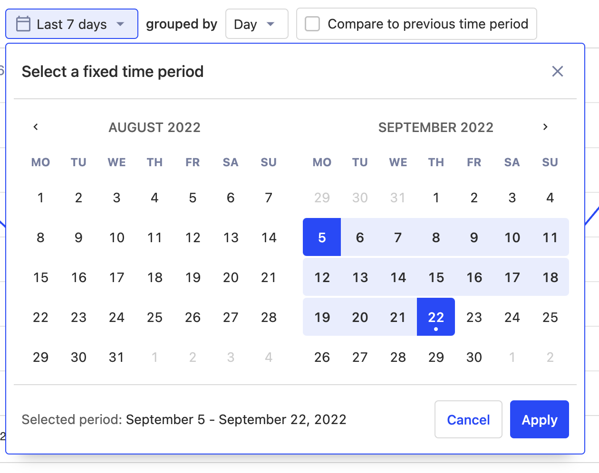
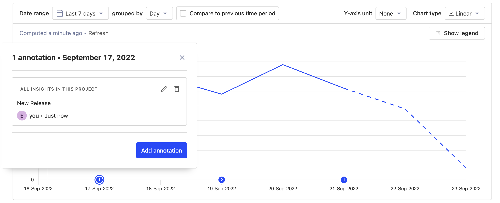
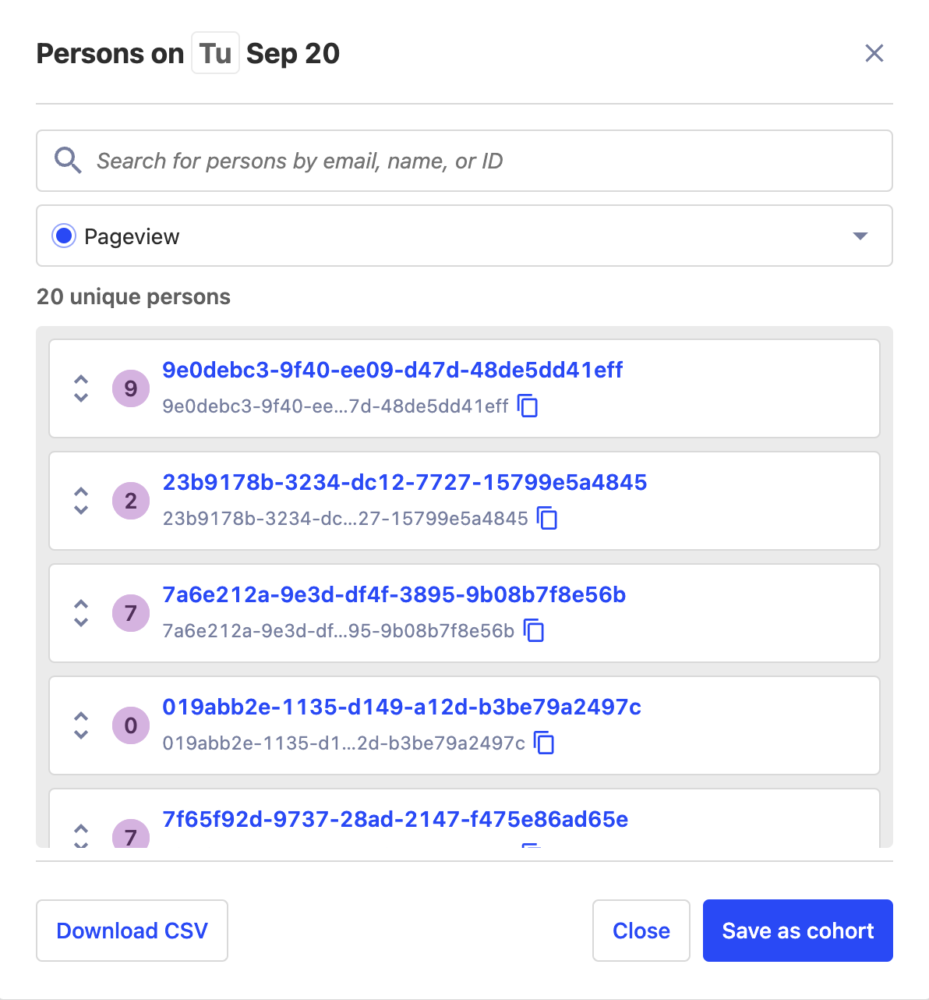
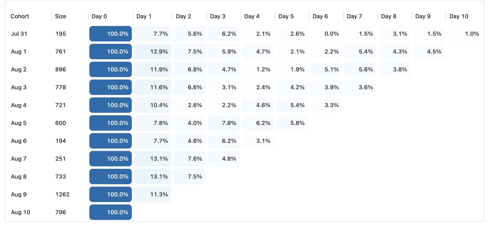

Want to know more about what we're up to? [Subscribe to HogMail, our newsletter](/newsletter), which we send every two weeks!

> Running a self-hosted instance? Check out our [guide to upgrading PostHog](/docs/runbook/upgrading-posthog).

## PostHog 1.40.0 release notes

**Release highlights:**

- New: [Lemonized calendar and date components](#new-lemonized-calendar-and-date-components)
- New: [Annotations revamp](#new-annotations-revamp)
- New: [Personal modal revamp](#new-person-modal-revamp)
- New: [Recordings domain settings](#new-recordings-domain-settings)
- Improved: [Retention insight update](#improved-retention-insight-update)

### New: Redesigned calendar and date components

We released some long overdue changes to our UI, including new calendar and date components. This is part of our ongoing effort to update all UI with components that provide an improved and more unified experience. 

### New: Overhauled annotations

We've overhauled [annotations](/manual/annotations) with a new look and interface. This change resolves several layout and interaction issues that had previously been impacting annotations. We've also touched up the annotations page to highlight important information better!

### New: Revamped persons modals

Clicking datapoints in an insight is one of our favorite ways to analyze the users behind the numbers. The new person modal now looks and feels like the rest of the app. We've made it easier for you to search and perform actions on those lists of users, too.

### New: Recordings domain settings

Struggling with keeping toolbar and recordings settings separate? Us too... That's why the settings for managing valid domains for recordings and toolbar are now split, so that they can be adjusted independently!

### Improved: Retention insight update

Another update to our UI! Nothing functionally changed here, but once again we cleaned up the UI on the retention insight to keep up with all the styling updates we've had across the board. 

### Other improvements & fixes

Version 1.40 also adds hundreds of other improvements and fixes, including...

- **Improvement:** Filters for test and internal users can now be set to apply on all new insights ([#11589](https://github.com/PostHog/posthog/pull/11589))
- **Improvement:** Event volume and query counts are now emphasized in data management ([#11806](https://github.com/PostHog/posthog/pull/11806))
- **Improvement:** Profile pictures now will show more information on hover ([#11849](https://github.com/PostHog/posthog/pull/11849))
- **Fix**: Fixed an issue where group properties weren't showing up on search previously ([#11813](https://github.com/PostHog/posthog/pull/11813))
- **Fix**: Fixed an issue that was causing property statistics to be calculated infrequently ([#11815](https://github.com/PostHog/posthog/pull/11815))

View the commit log in GitHub for a full history of changes: [`release-1.39.0...release-1.40.0`](https://github.com/PostHog/posthog/compare/release-1.39.0...release-1.40.0).

## Give us your feedback
We’re always working on improving PostHog and would love to talk to you! Please [schedule a 30 minute call](https://calendly.com/posthog-feedback) with one of our Product, Engineering, or Marketing team members to help us understand how to improve. As a thank you for your time, we'll be giving away awesome [PostHog merch](https://merch.posthog.com)!

## Contributions from the community
We always welcome contributions from our community and this time we want to thank the following people...

- [bobeagan](https://github.com/bobeagan) for correcting a documentation typo.
- [iamwacko](https://github.com/iamwacko) for fixing an OpenSSL dependency issue. 
- [Thebigbignooby](https://github.com/Thebigbignooby) for correcting an error in our documentation.
- [Klamas1](https://github.com/klamas1) for adding nodeSelector and tolerations to hooks. 

Do you want to get involved in making PostHog better? Check out our [contributing resources](/docs/contribute) to get started, or head to [our Slack group](/slack). We also have a [list of Good First Issues](https://github.com/PostHog/posthog/issues?q=is%3Aopen+is%3Aissue+label%3A%22good+first+issue%22) for ideas on where you can contribute!

## Open roles at PostHog
Want to join us in helping make more products successful? We're currently hiring for remote candidates in any of the following roles:

- [Product Designer](https://posthog.com/careers/product-designer)
- [Senior Data Engineer](https://posthog.com/careers/senior-data-engineer)
- [Site Reliability Engineer - Kubernetes](https://posthog.com/careers/site-reliability-engineer-kubernetes)
- [Full Stack Engineer](https://posthog.com/careers/full-stack-engineer)

Curious about what it's like to work at PostHog? Check out our [careers page](https://posthog.com/careers) for more info about our all-remote team and transparent culture. Don’t see a specific role listed? That doesn't mean we won't have a spot for you. [Send us a speculative application!](mailto:careers@posthog.com)

_Follow us on [Twitter](https://twitter.com/PostHog) or [LinkedIn](https://linkedin.com/company/posthog) for more PostHog goodness!_

<ArrayCTA />
