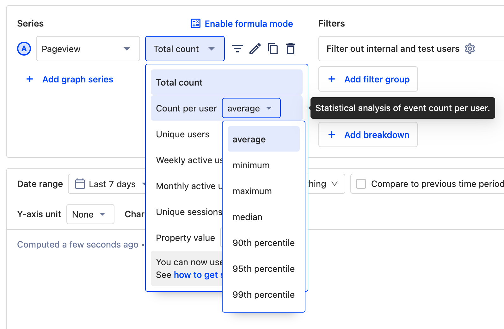
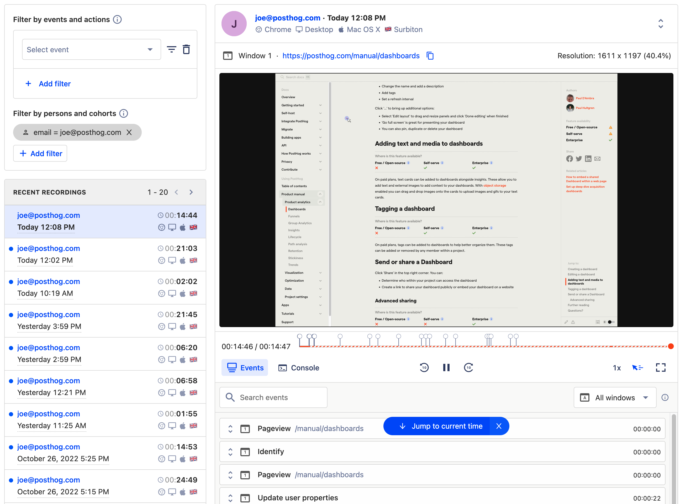
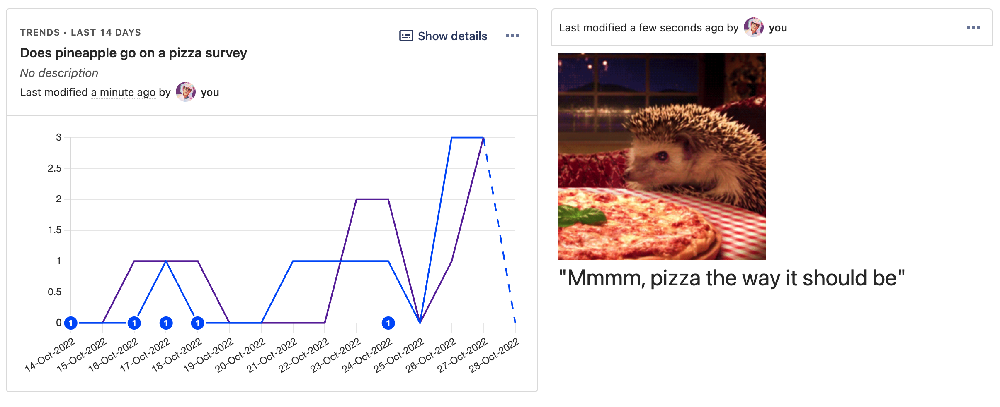
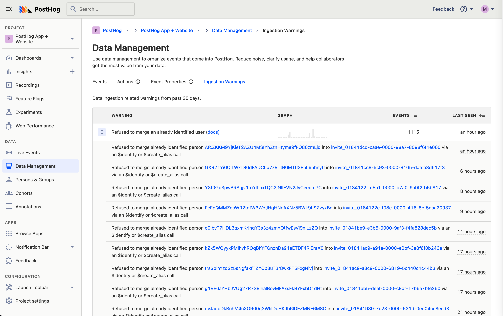
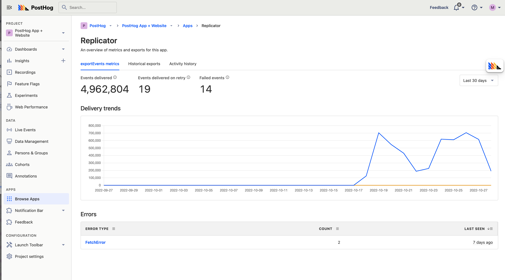
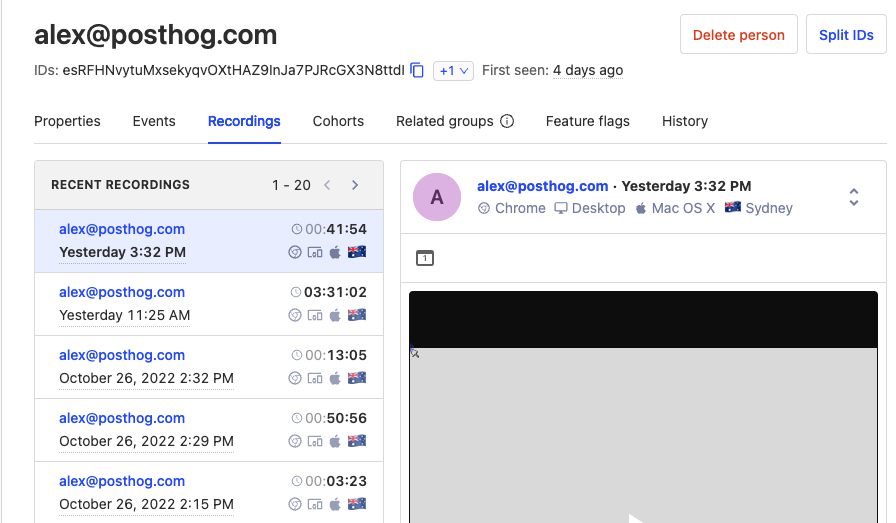
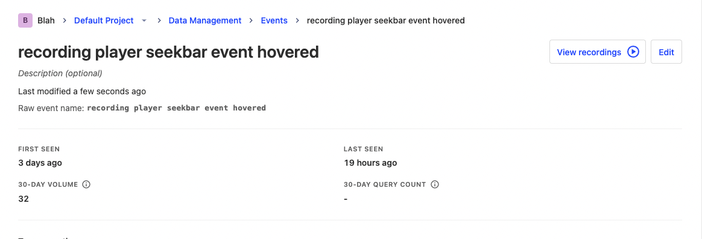
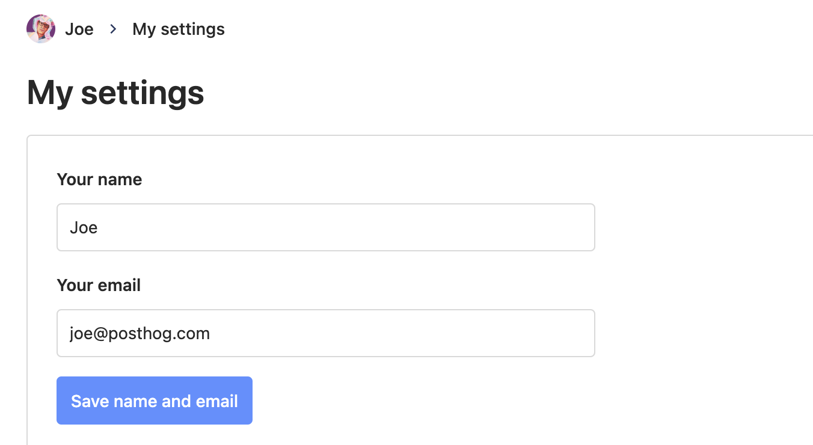
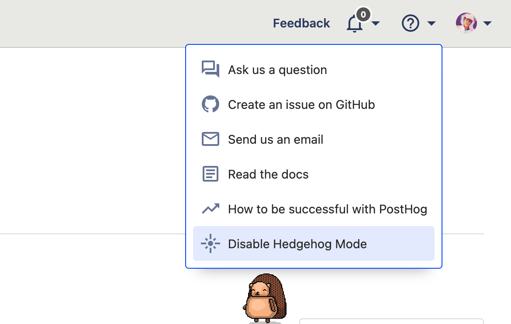
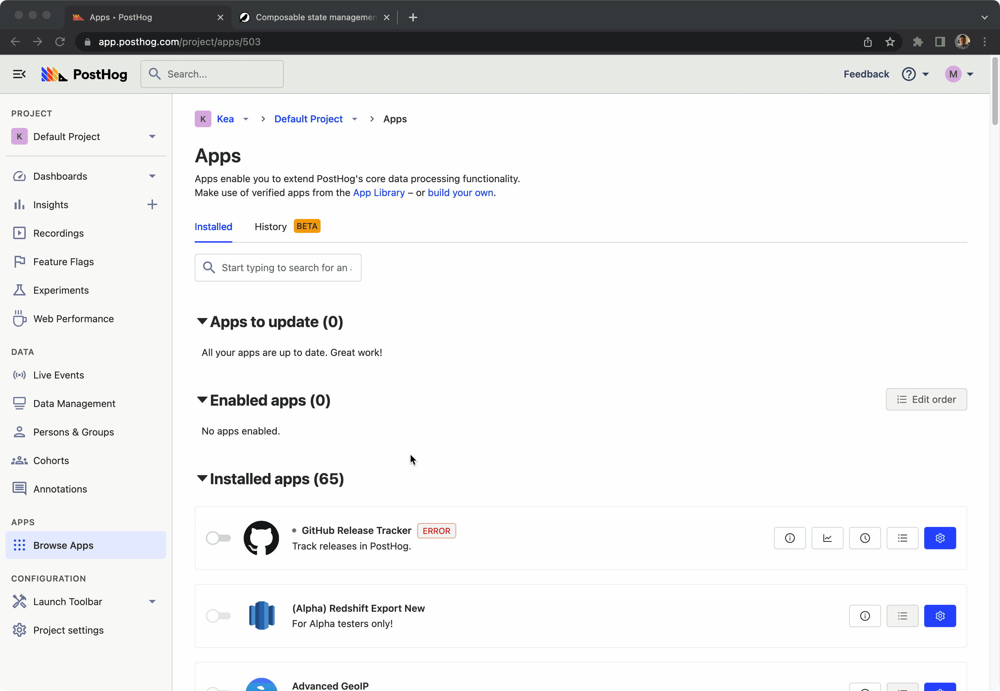

Want to know more about what we're up to? [Subscribe to our new newsletter](https://newsletter.posthog.com/subscribe), which we send once every two weeks!

## 1.41.0 update guide for self-hosted users
Due to changes in this update, it is important check `alias` usage before [upgrading PostHog](/docs/runbook/upgrading-posthog) to 1.41.0 on a self-hosted instance. Further [information is available in the docs](/docs/integrate/identifying-users#considerations), but for example, assuming `email` is used as the identified user id, then: 

```
identify(email)                     # in the frontend
alias(email, backend_unique_id)     # in the backend - this works
alias(backend_unique_id, email)     # in the backend - THIS WILL NOT WORK
```

> **If you haven't run async migration 0007 before:** Upgrade to 1.41 and then check [ingestion warnings](#new-ingestion-warnings) and solve any outstanding issues. After that run async migration 0007 at `<your-posthog-site>/instance/async_migrations` (if you haven't ran 0005 yet start with that, then 0006 and finally 0007).

> **If you have completed async migration 0007 before:** If you have changed anything regarding `alias` or based on ingestion warnings, you must re-run async migration 0007 on top of 1.41 by [connecting to Postgres](/docs/self-host/deploy/troubleshooting#how-do-i-connect-to-postgres), running `UPDATE posthog_asyncmigration SET status = 0 WHERE name = '0007_persons_and_groups_on_events_backfill' AND status = 2;` and re-running 0007 at `<your-posthog-site>/instance/async_migrations`.

## PostHog 1.41.0 release notes

**Release highlights:**

- [New: Persons on events on by default](#new-persons-on-events-on-by-default)
- [New: Count of events per user](#new-counts-of-events-per-user)
- [New: Text cards on dashboards](#new-text-cards-on-dashboards)
- [New: Ingestion warnings](#new-ingestion-warnings)
- [New: App metrics](#new-app-metrics)
- [New: View recordings from anywhere](#new-view-recordings-from-anywhere)
- [New: Change your own email](#new-change-your-own-email)
- [New: Hedgehog mode](#new-hedgehog-mode)
- [Improved: Recordings interface](#improved-recordings-interface)
- [One more thing: Site apps](#one-more-thing-site-apps)

### New: Persons on events on by default

We used to store events in one table and persons in another table. That meant that, once you reached billion event scale, any query which touched person properties would time out. But, no longer! After running [an extensive beta since update 1.39.0](/blog/the-posthog-array-1-39-0#beta-improving-query-performance-by-combining-persons-and-events), we've now added person data onto the events themselves.

You won’t see any UI changes as a result of this change — persons will still have their own Persons & Groups section on the sidebar, for example — but you will notice results are a lot (up to 400%!) faster for any queries involving persons and events. This is a massive change, so be sure to [read the full announcement for more info](/blog/persons-on-events).

> **Note:** As a result of adding persons on events and changing how queries work we now have to be more strict about merging users. Because of that, we recommend double checking your `alias` calls, and following advice above [how to upgrade a self-hosted instance to 1.41.0](/blog/the-posthog-array-1-41-0). 

### New: Count of events per user



Have you ever asked yourself '*What's the average average number of purchases per user?*' or '*What's the maximum number of forms submitted per user?'* 

Questions like these used to be hard to answer with PostHog, but no more! Use the new "Count per user" aggregation mode available in Trends to analyze _how intensely_ your users use the product and its features. "Count per user" supports common statistical functions for crunching the per-user numbers: average, median, minimum, maximum, 90th/95th/99th percentile.

**Bonus:** While working on this feature, we also took the opportunity to improve our aggregation selector UI: aggregation by property value is now presented with more clarity.

### Improved: Recordings interface



We've heard feedback recently that session recording was incredibly useful, but didn't spark much joy for those who used it. So, we've overhauled the entire interface for session recordings to make it easier to use and to help you find relevant recordings faster. 

We think session recording feels like an entirely new experience now, so check it out. Now's the perfect time to explore [the console log too](/manual/recordings#console-logs-recording)!

### New: Text cards on dashboards



Previously there was no easy way to add context or links to a dashboard, meaning you may have to send long explanations when sharing a dashboard with teammates. That's why we've added the option for users on paid plans to add text cards where they can add any information they want, including metadata, images or gifs!

### New: Ingestion warnings



We've added a new page to the Data Management section which lists warnings related to data ingestion from the past 30 days. If you still try to merge identified users into others, the Ingestion Warning page is where we'll remind you that the merge got blocked.

> **Note:** Self-hosted users managing kafka separately should create a new topic `clickhouse_ingestion_warnings` manually.

### New: App metrics



Curious how well your apps are doing? Previously, you may have had to pour over the AWS logs, but now you can head to the new app metrics page to find out how many events an app has processed, how many retries were attempted and what errors may have occured. Very handy. Want to take a look? Head to the apps page in your instance and click the chart symbol for any installed app.  

App metrics are only available for users on Scale or Enterprise plans. 

> **Note:** Self-hosted users managing kafka separately should create a new topic `clickhouse_app_metrics` manually.

### New: View recordings from anywhere





You can now view session recordings from lots of different places within PostHog, making it easier to find relevant recordings.

Curious about how a specific person is interacting with your app? Navigate to a person detail page and check out their recordings. Want to see recordings for a specific event or action you've created? Check out the new view recordings button you can find in the event's detail page or from the events table.

### New: Change your own email



Finally, we can release one of our most requested features: the ability to change the email address attached to your account, without contacting support. All you have to do is select your profile picture in the top right and access your account settings. 

### New: Hedgehog mode



For a while now, we've been having a hard time explaining to our families what we do for a living. This makes it even harder.

### Improved: Formula mode in Trends


We've seen that the relationship between Trends series and formula was a bit unintuitive at times. To alleviate this, we've reworked the experience of our formula feature. Instead of an "Add formula" button, click "Enable formula mode" – "Series" then become "Variables", and the formula itself is presented right below them.

### One more thing: Site apps 



We're testing a new big (beta) thing: site apps. You need to **manually opt in** to enable this feature by configuring your `posthog-js` initialization to include `opt_in_site_apps: true`. Once you do, PostHog will be able to inject code onto your website through `posthog-js`. We've put together [a tutorial that explains how to make a site app](/tutorials/build-site-app) if you're interested. 

Site apps can be useful for a number of potential tasks, such as displaying feedback forms, posting service update banners, or making it rain pineapples. No, we're not really sure why we made the last one either. 

### Other improvements & fixes

You think that's it? Not by a long shot! Version 1.41 also adds hundreds of other improvements and fixes, including...

- **Improvement:**  You can now [send analytics events from GitHub actions, to PostHog](https://github.com/PostHog/posthog-github-action)

- **Improvement:**  We have revamped our timezone system! We've squashed various bugs and improved the interval grouping to be more in line with expectations when filtering on dates.

- **Fix:** WAU/MAU aggregation in Trends was quietly always grouped by day, even if a different interval (hour/week/month) was selected. Additionally, those modes showed zero users for periods with no relevant events, even if the real count should have been non-zero due to WAU/MAU being a trailing count. Both issues are now fixed, and we've expanded our test coverage of those aggregation modes to ensure their results are accurate going forward.

- **Fix**: Experiment results will appear immediately after the first exposure to a user

- **Improvement**: The experiments table is now sortable

- **Improvement**: Hold down "shift" when using the toolbar to click on elements below the heatmap.

View the commit log in GitHub for a full history of changes: [`release-1.40.0...release-1.41.0`](https://github.com/PostHog/posthog/compare/release-1.40.0...release-1.41.0).

## Share your feedback
We'd love to hear anything you have to say about PostHog, good or bad. As a thank you, we'll share some awesome [PostHog merch](https://merch.posthog.com).

Want to get involved? [Email us to schedule a 30 minute call](mailto:hey@posthog.com) with one of our teams to help us make PostHog even better!

## Contributions from the community
We always welcome contributions from our community and this time we want to thank the following people...

- [@ShaneMaglangit](https://github.com/ShaneMaglangit) for fixing [a bug when buttons could be disabled on some insights](https://github.com/PostHog/posthog/pull/12332).

- [@RCMarron](https://github.com/rcmarron), a former team member who still helped [meter some rate limits](https://github.com/PostHog/posthog/pull/12006). We miss you, Rick!

- [@Codepitbull](https://github.com/codepitbull) who helped us with [shading transitive dependencies](https://github.com/PostHog/posthog-java/pull/23).

- [@GMA](https://github.com/gma) for clarifying that [`brotli` is required on all architectures](https://github.com/PostHog/posthog.com/pull/3925).

- [@ByteMerger](https://github.com/bytemerger) for [updating an app logo](https://github.com/PostHog/posthog-engage-so-plugin/pull/3) for [our Engage connector](/apps/engage-connector).

- [@Balajivenkatesh](https://github.com/balajivenkatesh) for [improving the way we send data to a webhook](https://github.com/PostHog/posthog-patterns-app/pull/1) in [our Patterns connector](/apps/patterns-connector).

- [@msmans](https://github.com/msmans) for [adding ClickHouse pod distribution](https://github.com/PostHog/charts-clickhouse/pull/582).
 
- [@krzd](https://github.com/krzd) for [updating some Debian-specific documentation](https://github.com/PostHog/posthog.com/pull/4307).

- [@jacobwgillespie], co-founder of [Depot](https://depot.dev/), for [moving us from Yarn 1 to Yarn 3](https://github.com/PostHog/posthog/pull/12520). A great PR!

Do you want to get involved in making PostHog better? Check out our [contributing resources](/docs/contribute) to get started, or head to [our Slack group](/slack). We also have a [list of Good First Issues](https://github.com/PostHog/posthog/issues?q=is%3Aopen+is%3Aissue+label%3A%22good+first+issue%22) for ideas on where you can contribute!

## Open roles at PostHog
Want to join us in helping make more products successful? We're currently hiring for remote candidates in any of the following roles:

- [Full Stack Engineer - Experimentation Team](/careers/full-stack-engineer-experimentation)
- [Full Stack Engineer - Analytics Team](/careers/full-stack-engineer-product-analytics)

Curious about what it's like to work at PostHog? Check out our [careers page](https://posthog.com/careers) for more info about our all-remote team and transparent culture. Don’t see a specific role listed? That doesn't mean we won't have a spot for you. [Send us a speculative application!](mailto:careers@posthog.com)

_Follow us on [Twitter](https://twitter.com/PostHog) or [LinkedIn](https://linkedin.com/company/posthog) for more PostHog goodness!_

<ArrayCTA />
