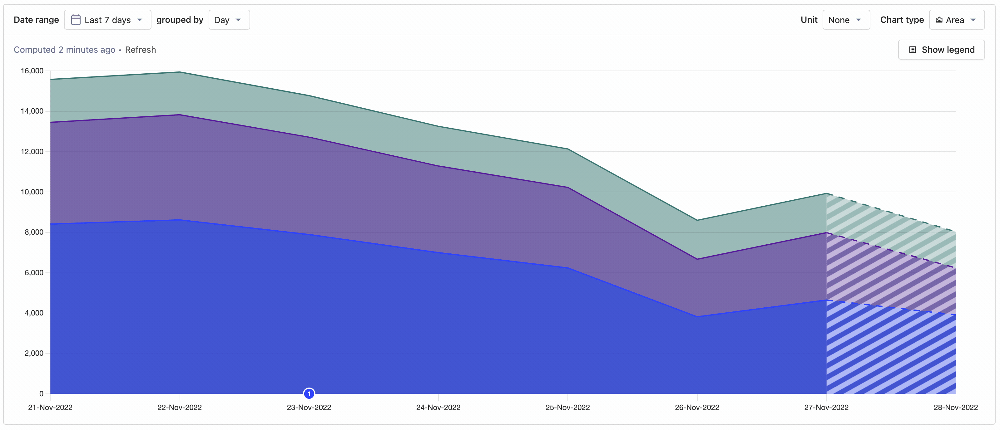
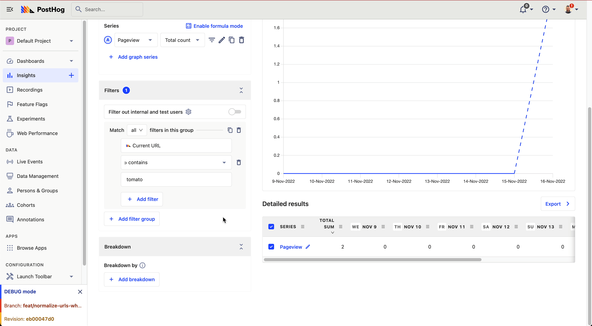

Want to know more about what we're up to? [Subscribe to our new newsletter](https://newsletter.posthog.com/subscribe), which we send once every two weeks!

## 1.42.0 update guide for self-hosted users

Self-hosted users must run async migrations 0005-0007 before updating to 1.42.0. 

If you haven't run async migrations 0005-0007 yet, or if they aren't available on your current version,  we recommend upgrading to 1.41.4 first, _then_ running the async migrations, then upgrading to 1.42.0.

## PostHog 1.42.0 release notes

**Release highlights:**

- [New: Area chart visualization](#new-area-chart-visualization)
- [New: URL breakdown normalisations](#new-url-breakdown-normalisations)
- [New: Share recordings more easily](#new-share-recordings-more-easily)
- [New: Get beta features via our roadmap](#new-get-beta-features-via-our-roadmap)
- [Boring legal bit: Policy updates](#boring-legal-bit-policy-updates)

### New: Area chart visualization

New team member Thomas Obermueller has got off to a great start by delivering the much-requested area chart visualization for PostHog insights. Now, if a normal line chart isn't  enough and a regular bar chart won't satisfy then you have an exciting third option.

To [quote Thomas](https://github.com/PostHog/posthog/pull/12869) himself: "_The main use case for this is when you want to see the composition of a metric, while also having the total value as a reference e.g. breakdown of revenue by customer over time._"

### New: URL breakdown normalisations

Are you frustrated when you breakdown trends and funnels by URLs and see four different URLs that look like: `/home/`, `/home`, `/home?`, and `/home/#`? Well, not anymore! 

Now, whenever we're dealing with breakdowns by "Current URL" or "Pathname", we normalise URLs to count the same, so you'll see there's only one place like `/home`. 

### New: Share recordings easily

When you find an interesting session recording, you probably want to share it with your team. So, we've improved sharing options to make it easier. You can now share specific recordings easily, and even send teammates to an exact time in any recording!

### New: Get beta features via our roadmap

Even though we're open source, we know it's not always very easy to tell what we're working on or planning for the future - there are just so many repos, issues and PRs!

So, [we built a public roadmap of our major projects](/roadmap). You can use it to vote on upcoming projects, subscribe for updates and give feedback on our wildest ideas. Best of all, it's [powered by Squeak!](https://squeak.posthog.com/)

### Boring legal bit: Policy updates

Despite being described by our VP of Marketing and Ops as "_the least interesting thing ever_", we nevertheless need to tell you that there have been some changes to our terms and privacy policies. Don't worry, it's all good news:

- We've added a CCPA addendum to [our privacy policy](/privacy)
- We've updated various policies for the release of [PostHog Cloud EU](/eu)
- We've updated [our SCCs](/handbook/company/security) to the latest versions
- We've [changed from Workable to Ashby for applicant data processing](https://www.ashbyhq.com/customers/posthog-customer-story)

### Other improvements & fixes

You think that's it? Not by a long shot! Version 1.42 also adds hundreds of other improvements and fixes, including...

- **Improvement:** Recordings no longer show windows anymore if only 1 window was tracked.
- **Improvement:** We added a next-up button for recordings (just like Netflix's next episodes) to better signal recordings to autoplay.
- **Improvement:** You now see a free trial banner if you're on the free trial.
- **Improvement:** You can now choose if deleting a dashboard should also delete insights.
- **Improvement:** We don't skip showing labels for alternate bars when breaking down insights.
- **Improvement:** We now disable heatmap clicks when holding down shift.
- **Fix:** Secondary metrics in experiments now don't depend on the flag values being present for all steps, just like the primary metric.
- **Fix:** Group pages were 404ing when they had a dot in the name. They don't anymore.

View the commit log in GitHub for a full history of changes: [`release-1.41.4...release-1.42.0`](https://github.com/PostHog/posthog/compare/release-1.41.4...release-1.42.0).

## Share your feedback
We'd love to hear anything you have to say about PostHog, good or bad. As a thank you, we'll share some awesome [PostHog merch](https://merch.posthog.com).

Want to get involved? [Email us to schedule a 30 minute call](mailto:hey@posthog.com) with one of our teams to help us make PostHog even better!

## Contributions from the community
We always welcome contributions from our community and this time we want to thank the following people...

- @gpetrioli for [fixing broken handbook links](https://github.com/PostHog/meta/pull/73)
- @MoSattler for [fixing some FF hook issues](https://github.com/PostHog/posthog-js-lite/pull/36)
- @GrowthFYI for [fixing some scaling issues](https://github.com/PostHog/feedback-app/pull/9)
- @BTruer for [correcting some docs issues](https://github.com/PostHog/posthog.com/pull/4698)
- @Chuloo for [fixing a URL on the roadmap](https://github.com/PostHog/posthog.com/pull/4661)
- @talenodigital for [becoming a PostHog partner](https://github.com/PostHog/posthog.com/pull/4651)
- @NitzanBallerine for [fixing some contributor attribution issues](https://github.com/PostHog/posthog/pull/12586)
- @Pblither8 for [fixing some 'raise issue', um, issues](https://github.com/PostHog/posthog.com/pull/4401)
- @Mmmoussa for [fixing some storage issues](https://github.com/PostHog/posthog-js-lite/pull/28)
- @JustinJones for [fixing a LOT of typos](https://github.com/PostHog/posthog.com/pull/4506)
- @danielthedifficult for [fixing some typos](https://github.com/PostHog/posthog.com/pull/4691)
- @Demivan for [fixing a broken URL](https://github.com/PostHog/posthog.com/pull/4682)
- @DavidODonovan for [fixing social sharing](https://github.com/PostHog/posthog.com/issues/4669)

Do you want to get involved in making PostHog better? Check out our [contributing resources](/docs/contribute) to get started, or head to [our community page](/posts). We also have a [list of Good First Issues](https://github.com/PostHog/posthog/issues?q=is%3Aopen+is%3Aissue+label%3A%22good+first+issue%22) for ideas on where you can contribute!

## Open roles at PostHog
Want to join us in helping make more products successful? We're currently hiring for remote candidates in the following role:

- [Full Stack Engineer - Experimentation Team](/careers/full-stack-engineer-experimentation)

Check out our [careers page](https://posthog.com/careers) for more info about our all-remote team and transparent culture. [You can also send a speculative application!](mailto:careers@posthog.com)

_Follow us on [Twitter](https://twitter.com/PostHog) or [LinkedIn](https://linkedin.com/company/posthog) for more PostHog goodness!_

<ArrayCTA />
