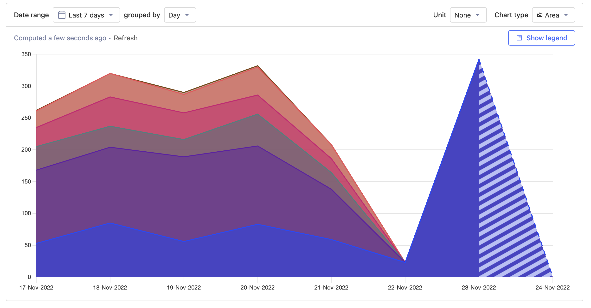

Want to know more about what we're up to? Check out [our roadmap](/roadmap) to see what we're working on and what new beta features are available! You can also subscribe to [our Hogmail newsletter](/newsletter)!

## 1.42.0 update guide for self-hosted users

Async migrations 0005-0007 need to be completed before updating to 1.42. If you haven't run them yet, or if they aren't available on your current version, then upgrade to 1.41.4 first, then run the async migrations, then upgrade to 1.42.

## PostHog 1.42.0 release notes

**Release highlights:**

- New: feature
- Improved: feature
- One more thing: announcement

### New: 

Joe to add a gif here. 

Neil and Joe to provide highlight here. 

### New: Area chart visualization

New team member Thomas Obermueller has got off to a great start by delivering the much-requested area chart visualization for PostHog insights. Now, if a normal line chart isn't  enough and a regular bar chart won't satisfy then you have an exciting third option.

To [quote Thomas](https://github.com/PostHog/posthog/pull/12869) himself: "_The main use case for this is when you want to see the composition of a metric, while also having the total value as a reference e.g. breakdown of revenue by customer over time._"

### New: Path breakdown normalisations

Are you frustrated when you breakdown paths by URLs and see four different URLs that look like: `/home/`, `/home`, `/home?`, and `/home/#`? Well, not anymore! Now, whenever we're dealing with path breakdowns, we normalise URLs to count the same, so you only see there's only one place like `/home`. 

### New: Share recordings more easily

User recordings are a great for finding ways to improve your product, but when you find something interesting what's the first thing you do? Probably share it with your team. 

So, we've improved the options for sharing specific recordings. You can now share specific recordings easily, and even send teammates to an exact time in any recording!

### New: 

Joe to add a gif here. 

Neil and Joe to provide highlight here. Substantial new feature. 

### One more thing: Roadmap

Joe to add info here about roadmap launch.

### Boring legal bit: Policy updates

Despite being described by our VP of Marketing and Ops as "_the least interesting thing ever_", we nevertheless need to tell you that there have been some changes to our terms and privacy policies:

- We've added a CCPA addendum to [our privacy policy](/privacy)
- We've updated various policies for the release of [PostHog Cloud EU](/eu)
- We've updated [our SCCs](/handbook/company/security) to the latest versions
- We've [changed from Workable to Ashby for applicant data processing](https://www.ashbyhq.com/customers/posthog-customer-story)

### Other improvements & fixes

You think that's it? Not by a long shot! Version 1.42 also adds hundreds of other improvements and fixes, including...

- **Improvement:** Recordings don't show windows anymore if only 1 window was tracked. 
- **Improvement:** A next-up button for recordings (think just like Netflix's next episodes) to better signal recordings to autoplay
- **Improvement:** You now see a free-trial banner if you're on the free trial
- **Improvement:** You can now choose if deleting a dashboard should also delete insights
- **Improvement:** We don't skip showing labels for alternate bars when breaking down insights.
- **Improvement:** We now disable heatmap clicks when holding down shift
- **Fix:** Secondary metrics in experiments now don't depend on the flag values being present for all steps, just like the primary metric.
- **Fix:** Group pages were 404ing when they had a dot in the name. They don't anymore.

View the commit log in GitHub for a full history of changes: [`release-1.41.4...release-1.42.0`](https://github.com/PostHog/posthog/compare/release-1.41.4...release-1.42.0).

## Give us your feedback
We’re always working on improving PostHog and would love to talk to you! Please [schedule a 30 minute call](https://calendly.com/posthog-feedback) with one of our Product, Engineering, or Marketing team members to help us understand how to improve. As a thank you for your time, we'll be giving away awesome [PostHog merch](https://merch.posthog.com)!

## Contributions from the community
We always welcome contributions from our community and this time we want to thank the following people...

- @gpetrioli for [fixing broken handbook links](https://github.com/PostHog/meta/pull/73)
- @MoSattler for [fixing some FF hook issues](https://github.com/PostHog/posthog-js-lite/pull/36)
- @GrowthFYI for [fixing some scaling issues](https://github.com/PostHog/feedback-app/pull/9)
- @BTruer for [correcting some docs issues](https://github.com/PostHog/posthog.com/pull/4698)
- @Chuloo for [fixing a URL on the roadmap](https://github.com/PostHog/posthog.com/pull/4661)
- @talenodigital for [becoming a PostHog partner](https://github.com/PostHog/posthog.com/pull/4651)
- @NitzanBallerine for [fixing some contributor attribution issues](https://github.com/PostHog/posthog/pull/12586)
- @Pblither8 for [fixing some 'raise issue', um, issues](https://github.com/PostHog/posthog.com/pull/4401)
- @Mmmoussa for [fixing some storage issues](https://github.com/PostHog/posthog-js-lite/pull/28)
- @JustinJones for [fixing a LOT of typos](https://github.com/PostHog/posthog.com/pull/4506)
- @danielthedifficult for [fixing some typos](https://github.com/PostHog/posthog.com/pull/4691)
- @Demivan for [fixing a broken URL](https://github.com/PostHog/posthog.com/pull/4682)
- @DavidODonovan for [fixing social sharing](https://github.com/PostHog/posthog.com/issues/4669)

Do you want to get involved in making PostHog better? Check out our [contributing resources](/docs/contribute) to get started, or head to [our Slack group](/slack). We also have a [list of Good First Issues](https://github.com/PostHog/posthog/issues?q=is%3Aopen+is%3Aissue+label%3A%22good+first+issue%22) for ideas on where you can contribute!

## Open roles at PostHog
Want to join us in helping make more products successful? We're currently hiring for remote candidates in the following role:

- [Full Stack Engineer - Experimentation Team](/careers/full-stack-engineer-experimentation)

Check out our [careers page](https://posthog.com/careers) for more info about our all-remote team and transparent culture. [You can also send a speculative application!](mailto:careers@posthog.com)

_Follow us on [Twitter](https://twitter.com/PostHog) or [LinkedIn](https://linkedin.com/company/posthog) for more PostHog goodness!_

<ArrayCTA />
