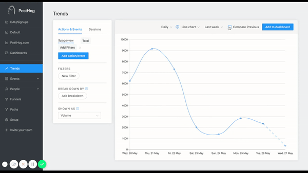
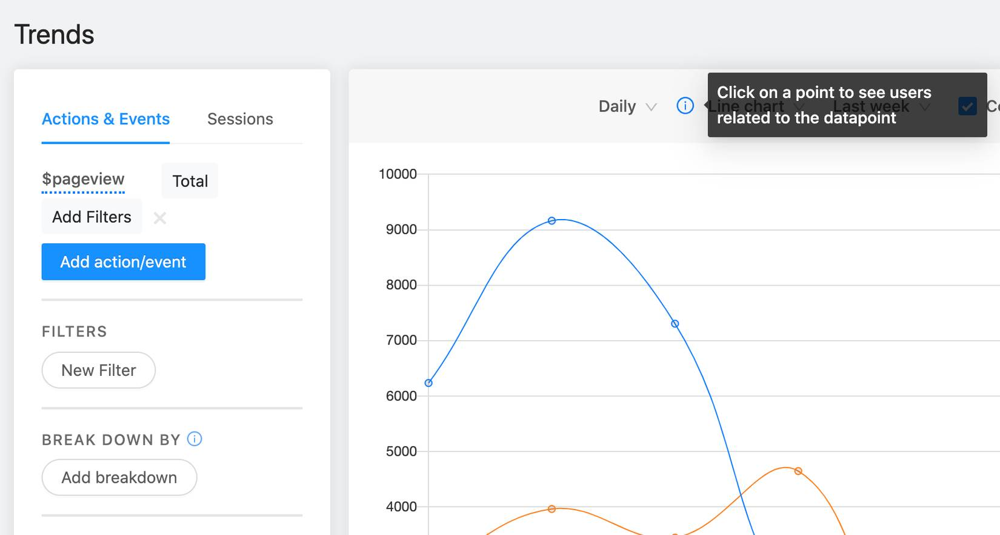

This week's update brings a React Native integration, time comparisons, easy access to user data from graphs, better user friendliness, and much stronger frontend testing.

Self hosting and want to upgrade? [Update your PostHog](/docs/runbook/upgrading-posthog).

## Release notes

### [Reactive Native](https://github.com/PostHog/posthog-react-native)

We've been on a real push the last few weeks to provide libraries for those writing for mobile devices.

We now support [Android](/docs/integrate/client/android), [iOS](/docs/integrate/client/ios) and - finally - [React Native](/docs/integrate/client/react-native)!

As always, calls are non-blocking and fast with this library. It batches requests and flushes asynchronously. We'd use emojis at this point, if that were our style.

### [PostHog for Startups Launched](/startups)

We benefited from many discounts as a startup ourselves. Now it's time for us to do the same.

The details are [available here](/startups). We'll provide a more generous free hosting tier (up to 20 million events per month) or a supported self deployment. You must have raised less than $5M and you have to be under 3 years old.

Tell your friends, or apply yourself.

### [Comparison charts](https://github.com/PostHog/posthog/pull/824)



The trends page is now even more powerful. You can compare time periods side-by-side - for charts or tables.

This is particularly useful if you wish to view different time periods without drawing huge graphs and cluttering your oh-so-beautiful dashboards.

Thanks to [Paolo](https://github.com/PaoloC68) for [suggesting this](https://github.com/PostHog/posthog/issues/715) :)

### [View the users inside each datapoint](https://github.com/PostHog/posthog/pull/830/commits/64e1ef34b5d8565934b1980d33432cef4e7002f7)



Did you know you could do this? If you click the datapoints in your trends graphs, you can see a list of the relevant users.

It was already possible, but we made it much more obvious!

The reason we provide underlying data is so that you can debug the software much more easily, and you can get to the data you need.

### [Property keys explained](https://github.com/PostHog/posthog/pull/822)


AI has got less far than we thought from all the hype.

It turns out that most of our users are humans.

Ever wondered what ```Referrer URL``` actually means?

We finally decided to pass you explanations rather than weird sounding variable names. We hope this means you really understand what your trends are showing you.

Oh, and we threw in some hedgehogs icons too. Because we can. #woodlandUX

### [Automatic domain detection](https://github.com/PostHog/posthog/pull/815)


You [used to](https://github.com/PostHog/posthog/issues/764) have to enter your domain every time you created an action by selecting an element. Now you don't!

## Bug fixes and performance improvements

* Developing PostHog is now a bit less tedious. We [halved the time](https://github.com/PostHog/posthog/pull/826) it takes to install python dependencies for any deployment.
* We've written [a lot of front end tests](https://github.com/PostHog/posthog/pull/802), as well as a [regression test](https://github.com/PostHog/posthog/pull/819) for single step funnels, where there was a bug - [now fixed](https://github.com/PostHog/posthog/pull/817).
* We neatened dashboard items so they're [closer together](https://github.com/PostHog/posthog/pull/846) in the navigation.
* We [improved our Sentry setup](https://github.com/PostHog/posthog/pull/842).
* Marius [fixed the way tables display](https://github.com/PostHog/posthog/pull/838) when they're on a dashboard.
* Eric [slayed a bug](https://github.com/PostHog/posthog/pull/832) when the People page wouldn't load with entity specific filters applied.
* We've had several users with very high scale pushing the limits of redis. We have more work to do here, but we've [improved the way we handle filled up servers](https://github.com/PostHog/posthog/pull/825).
* A little [header spring cleaning](https://github.com/PostHog/posthog/pull/831).
* We [fixed a bug](https://github.com/PostHog/posthog/pull/835) with suggestions loading, and another with [EditAppUrls null check](https://github.com/PostHog/posthog/pull/829).
* Cohort property filters had a small issue, [now fixed](https://github.com/PostHog/posthog/pull/828).
* AntD's gradual takeover of our app and website continued - it was [added to more dropdowns](https://github.com/PostHog/posthog/pull/814) this week.
* We prevented requests to update server for those who have opted out, and [added fine grained control](https://github.com/PostHog/posthog/pull/821) to the opt out flow.

## Favorite issue

### [Deployment master plan](https://github.com/PostHog/posthog/issues/799)

We also have a few backlog bugs to tackle - we will work through these.

## Weekly round up

* Get away from the screen - try Wired's [recommended board games](https://www.wired.co.uk/article/best-board-games-2020). Included since they criticize Monopoly.
* Make a new [open source best friend](https://github.com/olivia-ai/olivia), powered by a neural network.
* Get reading [free programming books](https://github.com/EbookFoundation/free-programming-books).
* Also - [don't miss the rocket launch](https://www.kennedyspacecenter.com/launches-and-events/events-calendar/see-a-rocket-launch) later today!

## Share your feedback
We'd love to hear anything you have to say about PostHog, good or bad. As a thank you, we'll share some awesome [PostHog merch](https://merch.posthog.com).

Want to get involved? [Email us to schedule a 30 minute call](mailto:hey@posthog.com) with one of our teams to help us make PostHog even better!


## PostHog news

We've had a big influx of Y Combinator S20 companies deploying the platform. It has been fun to meet everyone at the start of their journey - especially since new projects should have product analytics installed!

As a new idea, we've been running 15 min onboarding sessions with each company, which has highlighted many more features we wish to improve… [Paul G was right](https://twitter.com/paulg/status/898476047263518720?lang=en), we'll be doing lots more of this.

<ArrayCTA />
