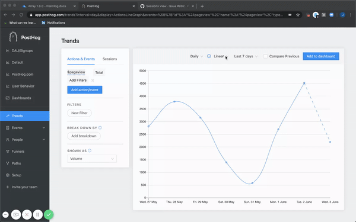
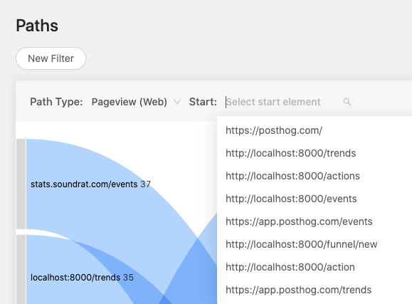
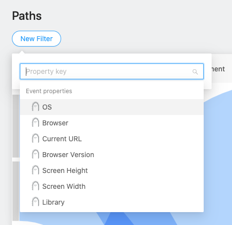
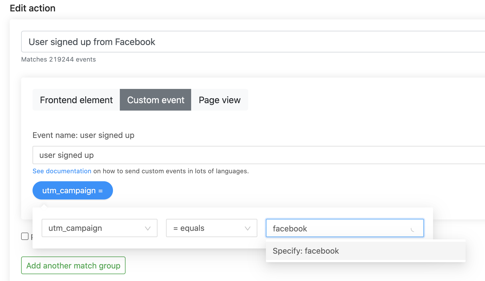

What's box-fresh in PostHog? Cumulative graphs, better paths, and an upgrade to our actions.

If you're self hosting and want these features - [update your PostHog](/docs/runbook/upgrading-posthog).

## Release notes

### [Cumulative graphs](https://github.com/PostHog/posthog/pull/862)

This feature is designed for startups.

We built it because we our own team had to create an investor presentation showing PostHog signups and realized that cumulative graphs can *only* go up and to the right. Just the thing for nailing that valuation!

### [Paths got more powerful](https://github.com/PostHog/posthog/pull/897)

We decided that the paths functionality needed more polish. You can't quite see your face in it yet, but this week is a good step up.

Finally, you can start your paths on a specific page. Useful for when your landing page isn't your homepage, or when you're trying to remove some of the noise from the graph when you've lots of volume.

For sweet, sweet bonus points, our close-to-magical / hard-working developers worked in the ability to filter paths by properties.

This means you can understand how traffic from a particular URL, or users with a particular property are flowing through your application. Work out which ad campaign engaged users come from, know which teams are doing what, or just have a play.

### [Add property filters to actions + lots of improvements (#841)](https://github.com/PostHog/posthog/pull/841)

This toy just got shinier. When you create an action, you can now filter events by properties. Not only that, but this pull request also made it easier to create actions too - we saw lots of first time users getting stuck here during the onboarding sessions.

## Bug fixes and performance improvements

* We cleaned up descriptions in the [breakdown filter](https://github.com/PostHog/posthog/pull/886).
* The [UX is nicer](https://github.com/PostHog/posthog/pull/863) for selection a URL on creating an action.
* We made it simpler to understand [how to use custom events](https://github.com/PostHog/posthog/pull/873) during the setup process.
* The token issues, oh the token issues. [Fixed](https://github.com/PostHog/posthog/pull/909) and [fixed](https://github.com/PostHog/posthog/pull/894).
* It was time for our events table [to become Ant Designed](https://github.com/PostHog/posthog/pull/895).
* Pre-2020 events [won't affect partitions](https://github.com/PostHog/posthog/pull/875) any more.
* [Better debugging](https://github.com/PostHog/posthog/pull/854) with Sentry.
* Scrollbar [small issue be gone](https://github.com/PostHog/posthog/pull/900).
* We [improved](https://github.com/PostHog/posthog/pull/885) how empty funnels work.
* Events are [40ms faster to process](https://github.com/PostHog/posthog/pull/833) - 25% quicker!
* The sidebar [works properly on mobile](https://github.com/PostHog/posthog/pull/839) - no more squished interface on your cell phone.
* Fix a bug with [selecting filters](https://github.com/PostHog/posthog/pull/844)
* [Funnels are simpler](https://github.com/PostHog/posthog/pull/881).
* [Solved](https://github.com/PostHog/posthog/pull/874) a tricky bug on app.posthog.com caused by URLs with non-utf8 or raw binary query parameters.
* Nothing to do with [dubious cheese](https://www.babybel.com/welcome), we [fixed errors with babel](https://github.com/PostHog/posthog/pull/861)
* [Improved toolbar UX](https://github.com/PostHog/posthog/pull/890) for actions to fix a small [issue](https://github.com/PostHog/posthog/issues/889). 
* PostHog will now [cache SQL and parameters between events processing](https://github.com/PostHog/posthog/pull/845). This speeds things up by a further 40%.
* We [refactored more classes to hooks](https://github.com/PostHog/posthog/pull/898), fixing a bug with event name labels along the way.

## Favorite issue

### [Sessions view](https://github.com/PostHog/posthog/issues/882)

Thank you to [PaoloC68](https://github.com/PaoloC68) for this one.

The goal is to be able to see all the specific sessions that have taken place, their respective users, the time, activity, and much more. It was really cool to see a mockup design for this to help explain the context!

## Share your feedback
We'd love to hear anything you have to say about PostHog, good or bad. As a thank you, we'll share some awesome [PostHog merch](https://merch.posthog.com).

Want to get involved? [Email us to schedule a 30 minute call](mailto:hey@posthog.com) with one of our teams to help us make PostHog even better!

## Weekly round up

* [George Floyd Memorial Fund](https://www.gofundme.com/f/georgefloyd)
* [I Run With Maud](https://www.gofundme.com/f/i-run-with-maud)
* [National Bail Out Fund](http://nationalbailout.org/)
* [Louisville Community Bail Fund](https://actionnetwork.org/fundraising/louisville-community-bail-fund/)
* [Color of Change](https://colorofchange.org/)
* [Campaign Zero](https://www.joincampaignzero.org/)
* [Black Lives Matter](https://blacklivesmatter.com/)
* [NAACP Legal Defense Fund](https://www.naacpldf.org/)

## PostHog news

In light of all graphs going up and to the right, we're looking to go from a team of 5 to >5. Would you like to n+1 this thing?

If you are proactive, fast and passionate about code - email tim@posthog.com. We are remote first, open source and in need of fast, founder-mentality proactive developers.

If you're a UX or designer - reach out to james@posthog.com. We've got a fancy new logo and rebrand planned. We'd love someone to take the wheel.

In other news, we're getting closer to a new logo and brand. It's '80s and hedgehog inspired. That'll take a few more weeks to appear, but watch this space.

<ArrayCTA />
