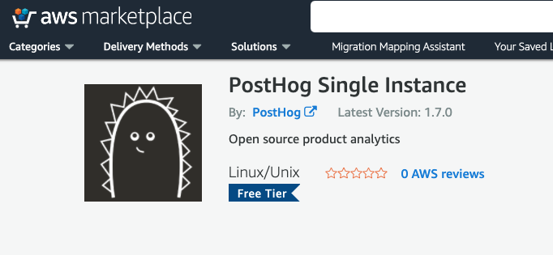

We are working on some very cool features at the moment, but we're not ready to release those yet, so no update this week. Curious?

If you'd like to preview what we're up to, check out the [PostHog <strike>coolbar</strike> toolbar](https://github.com/PostHog/posthog/issues/870).

We're also pleased to say there are a bunch of new things in the PostHog unvierse this week... from new languages supported to instructions on raising millions of dollars in funding.

## Shiny new things

### [Elixir integration](../docs/integrations/elixir-integration)

It feels pretty great to be leading this with a feature from a user in our community - thank you [whitepaperclip](https://github.com/whitepaperclip)!

We've heard Elixir mentioned many times lately, and it comes with [HN love](https://news.ycombinator.com/item?id=18838115).

Perhaps one to try out over the weekend...

### [Deploy via AWS marketplace](https://aws.amazon.com/marketplace/pp/B089QN5DZM#pdp-pricing)

We've long said Heroku was the easiest way to deploy, and AWS probably the best value but a little more work.

Now, it's possible to deploy PostHog onto AWS with 3 clicks. Zero if you use [vim for Chrome](https://chrome.google.com/webstore/detail/vimium/dbepggeogbaibhgnhhndojpepiihcmeb?hl=en).

If you head to the AWS marketplace, you'll see it right there ready to deploy.

### Blog: [How we raised $3M for our open source project](../blog/raising-3m-for-os)

Most fundraising announcements involve a lot of high level statements. We thought it would be more helpful if we did the _exact opposite_ and provided information on [how we raised the money](../blog/raising-3m-for-os) to encourage other open source projects to at least consider the same route.

Yes, [James H](https://github.com/jamesefhawkins) really did 200 Zoom calls. And, yes, most of those were after midnight.

Choosing not to go down the TechCrunch announcement route this time around was a leap of faith, but that tends to be our style. We blindly trusted that the internet would help get the word out, and 'lo it provided. Someone kindly posted the blog to Hacker News and we made the front page. The thread has lots of [interesting points](https://news.ycombinator.com/item?id=23426662).

## Favorite issue

### [Event ingestion performance](https://github.com/PostHog/posthog/issues/955)

Thank you to [prawnsalad](https://github.com/prawnsalad) for fantastic detail in this performance deep dive. [James G](https://github.com/fuziontech) is working on a response to these ideas.

Event ingestion is a huge challenge for product analytics, especially given our autocapture. We're steadily getting better and better at [scale](../docs/deployment/scaling-posthog), but we will always have room for improvement. It's particularly nice when this is driven by a community member.

## Weekly round up

* [Interview with the creator of Elixir](https://www.welcometothejungle.com/en/articles/btc-elixir-jose-valim)
* [Be careful of developing with VR](https://twitter.com/DannyBittman/status/1270402443768184832) - don't use Twitter for medical advice, but worth some research
* [Speeding up a git monorepo at Dropbox](https://dropbox.tech/application/speeding-up-a-git-monorepo-at-dropbox-with--200-lines-of-code)
* [Start saving for your next games console](https://www.ccn.com/2d-to-3d-leap-xbox-chief-delivers-dramatic-next-gen-sales-pitch/)

## PostHog news

So much hiring this week! We're speaking to many fantastic people as we're working out how to deliver more and more features and a better UX whilst keeping on top of the issues raised by users. We couldn't be more excited about some of the fresh faces that will soon start appearing in the PostHog repo :) We have tried to give direct feedback to every single person that applied even those we didn't interview. We've had many positive responses.

If you've read this far, could we pay you to blog, this newsletter, and our docs? We are looking for a developer turned writer that can help us keep pace with all our features and to blog about some of the interesting technical topics we come across as part of our growth.

There are plenty of roles open (see [how to apply](/careers)): 
* technical writer / dev blogger
* growth engineer
* full stack engineer
* UI designer