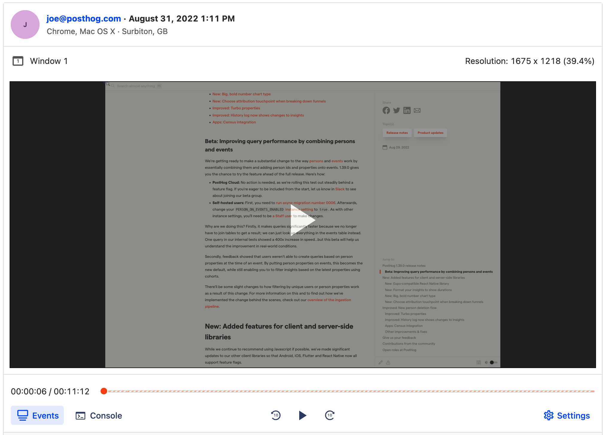

PostHog may have been built for product analytics, but that doesn’t mean you can only deploy it on your core product — you can also use it to gather analytics from your marketing website too. Internally at PostHog this is exactly what we do, tracking analytics from both the product and this very website within a single project. 

Using PostHog to gather analytics in this way isn’t just an excuse for us to ‘dogfood’ our own product. It’s also a best practice that we strongly recommend to other organizations for several reasons...

> Already want to track your marketing website with PostHog? Find out [how to install our JavaScript snippet](/docs/integrate/client/js) in just a few minutes!

### 1. Get better data

Web analytics tools, such as Google Analytics, are all well and good — but if your tracking stops as soon as a user logs in to your platform then can you really track their entire user journey? 

Deploying PostHog across both your website and product enables you not only to track their entire journey, but also to unlock important insights into how your marketing site is performing. You can compare pageviews to purchases, for example, to understand your conversion rate with a [funnel insight](/manual/funnels) — and you can use a [path insight](/manual/paths) to visualize that journey completely.

Ultimately, PostHog can do almost everything that Google Analytics can do and more. And, speaking of Google Analytics…

### 2. Simplify your stack (and get rid of Google Analytics)

Reducing your stack can have a few overlooked benefits, including greater data consistency. No two analytics tools are the same and each can be impacted by adblockers differently – so if you’re using Google Analytics on your website and PostHog on your product then it can be tough to get comparable results.

Even if data consistency isn’t a concern, there are still plenty of reasons to consider moving away from Google Analytics. Recent GDPR rulings within the EU have bought [the legality of Google Analytics](https://isgoogleanalyticsillegal.com/) into question, for example, and prompted many organizations to look for a self-hosted alternative. 

Worried about GDPR but don’t want to self-host? We recently, we offer [PostHog Cloud EU](https://posthog.com/eu) where all your data (and the product itself) is hosted in the EU, making it the [perfect alternative to GA4](/blog/ga4-alternatives).  

<GDPRForm />

### 3. Session recording and more!



We’ve built PostHog to be an all-in-one product analytics platform that, unlike tools such as Amplitude or Mixpanel, doesn’t force you to use other tools to plug feature gaps. Using PostHog across your marketing site therefore enables you to benefit from these tools, including [session recording](/manual/recordings), [heatmaps](/manual/toolbar) and [apps](/apps).

Session recording in particular is useful on a marketing website, as it lets you filter by events to find actual recordings of users who complete certain actions. Want to literally watch how a successful lead differs from an unsuccessful one, or how users navigate your documentation? Now you can. 

Apps too are an important part of the PostHog-for-websites toolkit, enabling you to shape, filter and enhance user data as it is ingested before exporting to other platforms. Marketing teams in particular can benefit from the ability to sync PostHog with other tools in their marketing stack!

## How to track website traffic with PostHog

If you’re on board and want to move ahead with tracking your marketing site with PostHog, it couldn’t be easier. All you need to do is copy the snippet below (which is also available in the ‘_Project settings_’ of your PostHog instance) into your website’s HTML. Ideally, put it just above the `</head>` tag to get the best results. 

```html
<script>
  !function(t,e){var o,n,p,r;e.__SV||(window.posthog=e,e._i=[],e.init=function(i,s,a){function g(t,e){var o=e.split(".");2==o.length&&(t=t[o[0]],e=o[1]),t[e]=function(){t.push([e].concat(Array.prototype.slice.call(arguments,0)))}}(p=t.createElement("script")).type="text/javascript",p.async=!0,p.src=s.api_host+"/static/array.js",(r=t.getElementsByTagName("script")[0]).parentNode.insertBefore(p,r);var u=e;for(void 0!==a?u=e[a]=[]:a="posthog",u.people=u.people||[],u.toString=function(t){var e="posthog";return"posthog"!==a&&(e+="."+a),t||(e+=" (stub)"),e},u.people.toString=function(){return u.toString(1)+".people (stub)"},o="capture identify alias people.set people.set_once set_config register register_once unregister opt_out_capturing has_opted_out_capturing opt_in_capturing reset isFeatureEnabled onFeatureFlags getFeatureFlag getFeatureFlagPayload reloadFeatureFlags group updateEarlyAccessFeatureEnrollment getEarlyAccessFeatures getActiveMatchingSurveys getSurveys".split(" "),n=0;n<o.length;n++)g(u,o[n]);e._i.push([i,s,a])},e.__SV=1)}(document,window.posthog||[]);
  posthog.init('<ph_project_api_key>', {api_host: '<ph_instance_address>'})
</script>
```

It’s worth noting that you’ll need to add this snippet to all pages you want to track, and that the snippet above uses Javascript. Don’t want to use Javascript? [There are plenty of other options](/docs/integrate)!
