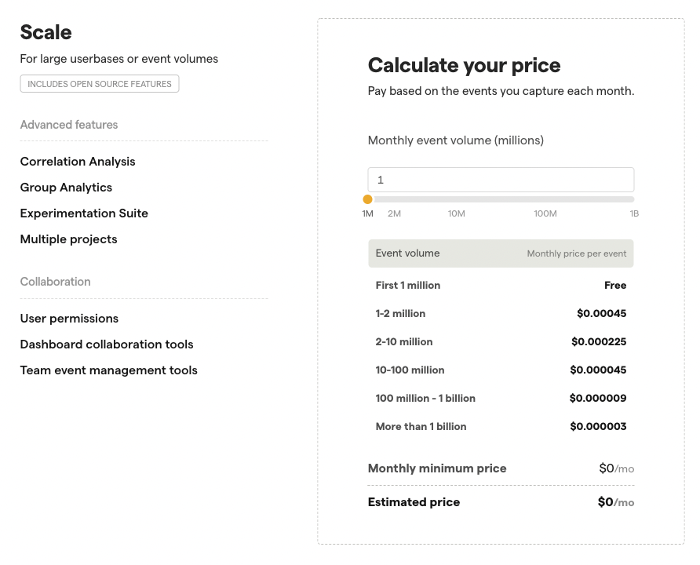
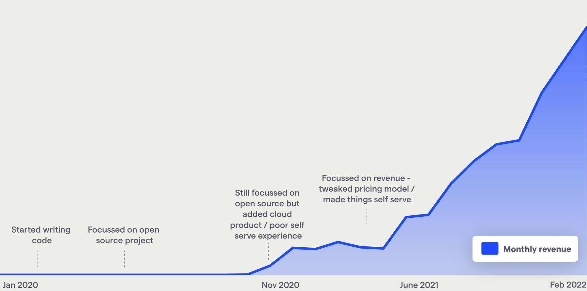

> "I wonder how much this SaaS product costs to..."
>
> "Contact sales!"
>
> 😤

Contact. Sales.

Two words that embody everything we hate about modern SaaS products. And, when you see them, you know it's just the start of the sales dance.

Even if you're deemed worthy enough for a sales rep to call you, it's likely you still won't find out the price until you've answered a _lot_ of questions.

And maybe seen a demo.

And perhaps your own hands-on evaluation.  

And introduced your boss' boss. 

And consulted the legal department.

And "hey, would you like to join our webinar?"

It's all a colossal waste of time and energy that's better spent focusing on what matters: building better products.

That's why, at PostHog, we've adopted transparent pricing and self-service for every paid plan, even PostHog Enterprise.

> Simon Fisher leads customer success at PostHog. He's made a career out of helping companies automate stuff, including seven years at IBM and five years at Chef Software. He lives in Sheffield in the North of England with his wife, three young boys, a black labrador, and a killer Lego collection. Seriously, it's sweet.

## Transparent pricing works

For those new to PostHog, it's an all-in-one product analytics suite that replaces siloed tools for [product analytics](/product#product-analytics), [Session Recording](/product/session-recording), [Feature Flags](/product/feature-flags), and Experimentation. It's open source and you can host it yourself, giving you complete control over your data – we have a Cloud version too if that's your thing. 

As an open-source business, we put great value in transparency. We make our processes, policies, team structure – even [how we pay people](/handbook/people/compensation) – available for anyone to read in our [company handbook](/handbook), and the vast majority of our comms is visible for anyone to read on [our GitHub repo](https://github.com/PostHog/posthog/issues).

This philosophy extends to transparent pricing and our self-serve model. 

We believe transparent pricing is fundamentally better for both us and our customers. No one should ever feel like they're paying over the odds because they didn't haggle hard enough, or have to go through a lengthy process just to get a simple estimate.

Self-service, meanwhile, makes it easy for customers to get up and running as quickly as possible. Got a problem to solve? We'll get out of your way and let you do that, and make it easy to upgrade to a higher tier when you actually need it.

That's why we made our core paid plans totally self-serve and free up to 1 million events per month, with the "per event" price decreasing as usage increases, as you can see below.

This model has worked incredibly well for us. 

In the last six months, we've seen 20% month over month growth on our paid plans – an 8.9x increase per year. 

We achieved this without cold emailing companies, or chasing specific customers. We just make it super easy for companies to try us and pay us, and proactively help new and potential customers get what they need from PostHog.

It's a winning combination more SaaS companies should adopt.

## Adopting transparent enterprise pricing

The last frontier for us was our Enterprise plans. While some companies practice partial transparency, we wanted 100% transparency across the board. This took a while to achieve, but we're glad we did.

Our plans are split by whether you want to self-host PostHog, or have it hosted and managed by us.

There are three options for [self-hosting PostHog](/pricing):

- **Open-Source:** Contains all of the base analytics features but is limited to one project
- **Scale:** Contains advanced features such as experiments and group analytics, and has unlimited projects
- **Enterprise:** Comes with SAML-based SSO, project permissions and a whole lot of help from us

For PostHog Cloud, there are just two options:

- **Cloud:** Mirrors the features of PostHog Scale, hosted by us
- **Cloud Enterprise:** Mirrors the features of PostHog Enterprise, hosted by us

PostHog Scale and Cloud have had transparent pricing for a while and, unsurprisingly, we found companies interested in PostHog Enterprise would calculate the price using the Scale or Cloud pricing calculators. 

This makes sense in isolation, but our enterprise plans cost more because you get more, particularly on self-hosted where we offer a lot of support to ensure things run smoothly.

We adapted our existing pricing models to be roughly 2x Scale pricing for self-hosted Enterprise, and 1.3x Cloud pricing for Cloud Enterprise to reflect the additional benefits you gain from these editions.

We didn't want to mandate lengthy annual commitments, so all of our products can be subscribed to on a monthly basis and canceled at any time.

That said, most larger organizations fall into a traditional annual buying process, and we incentivize them with bigger discounts for the upfront commitment.

## What did we learn?

People expect self-hosted deployments to be cheaper than PostHog Cloud as they incur the additional infrastructure 
costs. 

While it's true that running PostHog Cloud requires a minimum level of spend from us, self-hosting costs more than Cloud for a few important reasons:

1. Developing and supporting a self-hosted platform is more complex than a traditional SaaS offering (and we offer both)

2. We are willing to invest a significant amount of our time in ensuring our large, self-hosted deployments are tuned effectively so customers have the best PostHog experience possible. 

This is a message we'll continue to refine, but ultimately we feel tolerance for the expense PostHog Enterprise is directly connected to how important self-hosting is to a customer. 

It's still good value compared to other enterprise SaaS tools, especially considering the breadth of features we offer, and if the price isn't right then Cloud Enterprise might be a better option for those customers.

## Going one step further... self-serve for Enterprise

Things move fast at PostHog. When I started writing this blog post, our Enterprise plans had transparent pricing but still required you to contact us to get started. Not anymore.

You can now sign up for an Enterprise license yourself in a fully automated manner, so all our plans are now transparently-priced and self-serve.

If having SAML integration, project permissions and a whole lot of set up and ongoing help from us is for you, you can sign up for your [Enterprise license key](https://license.posthog.com/?price_id=price_1L1AeWEuIatRXSdzj0Y5ioOU) in just a few clicks.

Our final hurdle is to make it so Scale and Cloud users can upgrade to Enterprise themselves without our intervention. It's coming soon.

If all this talk of self-serving and automation isn't for you then don't worry – you can still always [contact sales](/contact-sales). We love hearing from our customers, but it's your choice when you do.
