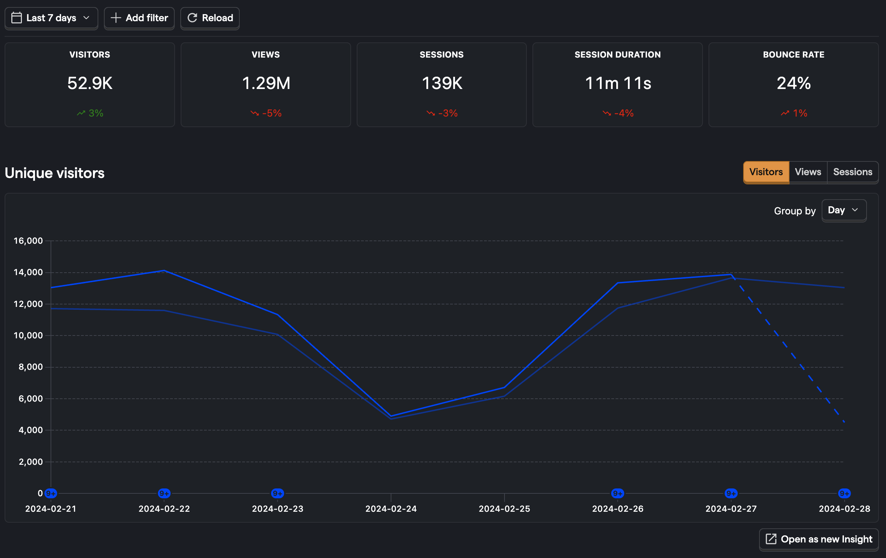
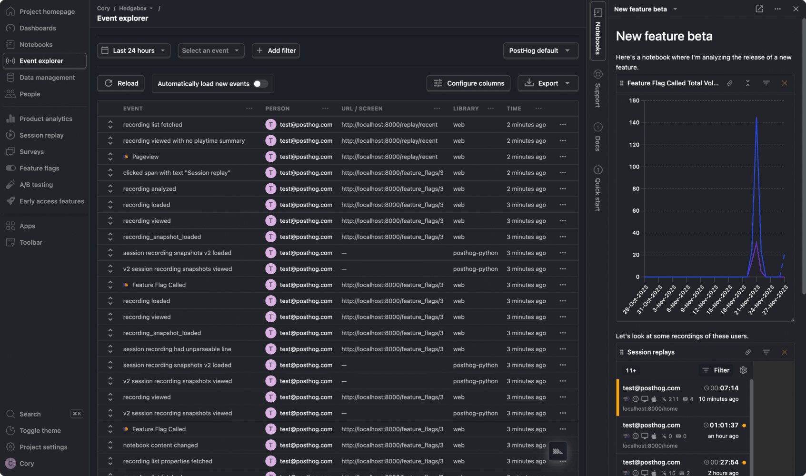
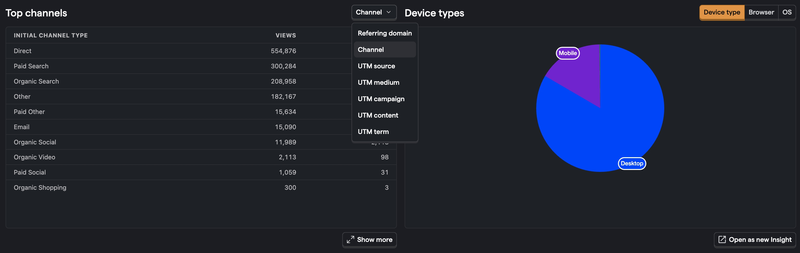

[Our web analytics beta](http://app.posthog.com/home#panel=feature-previews) started simple — a dashboard of some stats, plus the top site paths. We wanted to grow it into...

1. A Google Analytics alternative..
1. Which was low cost...
1. Simple to use...
1. Could be built quickly...
1. And was suitable for technical founders...

We didn’t put a lot of resources behind the idea. The ‘web analytics team’ is, in reality, just [Robbie](/handbook/small-teams/web-analytics). We think in situations like this where we can leverage existing work, one person learns faster than many — though it’s always worth looking at the progress you’re making. 

### Building a Google Analytics alternative

<Caption>Google Analytics 4 hasn't been very popular with users</Caption>

Google was already migrating users to the less-than-popular Google Analytics 4 (GA4) when we started this project last year. Predictably, there was a scramble among competitors to grab fleeing users and we thought about launching early to do the same. Instead, we waited until November. 

While we arguably missed out on an early opportunity to establish PostHog as a GA alternative, we knew it was more important to take our time and build a credible MVP. Only then could we  [validate it with actual users](/founders/product-market-fit-game#level-3---validate-your-mvp-by-recruiting-real-users). 

It’s a good thing we did too. We anticipated new feature requests during the beta, but were surprised to learn that _performance_ mattered far more than we expected. Users view traffic data as simple and therefore want to get it very quickly. Rushing a full launch without doing the work to make web analytics performant would have been a disaster!

### Making it low cost

<Caption>Web analytics shares high-level data, without user identification</Caption>

We haven’t yet made final decisions about how to price web analytics, in part because it has proven to be far more complex than we initially thought.

The challenge is that not all data is created equally. Web analytics and product analytics are separate products which address very different needs — for web analytics you only need high-level figures and don’t need to identify every user. It’s the opposite for product analytics. But they both work by looking at the same event data.

So, how do we build a pricing model that works for both and doesn’t force users to either pay for the same data twice, or capture too little/too much data for a single use-case? 

This is something we’ve found difficult to investigate during a free beta process, and we’re not sure what the solution will look like. [We’d love to hear your thoughts](http://app.posthog.com/home#supportModal)!

### Making it simple to use

<Caption>PostHog's UI is designed for extreme data density</Caption>

Shortly after we announced our web analytics beta we launched [a full UI redesign aimed at engineers](/blog/posthog-as-a-dev-tool). It evokes tools like VS Code, with small text, data density, fixed panels, and a desktop layout. 

None of this is suited to a product like web analytics that’s aiming for simplicity, but we can thankfully cut a lot of complexity because web analytics focuses only on pre-built queries. We don’t need to include many of the more complicated options, such as [formula mode](/docs/product-analytics/trends#using-formulas) or [HogQL](/docs/hogql).

Our biggest concern at the moment is that we’ve _over-simplified_ some of the UI by using too many visual elements and burying some insights in tabbed panes. The top channels insight, for example, is incredibly useful but currently nested within the also-useful top referrers insight — while the world map is hard to parse compared to a simple table. 

### Building it quickly

<Caption>Simple designs often require new UI paradigms</Caption>

We think we’re doing pretty well at building quickly, mainly because we can obviously reuse a lot of work from product analytics. 

The main benefit is that every graph and table in web analytics is a query node that has a source which has been changed to meet new needs. We don’t need to create new loading, refreshing, or caching behaviors — we can instead spend that time painfully putting together lists of likely UTM parameters for our top channels insight. 

One of the biggest benefits to users is that reusable components have enabled us to quickly respond to feedback when we otherwise may not have done so. The world map view which visualizes site traffic on an atlas, for example, was a frequent user request which we’re still skeptical about. If we hadn’t developed it previously as [part of an off-site hackathon](/blog/tags/offsites), we may never have added it to web analytics!

### Making it suitable for technical founders

This is the most difficult criteria to assess ourselves on, and also the hardest to build for. Web analytics needs to be both powerful enough for technical users, but also simple enough for non-technical users. 

What we’ve started to realize is that every feature appeals to a different persona. Feature flags, for example, are built for hands-on engineers who need to deploy new features and have direct access to code. Others, like surveys, have no-code editors which make them more approachable for marketers and less technical roles. Where does web analytics sit on this axis?

In recent months we’ve learned that technical founders often want entirely different features to product engineers or marketers, such as the ability to customize the dashboard experience. User feedback is still the deciding factor for whether or not we develop these features as we continue to move web analytics closer to release. 

> **Want to let us know what you think?** [Join the PostHog web analytics beta](http://app.posthog.com/home#panel=feature-previews) and send us your feedback.
