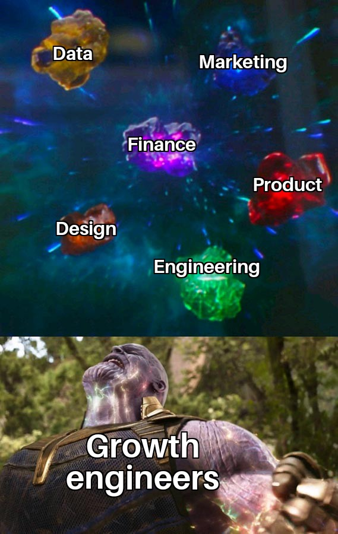

Every startup loves to see their growth metrics like signups, subscriptions, and revenue go up, yet all engineers basically work on things indirectly related to doing so. Growth engineers are different. They focus entirely on projects dedicated to driving as much growth as possible, no matter where they are in the product.

To help you understand growth engineers better, this post will go over what we’ve learned about the type of people who succeed as growth engineers, what skills they have, what they work on, and why they matter.

## What are the characteristics of a growth engineer?

To start to understand growth engineers, it is useful to understand who they are as people. When comparing them to regular engineers, here are the characteristics that stand out:

1. **Entrepreneurial**. Growth engineers have an interest in the business as a whole as well as the hustle to find ways to improve it. They find areas they can make a large impact on the growth metrics, and develop solutions themselves to improve those metrics. Like an entrepreneur, they are independent and scrappy.
2. **Experimental.** Growth ideas need testing in the real world, and this means growth engineers are like scientists: they experiment a lot. This means developing multiple solutions for a problem, having a testing framework, building their implementations, and evaluating its success. Growth engineers care more about real results from experiments than designing the perfect experiment. 
3. **Data-driven.** More so than other engineering roles, they care about usage data and it heavily informs how they work. They use data to inform and evaluate all the experiments they do. They need data, and the ability to analyze that data, to know which ideas to work on and how their proposed solutions are working.
4. **Curious.** Although it sounds a bit cliche, being curious enables growth engineers to discover new opportunities, grasp new technologies, and figure out whatever they need to drive growth. Growth engineers work with more tools and technologies than traditional engineers do. This means more learning, and being unafraid to dive into new subjects.

At PostHog, we find these characteristics often arise in former founders, and that means our growth team has always been entirely made up of them. Founders understand what it takes to build a product, have a combination of engineering and business skills, and are willing to figure out anything to drive growth.

## What skills does a growth engineer need?

Growth engineers are responsible for three key tasks:

1. Creating ideas and strategies for growth.
2. Implementing those ideas and strategies.
3. Measuring and evaluating those implementations.

To accomplish these tasks, they need a combination of engineering, business, product, and data skills.

First and most obvious, is **engineering skills**. Growth engineers write code to implement their ideas and experiments. If they couldn’t code, they wouldn’t be an engineer, and that is half the name. They must be comfortable across the stack, use new tools like external APIs, and work we unfamiliar tech if necessary.

Second, the other part of creating and implementing ideas is **product and design knowledge**. Because a growth team works across the stack and teams, they are often "lone wolves." They need the ability to fend for themselves in product and design decisions. They don’t have to be Da Vinci, but product and design knowledge helps them create successful features.

Third, to create growth ideas based on solid strategies, growth engineers must have an **understanding of business**. This includes areas like marketing and finance. This is because growth engineers work to improve growth metrics. If they don’t have an understanding of business fundamentals, they can’t be effective at improving those metrics. Growth engineers also regularly work with non-technical teams, and so they need this knowledge to collaborate well with them.

Last is **data literacy**. Since growth engineers do a lot of experiments, they must understand how those experiments perform. They should know what factors are relevant, how to calculate if something is significant, and what data to care about in the first place. All of this requires at least a basic knowledge of data and statistics.

If this sounds like a unicorn, you aren’t wrong. This is again why we find former technical founders as a good fit for this role. They have the business and product knowledge to develop growth ideas and strategies, the practical technical knowledge to implement them, as well as a familiarity with the data a product produces.  

## What do growth engineers actually work on?

So what do growth engineers use their skills to do? We’ve already covered that they work to increase signups, subscriptions, and revenue by working across the product, but what are some examples of what this looks like?

- Developing a growth strategy, experiment framework, and measurement for both.
- Doing SEO optimization on the marketing site. Building landing pages. Optimizing the signup funnels.
- Running A/B tests on specific parts of the signup and activation funnel. Trying to improve the conversion rate for both.
- Setting up in-app and push notification messaging systems. Building tools and systems for better product onboarding.

### What do PostHog’s growth engineers work on?

To give a specific example of what growth teams work on, we can look at our [growth team at PostHog](/handbook/small-teams/growth). Over the past few months, this team focused on three areas:

1. **Billing.** Creating a [billing service](https://github.com/PostHog/posthog/pull/11986) enabling different pricing for different plans and [products](https://github.com/PostHog/posthog/pull/15035/files). Improving the billing page both on the [website](https://github.com/PostHog/posthog.com/pull/5181) and [in-app](https://github.com/PostHog/posthog/pull/14652) to work with this service.
2. **Signup.** Improving the signup funnel. Running A/B tests of options like [single sign on buttons](https://github.com/PostHog/posthog/pull/13234). [Verifying emails](https://github.com/PostHog/posthog/pull/13632) and adding two-factor authentication.
3. **Onboarding.** Setting up [in-app messaging](https://github.com/PostHog/posthog/pull/13108) and notifications. Set up customer.io. Add [autocapture](https://github.com/PostHog/posthog/pull/14687) and session recording toggles.

Billing is a major focus recently because we believe we can provide a better offering to users if we charge for separate products. This will lead to growth across the signup, usage, and revenue metrics the growth team cares about. This also means implementing this is on the growth team’s plate, and it’s a big task.

## Why do growth engineers matter?

Many businesses and engineering teams lose focus on the growth metrics. Growth engineering work across teams, products, and code base to keep this focus. In doing so, they can make a massive impact on those metrics.

There are many growth opportunities a standard engineering team doesn’t care about, but growth engineers do. This is because those engineering teams don’t set their goals as driving signups or activation. They focus on making the product better, which is necessary for growth engineers to exist. You can’t growth a non-existent product. 

There are optimizations to the signup and onboarding flow that don’t fall under the responsibility of any of our product teams. These are opportunities for the growth team. For example, making all the changes to billing to treat pricing as a product is a lot of work, but unlocks a lot of growth. If we didn’t have a growth team, we’d likely need a team dedicated to billing anyways. 

### What are the results of growth engineers at PostHog?

At PostHog, our growth team is key to how we onboard, deal with pricing, drive signups, and interact with customers in app. Without a growth team at PostHog, we would leave a lot on the table. 

Growth engineers enabled charging for session replay as a separate product and also enabled future products to do this as well. This enables individual pricing and provides value to our customers as it makes all [our products more competitive](/handbook/engineering/feature-pricing).

Specifically, over the past few months, they ran 13 large experiments on features like email verification, pricing page, login screen, product onboarding, and more. Results include:

- Asking for billing details earlier led to a 250% increase in card activations.
- A pricing call to action change led to a 27% increase in clickthroughs.
- Focusing on the free plan on the pricing page led to a 14% increase in signups from that page.

<Caption>An example of the pricing call to action experiment.</Caption>

These are big gains. They help every one of our products grow faster, as well as PostHog as a business. If you are looking for some of these gains yourself, growth engineers might be the right role for you.

## Further reading

- [What is a product engineer (and why they're awesome)](/blog/what-is-a-product-engineer)
- [What we've learned about multi-product pricing (so far)](/blog/multi-product-pricing)
- [Why 'Product Engineer' is the most fun role I've had in tech](/blog/why-product-engineering-is-so-fun)