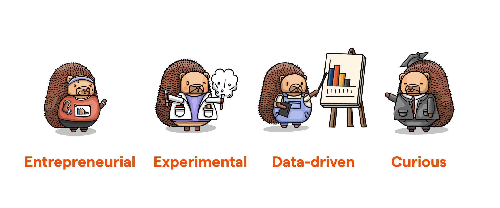
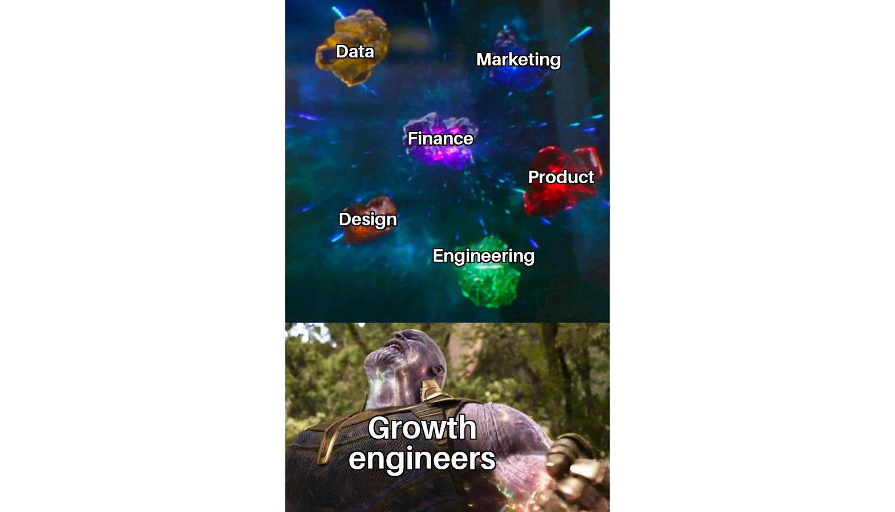
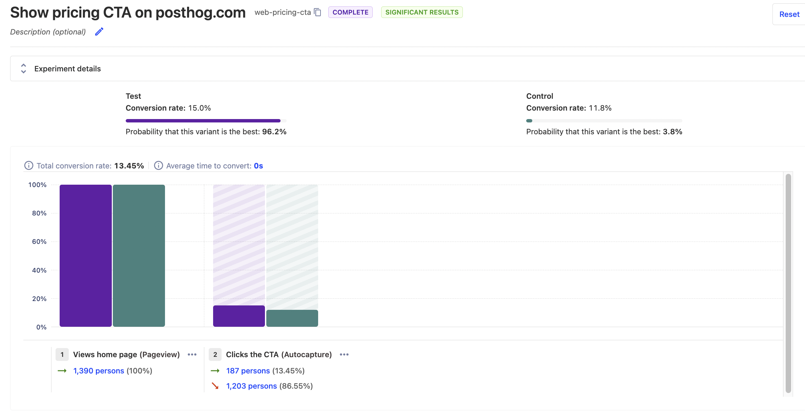

Every startup loves to see its growth metrics – signups, subscriptions, and revenue, etc. – go up, yet most engineers work on things that don't directly impact those metrics. Growth engineers are different. They focus entirely on projects dedicated to driving as much growth as possible, no matter where they build those projects.

In this post, we'll explain the benefits of growth engineers, the type of people who succeed as growth engineers, their skills, what they work on, why you should hire them, and how growth engineering works at PostHog.

> **Who are we?** [PostHog](/) is an open source suite of product and data tools built to help engineers build successful products. Relevant to this post, we have a [team of growth engineers](/teams/growth) who work to maximize the number of people who get value out of PostHog.

## What are the characteristics of a growth engineer?

To start, it is useful to understand who growth engineers are as people. When comparing them to software engineers, here are the characteristics that stand out:

1. **Entrepreneurial**. Growth engineers, especially at PostHog, have an interest in the business as a whole as well as the hustle to find ways to improve it. They find areas they can make a large impact on the growth metrics, and develop solutions themselves to improve those metrics. Like an entrepreneur, they are independent and scrappy.

2. **Experimental.** Growth ideas need [testing in the real world](/product-engineers/testing-in-production), and this means growth engineers are like scientists: they experiment a lot. This means developing multiple solutions for a problem, having a testing framework, building their implementations, and evaluating its success. Growth engineers care more about real results from experiments than designing the perfect experiment. 

3. **Data-driven.** More than other engineering roles, they care about usage data and it guides their work. They use data to inform and evaluate all the experiments they do. They need data, and the ability to analyze that data, to know which ideas to work on and how their solutions are working.

4. **Curious.** Although it sounds a bit cliche, curiosity enables growth engineers to discover new opportunities, grasp new technologies, and figure out whatever they need to drive growth. They work with more tools and technologies than traditional engineers do. This means more learning, and being unafraid to dive into new subjects.

At PostHog, we find these characteristics often arise in former technical founders, and that means our growth team has always been entirely made up of them. Founders understand what it takes to build a product, have a combination of engineering and business skills, and are willing to figure out anything to drive growth.

## What skills does a growth engineer need?

Growth engineers are responsible for three key tasks:

1. Creating ideas and strategies for growth.
2. Implementing those ideas and strategies.
3. Measuring and evaluating those implementations.

To accomplish these tasks, they need a combination of engineering, business, product, design, and data skills.

### Engineering skills

Growth engineers write code to implement their ideas and experiments. If they couldn’t code, they wouldn’t be an engineer, and that is half the name. They must be comfortable across the stack, use new tools like external APIs, and work we unfamiliar tech if necessary.

> **Growth engineers vs growth hackers:** Growth hackers also aim to drive growth but focus on more non-product, non-technical solutions. Growth engineering, for some teams, might include this, but for us, the role focuses on technical work across products.

### Product and design knowledge

Second, the other part of creating and implementing ideas is **product and design knowledge**. Because a growth team works across the stack and teams, they are often "lone wolves." They need the ability to fend for themselves in product and design decisions. They don’t have to be Da Vinci, but this knowledge helps them create successful features.

As [Porter](https://www.workatastartup.com/jobs/46166), a YC-backed devtool company founded in 2020, says:

> We're looking for a product engineer with strong design chops who is fluent in React/Typescript and CSS. Simply put, we want someone who will take Porter's usability and UX/visual polish to the next level. You will be involved in all feature discussions and will shape the trajectory of our product.

### Business understanding

Third, to create growth ideas based on solid strategies, growth engineers must have an **understanding of business**. This includes areas like marketing and finance. Without business knowledge, they can’t effectively make decisions about growth metrics related to those areas. They also need this knowledge to collaborate well with non-technical teams.

### Data literacy

Since growth engineers run many experiments, they must be able to craft hypotheses and evaluate results. They should know what factors are relevant, how to calculate significance, and what data to care about in the first place.

As [Terra](https://www.workatastartup.com/jobs/59415), a YC and Samsung-backed health API, says:

> The ideal candidate will have a deep understanding of data analytics, website optimization, user acquisition, and user engagement strategies. You will be responsible for developing and executing strategies to grow web traffic and engagement with our target customers... and making recommendations for changes to the product that will help us reach our goals.

If all this sounds like a unicorn, you aren’t wrong. This is again why we find former technical founders as a good fit for this role. They have the business and product knowledge to develop growth ideas and strategies, the practical technical knowledge to implement them, as well as a familiarity with the data a product produces.

> **Growth engineers vs product engineers:** Both build new features, are opinionated, experiment, and take ownership. The difference is their focus. [Product engineers](/blog/what-is-a-product-engineer) focus on building products for specific users. Growth engineers focus on projects that drive growth. This could be a feature enabling product teams, a service supporting marketing, or an optimization to a cross-product flow. They are less constrained to a specific product.

## What do growth engineers actually work on?

So what do growth engineers apply their skills to? We already covered that they work to increase signups, subscriptions, and revenue by working across the product, but what does this look like?

- Developing a growth strategy, experiment framework, and measurement for both.
- Doing SEO optimization on the marketing site. Building landing pages. Optimizing the signup funnels.
- [Running A/B tests](/product-engineers/how-to-do-ab-testing) on specific parts of the signup and activation funnel. Trying to improve the conversion rate and time to value.
- Setting up in-app and push notification messaging systems. Building tools and systems for better product onboarding.
- Developing features to access new markets such as localization and support for new types of payments.

## Growth engineering at PostHog

At PostHog, our [growth engineers](/teams/growth) are key to how we onboard, deal with pricing, drive signups, and interact with customers in-app. Without them, we would leave a lot on the table. To explain how they do this, we can look at their three areas of focus over the past few months:

### Billing

Billing is a major focus recently because we believe we can provide a better offering to users if we [charge for separate products](/handbook/engineering/feature-pricing). This leads to growth across the signup, usage, and revenue metrics the growth team cares about. Implementing it is on the growth team’s plate, and it’s a big task.

It includes creating a [billing service](https://github.com/PostHog/posthog/pull/11986) enabling different pricing for different plans and [products](https://github.com/PostHog/posthog/pull/15035/files) such as session replays. It also means improving the billing page both on the [website](https://github.com/PostHog/posthog.com/pull/5181) and [in-app](https://github.com/PostHog/posthog/pull/14652) to work with this service.

### Signup and activation

Our growth team are improving the signup funnel by running A/B tests of options like [single sign on buttons](https://github.com/PostHog/posthog/pull/13234), [verifying emails](https://github.com/PostHog/posthog/pull/13632), and adding two-factor authentication.

<Caption>An example of the pricing call to action experiment.</Caption>

The results of this include:

- Asking for billing details earlier led to a 250% increase in card activations.
- A pricing call to action change led to a 27% increase in clickthroughs.
- Focusing on the free plan on the pricing page led to a 14% increase in signups from that page.

### Onboarding

Onboarding is an area that is traditionally a big focus for growth teams, but isn't for us at the moment (it is a future priority).

Our team has set up [in-app messaging](https://github.com/PostHog/posthog/pull/13108) and notifications, using customer.io. They have also added [autocapture](https://github.com/PostHog/posthog/pull/14687) and session recording toggles to the onboarding flow, increasing the visibility of these features.

## Why you should hire a growth engineer

Growth engineers help your overall business by helping all products grow faster. Growth metrics like signups and activation have downstream consequences on metrics other teams care about like feature usage and revenue.

We've seen this from our growth team. Building cross-product features, like billing, has improved our overall business and user experience. These features don't fit into a specific product team's responsibility and would be missed out on if growth engineers didn't exist.

Growth engineers likely won't help you find traction, they need products to connect and optimize to thrive. Once you have traction, it might be the right time to hire a growth engineer to fuel rapid growth.

From our experience, we'd recommend the technical and entreprenuerial growth engineer, this often arises in former founders. Later-stage teams often find success with larger growth teams, and more marketing-focused roles, but we haven't made it that far yet. 

Still curious about our growth team? Check out [their small team page](/teams/growth).

## Further reading

- [What is a product engineer (and why they're awesome)](/blog/what-is-a-product-engineer)
- [What we've learned about multi-product pricing (so far)](/blog/multi-product-pricing)
- [Why 'Product Engineer' is the most fun role I've had in tech](/blog/why-product-engineering-is-so-fun)
