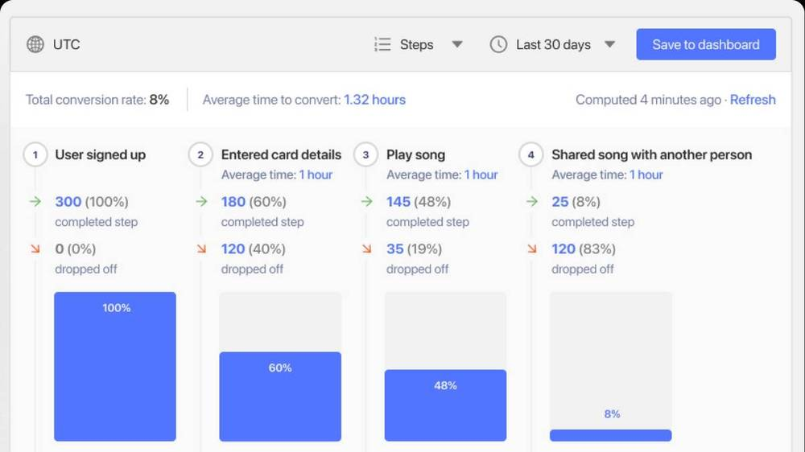

## What is product analytics?

At the most basic level product analytics refers to the process of gathering data about how a product is used, then analyzing that data in order to make decisions about improving it.

Where it gets more complicated is in the particular situations and decisions that are made using product analytics tools.

A good example of product analytics in action is collecting information about how many users reach each stage of an onboarding funnel, then using that information to improve or optimize a funnel. This is exactly [what companies such as Hasura use tools like PostHog for](/customers/hasura)!

<figcaption>Above: An example of a simple product analytics funnel</figcaption>

There are two types of data which you can gather for product analytics:

- *Quantitative data* is objectively measurable, such as an increase in a number of users or sales. Using [funnel analysis](/docs/user-guides/funnels) in PostHog to measure drop-off is an example of quantitative data analysis.
- *Qualitative data* is that which is subjective, such as user feedback or observations. Using [session recording](/docs/user-guides/recordings) in PostHog to intuit where users may be experiencing friction is an example of qualitative data analysis.

There are also frameworks which can be used to translate information between the two. [NPS scores](/product-engineers/nps-vs-csat-vs-ces), for example, are often used to translate a user sentiment into a measurable data point.

> This article is part of our [PostHog Academy series](/tracks) where we explain the fundamentals of product analytics.

## Why are product analytics tools important?

Product analytics tools are important because they enable you to make thoughtful and well-informed decisions about changes to a product. Product analytics tools also enable you to measure success (or failure!) when needed, so you know if you need to rollback or double-down on a change. 

It's possible to get by without product analytics, but then it's impossible to know if changes are having a beneficial impact, or even if you are solving the right problems to start with. Product development without product analytics is like stumbling around in a dark room, trying to find the way out. You _might_ find the way out, but you might also fall down a hole! 

## Who uses product analytics?

Nearly all modern businesses will employ product analytics tools at some level, from new start-ups such as [Pry](/customers/pry) to established products with thousands of users such as [Hasura](/customers/hasura).

Product analytics tools are _not_ used solely by Product teams, but can be used by a wide range of teams or individuals within a business. These can include:

- Product Managers or Product Engineers
- Software Engineers or Developers
- Leadership or senior management
- UI or UX Designers

Individuals will often employ product analytics on a particular area, depending on their role. Product Engineers, for example, may investigate the adoption rate for new features so that they can make decisions about the product roadmap. Meanwhile, UX Designers may use product analytics tools to understand where users are rage-clicking, so they can optimize the interface. 

<BorderWrapper>
    <Quote
        imageSource="/images/customers/joe.png"
        size="md"
        name="Joe Saunderson"
        title="Software Engineer, Mention Me"
        quote={`“We use feature flags to issue changes to 50% of users and then compare the effect. Experiment, find results, decide where to focus and then iterate.”`}
    />
</BorderWrapper>

## What product metrics should I track?

It’s important when using product analytics tools to look at metrics relevant to specific decisions. Metrics such as the number of customers, can give you a good sense of your overall [product health](/blog/product-health-metrics) but won't help you plan a roadmap.

One simple set of metrics which can help all teams to focus their efforts is the so-called pirate funnel, which was created by Dave McClure and tracks AARRR. That stands for:

- *Acquisition:* Users who discover your product (e.g. free trials, web traffic)
- *Activation:* Users who use your product (e.g. sign-ups, first orders)
- *Retention:* Users who stay with your product (e.g. repeat purchases)
- *Revenue:* The money bought in by users (e.g. Subscriptions, LTV)
- *Referral:* The users who share your product (e.g. reviews, shares)

> Find out [how to build a AARRR funnel](/blog/aarrr-pirate-funnel) in PostHog

## Do I need to share my data when using product analytics tools?

No. 

Most product analytics tools such as Mixpanel and Amplitude work by capturing user actions with a short code snippet or third-party cookie which sends data to their data centers. But not all platforms work this way.

PostHog enables you to self-host your product analytics, so you keep data on your infrastructure and don't need to share data with anyone. Not even PostHog. 

There are many situations where it may be preferable not to share data with a third-party analytics platform, such as a need to protect user information or mitigate the risk of data breaches. Self-hosting your product analytics platform also provides other benefits, such as circumventing ad blockers due to the lack of third-party cookies.

> Find out [how to self-host product analytics](/docs/self-host) with PostHog and easily deploy to your infrastructure using DigitalOcean. 

## Is Google Analytics good for product analytics?

No.

Google Analytics is one of the most popular analytics platforms in the world and is useful for understanding a number of important metrics, but it isn’t the ideal platform for running product analytics. This is because Google Analytics was built to help users understand web metrics, rather than answer questions about _why_ users behave in certain ways. 

In short, Google Analytics provides a handy overview of web traffic or vanity metrics such as bounce rate, but it doesn’t offer tools such as feature flags or session recording.

As a result, Google Analytics is often the preferred tool for specific roles in a Marketing team that uses other Google tools, but is unsuitable for the needs of Product or Engineering teams. 

## What are the best product analytics tools?

Naturally, we think PostHog is the best product analytics tool available. 

Why? PostHog enables you to self-host your analytics, integrates with tools such as data warehouses and offers everything you need to interrogate your data in a simple, visual UI. No SQL required. PostHog also offers many unique features which closed-source competitors do not, such as feature flags and session recording. 

There are a variety of product analytics tools available to choose from however, each with its own quirks and strengths. Popular options include platforms such as Amplitude, Heap, or Mixpanel, though none of these offer self-hosted deployments. 

## Further reading

- [An introduction to customer retention](/blog/introduction-to-customer-retention): Customer retention metrics are vital to the long term success of any product

- [How to measure product engagement](/blog/how-to-measure-product-engagement): How to define engagement for your platform, and how to use analytics tools to measure and build on the results

- [How to achieve B2B product market fit](/blog/how-to-product-market-fit): How to approach finding market fit for a B2B product

> PostHog is an open-source analytics platform you can host yourself. We help you build better products faster, without user data ever leaving your infrastructure.

<ArrayCTA />
