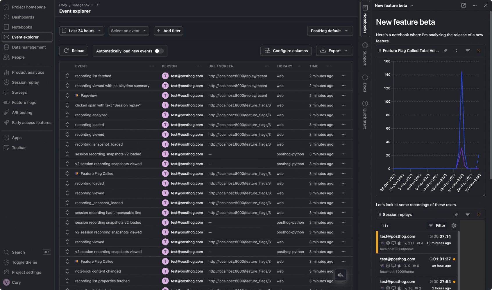
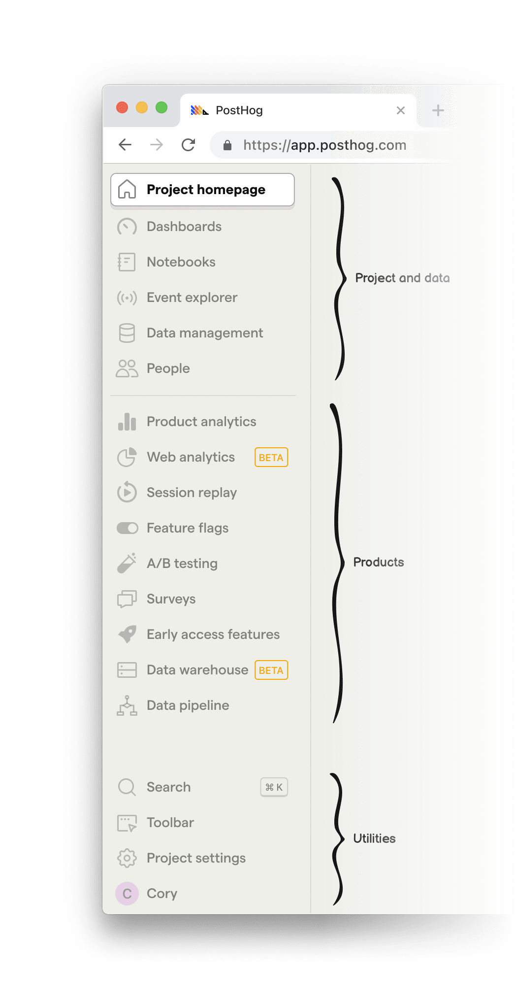
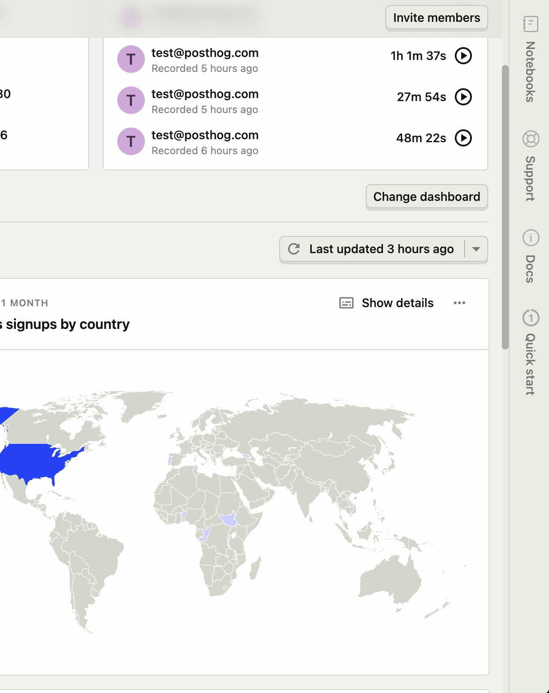
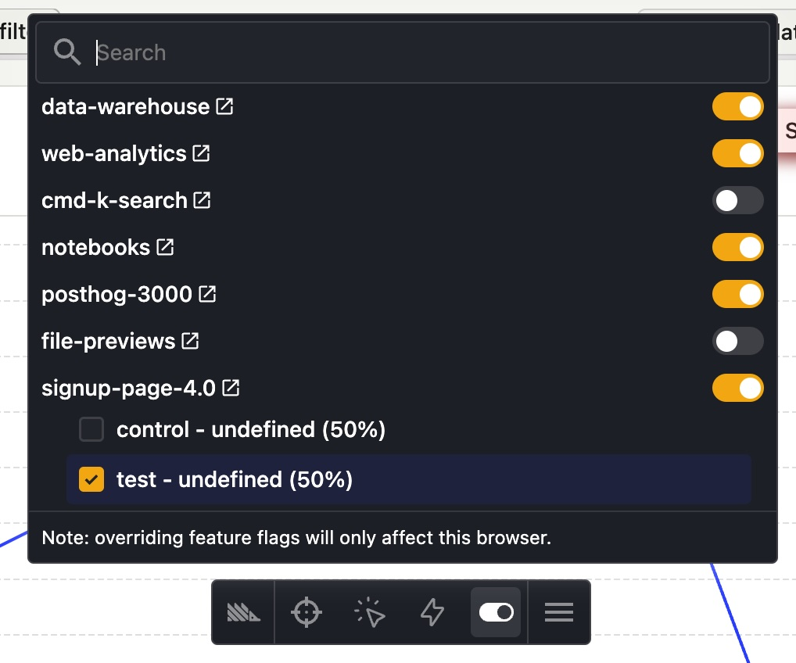
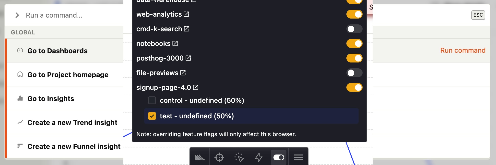
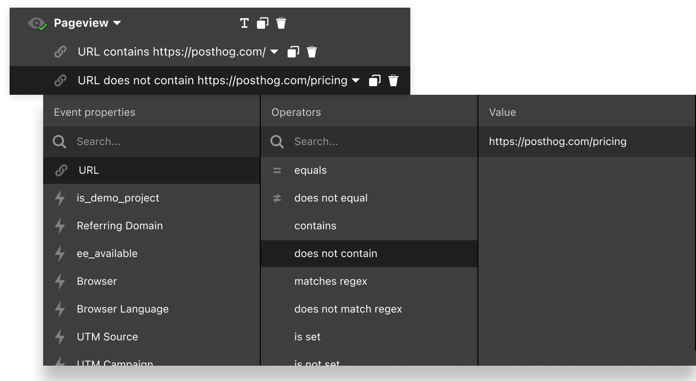
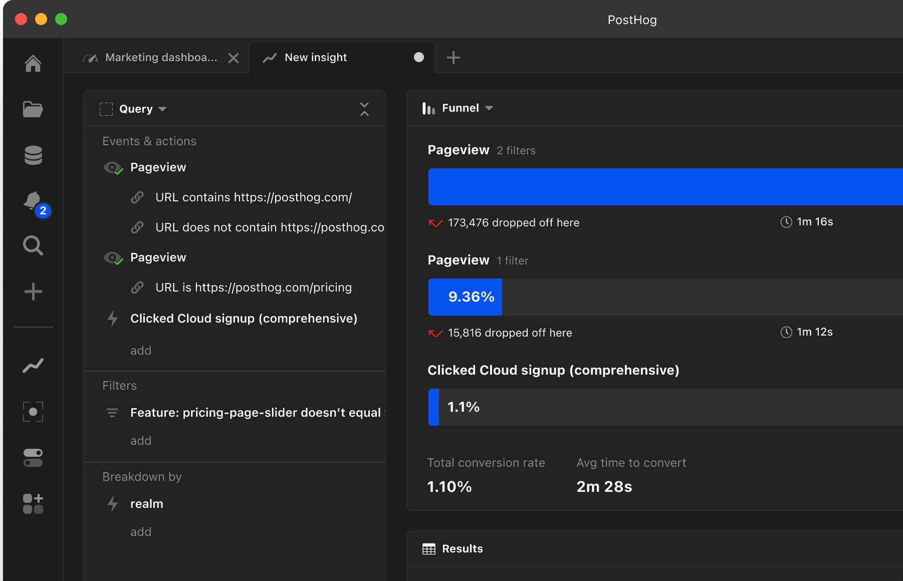
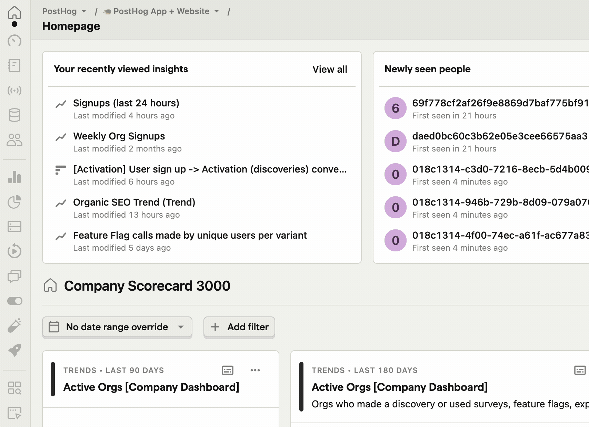
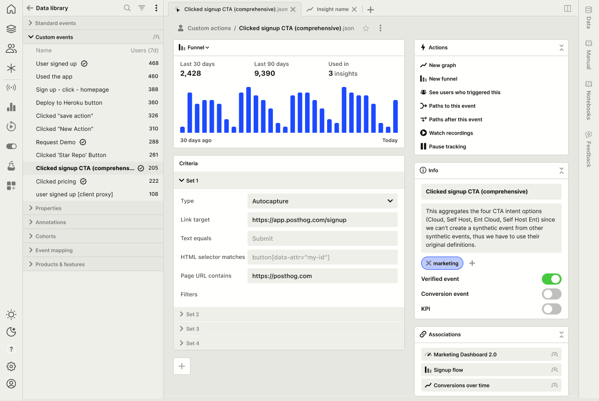

A year ago, [James](/james) and I sat down in a coffee shop in Austin, Texas and had a discussion about what the future of PostHog could look like.

Our current UI has served its purpose, but as we grow as a company, the possibilities of what can be achieved in PostHog have grown – as have our ambitions.

We’re launching a reskin this month as the first step in a series of many milestones around the experience of using PostHog. I’d like to share some of the reasoning behind our changes, and the longer-term vision we’re aiming to realize in the future.

## Why we're making changes

Sometimes it feels like designers change things for the sake of change. I promise, this is not one of those times. Here's some of the thinking that's gone into it:

### 1. PostHog isn’t product analytics - it’s a platform

As of this writing, we’re at five products with three more in beta. Interoperability will be a key differentiator for PostHog.

Underlying every query is our new [HogQL querying engine](/docs/hogql). This means it’s now possible to display a graph of users who match a set of criteria, then pivot to watching a playlist of session recordings, then toss those users into a cohort, enable a feature flag, and send them an in-app survey – all stemming from the same underlying query.

This means PostHog needs to be flexible, visually agnostic, and adaptable to pivot to whatever type of querying is being done.

### 2. An experience that sparks joy ✨

We’ve all used web-based products we _love_ and also those that drive us _absolutely insane_. We want to be in the former category. Our goal is to make PostHog feel to product engineers as Figma is for designers, VS Code is for engineers, or Linear is for ~product managers~ everybody.

So what does a better experience look like for product engineers? For starters, dark mode, keyboard shortcuts, better data density, and tools that make it easier for product engineers to do their jobs. But this is just the tip of the iceberg.

(Alongside this release, we’re also launching a preview of [Notebooks](#), a new platform feature that lets you explore data in an unstructured way.)

### 3. Flexibility

Some of our customers use all our products. Some only use one or two. The experience should feel like it was designed specifically for however you use PostHog.

## The biggest changes you'll see today

This initial release of our updated UI is largely focused on aesthetic changes, though it does come with some new features.

But more importantly, it lays the groundwork for future improvements. **Some things may still feel a bit janky, but there are lots of exciting plans. This is a work in progress, and I hope you'll bear with us as we continue to iterate in the coming months.**

Here's some of the design changes (and a few new features) you'll see today:

### 1. Colors, data density, dark mode

_Data density, dark mode, developers._ Now you can see more information on the screen, and it won't make your eyes bleed.

You can change between light, dark, and a mode that will match your system preference under the account menu.

### 2. New navigation menu grouping

The nav menu has now been organized into two main sections: **project & data** and **products**.

**Project & data** includes your dashboards and notebooks, along with the data you're sent to PostHog (like events, people, and properties), and metadata you've added on top (like actions, cohorts, and annotations) – and a live feed of incoming events.

**Products** is the ever-growing list of tools built on top of the PostHog platform.

Once the icons are familiar enough, you may want to hide the text labels. You can do this by dragging the dividing line to the left of the screen (or just double-click it).

In the future, we may add the [ability to customize the nav menu](https://github.com/PostHog/posthog/issues/18884) by re-ordering items or hiding products you don't use.

&nbsp;

### 3. Side panel

The new collapsible side panel is always available on the right side of the screen and is designed to help with whatever you're currently doing.

- **Notebooks:** Drag almost anything from the main workspace into a notebook so you don't lose it. It's designed to be a scratchpad for data exploration.
- **In-app docs (seen below):** Clicking any docs link in the product will now open in the side panel, keeping you in the flow of what you're doing.
- **Support:** Get in touch with support without having a model blocking whatever it is you were looking at.

The side panel may also open other panes as necessary – like quick access to settings, or an onboarding checklist if you're new to PostHog.

### 4. Notebooks

[Notebooks](#) is a large enough feature that it deserves a post of its own, but in short, it's a way to load up multiple insights (and more) onto a single page. As you explore data, keep dragging in more findings until you come to a conclusion. Then share it with your team.

### 5. Toolbar 3000

It's the same toolbar you know and love, except now it doesn't look like it was designed in 2020! (Oh, and it also has dark mode.)

### 6. Command bar

Press `Cmd` + `Shift` + `K` to launch the new command bar. Navigate to most of PostHog's built-in features without ever touching your trackpad. (This includes things like generating an API key, creating a dashboard, or switching to dark mode.)

### 7. Reorganized settings

Clicking on _project settings_ will now take you to a more organized page of settings.

---

## So what's next?

This reskin is really just the beginning. There's no shortage of ideas of what to work on next. Here are some other experience improvement’s we’re considering:

### 1. Unified filter experience

Right now, applying a filter requires a handful of clicks and keyboard entries. What if you could do it all in a fraction of time using only your keyboard? These are the types of experience improvements we're looking to make next.

### 2. Column-based query pane

In conjunction with the unified filter experience (seen above), we're exploring ways to make it easier to edit a query while simultaneously seeing the results. This can eliminate unnecessary scrolling, and would unify the interface between many places across products that share this functionality.

### 3. Explorer pane

There's currently no way to see a list of events while viewing the detail for one of them. It requires a click from an index view into a detail view.

So what if a side pane could let you jump into details without having to fully commit – then use the back button – or open a new tab?

Here's a preview of a concept we built (but aren't releasing quite yet). It works across the app everywhere that there's a list of items.

### 4. Tabs

Seen below with the explorer pane, here's a concept where we explored tabs! Though we're not working on these today, it's something we're definitely considering for the future. (The use case for tabs is a desktop app, which we don't have, and why there's no immediate work planned here.)

### 5. Panels: Actions, meta data, associations

Also in the above mockup, you'll notice the right column explores a few ideas:

- **Actions:** This pane would provide easy access to explore this event in PostHog products. Think of them like macros.
- **Info:** Metadata like the event name, description, tags appear here. The same concept would be used in insights, as well.
- **Associations:** Want to know where an event is used? Quickly jump to insights or dashboards that use it.

### 6. Keyboard shortcuts

This is a given, and will happen soon!

### 7. Better mobile support

Rolled into what we're releasing today is slightly better mobile support for viewing insights. Though we don't ever intend for an entirely mobile-first experience for managing data or creating insights, this data should definitely be more accessible on mobile, and we're working toward that as well.

---

If you liked this post, you may want to follow along with our [product roadmap](https://posthog.com/product-roadmap) or [GitHub](https://github.com/PostHog/posthog/issues?q=is%3Aopen+is%3Aissue+label%3Aposthog-3000) (with the `posthog-3000` label) where you'll find a lot of the original inspiration for what we're releasing today:

- [RFC: PostHog 3000](https://github.com/PostHog/posthog/issues/12923) - _Nov 2022_
- [Session replay UI in PostHog 3000](https://github.com/PostHog/posthog/issues/13360) - _Dec 2022_
- [UI improvements for running queries, doing deep dives](https://github.com/PostHog/posthog/issues/12883) - _Nov 2022_
- [Card view for PostHog 3000](https://github.com/PostHog/posthog/issues/17619) - _Sep 2023_
- [More condensed table view for Event Explorer](https://github.com/PostHog/posthog/issues/17614) - _Sep 2023_

You can also [follow me on X](https://twitter.com/ninepixelgrid) where I'll be sharing out some of our upcoming design work in progress. I'm always open to feedback!
