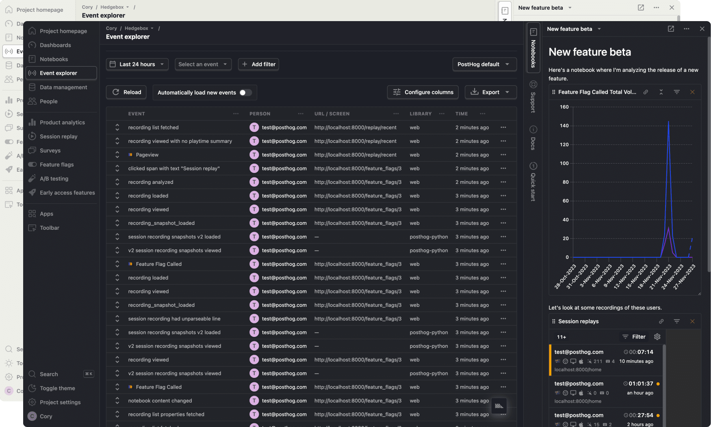

A year ago, [James](/james) and I sat down in a coffee shop in Austin, Texas and had a discussion about what the future of PostHog could look like.

Our current UI has served its purpose, but as we grow as a company, the possibilities of what can be achieved in PostHog have grown – as have our ambitions.

We’re launching a reskin this month as the first step in a series of many milestones around the experience of using PostHog. I’d like to share some of the reasoning behind our changes, and the longer-term vision we’re aiming to realize in the future.

## Why we're making changes

Sometimes it feels like designers change things for the sake of change. I promise, this is not one of those times. Here's some of the thinking that's gone into it:

### 1. PostHog isn’t product analytics - it’s a platform

As of this writing, we’re at five products with three more in beta. Interoperability will be a key differentiator for PostHog.

Underlying every query is our new [HogQL querying engine](/docs/hogql). This means it’s now possible to display a graph of users who match a set of criteria, then pivot to watching a playlist of session recordings, then toss those users into a cohort, enable a feature flag, and send them an in-app survey – all stemming from the same underlying query.

This means PostHog needs to be flexible, visually agnostic, and adaptable to pivot to whatever type of querying is being done.

### 2. An experience that sparks joy ✨

We’ve all used web-based products that drive us _absolutely insane_, and we’ve all used products that we _love_. We want to be the latter. Our goal is to make PostHog feel to product engineers as Figma is for designers, VS Code is for engineers, or Linear is for product managers.

So what does a better experience look like for product engineers? For starters, dark mode, keyboard shortcuts, better data density, and tools that make it easier for product engineers to do their jobs. But this is just the tip of the iceberg.

In this release we’re also launching a preview of Notebooks, a new platform feature that lets you explore data in an unstructured way.

### 3. Flexibility

Some of our customers use all our products. Some only use one or two. The experience should feel like it was designed specifically for however you use PostHog.

## The biggest changes you'll see today

1. New nav menu grouping
    1. Data vs products
2. Notebooks
3. Colors, data density, dark mode
4. Toolbar 3000
5. Command bar
6. Side pane
    1. In-app docs, notebooks
7. Reorganized settings

## What's next?

This reskin is really just the beginning. Here are some other experience improvement’s we’re considering:

1. Unified query pane
2. New subnav experience
3. Keyboard shortcuts
4. Tabs
5. Actions pane
6. Everything-is-a-pane
7. Team activity timeline
8. Better mobile support