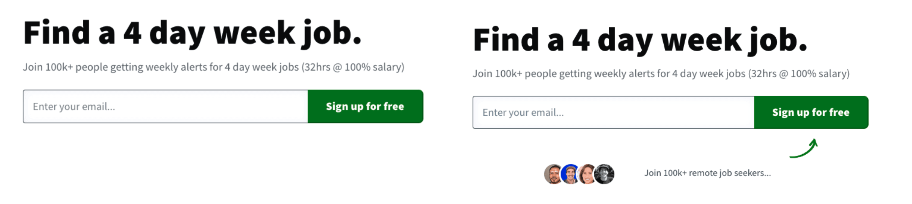

[4DayWeek](https://4dayweek.io/) is the world’s largest job board for employers offering a better work-life balance than the traditional 9 to 5. Created by solo founder Phil McParlane, the platform has experience incredible growth since it was launched and is regularly featured in publications such as Time, Fortune and Bloomberg — Phil credits some of this success down to his decision to build in public. 

“Building in public is a great way to get validation from the community,” says Phil. “It’s especially important in the early days of launching a product, when you want to get feedback, encourage discussion and ensure you’re staying accountable to all your promises!”

The fact that Phil builds in public made him naturally curious about PostHog, because we also value [transparency and building in public](/handbook/company/values). 

“I found out about PostHog through a friend in a Telegram group initially,” says Phil. “And I just knew from the content, the documentation, and the transparency that this was a good fit for me. I immediately became convinced that I needed to start A/B testing things with PostHog.”

### Increasing conversions with social proof and A/B testing

Phil was familiar with the _concept_ of A/B testing, but had never tried actually running a test before. Thankfully, with a little help from ChatGPT and [PostHog’s documentation](/tutorials/categories/experimentation), he quickly got up to speed and began planning how to run A/B tests that could make 4DayWeek even more successful.  

“Every test has to begin with a hypothesis,” says Phil. “In my case, I wanted to test if social proofs would help increase the number of newsletter signups. My hypothesis was that users would be more likely to convert if they had an indication that the service was popular and trusted by lots of people.”

​

<Caption>Tests in PostHog can have multiple variants, but Phil kept his simple and split traffic 50/50 between the original (left) and the test (right) versions</Caption>

As soon as the test was running, Phil started to see a clear winner – enough that, even though PostHog tracks statistical significance automatically, he was confident in selecting a winner prematurely. 

“I made the call to end the experiment early and deploy the test version,” says Phil. “It took less that two weeks to get that result and the difference was enough to justify it. At no point did the original control version perform better than the variant. I set it live and have been getting more subscriptions ever since!” 

<BorderWrapper>
<Quote
    imageSource="/images/customers/4dayweek_phil.jpg"
    size="md"
    name="Phil McParlane"
    title="Founder, 4DayWeek"
    quote={`“I started with testing, but then I started tracking events and building dashboards too. I’ve realized PostHog is something I’ve been looking for for a while — somewhere that I can have all the tools and analytics I need all in one place.”`}
/>
</BorderWrapper>

### Even a negative result is a useful result

Phil values running experiments because they help validate ideas and ward off blind optimism – a trap many solo founders fall prey to. 

“Often I think of a change I can make and I feel it’s just definitely going to improve everything,” admits Phil. “But with experiments I can test them and realize that it actually won’t improve anything. To be honest, many tests I run don’t really lead to success in the way I’d expected!”

One example of this came from a test to change the H1 on 4DayWeek, adapting it from ‘Find a four day a week job’ to ‘Work four days a week’. It was suggested by someone on Twitter and it seemed a sensible way to emphasize a benefit and shift the action away from the user. Ultimately though, it didn’t pan out when tested. 

“Very quickly I could see that people preferred the first version,” says Phil. “It said it more concisely and wasn’t trying to be too clever. That’s an example of when even getting a negative result can be helpful, because it helps you avoid mistakes. That’s why I run these tests!”

As a solo founder Phil is obviously working across a lot of different areas, but running these sorts of test — even when they are unsuccessful — has become a major priority for him. He finds he’s constantly getting new ideas. 

“I get ideas from Twitter, or even just as random thoughts when I’m in the shower,” says Phil. “It’s exciting to be able to test these ideas so quickly, even when I’m spread so thin. When I got that first boost to newsletter conversion? I just said to myself that running these experiments was like my new job.”

“And that’s the thing about these sorts of tests. If you can make a 4% increase here, a 5% increase there…it doesn’t sound like much, but it’s really just money on the table. These improvements all stack up.”
