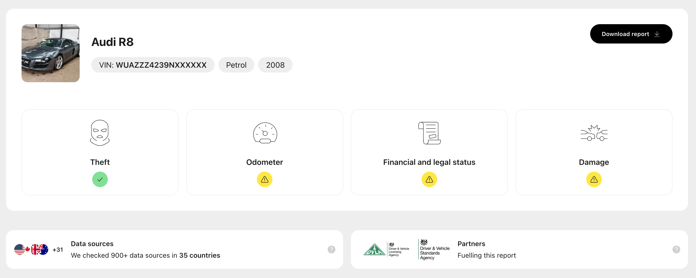

[carVertical](https://www.carvertical.com/) is the world’s leading automotive data company that builds vehicle history reports from accumulated data. If you’re looking to buy a used car these reports can help you understand the specific history of a particular vehicle, as well as help you to understand more about the overall model.

As befits a company which processes mountains of data on a regular basis, carVertical’s product and growth teams are incredibly data-led. In the past, they’ve used tools such as Google Analytics to help them understand user behavior, but as the company has grown, they’ve needed to get more sophisticated.

“Our goal was to implement a proper product analytics platform.,” says Aleksandras Nelkinas, carVertical’s Head of Product Engineering. “Our first thought was something like Mixpanel, but we wanted to be fair to ourselves, so we decided to [consider alternatives](/blog/best-mixpanel-alternatives). That's how we stumbled upon PostHog. What stood out to us was its comprehensive suite of tools, extending beyond mere product analytics. This influenced our decision to give it a trial.”

## Implementing product analytics without autocapture

After personally deploying PostHog in minutes, Aleksandras opted for a strict manual event ingestion process. This approach required every event to conform to a predefined schema before being processed, ensuring total control over the events they handle. This decision aligned with the team’s preference for precision and oversight in adopting a new tool. This approach also meant the team could focus specifically on the individual events they wanted to track and make decisions based on.

<Caption>carVertical tracks which sections users find the most helpful, so it can plan improvements.</Caption>

“Our vehicle reports are made up of sections,” explains Aleksandras. “So, of course, we fire an event to PostHog when each section is viewed, or left, with extra properties to give us more information. We monitor specific interactions, such as button presses and key actions, to gain insights into user preferences and needs.”

This focused approach to tracking enabled the team to start tracking individual on-page interactions and correlating them to other activities, such as various types of conversions.

“Right now, we have a new feature that suggests similar vehicles at the end of a report,” explains Aleksandras. “We wanted to figure out how that section was performing, so we looked into it with PostHog. We noticed that the conversion rate was high for users who reached it, but not all users got to the bottom of a report.”

“As a result, we’ve iterated around its positioning to enhance visibility. This is a prime example of how the data from PostHog enabled us to make refinements which improved the conversion rate!!”

### Getting support from actual PostHog engineers

Since getting started with product analytics during the test period, carVertical has begun using other PostHog tools, such as feature flags, and also invited more team members to the platform.

“We started with product analytics because that’s what we came to figure out,” says Aleksandras. ”We started creating insights and getting answers to our questions pretty quickly. Then we thought: We’ve been talking for a while about ditching our in-house feature flag tool, so why don’t we give PostHog a go as a replacement for that?”

<BorderWrapper>
<Quote
    imageSource="/images/customers/aleks.png"
    size="md"
    name="Aleksandras Nelkinas"
    title="Head of Product Engineering, carVertical"
    quote={`“Feature flags immediately bought a lot of value. What’s really elegant is how flags interlink with product analytics too. We can see exactly how users react, when needed!”`}
/>
</BorderWrapper>

As more and more users have begun using PostHog at carVertical, the team has become regular users of the dedicated Slack support channel offered to users paying over $2,000 a month. This has helped the team adopt PostHog more quickly and resolve any issues in a way other tools can’t match.

“The Slack channel is great,” says Aleksandras. “Responses are quick, and we’re talking to the actual engineers so we can get answers to technical questions too. When we were implementing feature flags, we got a detailed answer from the person who actually built that feature, which is remarkable.”

“Once we moved to Slack, our energy just matched with PostHog’s. We had to reflect on it afterwards: would we have gotten that from Mixpanel? Probably not!”

