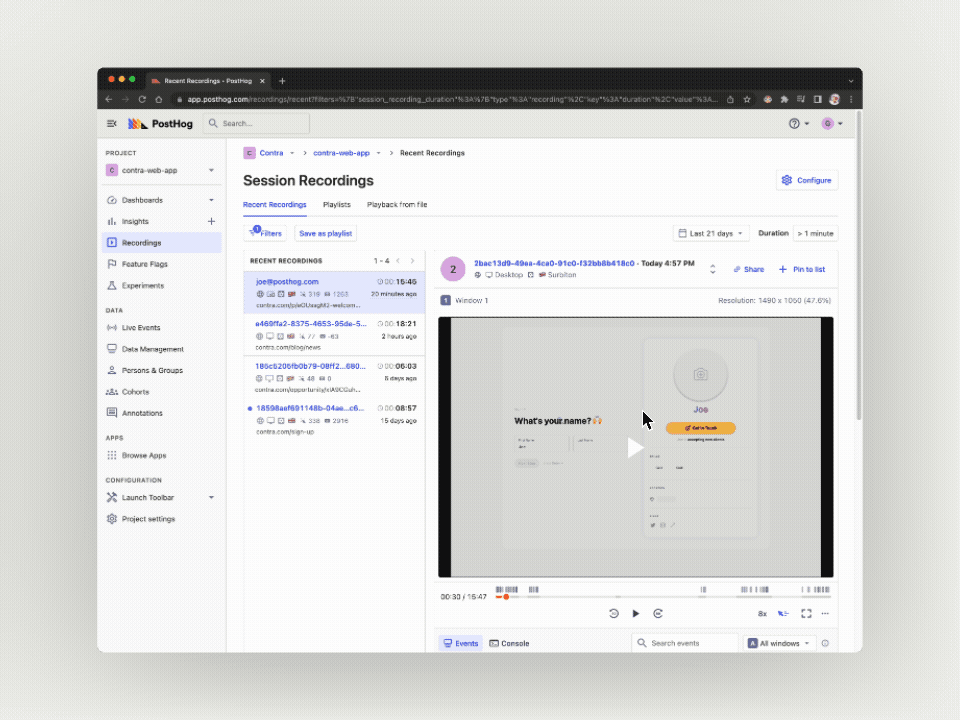

Contra is a freelance marketplace service which empowers its community of independent creatives and engineers to find work that fits the way they want to live. Since 2022 [Contra](http://www.contra.com) has used PostHog Cloud to power many of its engineering and product decisions, though previously the stack was a lot more complex.

“Originally we were using multiple platforms,” said Allison Nulty, Head of Product at Contra. “That meant Mixpanel for analytics, LaunchDarkly for feature flags, Segment for front-end tracking and FullStory for recordings. In isolation they could work well, but they were costly even then.”

As a result of spreading functionality across multiple tools, Contra also faced data inconsistencies. Tools such as Segment were helpful for forwarding data between platforms, but also added to the costs and upkeep required. Eventually, Contra decided to consolidate the stack as much as possible — and that’s where PostHog came in. 

### Using feature flags for a ‘slow roll-out’ strategy

Switching to PostHog enabled Contra to consolidate feature flags, session recordings, product analytics and more into a single tool — but it also enabled the company to come together around a single platform as well. Instead of each team in the company relying on a different software, everyone was able to look at a single source of truth.

<BorderWrapper>
    <Quote
        imageSource="/images/customers/allison.jpg"
        size="md"
        name="Allison Nulty"
        title="Head of Product, Contra "
        quote={`“A real positive has been the ability to talk to the PostHog engineers, to share feedback with them and have it received well. I think how rewarding that open line of communication is when I engage with our users too.”`}
    />
</BorderWrapper>

“Previously the teams all used different tools,” said Allison. “That led to a lot of confusion, because we were onboarding teams to all these different tools and it was clearly creating complexity and leading to inconsistencies… We had issues with LaunchDarkly especially, and feature flags are very important to us.”

Feature flags in particular are important because the engineering team deploys all new product features behind flags and follows a careful ‘slow roll-out’ strategy. All features are first deployed to beta users, then 20% of all users, followed by 50% of all users and finally 100% of all users. Switching feature flags to PostHog enables Contra to continue testing with this method, while also analyzing feature adoption and performance in the same tool. 

### Using session recordings to improve a product

The combination of feature flags and session recordings has been especially powerful for Contra, as it enables product managers to directly observe how user behavior changes between variants. In other instances, session recording alone enables the team to identify where to make improvements. 

<Caption>Using PostHog session recording to analyze user sign-ups</Caption>

“We had a waitlist for one feature,” said Allison. “We weren’t seeing expected results, so we used PostHog to look at the funnel and where people were dropping off. We could jump from there straight to the session recordings and that’s when we saw there was a button missing. That meant we were missing a huge number of sign-ups.”

After noticing the issue, the team made a change and saw an immediate, massive improvement in conversion. Today, 30% of waitlist sign-ups are attributed to this new and improved flow. 

“Adoption has even come at the encouragement of our CEO and co-founder,” said Allison. “We now have cross-functional meetings where we engineers, product managers and designers look at successful and unsuccessful sessions together to identify patterns — and they’re all familiar with the same tool.”

“That ability to consolidate platforms, to not have to onboard teams to six different platforms, to be able to easily connect events and funnels to recordings? It was a real a-ha moment for me!”