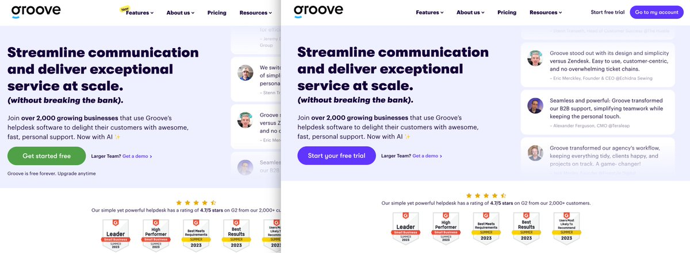

Founded in 2011, [Groove](https://www.groovehq.com/) is a simple yet powerful helpdesk and ticketing platform, and a leading alternative to Zendesk for price-conscious teams. In such a saturated market, serial Founder and [Imperfect Startup](https://www.groovehq.com/helpdesk-software/imperfect-startup) blogger Alex Turnbull knows it’s important to build quickly and build effective, scalable data stacks. So, while Alex had previous experience with [Mixpanel](/blog/posthog-vs-mixpanel), [Hotjar](/blog/posthog-vs-hotjar) and [Google Analytics 4](/blog/posthog-vs-ga4), he began searching for a new solution. 

“I used Mixpanel at a previous startup I founded for years and years, but didn’t feel it scaled well” says Alex. “Obviously I was also looking for a replacement for GA4, so eventually I decided we needed a standardized solution that will grow with us and bring everything into one place. I wanted the software to do its job, basically!”

Another specific aim was to find a tool which could collect Groove’s qualitative and quantitative data in one place, so that usage data could be charted against NPS scores and other metrics — and that’s what led the team to PostHog. 

​​
<Caption>Even simple tests, such as changing the color of a CTA, can have dramatic results. For Groove, a purple button performed 84% better than a green one!</Caption>

## Building an ICP with user surveys and product analytics 

As a team that’s committed to building in public, Groove is obsessive about collecting user feedback through NPS surveys, user interviews and social media conversations. However, Alex also recognizes that listening to user feedback too closely makes it easy to get distracted by noisier users, or for the company to lapse into a reactive stance. 

The solution therefore is to bring users’ anecdotal feedback together with the hard data, adding context and a sense of scale to the user narrative.  

“We are all about the qualitative feedback from customers,” says Alex. “But that’s also what drives us to look at quantitative data too. We want to be able to tie NPS results to different usage metrics, and to cohort certain groups and see which has the biggest NPS, for example.”

Putting information together in this way has enabled the team to develop an incredibly accurate sense of who their users are and how the audience breaks down into different personas. Armed with this understanding, the team has begun experimenting with new positioning statements, onboarding experiences and more.
<BorderWrapper>
<Quote
    imageSource="/images/customers/alex.jpg"
    size="md"
    name="Alex Turnbull"
    title="Founder, Groove"
    quote={`“Our developers loved PostHog the more they got into it. They could see that it was super flexible, and they saw the value in the data stack. All of us are super happy with it!”`}
/>
</BorderWrapper>

## A/B testing new designs, pricing models, and more

“Now that we’ve found our niche we’re able to hypothesize different experiments around the ICP,” says Alex. “We’re running around six or seven experiments right now, and the intent is to keep doing that and seeing how things perform as we scale.”

Using PostHog’s A/B testing platform, Groove runs a wide range of tests across its entire product. These include simple visual tweaks, such as swapping the color of a button, or the H1 on a page, through to testing a freemium pricing model vs. a free trial option.

“The freemium experiment is really interesting because the free trial variant is performing over 75% better,” says Alex. “We’re also testing long form copy against short form copy in our onboarding, and a lead magnet test that runs on our marketing site, as well as five or six other things.”

In this way, each test leaves the team with a better understanding of their customers, and leads them closer to product-market fit — especially when results combine with other elements of PostHog, such as session replays and product analytics. 

“I think that's why our developers wanted to build with PostHog,” says Alex. “It was so developer friendly and it was just a matter of days for us to understand the value and progress through the platform, from surveys, to A/B tests, and replays. Very quickly we saw the holistic package PostHog provides!”

