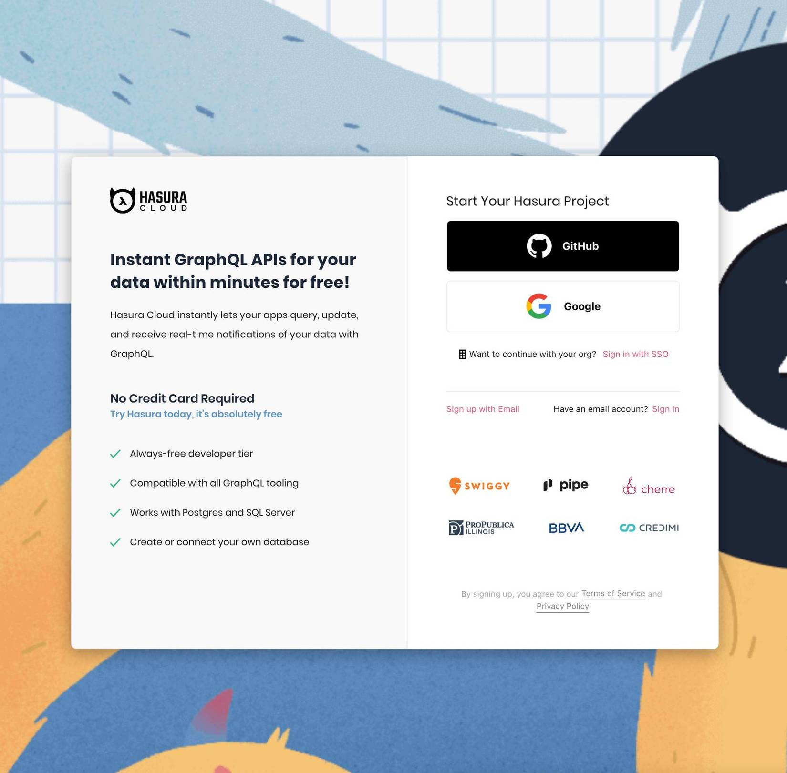

[Hasura](https://hasura.io/) is an open source GraphQL engine which provides instant, realtime GraphQL APIs over PostgreSQL, with webhook triggers and remote schemas for business logic. Since launching in 2018, it’s been adopted by tens of thousands of teams, from hobbyist developers to global companies such as Airbus, Atlassian, and Netlify.

Initially, Hasura used Google Analytics to gather data on how users were interacting with both the cloud product and marketing website. However, a more in-depth view of what users were doing was eventually required, and in 2021, Hasura began using PostHog to collect product insights.

“Google Analytics doesn’t give very detailed information,” said [Anubhuti Mishra](https://www.linkedin.com/in/anubhuti-mishra-868703134/), Hasura’s UI & UX Designer. “It gives a broad overview of the whole site, but in order to get really deep into the data - to see what users are actually clicking, where they are hovering? That’s where PostHog comes in.”

<BorderWrapper>
<Quote
    imageSource="/images/customers/rikin.png"
    size="md"
    name="Rikin Kachhia"
    title="Software Engineer, Hasura"
    quote={`“Like every company, we need to look at conversion funnels. But we also want to use heatmaps, path analysis, and more. PostHog has it all, so is very useful across the board.”`}
/>
</BorderWrapper>

## Improving the onboarding process

With PostHog in place, the team’s first objective was to understand the conversion rate of Hasura’s onboarding process — that is, how many people finished onboarding compared to how many started it. Hasura Software Engineer [Rikin Kachhia](https://www.linkedin.com/in/rikin-kachhia-816b91b8/) used [PostHog’s funnel analysis tools](/product/funnels) to do this, and was then able to go further and quickly identify areas for improvement.

“Using PostHog, we observed drop-offs at very particular stages of our onboarding flows,” said Kachhia. “As a result, we took several actions such as moving these steps further down the funnel. These changes helped us deliver a 10-20% improvement in our conversion rate.”

These insights helped drive other teams to adopt PostHog too. Soon, the UI & UX team were using [PostHog’s session replay tools](/product/session-recording) to identify improvements to the sign-up process.

“One time, I was watching session replays for users on the sign-up page to our cloud product,” said UI/UX Designer Anubhuti Mishra. “I realised a lot of people were trying to click something that wasn’t actually a button — a catchy line which said ‘Try Hasura today’ and which was coloured blue.”

“Blue is one of our brand colours, but here it looked like a hyperlink. We wouldn’t have noticed that needed fixing without PostHog’s session replays.”

## Using analytics to identify changes

Although Hasura began by using PostHog to complement Google Analytics and examine one particular flow, the team is now using the platform much more broadly and collaboratively.

“Initially we were just using PostHog to see if we had some UX problems we may have overlooked,” said Rikin. “But now? We use it across the board, on our blogs, our website… everything.”

“For example, I’m currently using PostHog to look at our top-performing website pages, such as tutorials, blog and pricing pages,” added Anubhuti. “We plan to build a schedule around this so that we are always shifting focus throughout the website and can continue to improve with the help of PostHog.”
