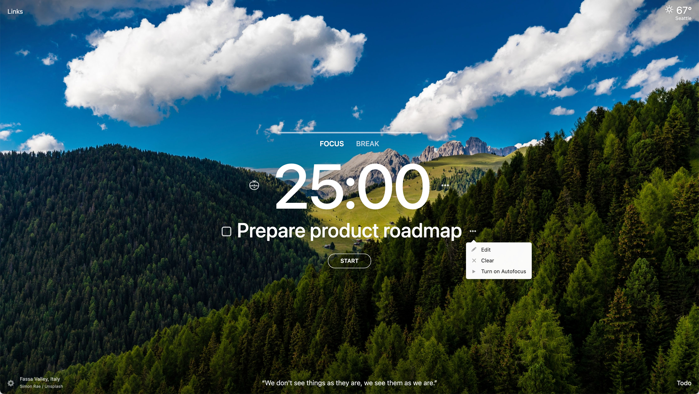

Enjoyed by over 2 million users, [Momentum Dash](https://momentumdash.com/) turns your browsers ‘New Tab’ page into a center for focus so that you become more productive, inspired and purposeful. The team is driven by a desire to build a product that people truly love — and product analytics has provided a strategic advantage in the pursuit of this goal.  

However, when analytics play such an essential role in the business it’s crucial that you’re able to trust the results — and for Momentum Dash that hasn’t always been the case. 

“We used to use [Mixpanel](/blog/why-i-ditched-google-analytics-for-posthog), but it was so extremely expensive that we had to downsample very aggressively,” said Engineering Manager & Tech Lead Joe Trollo. “In turn, the downsampling created artifacts in our reports and we spent a lot of time confirming whether or not they were real”

“Eventually, we were too skeptical of the reports for them to be effective. We were frustrated by the lost time and lack of insights, and started to look for another solution — which thankfully led us to PostHog.”

## A managed ClickHouse service with Altinity
PostHog seemed like the perfect solution for Momentum Dash as the team could self-host in order to keep costs down and retain ownership — and trust — of data. The Engineering team was also familiar with most of the components required to maintain a self-hosted instance, such as Postgres, Redis and Kafka. 

ClickHouse, however, was a complete unknown. In order to make sure everything was deployed correctly, Momentum Dash reached out to ClickHouse experts [Altinity](https://altinity.com/) via the [PostHog Marketplace](https://posthog.com/marketplace) and signed up for [Alinity.Cloud](https://altinity.com/cloud-database/), which provides a fully managed ClickHouse service to backend PostHog. 

“Altinity was extremely helpful and the team was very proactive,” says Joe. “They helped provision a test cluster, diagnose and solve issues and even helped us [materialize some columns](https://posthog.com/blog/clickhouse-materialized-columns) to improve performance.”

“Even now, Atlinity is monitoring our ClickHouse instance for any slow queries and working with PostHog to optimize them.”

<BorderWrapper>
    <Quote
        imageSource="/images/customers/joe_trollo.jpeg"
        size="md"
        name="Joe Trollo"
        title="Engineering Manager & Tech Lead, Momentum Dash"
        quote={`“Right now we're looking at funnels and conversion rates to see what motivates people to sign-up. We're doing experimentation around onboarding too, to teach users about the product.”`}
    />
</BorderWrapper>

## Creating a modern data stack with PostHog
After a short prototyping period in which Altinity helped test development clusters, Momentum Dash made the decision to migrate from Mixpanel to PostHog. The team now ingests over 16 million events into ClickHouse every day and all of it is accessible in PostHog’s open source platform. 

“The fact that PostHog is open source is extremely helpful because we can build on top of it when needed,” said Joe. In fact, the Momentum Dash team has now contributed to PostHog’s codebase several times, developing their own bespoke apps and even improving the way PostHog works with tools such as Confluent.

“Early last year we had done an evaluation because we were encountering problems with Mixpanel. We initially decided to stay with Mixpanel because we didn’t think the landscape had changed. Luckily for us, then PostHog started publishing helm charts!”
