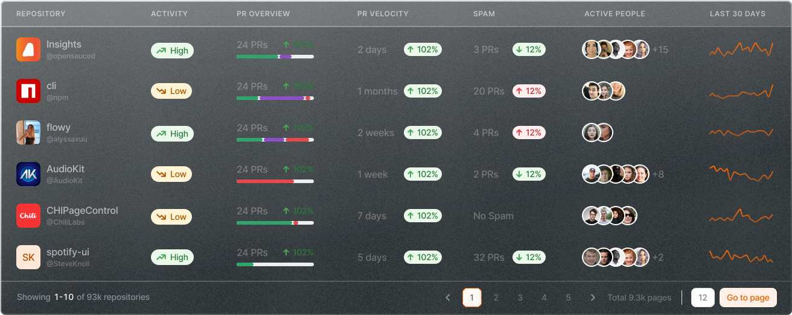

When Brian Douglas left his role as GitHub’s Director of Developer Advocacy in 2022, he knew he wanted to build a platform that would help engineers find and track their open source contributions. He called it [OpenSauced.pizza](https://opensauced.pizza/) and he’d been working on the idea for years in his spare time. 

“I actually added PostHog to OpenSauced even before we started raising money,” says Brian. “That ended up being one of the best things I’d ever done too, because I could track the weekly active users in some of the default insights. It helped me validate the idea even before we started raising and building the team.”

While seeking funding, Brian applied to [PostHog for Startups](/startups) — a program designed to accelerate early-stage teams [toward product-market fit](/blog/product-market-fit-game) as fast as possible. Members receive numerous benefits, including $50,000 in free PostHog credits for the first year (and founder merch too). Armed with this, Brian asked his investor network how he could maximize PostHog’s potential.

“I spoke to Anna Debenham at [boldstart](https://boldstart.vc/) and told her: I’m an engineer, not a product manager,” says Brian. “I explained that we had all this data, but I didn’t know how to slice and dice it. She taught me how to start picking metrics and building insights so we could track things in line with our bottom-up strategy.”

<Caption>OpenSauced joined PostHog for Startups and claimed $50,000 in free credits</Caption>

### PostHog for startups (and designers, and developer relations)

OpenSauced’s investors were incredibly excited to discover the team had implemented PostHog early and could track product and marketing data so easily. Brian and Anna quickly identified key metrics to guide them toward product-market fit.

“One of the coolest things Anna did was help us understand that the time it takes to customize a profile is really important,” says Brian. “We started tracking the conversion from signup to adding more profile info, like a bio. We found 68% of people will expand their bio, which then leads them to explore further.”

Now, a few months later, it’s not just Brian and Anna using PostHog’s analytics tools. 

“Even our designer is in PostHog,” Brian explains. “She’s using PostHog to triage tickets and collect feedback on designs when they go live, so we can be smart about the changes we make and track the results every time we implement a change.”

OpenSauced’s developer relations manager also uses PostHog to track website engagement, user paths, and to see which blog posts are successful. Tools such as PostHog’s [dashboard templates](/templates) make it easy to see what content performs well, when.

“I even have a person on my cap table who has a product background and is asking if they can use PostHog to help with our roadmap,” Brian adds.

<BorderWrapper>
<Quote
    imageSource="/images/customers/anna.jpg"
    size="md"
    name="Anna Debenham"
    title="Operating Partner, Boldstart"
    quote={`“PostHog is ideal for startups. It is a really solid analytics tool, but features like feature flags and experiments become even more useful as the company grows. It saves founders like Brian time, as they have the right tools from day one.”`}
/>
</BorderWrapper>

### Moving from minimum viable product, to product-market fit

PostHog for Startups has helped OpenSauced towards product-market fit, but even with VC funding and a growing user base the journey isn’t over. The team still has a year of PostHog credit to use!

“Next we’re going to look at the different types of users we have,” says Brian, who explains that open source projects have many different types of users engaged with them. “There are contributors, but there are also maintainers, who are the influencers in our niche. Our growth hinges on identifying these influencers in PostHog.”

The team also plans to take advantage of other PostHog features, such as surveys, session replays, and feature flags. 

“I’ve introduced the team to feature flags and we’ll use them to start releasing features soon,” says Brian. “Then we’ll look at session replays and how we can use that to get feedback to the team, make sure we’re shipping the right things…we’re trying to become more strategic about how we ship code and how we polish the product.” 

“There’s just so many things that are possible for us right now, the possibilities are endless — but PostHog is definitely helping us find a path.”

