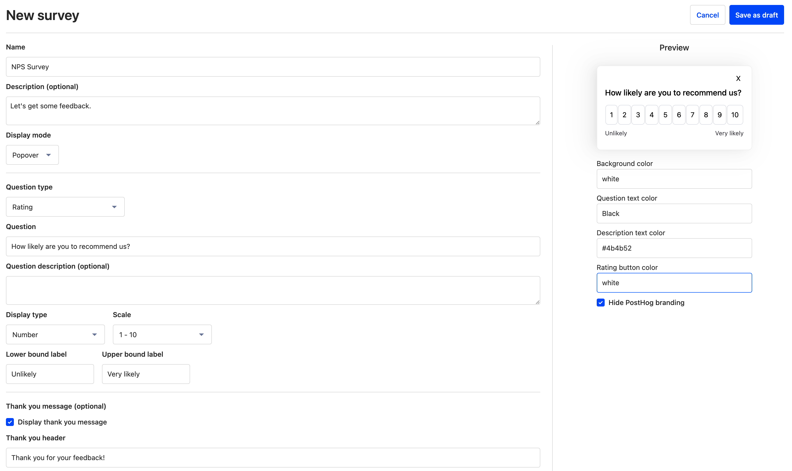

[Purple Wave](https://www.purplewave.com/) is the world’s leading two-way marketplace for heavy duty equipment, such as construction and agriculture fleets. The team of 220 people maintains a platform trusted by 4.75m annual visitors, with more than 150 fleet-scale auctions each year. 

Now, the team plans to 3x that growth — something it can only do by adopting more scalable systems for collecting and handling user feedback about the platform. 

“Previously a lot of teams operated on gut decisions and intuition,” says Purple Wave’s Product Owner, Matt Amick. “We had data, but it wasn’t mobilized well because it was accessed through Tableau, which isn’t the easiest to use. We started looking around for something that could help us make decisions based on data — and that’s when we found PostHog!”

“A lot of the other companies we spoke to were using tools like [Amplitude](/blog/posthog-vs-amplitude), but they all said they try to get you in and then charge you a million dollars once you’re set up... Our team is all about just being honest and not hiding stuff, so we preferred PostHog.”

Purple Wave began using many PostHog features, including [analytics](/product-analytics), [flags](/feature-flags), and [replays](/session-replay) — and when user surveys launched in their first beta state, the team adopted that too.

<BorderWrapper>
<Quote
    imageSource="/images/customers/purplewave_matt.jpg"
    size="md"
    name="Matt Amick"
    title="Product Owner, Purple Wave"
    quote={`“I love everything about PostHog from the design to the culture, just everything. When the team launched the surveys beta and we could make no-code surveys and have everything in one place too? That was just phenomenal.”`}
/>
</BorderWrapper>

### How Purple Wave reached a 25% response rate for user surveys

Before switching to PostHog, Purple Wave had previously attempted to solicit feedback over email using other tools. Response rates were poor, leading the team to consider more innovative ways to collect feedback. 

“We were only getting a 14% response rate on NPS surveys previously,” says Matt. “So, I ran a test with in-app surveys using PostHog. I was still able to target identified users, and the response rate jumped to 25% — almost twice as good!”

Conducting surveys with PostHog also enabled Purple Wave to centralize data into a single platform. Responses could be analyzed using insights, linked to feature flags, or observed with session replays — all in one place. 

“I really hate having to switch between separate software,” says Matt. “I want it all in one platform so it’s easy to access. Ultimately everything comes back to the [data warehouse](/docs/data-warehouse). You have to have your data centralized in order to use it effectively.” 

<Caption>Every element of a survey can be customized in PostHog, without using any code</Caption>

### Collecting NPS scores, organizing interviews, and more

Armed with PostHog’s surveys, Purple Wave is now able to collect all the information it needs to build better products. The team uses the full range of question types to collect NPS scores, monitor satisfaction, and more, and even customizes each survey to appear consistently and only target relevant users.  

“We have about 50 people using PostHog now so being able to launch no-code surveys is just phenomenal,” says Matt. “I don’t want to have to use any code for surveys, so having the customization options and the granularity of targeting options is just great. Really simple, really easy.”

Matt’s team also uses [the Link question type](/docs/surveys/new) in PostHog surveys to arrange interviews with users by directing them to a page where they can book a call. In this way, the team can collect more detailed feedback from specific power users they target using feature flags and events.

“Sometimes I’ll reach out to users too based on their survey responses,” says Matt. “It’s a core part of our feature release process now to send surveys at different times and follow-up. We’re standardizing that process across the company to make sure we can be granular and make good decisions with the data we have, all in one place.”
