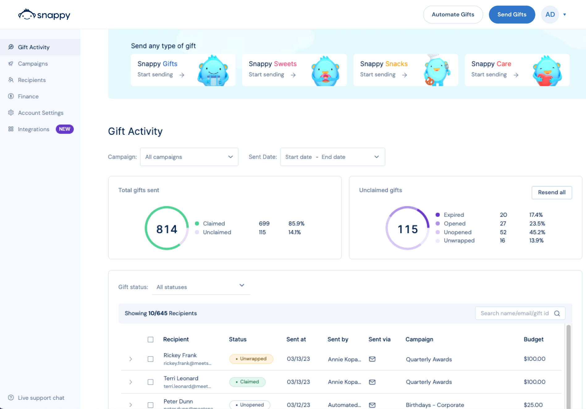

Snappy is an employee and customer giving platform. In early 2023, it faced a problem familiar to most fast-growing startups — teams had chosen their own tools and data had become fragmented across many different products and disciplines. 

Feature flags, for example, were overseen by the product team yet managed in LaunchDarkly by the engineering team. Surveys were housed in UserSnap; product data was siloed in Amplitude, and the B2B and B2C teams had different processes for analysis and session replays. 

“We had a lot of different tools used by different people,” admits Tomer Kulla, Snappy’s Director of R&D. “It used to be that whenever we wanted to change a feature flag the product managers would have to ask the engineers. We had a lot of problems making sure the data streamed correctly to the other products, which meant some teams didn’t have very good data at all.”

In addition to thwarting collaboration and frustrating any attempt to be data-led, spreading control and data over so many platforms was also prohibitively expensive. 

“Cost reduction was another focus,” says Tomer. “FullStory is great, but it was one of the most expensive pieces of software we used in the whole company.”

Ultimately, Tomer decided it was time to address the problem so that Snappy, which is trusted by organizations such as Amazon, Microsoft, Meta, and Uber could continue to grow quickly, and decisively.

<Caption>Snappy replaced LaunchDarkly, Amplitude, FullStory, UserSnap, Segment and more with PostHog</Caption>

### Reducing costs by replacing LaunchDarkly and FullStory

In early 2023, Tomer discovered PostHog through Y Combinator and realized it could singlehandedly replace FullStory, LaunchDarkly, Amplitude, UserSnap _and_ Segment all at once. 

“I’m a huge fan of [Y Combinator](/customers/ycombinator) and I usually go over all the startups which get accepted,” says Tomer. “That’s how I found PostHog and, from my background as a data engineer, I just saw how much sense PostHog made for putting everything in one place.”

Best of all, because PostHog has transparent usage-based pricing, customizable billing limits and a generous free allowance, switching would also reduce costs. 

“It’s more cost-effective for us to use PostHog than all of these tools together,” says Tomer. “Plus, PostHog continues to get more powerful. The [survey tool](/docs/surveys), for example? It’s pretty new, but we can use that now instead of Usersnap.”

Consolidation has also offered other benefits for Snappy, such as streamlining the way teams can roll out new features and helping teams to discover new product insights. 

“It was pretty difficult to implement other tools and work with events across LaunchDarkly, Amplitude, etc.,” says Tomer. “Our B2B team never fully completed their implementation because of this, so basically that entire product team was navigating without dashboards or data — just recordings from FullStory.”

“Now, with PostHog, they’ve discovered lots of new stuff and can make better product decisions thanks to all these extra capabilities.”

<BorderWrapper>
<Quote
    imageSource="/images/customers/tomer.jpg"
    size="md"
    name="Tomer Kulla"
    title="Director of R&D, Snappy"
    quote={`“PostHog has been a great success for us. Everybody is using it, everybody is enjoying it, and generally we have everything integrated a lot more smoothly and a lot more data capabilities.”`}
/>
</BorderWrapper>

### Improving organization and data capabilities by replacing Segment

With PostHog fully deployed, Snappy now has all of its teams on a single platform where they can manage feature flags, create insights, watch session replays, send surveys, and more.

“We basically have everything in PostHog now,” says Tomer. “The most important benefit is we now have a reliable funnel of every product on both the B2B and B2C side. We can monitor every step of that funnel closely and, every time we release a new feature, we create a dedicated dashboard for a deep dive. It’s a massive improvement.”

Snappy has even managed to replace its CDP tool, Segment, with PostHog — reducing costs even further and simplifying its stack significantly. 

“We’re a lot more organized generally in our data capabilities now and everything is integrated together very smoothly,” says Tomer. “We now just export directly from PostHog to BigQuery, which is good for us, and we can see all of our events in the data management tab…everything is more consistent because it isn’t forwarded over from another platform.”

“Honestly, I’m just a huge fan of PostHog. I really enjoy using it and so far I think it’s a huge success story for everyone here at Snappy.”
