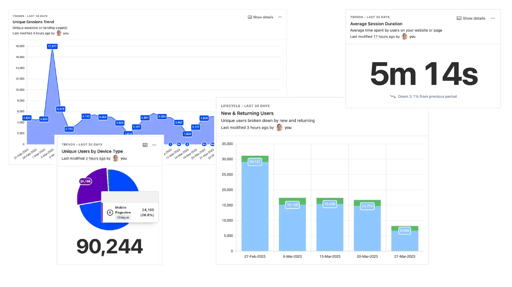

A team of engineers founded Speakeasy with a mission to enhance how engineers create and maintain their APIs. Dozens of teams, including Airbyte and Motion, now trust [Speakeasy](https://speakeasyapi.dev/) to provide everything engineers need to work with APIs: from native-language SDKs and AI-powered maintenance tools to world-class reference docs.

Internally, the team relies on PostHog for both product development and marketing activities, a practice they've maintained since the early days.

"At the beginning, we were trying to define our entire product operating system," says Nolan Sullivan, Speakeasy's founding developer relations expert. "We chose PostHog because it's open-source, and we really liked its appearance. Initially, we used the (now [sunset](/blog/sunsetting-helm-support-posthog)) self-hosted version, but later switched to the cloud version."

"The reason for the switch was that I wanted to use some features unavailable on the self-hosted version," Sullivan continues. "Transitioning to PostHog Cloud to access new features has been fantastic, especially for tracking marketing metrics."

<Caption>PostHog's dashboard templates helped Speakeasy replicate Google Analytics with ease</Caption>

### Replicating Google Analytics with PostHog Dashboard Templates
By moving to the cloud and deploying PostHog on both their core product and marketing site, Speakeasy can track website traffic and marketing metrics as well as product interactions. This combined approach offers a transparent view of conversion rates and user paths, without requiring extra setup time.

"One feature of PostHog I love is the dashboard templates," Nolan says. "I wanted to recreate a Google Analytics dashboard for our marketing efforts but didn't have the time to set up everything the way I wanted. The templates got me 80% of the way there with just a few clicks."

PostHog's dashboard templates, created during our [Aruba hackathon](/blog/aruba-hackathon), cover more than just website metrics. They also offer [templates for tracking AARRR funnels](/templates), retention, and more.

"I'd recommend the dashboard templates to anyone starting with PostHog," Nolan advises. "If you make setting up the initial event capture a team activity and carefully consider the custom events you track, the dashboards will provide a strong foundation for success."

<BorderWrapper>
<Quote
    imageSource="/images/customers/speakeasy-nolan.jpg"
    size="md"
    name="Nolan Sullivan"
    title="Founding Developer Relations Lead, Speakeasy"
    quote={`“I love that PostHog is an all-in-one tool, with all the features of LaunchDarkly and all those other enterprise platforms. It is just so nice not having to go into multiple UIs to make changes and manage things.”`}
/>
</BorderWrapper>

### Improving onboarding and feature roll-out with flags
Speakeasy also employs PostHog within its product. At the time of our conversation, Nolan and his team were actively refining their product's onboarding process, using insights directly from PostHog.

"We’re revamping our onboarding process because the product has changed significantly over the past four months," Nolan explains. "We started with a hypothesis that users weren't progressing through the funnel due to an unfriendly first stage of onboarding. We had all assumed this was the case for months, but a new funnel I built in PostHog proved us wrong!"

"Seeing that data was incredibly useful and made us realize the actual drop-off began at the signup page," Nolan adds. "As a result, we’re now testing changes to that page based on insights from PostHog."

Being a developer-led team, Speakeasy naturally incorporates feature flags into their change management strategy.

"We have alpha features that we want to keep hidden, so we use PostHog's feature flags to control access and roll out changes," Nolan states. "The integrated insights and feature flags help us monitor how users with specific flags enabled are using features, all from a single UI as we implement changes."

"In all honesty, I love that PostHog offers all these functionalities. It has all the features of LaunchDarkly and [Amplitude](/blog/posthog-vs-amplitude), but in one tool!"

