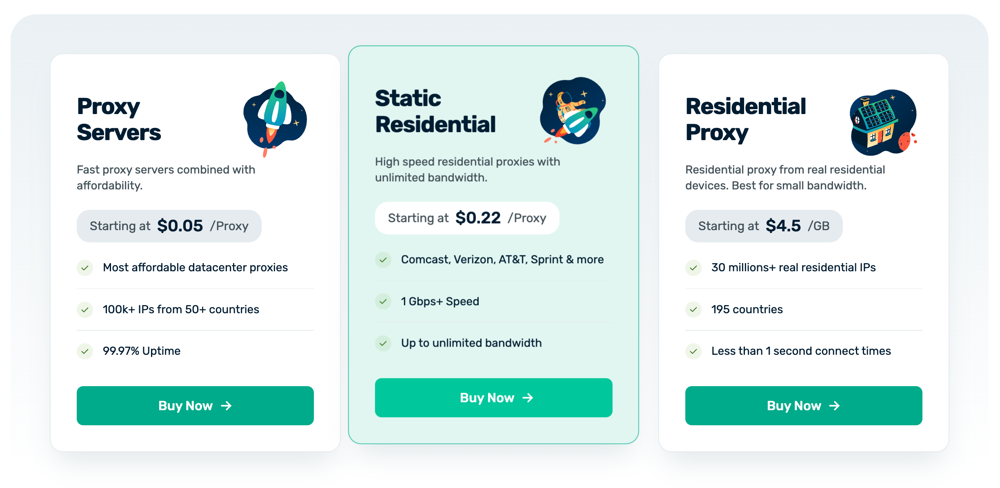

[Webshare](https://www.webshare.io/homepage) is a leading proxy server provider, enabling more than 100,000 users to connect using high-speed proxies in over 50 countries. 

Originally founded in 2018 by Utku Zihnioglu, Webshare has grown explosively. It now serves over 250bn proxy requests each month, but it retains the experimental, data-led approach it had in the early days. 

“We have all our funnels nailed down, but we’re constantly running experiments on top of them,” says Utku, Webshare’s founder and CEO. “We’re really passionate about testing new ideas to get customers the best product we can.”

In the early days, the team used a mix of tools to facilitate this customer-centric approach – Mixpanel for analytics, Hotjar for session replays, plus a handful of internal tools to fill the gaps left by these platforms. 

“We had to build our own tools for feature flags, because Mixpanel doesn’t do that,” says Utku. “We were using FullStory too... but we started looking for a replacement in 2021 because those tools just weren’t working for us anymore.”

“That’s when we found PostHog, and realized it does everything we needed all at once, including feature flags!”

<Caption>Adding the 'Buy Now' call to action and adjusting the text enabled Webshare to boost converstion by 26%</Caption>

### How Webshare increased conversion rates by 26% with experiments

Since 2021, Webshare has used PostHog to provide many of the tools they had previously fragmented across multiple platforms, such as Mixpanel and Hotjar. The team uses PostHog for analytics, session replays, feature flags, and A/B experiments – especially experiments. 

“We’re running about 20 experiments at any moment,” says Utku. “We test every change with an experiment because sometimes it’s the small, ridiculous things which increase conversion rates. Just moving a button from the left to the right, or tweaking the call to action, can increase conversion by 4-5%.”

Experiments the team have tried include adding explainer videos to the homepage to test the effect on sign-ups, and adding new payment methods to study impact on LTV. 

“The most successful experiment we did in the last two months involved add ‘Buy Now’ CTAs to pricing cards on our homepage,” says Utku. “We used to have the price in the CTA instead, but adding that text improved conversion rates by 26%, which is ridiculous. Normally you see only a 5% change!”

<BorderWrapper>
<Quote
    imageSource="/images/customers/utku.jpg"
    size="md"
    name="Utku Zihnioglu"
    title="Founder & CEO, Webshare "
    quote={`“We saw PostHog, and saw that it does everything that we needed, and had all these syncing capabilities too. We just knew right away that it was the right tool for us. We started using all of its capabilities.”`}
/>
</BorderWrapper>

### A single source of truth: building a data warehouse within PostHog

However, Webshare doesn’t just use PostHog to run experiments and track product data – teams also forward other data to it from other platforms too. In effect PostHog has become Webshare’s data warehouse, holding all information the company has and enabling analysis of it in one place. 

“Every email, every Intercom message – basically every time we interact with a customer on any platform – that all goes into PostHog,” says Utku. “We track all of our KPIs there, as well as product usage, conversion rates, marketing campaigns, and so on.” 

The team does, reluctantly, maintain a [Google Analytics](/blog/ga4-alternatives) account alongside PostHog, but it’s used only for tracking advertising performance. All other data can, and is, sent to PostHog so the team can track it there. 

“That’s why PostHog is our favorite tool; it’s the single source of truth for us. We knew exactly what we wanted to do when we were coming from Mixpanel and Hotjar. We wanted to move away from all these separate tools, and put everything in one place. PostHog absolutely nails is.”

