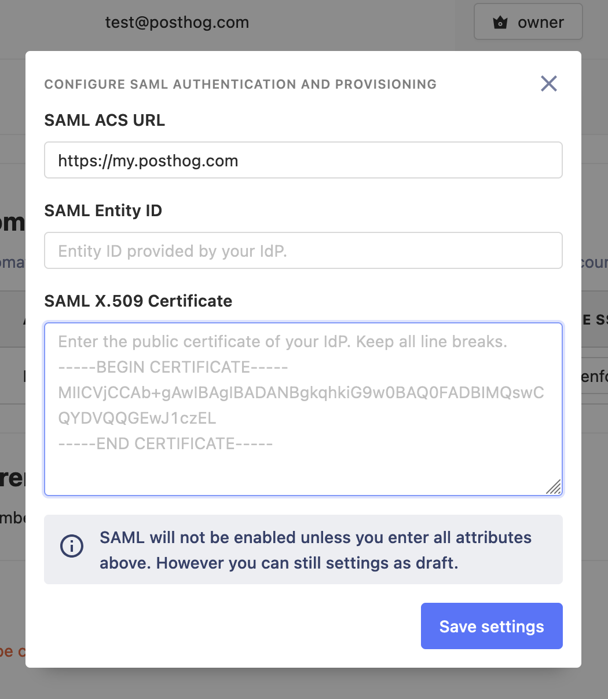

SSO makes loggin in easier for users to log and compliance easier for administrators.

We also allow support just-in-time provisioning of users, which means that team members can self-serve creating their account self-serve, while still enforcing log in through a specified SSO provider. 

Some SSO features are add ons. Please review each section below for details.

## Authentication domains

SSO configuration mostly occurs in your Organization settings and is based on authentication domains. You need to have a verified authentication domain in order to set Just-in-time provisioning, SSO enforcement and [SAML](#saml) configuration.

Authentication domains need to be verified if you are on PostHog Cloud.

To add an Authentication domain, go to your [Organization settings](https://us.posthog.com/settings/organization-authentication).

Authentication domains must be verified in PostHog Cloud. We do this through DNS verification. You will have to add a `TXT` record to your DNS zone with a specific value to prove you have authority over the domain. Verification only needs to be done once, but **the record must be kept at all times,** as we do periodic DNS verification.

Adding a `TXT` record depends on your DNS provider (e.g. Cloudflare, Google Domains, ...) and your provider should provide simple instructions on how to add the required record. The record should look as follows:

1. Select **TXT** for the record type.

2. The Name/Host/Alias field should be `_posthog-challenge.yourdomain.com.` where `yourdomain.com` is your actual domain name. Some DNS providers may require the dot in the end or not, and some providers may auto-populate your domain name.

3. The value of the record is provided in the domain verification screen (e.g. `lRk16Vtg7PJdcltYlCPq07vd7vwu7t`)

4. The time-to-live (TTL) should be the default or `3600`.

## Just-in-time user provisioning

<FeatureAvailability availability={_frontmatter.availability.features.jitUserProvisioning} />

Just-in-time user provisioning creates a new account whenever a first-time user logs in using any available SSO provider and an email address that matches your verified domain. PostHog Cloud supports GitHub, GitLab, Google, and SAML if you have configured it.

To enable just-in-time user provisioning, navigate to Authentication domains in your Organization settings and use the 'Enable automatic provisioning' toggle.

## SSO enforcement

<FeatureAvailability availability={_frontmatter.availability.features.ssoEnforcement} />

You may want to force users log in and/or sign up to your organization using a specific SSO provider. 

When SSO enforcement is enabled, users cannot:

1. Log in using a password
2. Request password resets
3. Use any SSO provider other than the one specified

This applies to administrators and organization owners, too. Please be sure your SSO configuration works correctly before enabling this.

If you enable SSO enforcement for a particular domain, any user who signs up or logs in with an email address on that domain will be required to use the SSO provider you enforced. This applies to existing users too and users not in your organization.

You can enable SSO enforcement through Authentication domains in your Organization settings.

## Third-party providers

PostHog currently supports GitHub, GitLab and Google as SSO providers. All providers are available and readily configured on PostHog Cloud.

This section contains instructions on how to configure each provider in your self-hosted instance. All the providers in this section (i.e. everything except SAML) is **configured instance-based**. SAML is configured domain-based.

Looking for a provider that's not here? [Reach out to us](https://posthog.com/support), we might be able to help.

<blockquote>
    Please note that you will <b>not</b> be able to use SSO with the first user of your instance. You will have to
    create a user with a regular password and you will later be able to log in with SSO (even for that first user).
</blockquote>

### GitHub

<FeatureAvailability availability={_frontmatter.availability.features.github} />

1. Go to <a href='https://github.com/settings/applications/new' target='_blank'>Register a new OAuth application</a>

> If you want to have this application as part of an organisation, you'll need to go to your organization's settings -> OAuth apps -> New OAuth App.

2. Register your application

    - `Homepage URL` needs to be the url of your PostHog instance
    - `Autherization callback URL` needs to be the url of your PostHog instance + `/complete/github/`

3. Find your `Client ID` and `Client Secret`

4. Add those two settings as `SOCIAL_AUTH_GITHUB_KEY` and `SOCIAL_AUTH_GITHUB_SECRET` and restart your server.

5. When logging in, or signing up to a team you can now log in using PostHog!

> We don't support logging in with GitHub when setting up PostHog for the very first time.

### GitLab

<FeatureAvailability availability={_frontmatter.availability.features.gitlab} />

1. Go to `Settings -> Applications` in your GitLab instance (<a href='https://gitlab.com/profile/applications' target='_blank'>click here for GitLab.com</a>)

2. Register your application

    - Redirect URI needs to be the url of your PostHog instance + `/complete/gitlab/`
    - Tick `read_user` as scope.

3. Find your `Application ID` and `Secret`

4. Add those two settings as `SOCIAL_AUTH_GITLAB_KEY` and `SOCIAL_AUTH_GITLAB_SECRET`. If you're hosting GitLab yourself you'll also need to add `SOCIAL_AUTH_GITLAB_API_URL`, which is the full URL to your GitLab instance.

### Google

<FeatureAvailability availability={_frontmatter.availability.features.google} />

To set up Google SSO please follow these instructions:

1. Go to the "Google Developer Console" at <a href="https://console.cloud.google.com/apis/dashboard" target="_blank" rel="noopener noreferrer">https://console.cloud.google.com/apis/dashboard</a>. Be sure to select the proper Google account and the right project for your app (or create one if you don't have it).

2. Navigate to the [Credentials](https://console.cloud.google.com/projectselector2/apis/credentials) section.

3. Click on "Create credentials" and select "OAuth client ID" to generate your credentials.
    - On Application Type select "Web application" and enter a meaningful name (e.g. PostHog Self-hosted).
    - On the "Authorized JavaScript origins" section add the root domain (with protocol) for your PostHog instance (e.g. `https://us.posthog.com`)
    - On the "Authorized redirect URIs" section add the following URI (**replace with your hostname**): `https://{hostname}/complete/google-oauth2/`.
    - Click on Save.

4. You will now get a "Client ID" and "Client secret". Set those as [environment variables](/docs/self-host/configure/environment-variables) `SOCIAL_AUTH_GOOGLE_OAUTH2_KEY` and `SOCIAL_AUTH_GOOGLE_OAUTH2_SECRET` respectively.

5. **Additional**. If this is your first time setting SSO for this project, you may need to set up some additional configuration for your OAuth Consent Screen. We **highly recommend you only enable internal access** (if it makes sense for you), as it'll make things more secure and the verification process faster. Check out <a href="https://support.google.com/cloud/answer/10311615" target="_blank" rel="noopener noreferrer">Google's official docs</a> to learn more.

## SAML

<FeatureAvailability availability={_frontmatter.availability.features.saml} />

SAML (Security Assertion Markup Language) enables users to have a single set of credentials to access multiple systems. It also has the benefits of centralizing user management to aid maintenance. If your company has an Identity Provider (IdP) that uses SAML, you can integrate it with PostHog (Service Provider, SP) so your users can authenticate through your SAML portal instead of having an additional password for PostHog.

PostHog supports multi-tenant SAML, which means you can have multiple SAML authentication servers within a single instance and even a single organization. The limitation is that you can only have one SAML provider per domain. So for instance, users with email address at `example.com` can log in with SAML provider A and users with email address at `anotherdomain.net` can use SAML provider B.

> If you are self-hosting, please be sure to update PostHog to version 1.35.0+. Before this version, SAML used to work instance-based with environment variables and this behavior is fully deprecated.

### Warnings

When using SAML to authenticate your users in PostHog there are a few considerations to keep in mind. Please make sure to read them to avoid any security issues.

1. **Only use SAML with identity providers that validate the user's email address** or in a context where you control a user's email address. When first logging in, we use the email address that the IdP passes to associate with a user. If a user can spoof their email address with your IdP, they'll be able to impersonate your users.

2. Enabling or enforcing **SAML login will not disable Personal API Key usage**. This means that even users can always create a Personal API Key and use it instead of SAML authentication (API-only, not for the app).

3. Our SAML integration only handles authentication and automatic user provisioning. If you remove a user from your IdP, their account will not be removed or disabled from PostHog, they might just be unable to log in (depending on your configuration).

4. When you enable or enforce SAML, any existing user passwords are preserved. This means if you ever want to go back (or something breaks down with your authentication), you can just stop enforcing SAML and you'll be able to log in with your existing credentials.

### Setting up SAML

For SAML to work your IdP and PostHog (SP) need to exchange information. To do this, you need to configure some settings in your IdP and on PostHog. Depending on your IdP you might need to pass PostHog information first, or the other way around. We provide complete examples for OneLogin and Okta below, but the general flow is:

1. If you are on self-hosted, make sure you have properly set up your `SITE_URL` [environment variable][env-vars] configuration.

2. If you are on self-hosted, you will need to be running your PostHog instance over TLS.

3. Register a new SAML 2.0 application with your IdP. If you need to pass PostHog's information to your provider first, set the following values below (alternatively if your IdP supports it, you can obtain our XML metadata from `<yourdomain>/api/saml/metadata/`)
    - **Single Sign On URL** (also called ACS Consumer URL): `<yourdomain>/complete/saml/` or `https://us.posthog.com/complete/saml/` for PostHog Cloud US or `https://eu.posthog.com/complete/saml/` for PostHog Cloud EU.
    - **Audience or Entity ID**: _Your Site URL_ value (verbatim), on PostHog Cloud this is `https://us.posthog.com` or `https://eu.posthog.com`
    - **RelayState**: On PostHog cloud, get your RelayState value from the SAML configuration modal in your PostHog Organization settings. For self hosted, _empty or default_ (will be set on every request).

4. For SAML to work properly with PostHog, we need to receive at least the following information from your IdP in the SAML assertion payload: ID, email and first name. Optionally, you can also pass the last name. By default, PostHog expects these attributes with a certain name.

<table>
    <tr>
        <td>Attribute</td>
        <td>Default name on PostHog</td>
        <td>Optional?</td>
    </tr>
    <tr>
        <td>Permanent ID</td>
        <td>
            <code>name_id</code>
        </td>
        <td>❌ No</td>
    </tr>
    <tr>
        <td>Email</td>
        <td>
            <code>email</code>
        </td>
        <td>❌ No</td>
    </tr>
    <tr>
        <td>First (Given) Name</td>
        <td>
            <code>first_name</code>
        </td>
        <td>❌ No</td>
    </tr>
    <tr>
        <td>Last Name (Surname)</td>
        <td>
            <code>last_name</code>
        </td>
        <td>✅ Yes</td>
    </tr>
</table>

3. You will now need to obtain some parameters from your IdP and configure them in PostHog for the appropriate domain in Authentication domains. Depending on your provider, they may only provide this information as an XML metadata file. If this is the case, you can open the file in a text editor and obtain the required values from there.

    - **SAML Entity ID**: Will be identified as EntityID or IdP issuer. This can vary greatly between providers, but it usually looks like a URL.
      - If using Azure AD the setting to use for this field is called `Azure AD Identifier`.
    - **SAML ACS URL**: The endpoint to which the SAML requests are posted. It's usually called SAML endpoint or IdP sign-on URL.
    - **SAML X.509 certificate**: The public certificate used to validate SAML assertions from your IdP. It must be in X509 (almost all providers will provide it in this format). If your provider gives you the certificate as a file (usually `.pem`), just open it with a text editor to get the contents. When setting this certificate be sure to **keep any spaces and new lines** (don't format it). The first and last line of the certificate (e.g. `-----BEGIN CERTIFICATE-----`) are optional.

    

4. Once you've configured all the settings above, you can now log out and attempt logging in using SAML (you just need to enter your email address).

5. For security reasons, we don't output errors directly in your browser when something goes wrong. If you need help debugging on PostHog cloud, please contact support and provide the error ID that is shown at the bottom of the error page. To debug your self-hosted configuration, you have two options:
    - **Recommended**. Check your app logs (this varies depending on your deployment). Any errors will be logged there.
    - If everything else fails, **temporarily** set environment variable `DEBUG=1`, errors will be fully displayed now in the browser. **Please be sure to remove this once you're done, ugly things can happen if you don't.**

### Example: OneLogin

#### OneLogin quick setup

You can quickly connect OneLogin and PostHog by using the prebuilt integration.

1. In OneLogin admin, go to Applications and click on "Add App". Search for "PostHog" and create your app.

2. Go to the "Configuration" tab and where it says "PostHog domain name" enter your PostHog's instance domain (as it's also specified in the `SITE_URL` [environment variable][env-vars]), **but don't include any protocol or trailing slashes.** Examples: `playground.posthog.com`, `myposthog.mydomain.com`, `myposthogdomain.com`.

3. Go to the "SSO" tab. This is where you'll obtain the information you need to pass to PostHog.
    - "Issuer URL" needs to be set as SAML Entity ID.
    - "SAML 2.0 Endpoint (HTTP)" needs to be set as SAML ACS URL.
    - On "X.509 Certificate" click on "View Details". Copy the full certificate and set it as SAML X.509 certificate.

4. You're good to go! Click on the "Login with SSO" in PostHog's login page.

#### OneLogin advanced

Use this option if you want to add additional configurations to your app that are not supported with the default app catalog.

1. In OneLogin admin, go to Applications and click on "Add App".

2. Search for "SAML" and select "SAML Custom Connector (Advanced)". Set name to "PostHog".

3. Go to the "Configuration" tab and edit the following attributes (leave everything else as default)
    - Audience (EntityID): enter `https://us.posthog.com`.
      - If you are using our EU deployment, use `https://eu.posthog.com`.
      - If you are self-hosting, enter the exact same value as your `SITE_URL` [environment variable][env-vars].
    - ACS (Consumer) URL Validator: Set to a regex that only matches `<yourdomain>/complete/saml/`. For instance: `^https:\/\/us.posthog.com\/complete\/saml\/$` (or use `eu` for an EU instance)
    - ACS (Consumer) URL: Set to `https://us.posthog.com/complete/saml/`.
      - If you are using our EU deployment, use `https://eu.posthog.com/complete/saml/`.
      - If you are self-hosting, use `<yourdomain>/complete/saml/`.

4. Go to the "Parameters" tab. You will add the following parameters. **Be sure to check "Include in SAML assertion"**.
    - `email` to match the user's email ("Email")
    - `first_name` to match the user's first name ("First Name")
    - `last_name` to match the user's last name ("Last Name")

5. Go to the "SSO" tab. This is where you'll obtain the information you need to pass to PostHog.
    - "Issuer URL" needs to be set as SAML Entity ID.
    - "SAML 2.0 Endpoint (HTTP)" needs to be set as SAML ACS URL.
    - On "X.509 Certificate" click on "View Details". Copy the full certificate, removing the first and last lines and set it as SAML X.509 certificate.

6. You're good to go! Click on "Login with SSO" in the login page.

### Example: Okta

1. In Okta admin, go to Applications and click on "Create App Integration".

2. Select the "SAML 2.0" option. In the next step, set "PostHog" as the name.

3. Fill in the following attributes in the SAML settings. Do not click next yet.
    - In "Single sign on URL" enter `https://us.posthog.com/complete/saml/`.
      - If you are using our EU deployment, use `https://eu.posthog.com/complete/saml/`.
      - If you are self-hosting, use `<yourdomain>/complete/saml/`.
    - In "Audience URI (SP Entity ID)" enter `https://us.posthog.com`.
      - If you are using our EU deployment, use `https://eu.posthog.com`.
      - If you are self-hosting, enter the exact same value as your `SITE_URL` environment variable.
4. In the Default Relay State field, enter the RelayState value you obtain from your [PostHog Organization Settings page](https://us.posthog.com/organization/settings) in the SAML configuration modal.

5. In the "Attribute Statements" section, add the following attributes:
    - `email` with value `user.email`
    - `first_name` with value `user.firstName`
    - `last_name` with value `user.lastName`
    - Permanent ID is not required as Okta sends this automatically.

6. In the final step select the option "I'm an Okta customer adding an internal app".

7. Navigate now to the "Sign On" tab of the application and click on "View Setup Instructions". This is where you'll obtain the information you need to pass to PostHog.
    - "Identity Provider Single Sign-on URL" needs to be set as SAML ACS URL.
    - "Identity Provider Issuer" needs to be set as SAML Entity ID (use the complete URL).
    - "X.509 Certificate" needs to be set as SAML X.509 certificate.
    
8. You're good to go! Click on "Login with SSO" in the login page.

[env-vars]: /docs/self-host/configure/environment-variables
