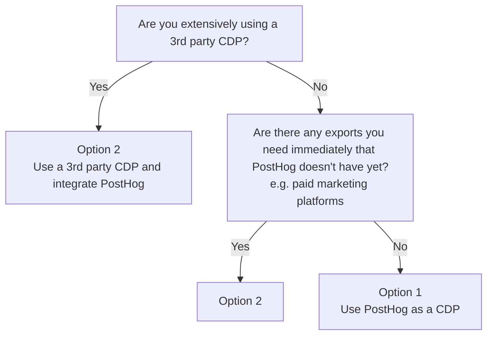
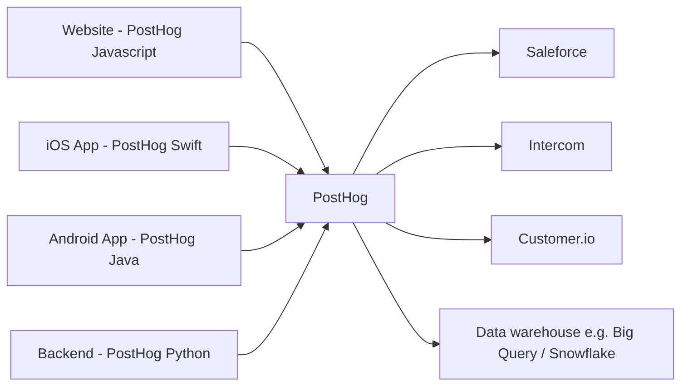
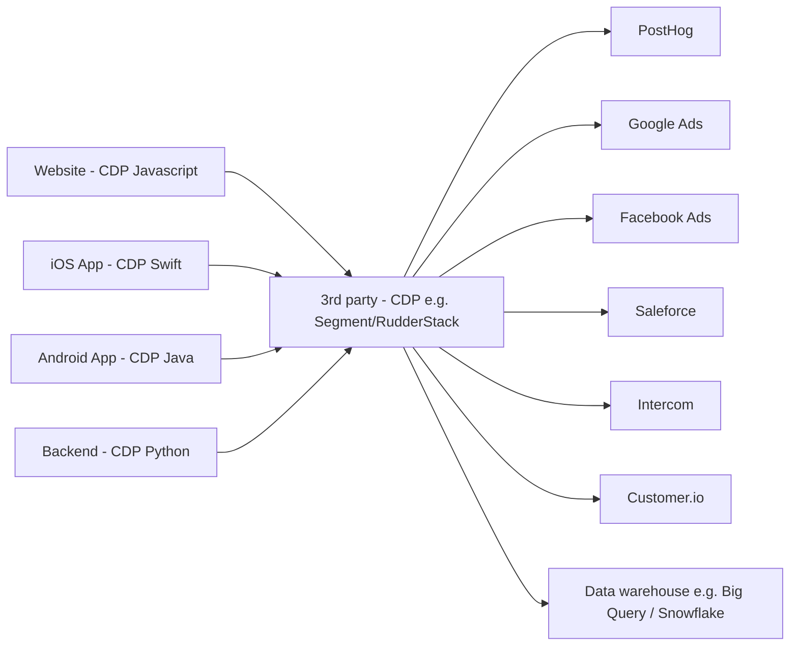
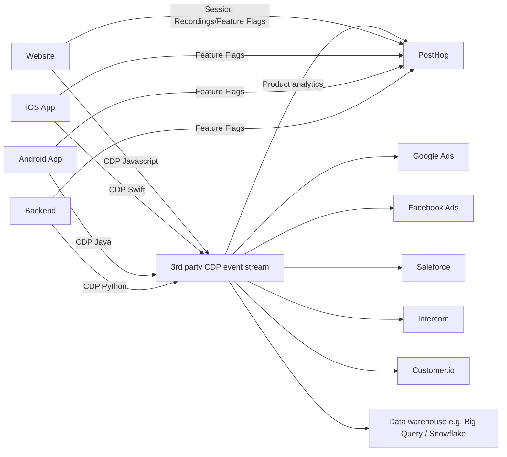
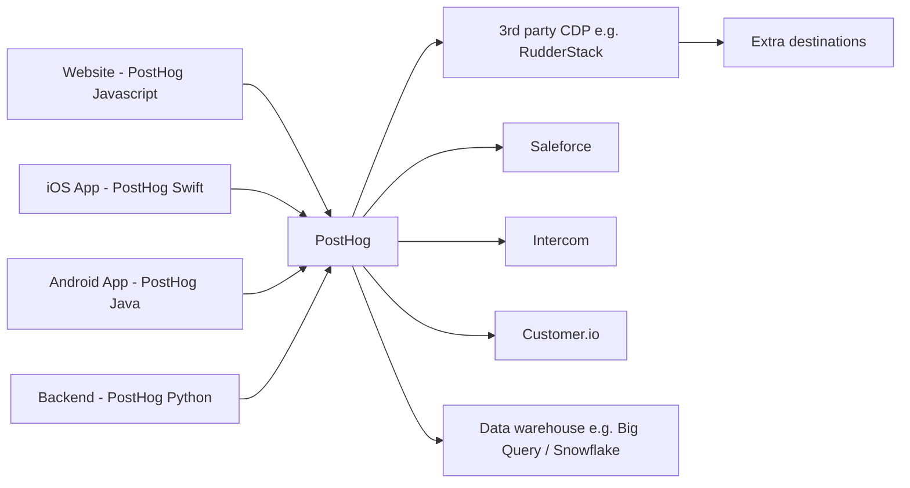

## What is a CDP?

A CDP is a Customer Data Platform. It is a platform that allows you to collect, and send customer data to other tools like product analytics (PostHog!), marketing automation tools, your CRM, data warehouses etc.

The most common CDPs are [Segment](/docs/libraries/segment) and [RudderStack](/docs/libraries/rudderstack), both of which work with PostHog.

If you already have a Customer Data Platforms (CDP) setup or are thinking of using one this guide will help you decide how to integrate with PostHog.

## Which PostHog CDP setup should I use?

PostHog has many of the imports and exports of common (CDPs) built-in. This means there's two options for how you could integrate PostHog with a 3rd party CDP:

1. Use PostHog as a CDP (recommended if you don't have a 3rd party CDP set up and we have the exports you need)
2. Use a 3rd party CDP and integrate PostHog

Which method you choose will depend on what your goals are, what you have already set up, and how much time and money you are willing to invest.

Here's a decision tree that you might find handy:

## Option 1: Use PostHog as a CDP

In general, we'd highly recommend starting with PostHog as your CDP using the variety of imports and exports apps that we have. This is the easiest and least expensive way to get started.

If you later need some extra destinations that we don't yet have you have several options: you can send your PostHog data to a 3rd party CDP ([see extra info here](#sending-posthog-data-to-a-3rd-party-cdp-for-extra-destinations)), create your own app, or fully transition to a 3rd party CDP (option 2). Every month we are adding more destinations.

Pros:
- Least expensive as you don't need a 3rd party CDP.
- You don't have a 3rd party CDP before PostHog reducing risk of data being dropped.
- Works with all the features of PostHog (analytics, autocapture, feature flags, session recording, etc.)

Cons:
- We don't yet have as many 3rd party integrations as existing 3rd party CDPs - particularly for marketing platforms (for Facebook Ads, Google Ads, TikTok Ads etc.). If you need these extra exports immediately and you have the time and money for a 3rd party CDP you might want to go with option 2.

Instructions:
1. Setup PostHog
2. Install the [PostHog apps](/apps) you need

## Option 2: Use a 3rd party CDP with PostHog as a destination

If you already have a CDP being used extensively, you'll likely want to integrate PostHog with the CDP. For your frontend sources you'll want to configure PostHog as a device mode destination to ensure you get the full functionality.

Pros:
- You can integrate PostHog with your existing CDP.
- Can manage all your sources and destinations in one place (the 3rd party CDP).
- The 3rd party CDP has more destinations available than PostHog alone

Cons:
- You'll need to pay for a 3rd party CDP.
- If you use PostHog's event autocapture, the other CDP destinations will not receive the autocapture events.
- Enabling feature flags and session recordings requires extra setup (instructions are included for [Segment integration instructions](/docs/libraries/segment) or [RudderStack integration instructions](/docs/libraries/rudderstack)) or manually installing the PostHog script.
- Data to PostHog first passes through a CDP, adding risk that it's dropped.
- Variable support by the CDP libraries for PostHog's features.

Instructions: see the [Segment integration instructions](/docs/libraries/segment) or [RudderStack integration instructions](/docs/libraries/rudderstack) depending on which CDP you are using.

If using feature flags and/or session recordings, the true flow of data will end up looking more like the following. With the custom events going through the 3rd party CDP, and the PostHog specific data (like autocapture events, session recordings, and feature flag calls) going directly to PostHog.

## Sending PostHog data to a 3rd party CDP for extra destinations

If there's key exports you are looking for that we don't currently have, you can use the data export app to send the PostHog data to the 3rd party CDP and then add the extra destinations you need.

Note: this won't work for the CDP device-mode sources such as Facebook Ads and Google Ads (where the CDP injects the marketing script onto the page). If you need this we'd recommend integrating the marketing platforms directly, using Google Tag Manager or using a 3rd party CDP as your primary CDP (option 2).

Pros:
- More destinations available than PostHog alone
- You don't have a 3rd party CDP before PostHog reducing risk of data being dropped
- Works with all the features of PostHog (analytics, autocapture, feature flags, session recording, etc.)
- Can control within PostHog what data is sent onto the CDP and the extra destinations

Cons:
- Can't use the CDP for device mode sources such as Facebook Ads and Google Ads
- More expensive than Option 1 as you now need to pay for a 3rd party CDP
- You need to manage two platforms, which adds some complexity
