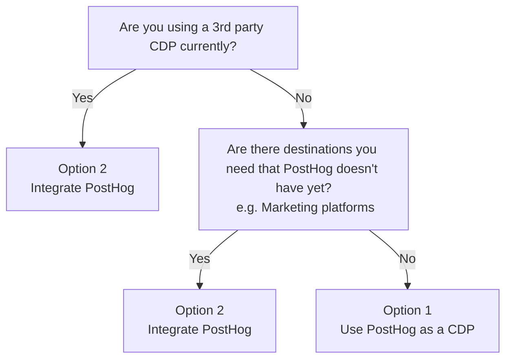
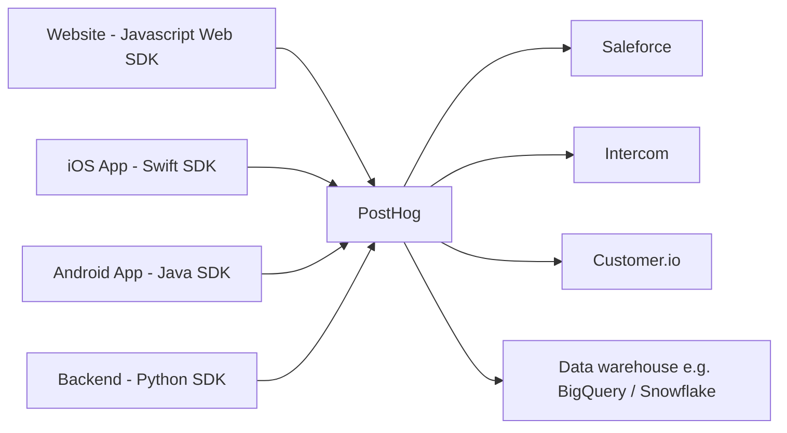
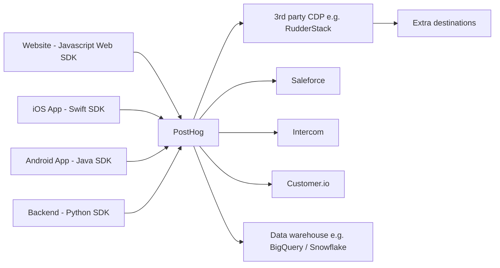
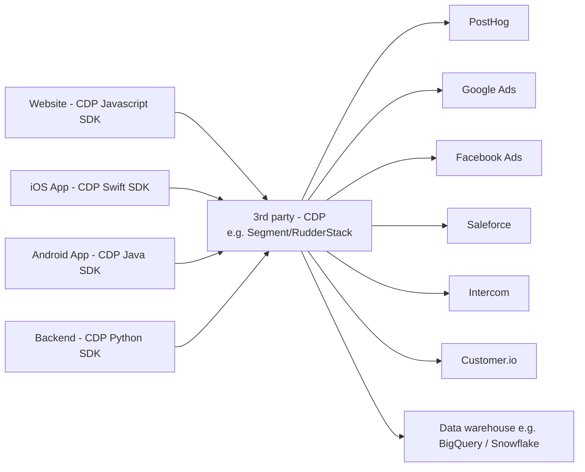
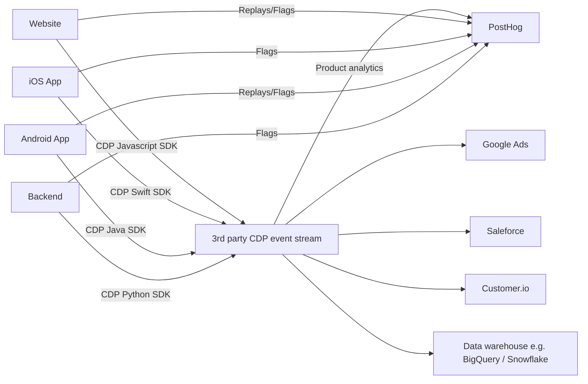

## What is a CDP?

CDP stands for Customer Data Platform. It is a service that collects and unifies customer data from many sources and then sends it for use in other tools like product analytics (PostHog!), marketing automation, your CRM, data warehouses, and more.

The most common CDPs are [Segment](/docs/libraries/segment) and [RudderStack](/docs/libraries/rudderstack), both of which work with PostHog.

## Do I need a CDP?

If you don't have a CDP already set up, you might not need one. PostHog has:

- [SDKs](/docs/libraries) and [API](/docs/api/capture) to capture data from anywhere.
- [Data warehouse](/docs/data-warehouse) to easily import and query data from Stripe, Hubspot, [Zendesk](/tutorials/zendesk-reports), S3, and more.
- Pre-built or customizable [transformations and destinations](/docs/cdp) for cleaning and sending data to other tools.
- Use your data in PostHog's suite of analysis tools.

This means PostHog can act as your single source of truth without needing to set up and pay for another tool.

Here's a decision tree that you might find handy:

## Option 1: Use PostHog as a CDP

In general, we recommend starting with PostHog as your CDP using our SDKs, data warehouse, destinations, and transformations as needed. This is the easiest and least expensive way to get started.

If you need destinations that we don't currently support, you have several options

1. Build your own [real-time destinations](/docs/cdp/destinations) to call the 3rd party API.
2. You can send your PostHog data [to a 3rd party CDP](#sending-posthog-data-to-a-3rd-party-cdp-for-extra-destinations).
2. Fully transition to a 3rd party CDP.

Pros:
- Least expensive as you don't need a 3rd party CDP.
- Fewer services means reduced risk of data being dropped.
- Works with all the features of PostHog (analytics, autocapture, feature flags, session recording, etc.)

Cons:
- We don't yet have as many integrations as 3rd party CDPs, particularly for marketing ad platforms (like Facebook, Google, TikTok, etc.). If you need these destinations immediately and you have the time and money for a 3rd party CDP, you might want to go with option 2.

### Sending PostHog data to a 3rd party CDP for extra destinations

If there's destination you are looking for that we don't currently have, you have two options:

1. Build your own [real-time destinations](/docs/cdp/destinations) using custom code. You can also request a new destination in the app and our team will be notified.

2. Use a destination to send data to your CDP like [RudderStack](/docs/cdp/rudderstack-export) and then add the destination you need. This gives you more destinations than PostHog alone, while also mostly relying on PostHog. 
> **Note:** This won't work for the CDP device-mode sources such as Facebook Ads and Google Ads (where the CDP injects the marketing script onto the page). If you need this, we'd recommend integrating the marketing platforms directly, using Google Tag Manager or using a 3rd party CDP as your primary CDP (option 2).

## Option 2: Use a 3rd party CDP with PostHog as a destination

If you already use a CDP extensively, you'll likely want to integrate PostHog with it. For your frontend sources, you'll want to configure PostHog as a destination to ensure you get the full functionality. See our guides for [Segment](/docs/libraries/segment) and [RudderStack](/docs/libraries/rudderstack) for more information.

Pros:
- You can integrate PostHog with your existing CDP.
- Manage all your sources and destinations in one place.
- A broader range of destinations available than PostHog alone.

Cons:
- You'll need to pay for a 3rd party CDP.
- If you use PostHog's event autocapture, the other CDP destinations will not receive the autocapture events.
- Enabling feature flags and session recordings requires extra setup or manually installing the PostHog script.
- Variable support by the CDP libraries for PostHog's features.

### Using PostHog alongside a 3rd party CDP

You can still use PostHog features like feature flags, session replays, surveys, and more alongside a 3rd party CDP. This will mean that custom events go through the 3rd party CDP and the PostHog specific data (like autocapture events, session replays, and feature flag calls) go directly to PostHog. The true flow of data will end up looking more like the following.

