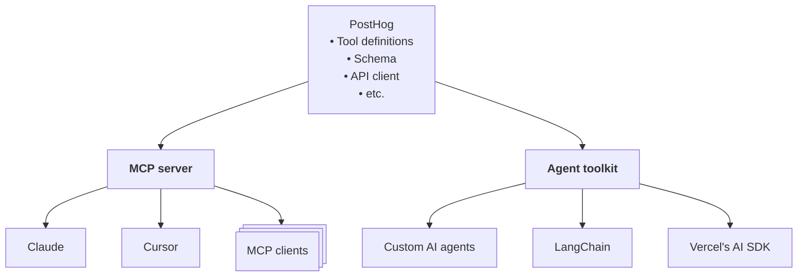

import MCPTools from '../../../src/components/Docs/MCPTools'

The PostHog agent toolkit equips your AI agents with the ability to interact with the PostHog API and platform. It provides a set of standardized function calling tools that can be integrated with frameworks like Vercel's AI SDK and LangChain.

Our agent toolkit is open source on [GitHub](https://github.com/PostHog/mcp) and currently available in [TypeScript](https://github.com/PostHog/mcp/tree/main/typescript) and [Python](https://github.com/PostHog/mcp/tree/main/python). 

<MultiLanguage selector="tabs">

```bash file=TypeScript
npm install @posthog/agent-toolkit
```

```bash file=Python
uv add posthog_agent_toolkit
```

</MultiLanguage>

## Key features

With the agent toolkit, your AI agents can:

- Select PostHog organizations and projects
- Manage insights and dashboards
- Write SQL queries using natural language
- Create, update, or remove feature flags
- Retrieve errors, experiments, and LLM analytics
- Search PostHog documentation

See the [available tools](#available-tools) section for the full list.

The toolkit also keeps track of your active PostHog project and organization across tool calls and gives you clear error messages when something goes wrong.

## MCP vs agent toolkit 

The PostHog [MCP server](/docs/model-context-protocol) and agent toolkit are two complementary ways to integrate PostHog tools into your AI workflows. They share the same foundation: a set of core services and function calls that include tool definitions, schemas, API interactions, state management, error handling, etc.



<Caption>Our MCP and agent toolkit share the same core services</Caption>


MCP provides a standardized way for AI agents to connect with external tools and data sources like PostHog. We provide a remote, cloud-hosted MCP server, which makes PostHog's tools accessible without requiring you to host anything yourself.

But with the agent toolkit, you can embed PostHog’s tools directly into your AI workflows, giving you full control over how they’re integrated and called.

Here's a high-level comparison: 

| &nbsp; | MCP | Agent toolkit |
| --- | --- | --- |
| **Setup** | Ready to use, hosted by PostHog. | Requires development and manual integration. |
| **Integration** | Integrates with any MCP-compatible client like Claude, Cursor, and Windsurf.| Integrates with AI agent frameworks like LangChain and Vercel's AI SDK. |
| **Control** | Standardized MCP interface. | You control how PostHog tool calls fit into your workflow. |
| **Best for** | Out-of-the-box integrations that leverage the MCP ecosystem. | Custom AI workflows that need flexibility and programmatic control. |

Pick what makes sense for your use case. It also doesn't have to be one or the other. Both the MCP server and the agent toolkit can play a role in your AI engineering process. 

For example, you could use our agent toolkit for in-house AI development and our MCP server for integrating with third-party agents. *Fun fact*: Our Python agent toolkit is actually a wrapper around our MCP server (see the [source code](https://github.com/PostHog/mcp/tree/main/python)). 

These two approaches are designed to work together or on their own.

## Agent toolkit example

Here’s an example of using the agent toolkit with AI frameworks such as LangChain and Vercel’s AI SDK. After installing and importing the toolkit, here’s an example of how it can be integrated:

<MultiLanguage selector="tabs">

```typescript file=Vercel&nbsp;AI&nbsp;SDK

import { openai } from '@ai-sdk/openai';
import { PostHogAgentToolkit } from '@posthog/agent-toolkit/integrations/ai-sdk';
import { generateText } from 'ai';

// Initialize PostHog toolkit
const toolkit = new PostHogAgentToolkit({
  posthogPersonalApiKey: process.env.POSTHOG_PERSONAL_API_KEY,
  posthogApiBaseUrl: 'https://us.posthog.com' // or https://eu.posthog.com
});

// Get tools and execute the agent
const tools = await toolkit.getTools();
const result = await generateText({
  model: openai('gpt-5-mini'),
  tools: tools,
  prompt: 'Show me my top 5 PostHog insights and summarize them'
});

console.log(result.text);

```

```typescript file=LangChain&nbsp;JS

import { ChatOpenAI } from '@langchain/openai';
import { PostHogAgentToolkit } from '@posthog/agent-toolkit/integrations/langchain';
import { AgentExecutor, createOpenAIFunctionsAgent } from 'langchain/agents';
import { ChatPromptTemplate } from '@langchain/core/prompts';

const llm = new ChatOpenAI({ modelName: 'gpt-5-mini' });

// Initialize PostHog toolkit
const toolkit = new PostHogAgentToolkit({
  posthogPersonalApiKey: process.env.POSTHOG_PERSONAL_API_KEY,
  posthogApiBaseUrl: 'https://us.posthog.com' // or https://eu.posthog.com
});

// Get tools and create prompt template
const tools = await toolkit.getTools();
const prompt = ChatPromptTemplate.fromMessages([
  ['system', 'You are a helpful assistant that can analyze PostHog data.'],
  ['human', '{input}'],
  ['placeholder', '{agent_scratchpad}']
]);

// Create the agent and executor
const agent = await createOpenAIFunctionsAgent({ llm, tools, prompt });
const agentExecutor = new AgentExecutor({ agent, tools });

// Execute the agent
const result = await agentExecutor.invoke({
  input: 'Show me my top 5 PostHog insights and summarize them'
});

console.log(result.output);

```

```python file=LangChain&nbsp;Python

import os
from langchain_openai import ChatOpenAI
from posthog_agent_toolkit.integrations.langchain import PostHogAgentToolkit
from langchain.agents import AgentExecutor, create_openai_functions_agent
from langchain_core.prompts import ChatPromptTemplate

# Initialize the language model
llm = ChatOpenAI(model="gpt-5-mini")

# Initialize PostHog toolkit
toolkit = PostHogAgentToolkit(
    posthog_personal_api_key=os.environ["POSTHOG_PERSONAL_API_KEY"],
    posthog_api_base_url="https://us.posthog.com"  # or https://eu.posthog.com
)

# Get tools and create prompt template
tools = toolkit.get_tools()
prompt = ChatPromptTemplate.from_messages([
    ("system", "You are a helpful assistant that can analyze PostHog data."),
    ("human", "{input}"),
    ("placeholder", "{agent_scratchpad}")
])

# Create the agent and executor
agent = create_openai_functions_agent(llm, tools, prompt)
agent_executor = AgentExecutor(agent=agent, tools=tools)

# Execute the agent
result = agent_executor.invoke({
    "input": "Show me my top 5 PostHog insights and summarize them"
})

print(result["output"])

```

</MultiLanguage>

A few more example prompts you can use with PostHog tool calls within an agentic workflow:

```
- What feature flags do I have active?
- Add a new feature flag for our homepage redesign
- What are my most common errors?
- Show me my LLM costs this week
```

Check out our repo for [more integration examples](https://github.com/PostHog/mcp/tree/main/examples) and instructions on how to use our agent toolkit. 

## Available tools

<MCPTools />