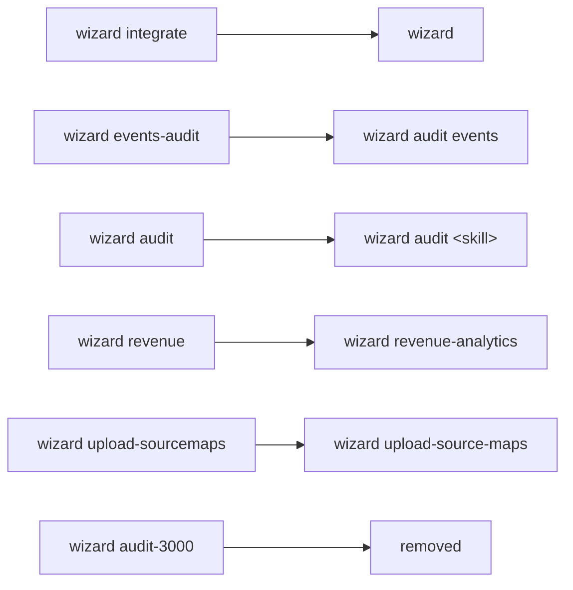

import WizardInstall from 'getting-started/_snippets/wizard.mdx'

The PostHog wizard automatically installs and instruments PostHog into your application codebase using AI. It's an agentic CLI tool that handles the entire PostHog integration process on your behalf.

Set up the PostHog platform in minutes, with a single command.

<WizardCommand slim />

When it's done, your project is onboarded with:

<ProductList
className="grid gap-4 grid-cols-2 not-prose"
urlPrefix="/docs/"
sourceField="wizardSupport"
sourceValues={[true, { value: "In development", color: "red" }, { value: "Coming soon", color: "yellow" }]}
/>

## How it works

<ProductVideo
videoLight="https://res.cloudinary.com/dmukukwp6/video/upload/wizard_clip_0a996d3379.mp4"
alt="AI wizard install in Cursor"
classes="rounded"
autoPlay={true}
loop={true}
/>

Running the wizard automatically:

1. Authenticates your PostHog account
2. Installs the relevant **PostHog SDKs**
3. Scans your codebase and app architecture
4. Creates **custom events** based on real product flows
5. Configures `.env` file with your project credentials
6. Writes code and instruments the PostHog SDKs **client-side** and **server-side**
7. Generates **insights** and **dashboards** in the PostHog app
8. Optionally installs the [PostHog MCP server](/docs/model-context-protocol) for your AI agent

<Caption>
The AI wizard integrating both the JS Web SDK and Node SDK into a Next.js application
</Caption>

## AI wizard installation

<WizardInstall />

## Commands

Running `npx @posthog/wizard` with no arguments starts the default integration flow. The wizard also exposes focused commands:

| Command | What it does |
|---|---|
| `wizard` | Default flow — installs and instruments PostHog |
| `wizard audit [skill]` | Audit an existing integration (e.g. `wizard audit events`, `wizard audit all`) |
| `wizard revenue-analytics` | Wire up Stripe + PostHog revenue analytics |
| `wizard migrate` | Migrate from another analytics or feature-flag vendor |
| `wizard upload-source-maps` | Upload source maps to PostHog Error Tracking |
| `wizard mcp add` / `wizard mcp remove` | Manage the PostHog MCP server for your AI agent |

### Command changes

The CLI was overhauled to consolidate commands into a smaller, more consistent surface. If you used an older command name, here's where it went:

| Old command | New command | What changed |
|---|---|---|
| `wizard integrate` | `wizard` | The default flow now runs the integration |
| `wizard events-audit` | `wizard audit events` | Now an `audit` subcommand |
| `wizard audit` | `wizard audit [skill]` | Now takes a subcommand; `wizard audit all` runs a full audit |
| `wizard revenue` | `wizard revenue-analytics` | Renamed — update any scripts using `revenue` |
| `wizard upload-sourcemaps` | `wizard upload-source-maps` | Renamed (the old `upload-sourcemaps` still works) |

We think flows like the AI wizard are pretty cool and the future of developer experience. The AI wizard is our recommended and default method for [installing PostHog](/docs/getting-started/install?tab=wizard) and getting started.

If you have any feedback or requests, we would love to hear from you. Feel free to comment on this page or open an issue on [GitHub](https://github.com/PostHog/wizard/issues).
