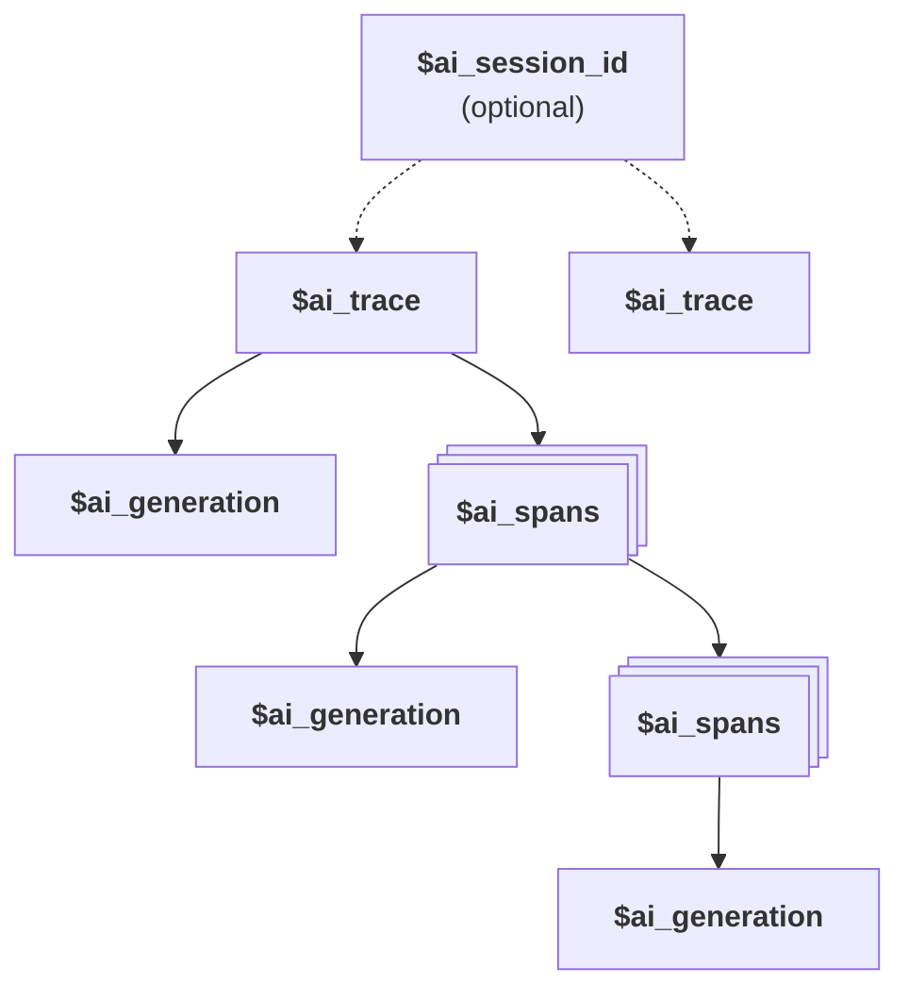

import TraceEventSnippet from "./_snippets/trace-event.mdx"

Traces are a collection of [generations](/docs/ai-observability/generations) and [spans](/docs/ai-observability/spans) that capture a full interaction between a user and an LLM. The [traces tab](https://app.posthog.com/ai-observability/traces) lists them along with the properties autocaptured by PostHog like the person, total cost, total latency, and more.

## Sessions vs Traces

- **Trace** (`$ai_trace_id`): Groups related generations and spans together. Required for all AI Observability events.
- **Session** (`$ai_session_id`): Optional property that groups multiple traces together based on your chosen grouping strategy.

See the [Sessions](/docs/ai-observability/sessions) documentation for more details on how to use `$ai_session_id`.

## Trace timeline

Clicking on a trace opens a timeline of the interaction with all the generation and span events. The trace timeline enables you to see the entire conversation, profiling details, and the individual generations and spans.

<ProductScreenshot
  imageLight="https://res.cloudinary.com/dmukukwp6/image/upload/llma_traces_25e203aa50.png"
  imageDark="https://res.cloudinary.com/dmukukwp6/image/upload/llma_traces_dark_dd6ad555dc.png"
  alt="LLM traces"
  classes="rounded"
/>

<Caption>A trace presents LLM event data in a timeline, tree-structured view </Caption>

## Conversation display options

When viewing a trace, you can control how conversation messages are displayed using the display options dropdown. The available options are:

- **Expand all** - Shows the full content of all messages in the conversation
- **Expand user only** - Expands only user messages, keeping system and assistant messages collapsed for easier scanning of user inputs
- **Collapse except output and last input** - The default view that shows the model's output and the most recent user input, keeping earlier messages collapsed

## Tool calls

Traces display any [tools](/docs/ai-observability/tools) called by the generations within them, shown as tags in the traces list. This makes it easy to see which conversations involved tool use at a glance.

## Sentiment classification

PostHog can classify the sentiment of user messages in a trace as negative, neutral, or positive. Sentiment is computed on-demand using a local model when you view a trace — no data is sent to third-party services. Each trace gets an overall sentiment label and score, with a per-generation and per-message breakdown. See [Sentiment classification](/docs/ai-observability/sentiment) for more details.

## Search traces with PostHog AI

[PostHog AI](/docs/posthog-ai) can search and analyze your LLM traces using natural language. When you're on an [AI Observability page](https://app.posthog.com/ai-observability), PostHog AI automatically switches to its AI Observability mode, giving it access to tools for searching traces by date range, model, cost, error status, and other properties.

Example prompts you can try:

- "Show me recent LLM traces from the past week"
- "What are the most expensive LLM calls from today?"
- "Find traces with errors in the last 30 days"
- "What's happening in my most expensive trace?"

PostHog AI returns trace details including name, latency, cost, token counts, and error count. It can also read individual traces to provide a detailed summary of what happened.

## AI event hierarchy

Traces consist of the following event hierarchy:

1. (Optional) A session (`$ai_session_id`) can group multiple traces together.
2. A trace (`$ai_trace_id`) is the top-level required grouping for LLM events.
3. A trace can contain multiple spans and generations.
4. A span can be the parent of other spans.
5. A generation can be the child of a span or trace.

## Event properties

<TraceEventSnippet />
