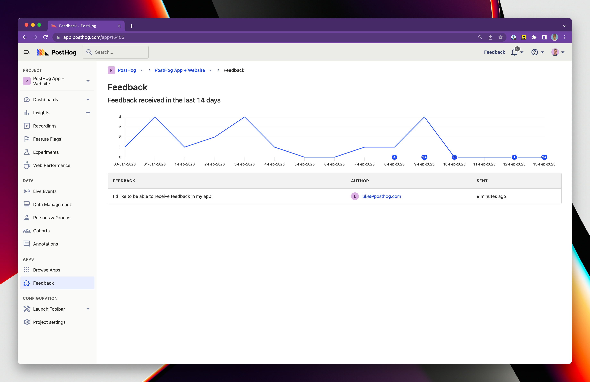
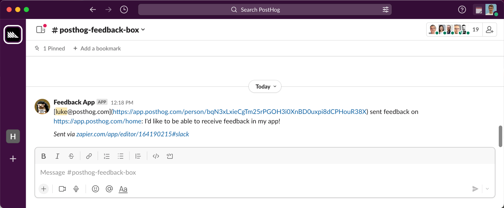
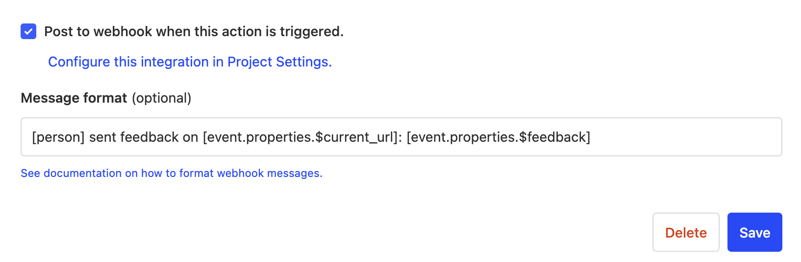

### What does the Feedback Widget app do?

This app enables you to gather feedback from your users and ingest it as an event into PostHog. The app accomplishes this by injecting code into your website, such that a small widget appears to prompt users to share feedback.

Sending feedback looks like this...

You can see the feedback in PostHog as a custom event called `Feedback Sent` with the feedback in the `$feedback` property or through the Feedback Widget app's page.

You can also use Zapier to send feedback to other tools like Slack, Zendesk, and more.

### What are the requirements for this app?

First, you need to opt in to the site apps beta. You'll need to be on PostHog cloud or if self-hosting using PostHog 1.41.0 or later.

You can opt in to the beta by configuring your `posthog-js` initialization to include `opt_in_site_apps: true`. Please be aware you do this at your own risk.

Self-hosted and not running 1.41.0? Find out [how to update your self-hosted PostHog deployment](/docs/runbook/upgrading-posthog)!

### How do I install the Feedback Widget?

1. Opt into the site apps beta by setting your `posthog-js` initialization to include `opt_in_site_apps: true`.  
2. Visit the 'Apps' page in your instance of PostHog.
3. Search for 'Feedback Widget' and select the app, press Install.
4. Customise the text, and enable the plugin
5. Either select "Show feedback button on the page" or add a button with a corresponding data attribute e.g. `data-attr='posthog-feedback-button'` which when clicked will open the feedback widget
6. Each feedback from your users is now captured as a custom `Feedback Sent` event with the feedback in the `$feedback` property
7. You can now use this event to trigger PostHog actions, or create a funnel to see how many users are giving feedback

## How can I connect the feedback to Slack?

1. Install the Feedback Widget app as described above
2. [Create an action](https://app.posthog.com/data-management/actions/new) called `Feedback Sent Action` that matches the custom event `Feedback Sent`.
3. Check the box "Post to webhook when this action is triggered" with the following message: `[person] sent feedback on [event.properties.$current_url]: [event.properties.$feedback]`
   - 
4. [Create the slack app](https://posthog.com/docs/integrate/webhooks/slack)
5. [Copy the Webhook URL into the PostHog Setup page](https://posthog.com/docs/integrate/webhooks/slack)

## Can I make my own site apps?

You certainly can. Check our tutorial about [how to build a site app in PostHog](/tutorials/build-site-app) to get started.

### Is the source code for this app available?

PostHog is open-source and so are all apps on the platform. The [source code for the Feedback Widget](https://github.com/PostHog/downsampling-plugin) is available on GitHub.

### Who created this app?

We'd like to thank PostHog team members [Luke Harries](https://github.com/lharries), [Marius Andra](https://github.com/mariusandra), and user [Ankit Ghosh](https://github.com/Growthfyi). Thanks, all!

### Who maintains this app?

This app is maintained by PostHog. If you have issues with the app not functioning as intended, please [raise a bug report](https://github.com/PostHog/posthog/issues/new?assignees=&labels=bug&template=bug_report.md) to let us know!

### What if I have feedback on this app?

We love feature requests and feedback! Please [create an issue](https://github.com/PostHog/posthog/issues/new?assignees=&labels=enhancement%2C+feature&template=feature_request.md) to tell us what you think.

Or, if you see the feedback widget enabled, use that!

### What if my question isn't answered above?

We love answering questions. Ask us anything via [our Support page](/questions).

You can also [join the PostHog Community Slack group](/slack) to collaborate with others and get advice on developing your own PostHog apps.
