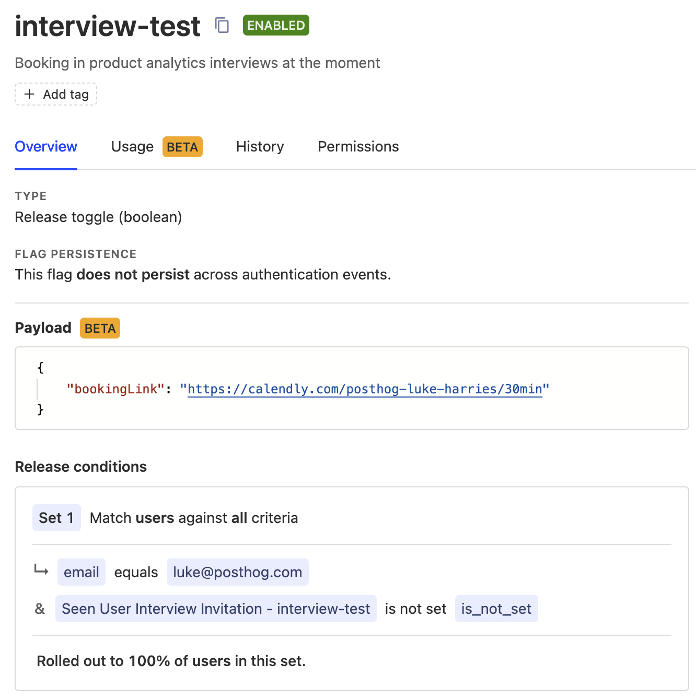

### What does the User Interviewer app do?

This app enables you to send a popup notification to targeted users that invites them to schedule an interview to provide feedback. This app was created by PostHog's product team and is something we use regularly to collect community feedback. 

### What are the requirements for this app?

This app requires either PostHog Cloud, or a self-hosted PostHog instance running [version 1.30.0](https://posthog.com/blog/the-posthog-array-1-30-0) or later.

Not running 1.30.0? Find out [how to update your self-hosted PostHog deployment](https://posthog.com/docs/runbook/upgrading-posthog)!


### How do I install this app?

1. Make sure you have enabled `opt_in_site_apps: true` in your posthog-js config.
2. Install the app from the PostHog App Repository
3. Customize the text and theme using the app config
4. Create a feature flag starting with `interview-` (see below)

That's it!

### Is the source code for this app available?

PostHog is open-source and so are all apps on the platform. The [source code for this app](https://github.com/posthog/user-interview-app) is available on GitHub.

### How do I create the feature flag to invite users to interview?

After installing the app, you'll need to create a feature flag starting with `interview-` and then add the feature flag name and booking link to the app config.

- Name
  - By default any feature flag starting with `interview-` will trigger the popup. You can change this by adding the name of the feature flag to the app config.
- Payload
  - Add your booking link as a JSON payload as follows:

    ```json
    {
        "bookingLink": "https://calendly.com/posthog-luke-harries/test"
    }
    ```

- Filters (who you invite to the interview)
  - (Required) Set the filter `Seen User Interview Invitation - {FEATURE_FLAG_NAME}` to `is not set` so that it doesn't show to users who have seen the user interview already. This property is added once the user has interacted with the popup - either to close it or to book in a time.
  - You can create a filter based on properties, such as location or email, but not events.
  - If you want to invite users based on them doing certain actions, you'll need to update the users' property once they've done that action or create a static cohort from an insight.

By default the flags won't be shown to users who have seen a user interview popup within the last 90 days. You can override this with with `minDaysSinceLastSeenPopUp`

Example feature flag that targets Luke Harries:


### What new properties and events does this app add?

Please check [the Readme in the GitHub repo for a full list](https://github.com/posthog/user-interview-app#tracking-events). 

### Who created this app?

We'd like to thank PostHog team member [Luke Harries](https://github.com/lharries) for creating this app.

### Who maintains this app?

This app is maintained by PostHog. If you have issues with the app not functioning as intended, please [raise a bug report](https://github.com/posthog/user-interview-app).

### What if I have feedback on this app?

We love feature requests and feedback! Please [create an issue](https://github.com/PostHog/posthog/issues/new?assignees=&labels=enhancement%2C+feature&template=feature_request.md) to tell us what you think.

### What if my question isn't answered above?

We love answering questions. Ask us anything via [our Support page](/questions).

You can also [join the PostHog Community Slack group](/slack) to collaborate with others and get advice on developing your own PostHog apps.
