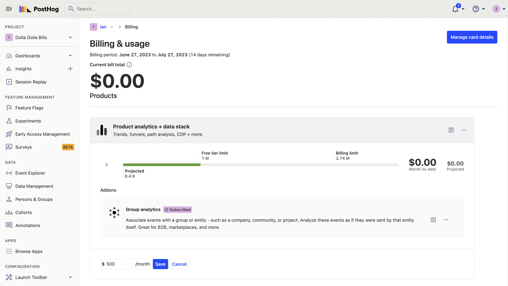

To help you avoid surprise bills, PostHog enables you to set billing limits for each of our products. Setting a billing limit means we will stop ingesting and processing your data so you are not charged over the set limit. In other words, if you exceed the billing limit you set, your additional data is lost forever.

To set a billing limit:

1. Go to your organization's [billing settings](https://app.posthog.com/organization/billing)
2. Click on the three dots in the top right of a product, then "Set billing limit."
3. Set your dollar limit in the box at the bottom of the product and press "Save."

You’ll need to do this for each of the products. You can also remove limits by following the same process and clicking “Remove limit” instead of "Save."

## Billing alerts

When you set billing limits, the owner of the organization will automatically get alert emails when product usage nears the billing limits. These emails are sent at **80%** and **100%** of the limit. These emails are also sent when you reach **80%** and **100%** of the free allotment.
