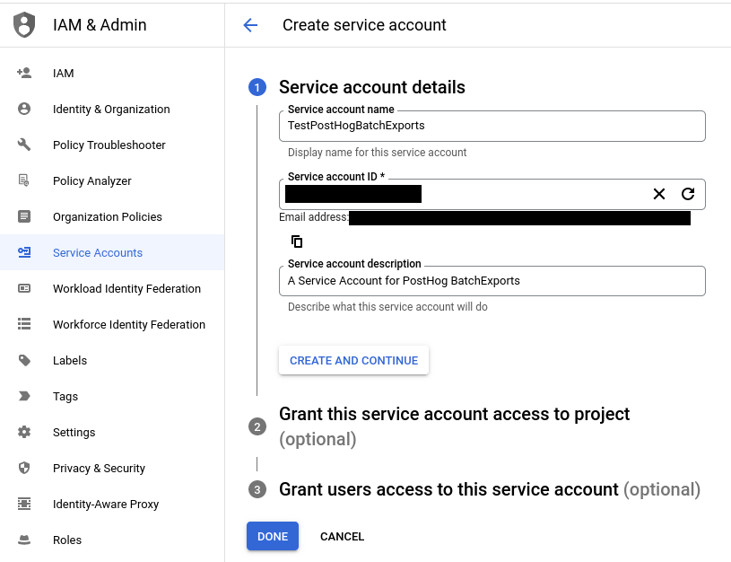
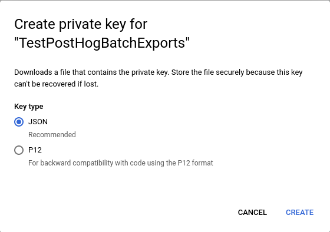
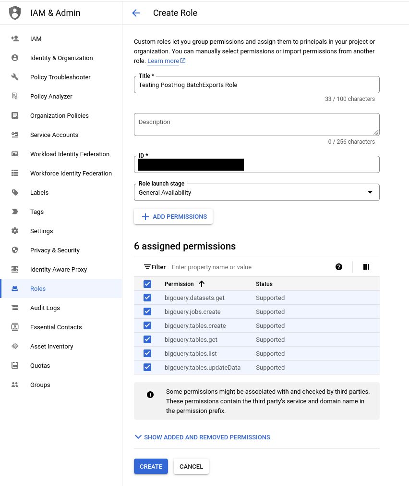
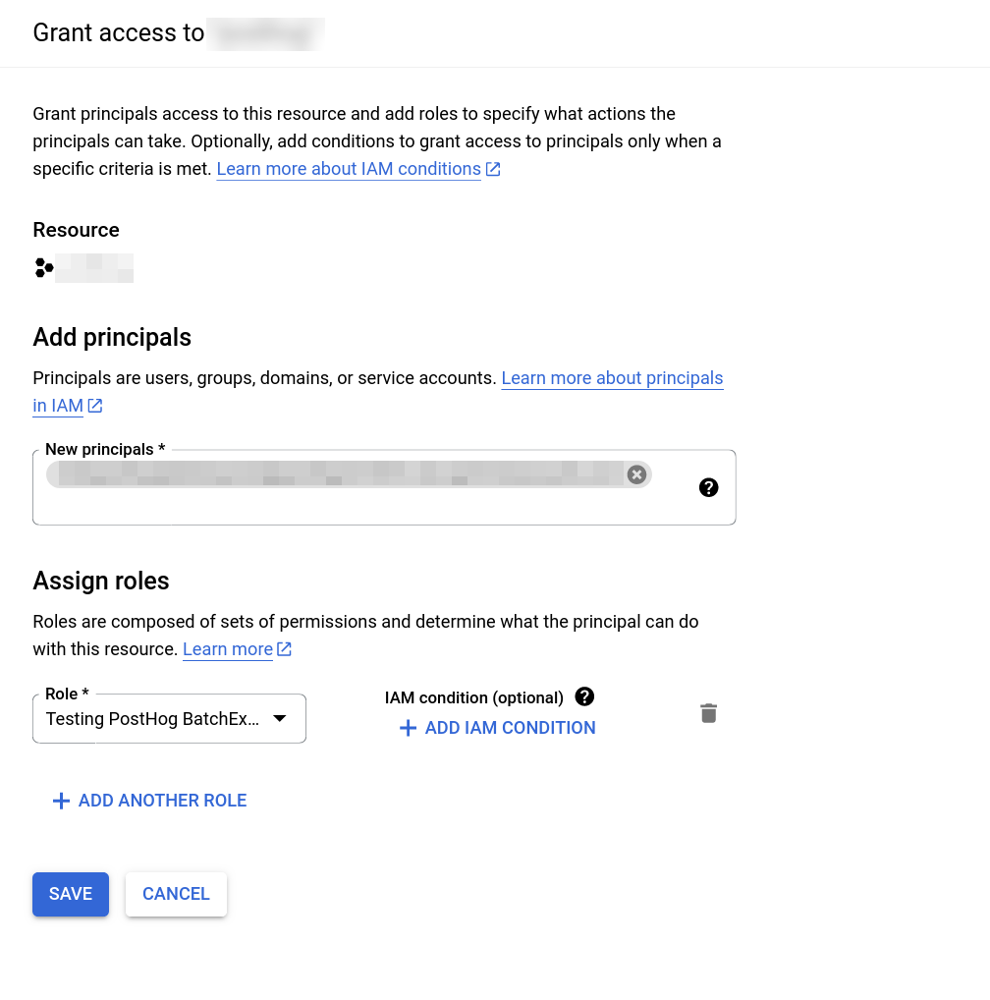
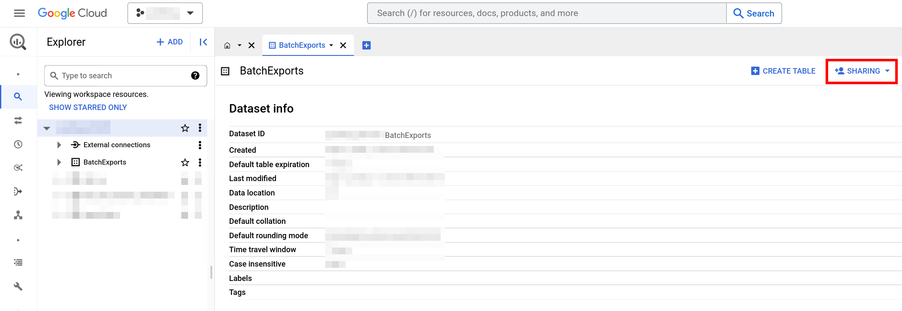
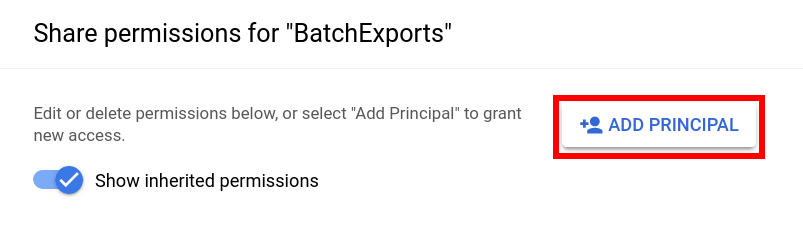
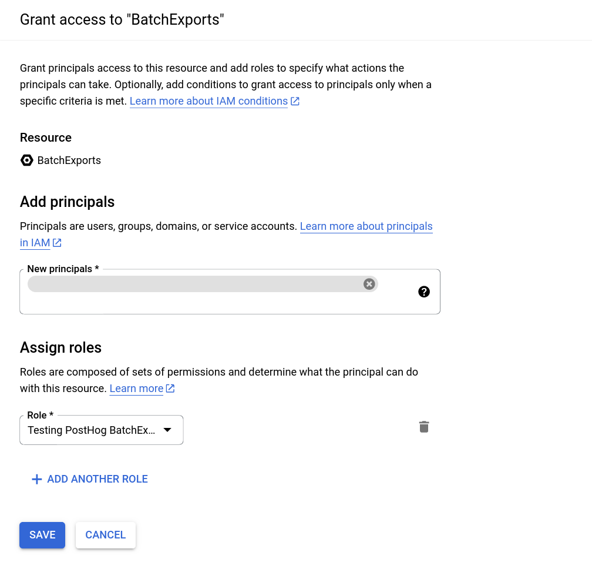

Batch exports can be used to export data to a BigQuery table.

## Setting up BigQuery access

To set up the right permissions for a batch export targeting BigQuery, you need:

1. A Service Account.
2. A dataset which has permissions allowing the service account to access it.

Here's how to set these up so that the app has access only to the dataset it needs:

1. Create a [Service Account](https://cloud.google.com/iam/docs/service-accounts-create#creating).

2. Create a [key](https://cloud.google.com/iam/docs/keys-create-delete#creating) for the Service Account you created in the previous step.
3. Save the key file as JSON to upload it when configuring a batch export.

4. Create a role which has only the specific permissions the batch export requires:
   * `bigquery.datasets.get`
   * `bigquery.jobs.create`
   * `bigquery.tables.create`
   * `bigquery.tables.get`
   * `bigquery.tables.list`
   * `bigquery.tables.updateData`

This step can be skipped if using the built-in roles `BigQuery Data Editor` and `BigQuery Job User` in the steps that follow.

5. Grant the Service Account access to run jobs in your Google Cloud project. This can be done by granting the `BigQuery Jobs User` role or the role we created in the previous step on your project.

Navigate to IAM and click on Grant Access to arrive at this screen:

> In the screenshot above, we have used a custom role named `Testing PostHog BatchExports` with the permissions listed in the previous step.

6. Create a dataset within a BigQuery project (ours is called `BatchExports`, but any name will do).
7. Use the Sharing and Add Principal buttons to grant access to your dataset with your Service Account created in step 1. Next, assign either the `BigQuery Data Editor` role or your custom role created in step 4 to provide permissions for the dataset access. Read the full instructions on [granting access to the dataset in BigQuery](https://cloud.google.com/bigquery/docs/control-access-to-resources-iam#grant_access_to_a_dataset) if unclear.

> In the screenshot below, we grant our Service Account access to the `BatchExports` data set and assign the `Testing PostHog BatchExports` role permissions for it.

8. All done! After completing these steps you can create a BigQuery [batch export in PostHog](https://app.posthog.com/project/apps?tab=batch_exports) and your data will start flowing from PostHog to BigQuery.

## Event schema

This is the schema of all the fields that are exported to BigQuery.

| Field                 | Type        | Description                                                               |
|-----------------------|-------------|---------------------------------------------------------------------------|
| uuid                  | `STRING`    | The unique ID of the event within PostHog                                 |
| event                 | `STRING`    | The name of the event that was sent                                       |
| properties            | `STRING`    | A JSON object with all the properties sent along with an event            |
| elements              | `STRING`    | This field is present for backwards compatibility but has been deprecated |
| set                   | `STRING`    | A JSON object with any person properties sent with the `$set` field       |
| set_once              | `STRING`    | A JSON object with any person properties sent with the `$set_once` field  |
| distinct_id           | `STRING`    | The `distinct_id` of the user who sent the event                          |
| team_id               | `STRING`    | The `team_id` for the event                                               |
| ip                    | `STRING`    | The IP address that was sent with the event                               |
| site_url              | `STRING`    | This field is present for backwards compatibility but has been deprecated |
| timestamp             | `TIMESTAMP` | The timestamp associated with an event                                    |
| bq_ingested_timestamp | `TIMESTAMP` | The timestamp when the event was sent to BigQuery                         |

## Creating the batch export

1. Navigate to the exports page in your PostHog instance (Quick links if you use [PostHog Cloud US](https://app.posthog.com/project/apps?tab=batch_exports) or [PostHog Cloud EU](https://eu.posthog.com/project/apps?tab=batch_exports)).
2. Click "Create export workflow".
3. Select **BigQuery** as the batch export destination.
4. Fill in the necessary [configuration details](#bigquery-configuration).
5. Finalize the creation by clicking on "Create".
6. Done! The batch export will schedule its first run on the start of the next period.

## BigQuery configuration

Configuring a batch export targeting BigQuery requires the following BigQuery-specific configuration values:
* **Table ID:** The ID of the destination BigQuery table. This is not the fully-qualified name of a table, so omit the dataset and project IDs. For example for the fully-qualified table name `project-123:dataset:MyExportTable`, use only `MyExportTable` as the table ID.
* **Dataset ID:** The ID of the BigQuery dataset which contains the destination table. Only the dataset ID is required, so omit the project ID if present. For example for the dataset `project-123:my-dataset`, use only `my-dataset` as the dataset ID.
* **Google Cloud JSON key file:** The JSON key file for your BigQuery Service Account to access your instance. Generated on Service Account creation. See [here](#setting-up-bigquery-access) for more information.
