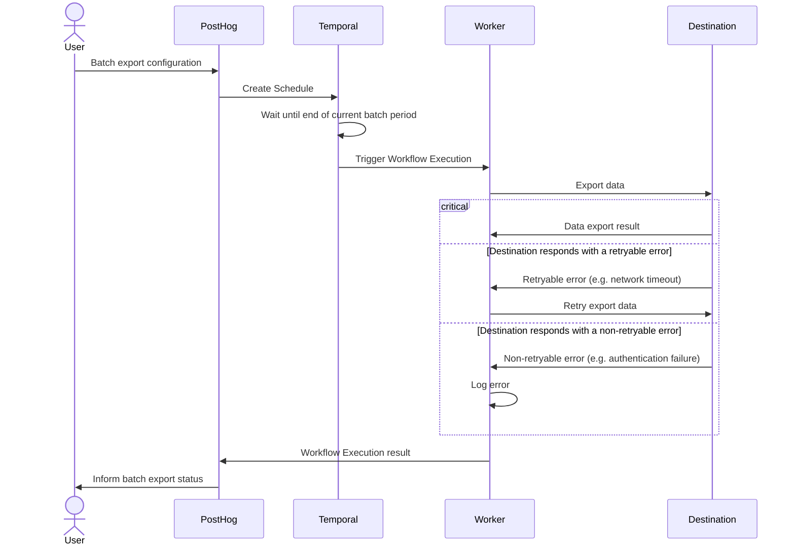

Batch exports give you a platform to schedule data exports to supported destinations. Batch exports are built on [Temporal](https://www.temporal.io/) to enable reliable data exports, ensuring your data reaches your destination.

The key features offered by this platform are:
* **Resiliency:** Retry capabilities (both automated and manual) when the destination is temporarily unavailable.
* **Efficient data transfers:** Processing data in batches reduces the number of data transfers required (less `INSERT` queries or file uploads).

Batch exports are designed to power any complimentary analytics use cases outside of PostHog.

> **Note:** Batch exports require a subscription to the data pipeline add-on which you can enable in [your billing settings](https://us.posthog.com/organization/billing).

## Destinations

Every batch export exports data to a destination using the configuration parameters provided when creating a batch export. The following destinations are currently supported:

* [BigQuery](/docs/cdp/batch-exports/bigquery)
* [S3](/docs/cdp/batch-exports/s3)
* [Snowflake](/docs/cdp/batch-exports/snowflake)
* [Postgres](/docs/cdp/batch-exports/postgres)
* [Redshift](/docs/cdp/batch-exports/redshift)

Support for new destinations will be added based on demand. You can follow development of new destinations [here](https://github.com/PostHog/posthog/issues/15997).

## Models

Batch exports can export different data models, like the events and persons model. Each data model represents a different view into the PostHog database, complete with their own schemas and semantic meanings.

### Events model

The events model is the default model for all batch exports, and it represents a view into the events received by PostHog.

For historical reasons, this model can vary depending on the destination, so we suggest checking each destinations documentation for the precise composition of the model's schema:

* [BigQuery](/docs/cdp/batch-exports/bigquery)
* [S3](/docs/cdp/batch-exports/s3)
* [Snowflake](/docs/cdp/batch-exports/snowflake)
* [Postgres](/docs/cdp/batch-exports/postgres)
* [Redshift](/docs/cdp/batch-exports/redshift)

However, there are some properties of the model that apply to all destinations:
* This model is **immutable** with all fields set once the event is ingested.
* Each event is **uniquely** identified by a UUID that can be used for de-duplication.

### Persons model

The persons model represents a view into how PostHog identifies unique [persons](/docs/data/persons) assigned to each event.

Initially, PostHog events include an unidentified or anonymous `distinct_id` with each event, as we don't know who the user is until they go through your log-in steps. After a user logs in and you call `identify` with their corresponding `distinct_id`, PostHog has to group all previous events that had an anonymous `distinct_id` with the new events coming after the call to `identify`. This grouping is done under the an entity known as a person, and you can get access to these groupings by exporting the persons model. In a few words, the persons model is a mapping of all `distinct_id`s in events, both anonymous and identified, to a single ID per unique user as determined by your calls to `identify`.

In contrast to the events model, the persons model is **mutable**: As users of PostHog may `identify` and merge new and old persons all the time, the persons model has to change with every operation. This rate of change depends on how frequently you call `identify` or merge persons together.

Being a mutable model has implications for the export process: PostHog must merge incoming data with existing data to find any rows that need updating, as incoming data could be both completely new persons and updates to old persons. This merging process is different depending on each destination, but it is likely to require a higher level of access to your destination in comparison to exporting the immutable events model, which only executes append operations.

The intended use-case for this model is to be exported alongside the events model, creating one batch export for each. The persons model can then be joined together with the events model to assign events to their unique persons.

More information, including any additional necessary permissions, schema information, and examples, can be found in each of the destinations documentation:

* [BigQuery](/docs/cdp/batch-exports/bigquery)
* [Snowflake](/docs/cdp/batch-exports/snowflake)
* [Postgres](/docs/cdp/batch-exports/postgres)
* [Redshift](/docs/cdp/batch-exports/redshift)

## Batch runs

A batch export is executed in batch runs depending on the configured frequency. For example, an hourly batch export starts a run on every hour. The data processed by every run has an **upper bound** given by the time in which the run is scheduled to start, and a **lower bound** that results from subtracting the frequency to the batch run's scheduled start time.

As an example, creating a batch export of events with daily frequency today will schedule the first batch run to start right as tomorrow begins. Thus, the data exported are events that PostHog received from 00:00:00 until 23:59:59 of today.

> **Note:** When deciding which data falls within the bounds of a specific batch run, we look at the time when the data landed in PostHog's ClickHouse database. This means that network and processing delays can make an event that was sent within the bounds of a batch run fall in a future run.

### Tracking progress

On each batch export view, you are presented with a list of the latest executed runs:

Each run has:
1. A state indicator which can be either "Starting", "Running", "Failed", or "Completed."
2. The exported data start and end intervals.
3. When the run actually started.
4. The option of retrying a specific run.

## Exporting historical data

You can use batch exports for past data stored in PostHog, known as historical data. For this, you don't need to create a new batch export. The batch export already knows the destination where we wish to send historical data. It only requires the boundaries for the data you want to export, in other words, a start and an end date.

A "Backfill batch export" button can be found in the UI:

Which will let you input the start and end date of the historical export:

Immediately afterwards, the historical export runs that fall within the bounds selected are scheduled.

> **Note:** A historical export does not check if the data already exists in the destination. Doing so would negatively impact the performance of the batch export, and potentially require more permissions on the user's database or storage. Moreover, we can never be sure if the data was moved somewhere else. Instead, we assume that users who request a historic export want all their historic data, which means that multiple historical exports over the same time period will produce duplicates.

> **Note:** A batch export may optionally be created with an end date: Batch exports will never export data past this end date, even if requesting a historical export which exceeds this upper bound.

## FAQ

### How do batch exports work?

As previously mentioned, batch exports are implemented on [Temporal](https://www.temporal.io/). More in detail, each supported destination is defined as a [Temporal Workflow](https://docs.temporal.io/workflows), with a [Workflow Type](https://docs.temporal.io/workflows#workflow-type) that indicates which destination is implemented in it.

For example, the Workflow of `s3-export` type contains the code to export data from PostHog to AWS S3. This way, PostHog maintains a map of destinations to Workflow Types, so whenever a user selects a destination, like Snowflake, we can check the map to arrive at the Workflow Type `snowflake-export`.

To trigger these workflows according to intervals chosen by our users, we leverage [Schedules](https://docs.temporal.io/workflows#schedule). Whenever a PostHog user creates a batch export, under the hood PostHog creates a Temporal Schedule configured to execute the Workflow associated with the export destination, at the chosen interval.

After creation, the Schedule will wait until the end of the current batch period as defined by the batch export frequency, such as until the end of the current hour for hourly exports. At this point, the Schedule will trigger a Workflow to export the data for the batch period that has just concluded. Scheduling a Workflow for execution places the Activities defined in the Workflow on a task queue. Temporal Workers running in [PostHog infrastructure](/docs/how-posthog-works) will then pick up these tasks as they become available and execute them.

> **Note:** Temporal Workers run in PostHog infrastructure and are maintained by PostHog, not by Temporal. This means no data leaves PostHog infrastructure unless it is being exported to the destination of your choosing. Any configuration parameters are encrypted before being sent to Temporal Cloud.

### How does this differ from the old export destinations, formerly known as apps?

- The data is exported on batches at a fixed frequency, like hourly or daily.
  - This allows us to optimize uploads and insertions which generally perform better with larger sizes.
  - If you need real time delivery, then you will want check out [webhooks](/docs/webhooks).

- Some features of the old export destinations are still being ported over.
  - This includes logs and error reporting.

### How do batch exports handle periods with no data?

If no data is found for a particular batch period, then the batch export run will immediately succeed. No data to export is not considered a failure, as it is expected that there may be times of low or no volume of events coming into PostHog, and it is particularly relevant when filtering the batch export to only export very low volume events.

> **Note:** This could mean that underlying configuration issues are not surfaced early, as we do not attempt to connect to a destination if there is nothing to export. It is recommended to confirm there is data to export to ensure a batch export has been configured correctly. This can be done by checking batch export debug logs as they will display how many rows are exported. So, if no debug logs appear, it means there is no data to export, so we haven't had a chance to validate the batch export configuration.
