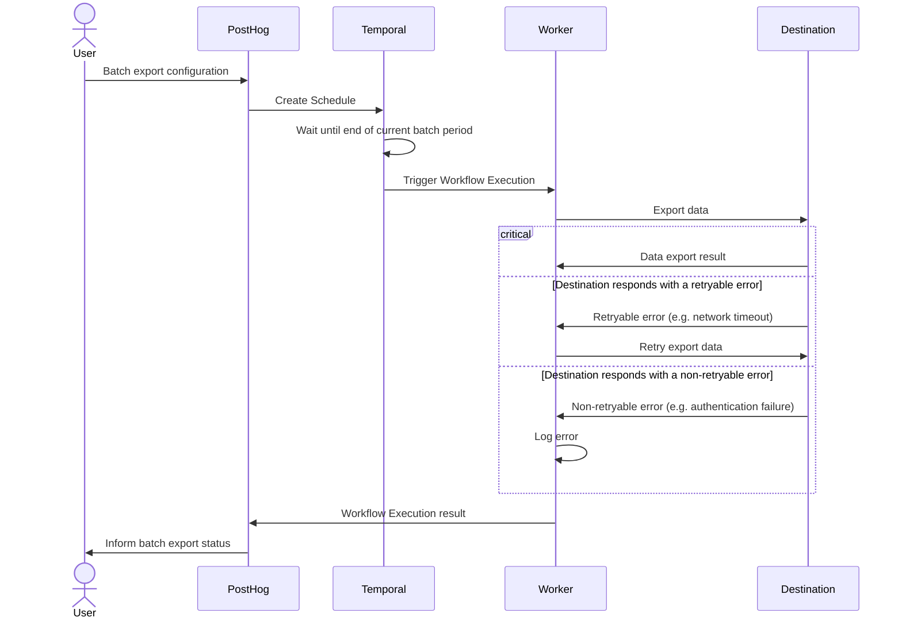

Batch exports give you a platform to schedule data exports to supported destinations. Batch exports are built on [Temporal](https://www.temporal.io/) to enable reliable data exports, ensuring your data reaches your destination.

The key features offered by this platform are:
* **Resiliency:** Retry capabilities (both automated and manual) when the destination is temporarily unavailable.
* **Efficient data transfers:** Processing data in batches reduces the number of data transfers required (less `INSERT` queries or file uploads).

Batch exports are designed to power any complimentary analytics use cases outside of PostHog.

> **Note:** Batch exports require a subscription to the data pipeline add-on which you can enable in [your billing settings](https://us.posthog.com/organization/billing).

## Destinations

Every batch export exports data to a destination using the configuration parameters provided when creating a batch export. The following destinations are currently supported:

* [BigQuery](/docs/cdp/batch-exports/bigquery)
* [S3](/docs/cdp/batch-exports/s3)
* [Snowflake](/docs/cdp/batch-exports/snowflake)
* [Postgres](/docs/cdp/batch-exports/postgres)
* [Redshift](/docs/cdp/batch-exports/redshift)

You can test the configurations of each destination by clicking the **Start test** button below the configuration form:

This test can detect and diagnose configuration issues, like invalid credentials or missing permissions, before running the batch export.

Support for new destinations will be added based on demand. Message us via the [in-app support form](https://us.posthog.com/#panel=support%3Asupport%3Abatch_exports%3Alow%3Atrue) or create an [issue in GitHub](https://github.com/PostHog/posthog/issues/new?template=feature_request.yml) to voice your interest in  new destinations.

import InboundIpAddresses from '../_snippets/inbound-ip-addresses.mdx'

<InboundIpAddresses />

## Models

Batch exports can export different data models, like the events and persons model. Each data model represents a different view into the PostHog database, complete with their own schemas and semantic meanings.

### Events model

The events model is the default model for all batch exports, and it represents a view into the events received by PostHog.

For historical reasons, this model can vary depending on the destination, so we suggest checking each destinations documentation for the precise composition of the model's schema:

* [BigQuery](/docs/cdp/batch-exports/bigquery)
* [S3](/docs/cdp/batch-exports/s3)
* [Snowflake](/docs/cdp/batch-exports/snowflake)
* [Postgres](/docs/cdp/batch-exports/postgres)
* [Redshift](/docs/cdp/batch-exports/redshift)

However, there are some properties of the model that apply to all destinations:
* This model is **immutable** with all fields set once the event is ingested.
* Each event is **uniquely** identified by a UUID that can be used for de-duplication.

### Persons model

The persons model represents a view into how PostHog identifies unique [persons](/docs/data/persons) assigned to each event.

Initially, PostHog events include an unidentified or anonymous `distinct_id` with each event, as we don't know who the user is until they go through your log-in steps. After a user logs in and you call `identify` with their corresponding `distinct_id`, PostHog has to group all previous events that had an anonymous `distinct_id` with the new events coming after the call to `identify`. This grouping is done under the an entity known as a person, and you can get access to these groupings by exporting the persons model. In a few words, the persons model is a mapping of all `distinct_id`s in events, both anonymous and identified, to a single ID per unique user as determined by your calls to `identify`.

In contrast to the events model, the persons model is **mutable**: As users of PostHog may `identify` and merge new and old persons all the time, the persons model has to change with every operation. This rate of change depends on how frequently you call `identify` or merge persons together.

Being a mutable model has implications for the export process: PostHog must merge incoming data with existing data to find any rows that need updating, as incoming data could be both completely new persons and updates to old persons. This merging process is different depending on each destination, but it is likely to require a higher level of access to your destination in comparison to exporting the immutable events model, which only executes append operations.

The intended use-case for this model is to be exported alongside the events model, creating one batch export for each. The persons model can then be joined together with the events model to assign events to their unique persons.

More information, including any additional necessary permissions, schema information, and examples, can be found in each of the destinations documentation:

* [BigQuery](/docs/cdp/batch-exports/bigquery)
* [Snowflake](/docs/cdp/batch-exports/snowflake)
* [Postgres](/docs/cdp/batch-exports/postgres)
* [Redshift](/docs/cdp/batch-exports/redshift)

## Sessions model Beta

> **Note:** The sessions model is currently in `beta`. This means the schema of this model is subject to change.
>
> You can request access via the [in-app support form](https://us.posthog.com/#panel=support%3Asupport%3Abatch_exports%3Alow%3Atrue).

A [session](/docs/data/sessions) in PostHog represents a series of events that make up a single use of your product or visit to your website. Each session is uniquely identified by its `session_id`.

If you want to link events with sessions, you'll need to ensure you're capturing the `$session_id` in your events. This is done automatically by our JavaScript Web library and mobile SDKs. For server-side SDKs, refer to our [docs](/docs/data/sessions#server-sdks-and-sessions).

## Batch runs

A batch export is executed in batch runs depending on the configured frequency. For example, an hourly batch export starts a run on every hour. The data processed by every run has an **upper bound** given by the time in which the run is scheduled to start, and a **lower bound** that results from subtracting the frequency to the batch run's scheduled start time.

As an example, creating a batch export of events with daily frequency today will schedule the first batch run to start right as tomorrow begins. Thus, the data exported are events that PostHog received from 00:00:00 until 23:59:59 of today.

> **Note:** When deciding which data falls within the bounds of a specific batch run, we look at the time when the data landed in PostHog's ClickHouse database. This means that network and processing delays can make an event that was sent within the bounds of a batch run fall in a future run.

### Tracking progress

On each batch export view, you are presented with a list of the latest executed runs:

Each run has:
1. A state indicator which can be either "Starting", "Running", "Failed", or "Completed."
2. The exported data start and end intervals.
3. When the run actually started.
4. The option of retrying or cancelling a specific run.

## Backfills (exporting historical data)

When you create a batch export, it will start exporting data from the current time interval. If you want to export historical data, you can **backfill** the batch export.

To view your existing backfills or to start a new one, you can navigate to the "Backfills" tab of the destination:

From here, you can create a new backfill by clicking the "Start backfill" button, which will let you input the start and end date of the historical export:

This will immediately schedule a series of batch export runs that fall within the bounds selected, based on the batch export's frequency.

The start date of a backfill may be adjusted depending on when the earliest available data is. For example, if you choose a start date of 2024-01-01 but the earliest event captured in PostHog is 2024-01-02, the start date will be adjusted to 2024-01-02. On the other hand, the end date of the backfill cannot be set past the current time, as our engineers have yet to figure out time traveling to allow us to export events in the future.

## FAQ

### How do batch exports work?

As previously mentioned, batch exports are implemented on [Temporal](https://www.temporal.io/). More in detail, each supported destination is defined as a [Temporal workflow](https://docs.temporal.io/workflows). These workflows contain all the destination-specific operations required to connect to each specific destination. For example, the `s3-export` workflow contains the code to export data from PostHog to AWS S3.

When a batch export run is triggered, all workflows first read the data to export from our database and store it in an internal S3 bucket. The workflows then read the data from this internal bucket, processes it into the desired output format, and sends it to the destination.

To trigger these workflows on intervals chosen by our users, we leverage another feature of Temporal: [schedules](https://docs.temporal.io/workflows#schedule). Whenever a PostHog user creates a batch export, under the hood PostHog creates a Temporal schedule configured to execute the workflow associated with the export destination at the chosen interval.

After creation, the schedule will wait until the end of the current batch period as defined by the batch export frequency, such as until the end of the current hour for hourly exports. At this point, the schedule will trigger a workflow to export the data for the batch period that has just concluded. However, before doing so, the schedule will wait for an additional small and randomly assigned amount of time. This additional waiting time allows us to avoid issues with having all workflows starting just as the next hour or day starts (commonly known as the thundering herd problem).

Each workflow is divided into activities, and we operate workers running in [PostHog infrastructure](/docs/how-posthog-works) that pick up and run these activities as they are queued-up by each workflow.

> **Note:** Workers run in PostHog infrastructure and are maintained by PostHog, not by Temporal. This means no event, person, or session data is ever sent to Temporal, as it is only handled by the aforementioned workers. Only configuration parameters are sent to external Temporal servers as they coordinate the execution of batch exports across multiple workers. This configuration data is always encrypted before leaving PostHog.

### How does this differ from the old export destinations, formerly known as apps?

- The data is exported on batches at a fixed frequency, like daily, hourly, or sub-hour frequencies.
  - This allows us to optimize uploads and insertions which generally perform better with larger sizes.
  - If you need real time delivery, then you will want check out [webhooks](/docs/webhooks).

### How do batch exports handle periods with no data?

If no data is found for a particular batch period, then the batch export run will immediately succeed. No data to export is not considered a failure, as it is expected that there may be times of low or no volume of events coming into PostHog, and it is particularly relevant when heavily filtering the batch export.

When this happens, the batch export logs will display a message like "Batch export will finish early as there is no data matching specified filters".

> **Note:** When there is no data to export, a batch export may skip attempting to connect to a destination. This could mean that underlying issues with the destination configuration are not surfaced. It is recommended to test the configuration after every change by running the tests in the configuration tab.

### Why do I get duplicate data?

There are a few situations that can cause batch exports to export duplicate data. For this reason, although we strive to keep the number of duplicates below a threshold, we recommend that you set up processes to de-duplicate the data in your destination if any amount of duplicates is undesirable. Different destinations will offer different tools to optimally handle duplicates, so we suggest you review your destination's documentation to find out what is the best strategy.

#### 1. Batch exports run before deduplication

Occasionally, PostHog ingests duplicate data, as we want to ensure all data is captured, even if that means sometimes capturing the same event multiple times. PostHog has several asynchronous processes that clean up these duplicate values so that they never surface to any visible dashboards.

Batch exports can run before these asynchronous processes have done their work. In that situation, the batch export can be served duplicate data by our underlying data storage. Batch exports will attempt to de-duplicate data within a batch, but any de-duplication across multiple batches would be too expensive to execute within the time constraints of the batch export.

In these rare situations, you will see duplicate data in your destination.

#### 2. Backfills

When requesting a backfill, PostHog does not check if the data to backfill already exists in the destination. Doing so would negatively impact performance of each batch export run, potentially require more permissions to operate on the destination, and introduce more complexity into the configuration of the batch export.

Batch exports assume that users who start a backfill want all the data within the backfill window exported, which means that multiple backfills over the same time period will produce duplicates.

When requesting a backfill, we recommend doing so for data that wasn't exported at all, like data from before the batch export was created, or when re-exporting the same data is required, like if it is accidentally deleted from the destination by an unrelated error.

In addition, depending on any delays in sending or ingesting data, batch export runs triggered by a backfill close to real time may have data that overlaps with regularly scheduled batch export runs.

For these reasons, although we strive to keep the number of duplicates below a threshold, we recommend that you set up processes to de-duplicate the data in your destination if any amount of duplicates is undesirable. Different destinations will offer different tools to optimally handle duplicates, so we suggest you review your destination's documentation to find out what is the best strategy.

### Why are events exported in runs that do not match the event's timestamp?

Due to delays in ingestion, caused by unreliable networks, buffering strategies, and other quirks, an event may arrive at PostHog with a significant delay compared to its timestamp. If batch exports relied on the event's timestamp to decide which data to include in a particular batch, we could be missing events that arrive late. As it is impossible to know whether events with a delay exist before they arrive, batch exports instead relies on the time when an event is ingested to decide whether an event belongs in a batch or not.

Here is an example to illustrate this situation:

1. An event is generated by your mobile application with a timestamp with a time component of 12:59:59 (assume all times are on the same timezone, for simplicity).

2. Since the mobile device is currently not connected to a stable WiFi connection, the event fails to be sent to PostHog, and is instead cached in the device to be sent later.

3. In the time it took for the event to fail, the clock already moved past 13:00:00, and your hourly batch export has started the 12:00:00-13:00:00 run.

4. A few minutes later, say 13:05:00, the batch export run finishes.

5. Finally a few minutes after that, at 13:07:00, the mobile device connects to a reliable WiFi, the event with timestamp 12:59:59 is finally sent, and processed in PostHog.

This example illustrates the issue: The event with timestamp 12:59:59 can only be exported by batch export runs triggered after its arrival (13:00:00-14:00:00, and beyond), as the previous runs (12:00:00-13:00:00, and before) execute before PostHog even knows that the event exists. But if the 13:00:00-14:00:00 batch export run looked for events with timestamps in the 13:00:00-14:00:00 range, it would not export the event with timestamp 12:59:59, in fact, the event would never be automatically exported; we would say the event was **missed**.

For this reason, PostHog tracks the time when an event is ingested and uses that to determine which events to include in a batch export run. Continuing with the example, the 13:00:00-14:00:00 batch export run instead looks for events that arrived within those bounds, and since the event in our example arrived at 13:07:00, it would be picked up and exported. This way, no events are missed.
