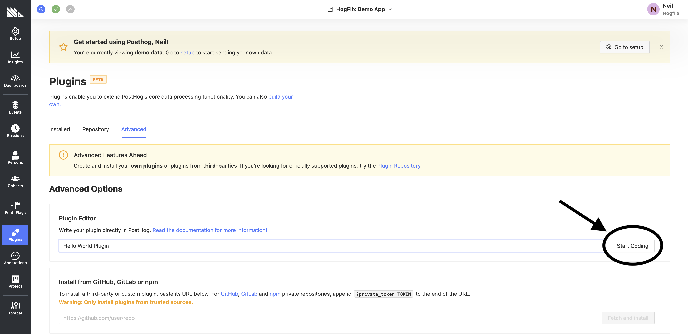
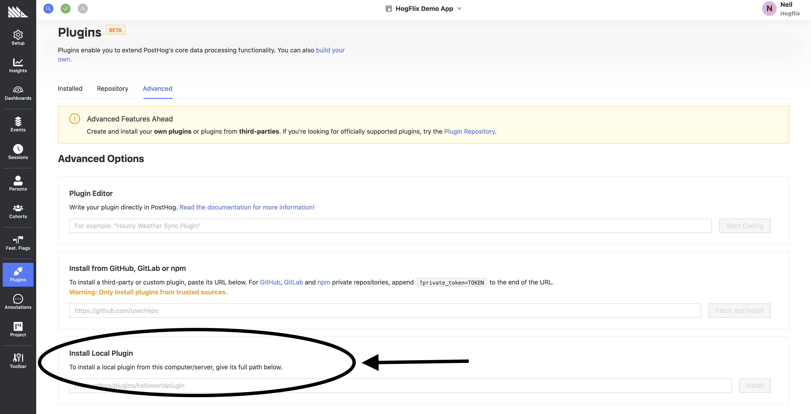

> We are currently **not reviewing new apps** while we build a [new export system](https://github.com/PostHog/posthog/issues/15997). We will update these docs with more information as that work is completed. 

This tutorial explains the development workflow and best practices, using an example 'Hello World' app. We go from zero to publishing your app in the official PostHog repository.

## Prerequisites

1. A self-hosted PostHog instance (or a local development environment)
1. Some knowledge of JavaScript (or TypeScript)

## The app

Every app begins with either the PostHog app [source editor](#using-the-plugin-source-editor), or a new GitHub repository. In both cases, our app source code will look like this:

```js
/* Runs on every event */
export function processEvent(event, meta) {
    // Some events (like $identify) don't have properties
    if (event.properties) {
        event.properties['hello'] = `Hello ${meta.config.name || 'world'}`
    }
    // Return the event to ingest, return nothing to discard  
    return event
}
```

And our config would look like:

```js
[
  {
    "key": "name", // name of key to be accessed using meta. Check value using `meta.config.name`
    "name": "Person to greet",
    "type": "string",
    "hint": "Used to personalise the property `hello`",
    "default": "",
    "required": false
  }
]
```

For information on what code to write and what special functions to use, check out [the overview](/docs/apps/build) and [the developer reference](/docs/apps/build/reference).

### Using the app source editor

Go to Apps -> Advanced tab -> App editor -> Start coding.



Then, click on "Edit Source", and you're good to go. Copy your code and config into the editor, and you're ready to [test the app.](#testing)

### Using a GitHub repository

We have a [GitHub template (GH login required)](https://github.com/PostHog/posthog-plugin-starter-kit/generate) which helps you create a new repository with all the right files. There are only two files which make up the entire app: the `index.js` and `plugin.json`. Your code goes into `index.js`, and your configuration goes into `plugin.json`.

Other than this, there's the `index.test.js` file for tests, and `package.json` for package dependencies and metadata.

Remember to update `package.json` with the appropriate metadata, like name, description, and maintainer.

Once you've written the code in this new repository, you can run it by installing it locally in PostHog. [See testing for more information.](#testing)

#### App naming conventions

When creating your repository, follow the naming convention of `posthog-<plugin-name>-plugin`. For example, the hello world  repository would be called `posthog-hello-world-plugin`.

### Converting a source app to a GitHub repository

If you wish to submit your app to the official repository, you need to convert it into a GitHub repository. The easiest way to do this is to start with [the template](https://github.com/PostHog/posthog-plugin-starter-kit/generate) and copy your source code into `index.js` and your config into the config field of `plugin.json`. Then update `package.json` with the appropriate metadata, like name, description, and maintainer.

[See submission instructions](#submitting-your-plugin) for how to submit the app to the PostHog Repository.

## Testing

For now, the best way to test apps is to install them locally. 

- If you're writing a app in the App source editor, this is as easy as clicking "Save".
- If you're writing a app in a GitHub repository, install it locally using the "Install Local App" option in the Advanced Tab.



This allows you to tweak your app and see that everything works fine.

## Debugging

Apps can make use of the JavaScript `console` for logging and debugging. 

These logs can be seen on the 'Logs' page of each app, which can be accessed on the 'Apps' page of the PostHog UI.

## Publishing your app

There are four ways to use apps you build:

1. Publish the app to `npm` and install it with the url from `npmjs.com` 
1. You can add it via its repository URL (e.g. GitHub/GitLab)
1. Reference the location of the app on your local instance (e.g. /Users/yourname/path/to/app)  

    This can be configured in 'Settings' -> 'Project Apps'.
1. Submit it to the official repository so that it can be installed on PostHog Cloud. [See below](#submitting-your-plugin) 

## Submitting your app

If you wish to, you can contribute back to the PostHog community by submitting to the [official App Store](/apps). This means everyone else can use your app, too!

If you built a app inside the PostHog editor, first [convert it to a GitHub repository](#converting-a-source-plugin-to-a-github-repository)

To submit, [email your GitHub URL to hey@posthog.com](mailto:hey@posthog.com?subject=Submit%20Plugin%20to%20Repository&body=Plugin%20GitHub%20link%3A)

Once we get your email, we review the app to ensure it's secure, performant, and adheres to best practices. Then, we add it to our official repository and make it available for everyone to use.
