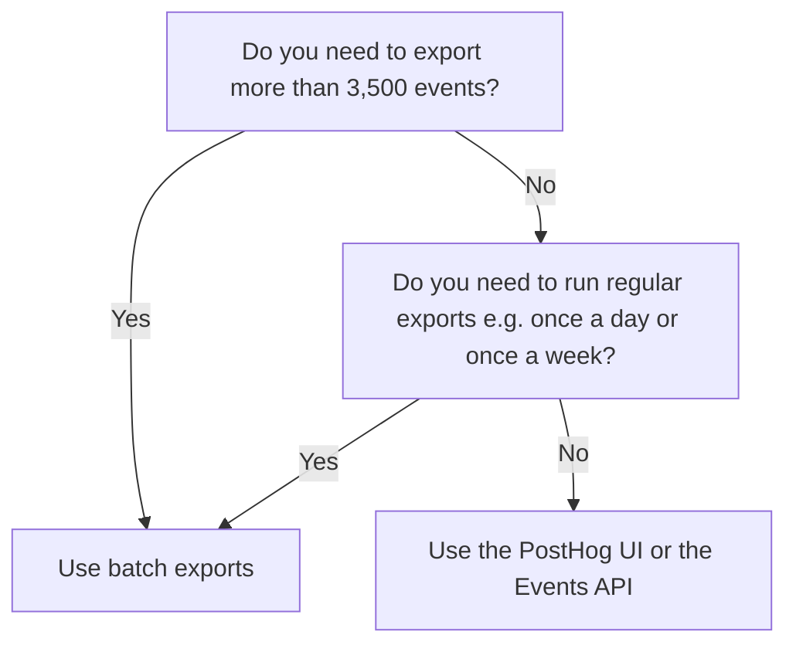

## My transformation or destination isn't working, what do I do?

1. Wait 60 seconds, then check that the transformation or destination is enabled with the correct configuration options in the [data pipeline tab](https://app.posthog.com/pipeline). You can find the correct configuration options in the [transformation or destination's documentation](/docs/cdp) by searching for it in the destinations, transformations, or filtering sections of the docs.

2. Click "Logs & metrics" and go to the `Metrics` tab to check that the transformation or destination is processing events without errors.

3. Check the `Logs` tab to see if there are any errors.

4. Go to the data management tab to check if there any [ingestion warnings](https://us.posthog.com/data-management/ingestion-warnings).

5. If the transformation or destination relates to an external service, check that the external service is working correctly. Make a request to the relevant API endpoint. You can also use a tool like [webhook.site](https://webhook.site/) to check that PostHog sends events as expected.

## How do I capture data from another application?

We deprecated the functionality of data pipelines that enable you to capture data from other tools on a schedule. Functionally, these were a cron which ran every minute (or more) and pulled data from another tool.

There are two options for recreating this functionality:

1. **Set up a cron of your own**. You can use a tool like [val.town](https://val.town/) to easily set up scheduled tasks that capture data from other tools and send them to PostHog. Our tutorials on [capturing new RSS items](/tutorials/rss-item-capture), [events from Calendly webhooks](/tutorials/calendly-webhooks), and [GitHub stars](/tutorials/github-star-tracker) are examples of this.

2. **Use our data warehouse**. PostHog's data warehouse enables you to import and use data from platforms like Stripe, Hubspot, and Postgres natively in PostHog. See our [docs](/docs/data-warehouse) for more information.

## How do I track when users do an event for the first time?

There are a few ways to capture a user doing an event for the first time. We cover a few of these in our tutorials on [tracking new and returning users](/tutorials/track-new-returning-users) and [first touch attribution](/tutorials/first-last-touch-attribution).

- Create a [cohort](/docs/data/cohorts) matching users who have done an event for the first time recently.
- Use a custom event to set a [person](/docs/getting-started/person-properties) or [event property](/docs/data/events). For example, you can set a `first_seen` property with the `$set_once` option.
- Use [HogQL](/docs/product-analytics/sql) to query for the `min(timestamp)` of an event.

## How do I migrate events or rows into PostHog?

See our [migration docs](/docs/migrate) for the full details.

## How do I do real time exports?

We don't currently support real time exports. 

If you need more than the hourly interval [batch exports](/docs/cdp/batch-exports) and are on the enterprise plan, please contact our team (or email [sales@posthog.com](mailto:sales@posthog.com)). 

If you're not on the enterprise plan, check out our [webhook issue](https://github.com/PostHog/posthog/issues/16976) on GitHub.

## Where are my missing events?

See our troubleshooting guide for [events not appearing in a project](/docs/product-analytics/troubleshooting#why-are-events-not-appearing-in-my-project).

## Why can't I use the UI or events API to export data?

You can, but they are rate-limited. [Batch exports](/docs/cdp/batch-exports) should be your default. The table below compares the options: 

Method | When? | Limitations
--- | --- | ---
PostHog UI - click "Export" on the events table | You need to export a small number of events | 3,500 events
Events API | Great for one-off smaller exports | 1 day date range and 3,500 events
Batch exports | You need to export a large number of events, can be used for continuous exports | No limits

If that isn't clear enough, here's a decision tree you might find useful:

## Why am I seeing duplicate events?

We recommend sending a `uuid` value with every captured event. Events with the same UUID, event name, timestamp, and `distinct_id` are considered duplicates and are eventually de-duplicated. 

This is important because failures and retries happen, so your application or our library might send the same event multiple times. If you don't send UUIDs for every event, we aren't able to know if it's the same event, and hence we are not able to de-duplicate it for you.

Some of our SDKs, such as JavaScript Web, do this automatically, other SDKs allow you to pass UUIDs. If you're using an SDK which doesn't currently support UUIDs for every event, please consider creating a PR or filing an issue in GitHub.