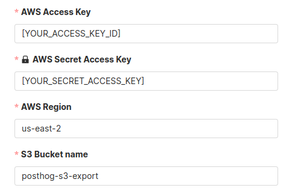

> **Important:** This app has been deprecated in favor of the [S3 batch exports destination](/docs/cdp/batch-exports/s3). 

This app enables you to export events to Amazon S3 on ingestion. Archive your data, or simply free it up for other kinds of analysis, by integrating export right into your event processing pipeline.

## Installation

### PostHog Cloud

PostHog Cloud users can find the app [here on the apps page](https://app.posthog.com/project/apps?name=S3+Export+Plugin).

Before you can enable the app, you will need to [configure it](#configure) by clicking on the settings icon.
Once the app has been configured, you can enable it by flipping the toggle and it will start exporting newly ingested events to S3.

### PostHog Self-hosted

> This requires a PostHog instance running [version 1.24.0](https://posthog.com/blog/the-posthog-array-1-24-0) or later.
> Not running 1.24.0? Find out [how to update your self-hosted PostHog deployment](https://posthog.com/docs/runbook/upgrading-posthog)!

1. Log in to your PostHog instance
2. Click 'Apps' on the left-hand navigation
3. Search for 'S3'
4. Select the 'S3 Export Plugin' and press 'Install'
5. [Configure the app](#configure) by entering your AWS credentials and S3 bucket details
6. Enable the app and Watch events roll into S3!

## Configuration

Before we can get things set up in PostHog, we will need to work on creating an S3 Bucket in AWS which we will use as a destination for our events.

Already have a bucket set up? Skip [here](#set-up-access) to start configuring access to your bucket.

### Creating a bucket

1. Log in to [AWS](https://console.aws.amazon.com/).
2. Open [S3](https://s3.console.aws.amazon.com/) in the AWS console and create a new bucket in your chosen region.

> Make sure to take note of both the name of your bucket and the region that it's in, we'll need these later.

### Set up access

Next, we'll need to create a new user in our AWS console with programmatic access to our newly created bucket.

1. Open [IAM](https://console.aws.amazon.com/iam/home) and create a new policy to allow access to this bucket.
2. On the left under "Access management" select "Policies" and click "Create policy"
3. Under the service, choose "S3"
4. Under "Actions" select
    1. "Write" -> "PutObject"
    2. "Permission Management" -> "PutObjectAcl"
5. Under "Resources" select "Specific" and click "object" -> "Add ARN"
6. Specify your bucket name and choose "any" for the object name. In the example below, replace `posthog-s3-export` with the bucket name you chose in the previous section

7. Your config should now look like the following

6. Click "Next" until you end up on the "Review Policy" page
7. Give your policy a name and click "Create policy"

The final step is now to create a new user and give them access to our Bucket by attaching our newly created Policy.

1. Open [IAM](https://console.aws.amazon.com/iam/home) and navigate to "Users" on the left
2. Click "Add Users"
3. Specify a name and make sure to choose "Access key - Programmatic access"

4. Click "Next"
5. At the top, select "Attach existing policies directly"
6. Search for the policy you just created and click the checkbox on the far left to attach it to this user

6. Click "Next" until you reach the "Create user" button. Click that as well.
7. **Make sure to copy your "Access key" and "Secret access key". The latter will not be shown again.**

### Configure the app

Now that we have our Bucket set up, we have all the information we need to set up the S3 Export app!

1. Start by navigating back to your PostHog dashboard and opening the "Apps" page.
2. Open the configuration for the S3 Export plugin by clicking the settings icon.
3. First, we'll fill in the information for our S3 Bucket

> **Note: ** Make sure to replace the `S3 Bucket name` and `AWS Region` with the values for your own bucket!

Finally, we'll configure the rest of the settings. Below is a list of a few important options, with a more detailed list of [all available options](#options) in the next section.

-   `S3 filename prefix`
    -   This option is used if you need to prefix filenames with a specific identifier, or if you want to store exports in a specific directory within your Bucket. The latter option can be done using a prefix which ends in a trailing slash (e.g. /posthog/exports)
-   `Upload at most every X minutes`
    -   Default: **Every minute**
    -   This option sets how frequently the app will check for new events. This plugin [buffers events](#batch-uploads) in-memory before uploading them, and this timeout determines how frequently it will check this buffer for new events.
-   `Maximum upload size`
    -   Default: **1 MB**
    -   Each time an upload is ingested into PostHog, this plugin will check whether its internal buffer is under this limit. If at any point it exceeds this limit, it will immediately flush events to S3. As a result, this plugin may upload more frequently than specified in the `Upload at most every X minutes` settings if the buffer frequently reaches this limit.

### Batch uploads

To vastly increase export throughput, this app batches events in memory before uploading them to S3.
Upload frequency (every minute by default) and maximum upload size (1 MB by default) can be configured when the app is installed.

You should make sure to keep these numbers reasonable to avoid running out of memory on your server. Note that the values apply to **each** concurrent app server thread.

## Additional configuration

### Basic Options

| Option                                                                                                                         | Description                                                                                                                                                                                      |
| ------------------------------------------------------------------------------------------------------------------------------ | ------------------------------------------------------------------------------------------------------------------------------------------------------------------------------------------------ |
| `AWS Access Key`  **Type:** String **Required:** Yes                     | The Access Key ID for the User you created in AWS.                                                                                                                                               |
| `AWS Access Secret Key`  **Type:** String **Required:** Yes              | The secret Access Key for the User you created in AWS.                                                                                                                                           |
| `AWS Region`  **Type:** String **Required:** Yes                         | The AWS region where you created the destination bucket.                                                                                                                                         |
| `S3 Bucket name`  **Type:** String **Required:** Yes                     | The name of the bucket where you would like to send exports.                                                                                                                                     |
| `S3 filename prefix`  **Type:** String **Required:** No                  | This will be prepended to every file sent to S3. Allows you to specify a directory to store exports in (backups/posthog/ with a trailing slash).                                                 |
| `Upload at most every X minutes`  **Type:** Number **Required:** Yes     | This option sets the interval at which the plugin will check if there are new events to export. The value must be between 1 and 60 (minutes).                                                    |
| `Maximum upload size (megabytes)`  **Type:** Number **Required:** Yes    | The maximum _single_ file size that this plugin will send to S3. When the buffer reaches this limit, the app will automatically send these events to S3. The value must be between 1 and 100 MB. |
| `Events to ignore`  **Type:** String **Required:** No                    | Comma separated list of events to ignore                                                                                                                                                         |
| `Format of uploaded files`  **Options:** `jsonl` **Default:** `jsonl`    | Currently, we only support exports in `jsonl`, which serializes events in JSON, one event per line.                                                                                              |
| `Compression`  **Options:** `gzip`, `brotli`, `none` **Default:** `gzip` | The method used to compress events before sending. Upload size limits are applied _before_ compression.                                                                                          |

### Advanced Options

| Option                                                                                                                                             | Description                                                                                                                                                                                    |
| -------------------------------------------------------------------------------------------------------------------------------------------------- | ---------------------------------------------------------------------------------------------------------------------------------------------------------------------------------------------- |
| `S3 Bucket endpoint`  **Type:** String **Required:** No                                      | Used when exporting to S3-compatible storage other than AWS. For example: `http://127.0.0.1:9000`, which is a minio or localstack instance that is API compatible with Amazon S3               |
| `Signature version`  **Options:** `V4`                                                            | [AWS Signature version](https://docs.aws.amazon.com/AmazonS3/latest/API/bucket-policy-s3-sigv4-conditions.html) used when signing uploads.                                                     |
| `Server-side encryption`  **Options:** `disabled`, `AES256`, `aws:kms` **Default:** `AES256` | Specifies server-side encryption of the object in S3.                                                                                                                                          |
| `SSE KMS key ID`  **Type:** String **Required:** No                                          | The customer-managed AWS Key Management Service (KMS) key ID that should be used to server-side encrypt the object in S3. Only used if the `Server-side encryption` option is set to `aws:kms` |

## FAQ

### Who created this app?

A lot of people worked on this app! We'd like to thank the following contributors for creating the S3 Export app. Thank you, all!

-   [Yakko Majuri](https://github.com/yakkomajuri)
-   [Marius Andra](https://github.com/mariusandra)
-   [Michael Matloka](https://github.com/Twixes)
-   [Maximilian Ferdinand Müller](https://github.com/maxmue)
-   [Sam Winslow](https://github.com/samwinslow)
-   [StackoverFrog](https://github.com/hjweddie)

### Who maintains this app?

This app is maintained by PostHog. If you have issues with the app not functioning as intended, please [let us know](http://app.posthog.com/home#supportModal)!

### What if I have feedback on this app?

We love feature requests and feedback! Please [tell us what you think](http://app.posthog.com/home#supportModal)! to tell us what you think.

### What if my question isn't answered above?

We love answering questions. Ask us anything via [our community forum](/questions), or [drop us a message](http://app.posthog.com/home#supportModal). 
